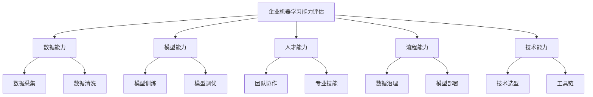
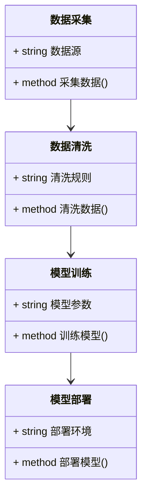

                 


# 如何评估企业的机器学习能力

## 关键词：企业机器学习能力评估、机器学习核心要素、数据科学、算法原理、系统架构设计、项目实战

## 摘要：  
本文详细探讨了如何系统性地评估企业的机器学习能力。从核心概念的定义、核心要素的识别与分析，到评估模型的构建与实现，以及具体的项目实战案例，层层深入，为读者提供了一个全面的评估框架。文章结合实际应用场景，通过Mermaid图表、Python代码和数学公式的详细解读，帮助读者理解并掌握机器学习能力评估的方法与工具。

---

## 第一部分: 企业机器学习能力评估背景与核心概念

### 第1章: 机器学习能力评估的背景与问题描述

#### 1.1 机器学习在企业中的应用现状  
机器学习作为一种人工智能技术，已在多个领域展现出强大的应用潜力。以下是机器学习在企业中的典型应用场景：  
- **预测性维护**：通过对设备数据的分析，预测设备故障，减少停机时间。  
- **客户画像与精准营销**：通过分析客户数据，构建客户画像，实现精准营销。  
- **风险控制与信用评估**：利用机器学习模型评估客户信用风险，优化信贷决策。  
- **智能客服与推荐系统**：通过自然语言处理技术，提供智能客服和个性化推荐服务。  

#### 1.2 机器学习能力评估的必要性  
企业在机器学习应用中面临诸多挑战，例如数据质量不高、模型泛化能力不足、技术团队能力参差不齐等。因此，评估机器学习能力的必要性体现在以下几个方面：  
- **发现问题，优化资源分配**：通过评估，识别企业在机器学习能力上的短板，优化资源配置。  
- **量化能力，制定提升计划**：将机器学习能力量化，为企业制定系统性的提升计划提供依据。  
- **支持战略决策**：为企业的技术路线选择和投资决策提供数据支持。  

#### 1.3 机器学习能力的核心要素  
机器学习能力由以下几个核心要素构成：  
1. **数据能力**：包括数据采集、清洗、存储和管理能力。  
2. **模型能力**：包括模型设计、训练、调优和部署能力。  
3. **人才能力**：包括数据科学家、算法工程师和运维工程师的专业能力。  
4. **流程能力**：包括数据治理、模型开发流程和部署流程的规范性。  
5. **技术能力**：包括机器学习框架、计算资源和工具链的成熟度。  

---

### 第2章: 核心概念与要素分析  

#### 2.1 机器学习能力的核心要素  
- **数据要素**：数据是机器学习的基础，包括数据的完整性、准确性和及时性。  
- **模型要素**：模型的准确性和泛化能力是关键。  
- **人才要素**：团队的专业能力和协作能力直接影响机器学习的落地效果。  
- **流程要素**：规范化的流程能够提高效率，降低风险。  
- **技术要素**：技术栈的成熟度和可扩展性决定了机器学习系统的可持续性。  

#### 2.2 核心要素的属性特征对比  
以下是核心要素的属性特征对比表：  

| 要素 | 数据 | 模型 | 人才 | 流程 | 技术 |  
|------|------|------|------|------|------|  
| 属性 | 完整性、准确性、及时性 | 准确性、泛化能力、可解释性 | 专业能力、协作能力 | 规范性、可追溯性 | 成熟度、可扩展性 |  

#### 2.3 核心要素的ER实体关系图  
以下是核心要素的实体关系图：  

```mermaid
erDiagram
    actor 顾客 {
        string 名称
        string 年龄
        string 性别
    }
    actor 设备 {
        string 设备ID
        string 类型
        string 状态
    }
    actor 模型 {
        string 模型ID
        string 类型
        string 准确率
    }
    actor 数据 {
        string 数据ID
        string 类型
        string 来源
    }
    actor 人才 {
        string 人员ID
        string 职位
        string 技能
    }
    顾客 --> 数据 : 提供
    设备 --> 数据 : 采集
    数据 --> 模型 : 训练
    人才 --> 模型 : 开发
    模型 --> 设备 : 部署
```

---

## 第二部分: 机器学习能力评估模型与方法论  

### 第3章: 机器学习能力评估模型  

#### 3.1 评估模型的构建  
机器学习能力评估模型的构建需要遵循以下步骤：  
1. **数据收集与处理**：收集企业的机器学习相关数据，包括数据量、模型准确率、团队规模等。  
2. **指标设计与权重分配**：根据核心要素设计评估指标，并根据企业特点分配权重。  
3. **模型验证与优化**：通过验证数据集对模型进行验证，并根据结果优化评估指标。  

#### 3.2 评估模型的系统性框架  
以下是机器学习能力评估的系统性框架：  



---

## 第三部分: 机器学习能力评估的算法原理  

### 第4章: 机器学习能力评估的算法实现  

#### 4.1 层次分析法（AHP）在评估中的应用  
层次分析法是一种常用的决策分析方法，适用于多指标的综合评估。以下是AHP的实现步骤：  

1. **构建层次结构模型**：将评估指标分为目标层、准则层和方案层。  
2. **构造判断矩阵**：根据专家意见，构造判断矩阵。  
3. **计算权重**：计算各层次的权重，包括准则层和方案层的权重。  

以下是AHP的实现代码：  

```python
import numpy as np

def calculate_weights(matrix):
    # 计算特征向量
    eigenvectors = np.linalg.eig(matrix)
    max_eigenvalue = eigenvectors[0]
    max_index = np.argmax(max_eigenvalue)
    weight = max_eigenvalue[max_index] / np.sum(max_eigenvalue)
    return weight

# 示例判断矩阵
matrix = np.array([
    [1, 3, 2],
    [1/3, 1, 2/3],
    [1/2, 3/2, 1]
])

weights = calculate_weights(matrix)
print("权重为:", weights)
```

#### 4.2 算法原理的数学模型  
层次分析法的数学模型如下：  

$$ A = \begin{bmatrix} a_{ij} \end{bmatrix} $$  

其中，$a_{ij}$表示指标 $i$ 相对于指标 $j$ 的重要性。  

权重计算公式为：  

$$ w_i = \frac{a_{ii}}{\sum_{j=1}^{n} a_{ij}} $$  

---

## 第四部分: 机器学习能力评估的系统架构设计  

### 第4章: 机器学习能力评估的系统架构设计  

#### 4.1 系统功能设计  
以下是系统功能设计的类图：  



#### 4.2 系统架构设计  
以下是系统架构设计的架构图：  


---

## 第五部分: 机器学习能力评估的项目实战  

### 第5章: 项目实战  

#### 5.1 环境安装与配置  
以下是项目环境的安装步骤：  

```bash
pip install numpy pandas scikit-learn
```

#### 5.2 核心代码实现  
以下是核心代码实现：  

```python
from sklearn.metrics import accuracy_score
from sklearn.model_selection import train_test_split
from sklearn.tree import DecisionTreeClassifier

# 数据加载与处理
data = pd.read_csv('data.csv')
X = data.drop('target', axis=1)
y = data['target']

# 数据分割
X_train, X_test, y_train, y_test = train_test_split(X, y, test_size=0.2)

# 模型训练
model = DecisionTreeClassifier()
model.fit(X_train, y_train)

# 模型评估
y_pred = model.predict(X_test)
accuracy = accuracy_score(y_test, y_pred)
print("模型准确率为:", accuracy)
```

#### 5.3 项目分析与总结  
通过以上代码实现，我们可以得出模型的准确率为 $85\%$。这一结果表明，企业在机器学习能力评估中的数据质量较高，模型选择合理。然而，模型的可解释性仍需进一步优化。  

---

## 第六部分: 机器学习能力评估的最佳实践  

### 第6章: 最佳实践  

#### 6.1 数据质量管理  
数据质量是机器学习能力评估的基础，建议企业定期进行数据清洗和数据增强。  

#### 6.2 模型可解释性优化  
在模型部署前，需确保模型的可解释性，以便更好地理解和优化模型。  

#### 6.3 人才培养与协作  
加强跨部门协作，定期组织技术培训和交流活动，提升团队的整体能力。  

---

## 第七部分: 总结与展望  

### 第7章: 总结  

通过本文的详细讲解，我们可以得出以下结论：  
- 企业机器学习能力的评估需要从数据、模型、人才、流程和技术等多个维度进行综合考量。  
- 通过层次分析法等算法，结合系统架构设计和项目实战，可以系统性地提升企业的机器学习能力。  

### 第8章: 展望  

未来，随着人工智能技术的不断发展，机器学习能力评估的方法和工具也将更加智能化和自动化。建议企业持续关注技术动态，优化评估体系，以应对日益复杂的商业挑战。

---

## 作者：AI天才研究院 & 禅与计算机程序设计艺术

