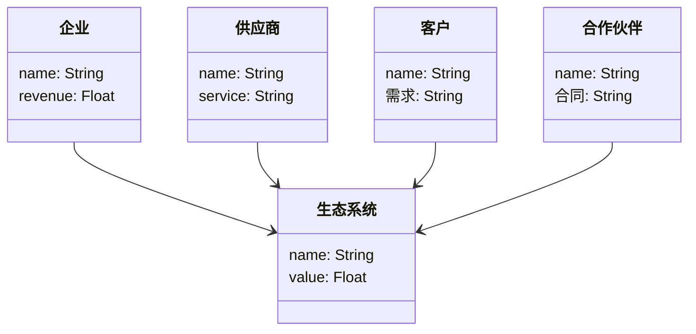
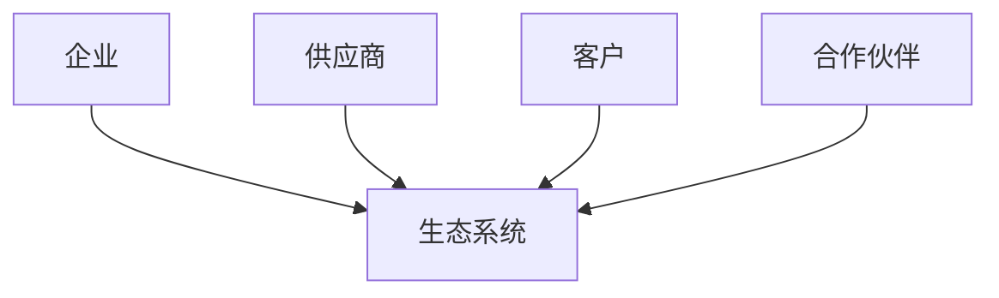

                 


# 如何评估企业的生态系统价值

> 关键词：企业生态系统、生态系统价值、价值评估、系统架构、算法原理、项目实战

> 摘要：本文旨在系统地探讨如何评估企业的生态系统价值。从背景介绍、核心概念、算法原理到系统架构设计、项目实战，全面解析企业生态系统价值评估的各个方面。通过详细分析和实际案例，帮助读者掌握企业生态系统价值评估的方法和技巧，为企业的可持续发展提供有力支持。

---

# 第一部分：企业生态系统价值评估的背景与概念

## 第1章：企业生态系统概述

### 1.1 企业生态系统的基本概念

#### 1.1.1 生态系统的定义与特征
- 生态系统的定义：由企业、供应商、客户、合作伙伴等组成的复杂关系网络。
- 生态系统的特征：
  - 多元性：包含多种角色和利益相关者。
  - 互动性：各角色之间存在相互作用和依赖。
  - 动态性：生态系统会随市场变化而调整。
  - 整体性：生态系统作为一个整体，各部分相互影响。

#### 1.1.2 企业生态系统与传统业务模式的区别
- 传统业务模式：企业独立运作，专注于自身的产品或服务。
- 企业生态系统：通过协同合作，构建一个互利共赢的生态网络。

#### 1.1.3 企业生态系统的核心要素
- 核心要素：
  - 企业：核心参与者。
  - 供应商：提供资源或服务。
  - 客户：需求方。
  - 合作伙伴：技术、服务或其他支持方。

### 1.2 企业生态系统价值的定义与内涵

#### 1.2.1 企业生态系统价值的定义
- 企业生态系统价值：衡量一个企业生态网络的整体效益和可持续性。

#### 1.2.2 企业生态系统价值的构成要素
- 构成要素：
  - 经济价值：直接的收益和成本。
  - 社会价值：企业对社会的贡献。
  - 环境价值：对环境的影响。

#### 1.2.3 企业生态系统价值的评估标准
- 评估标准：
  - 经济效益：收入、利润。
  - 社会效益：就业、社区贡献。
  - 环境效益：碳排放、资源消耗。

### 1.3 企业生态系统价值评估的重要性

#### 1.3.1 企业生态系统价值对企业战略的意义
- 战略意义：
  - 提升竞争力。
  - 优化资源配置。
  - 促进创新。

#### 1.3.2 企业生态系统价值对投资决策的影响
- 投资影响：
  - 吸引投资者。
  - 评估投资回报。

#### 1.3.3 企业生态系统价值对可持续发展的贡献
- 可持续发展：
  - 绿色生态。
  - 社会责任。

### 1.4 本章小结
- 本章介绍了企业生态系统的基本概念、核心要素以及价值评估的重要性。

---

# 第二部分：企业生态系统价值评估的核心概念与联系

## 第2章：企业生态系统价值评估的核心模型

### 2.1 企业生态系统价值评估的主要模型

#### 2.1.1 基于资源基础的模型
- 资源基础模型：基于企业的资源和能力进行评估。
- 优缺点：
  - 优点：简单易懂。
  - 缺点：忽视外部合作。

#### 2.1.2 基于网络关系的模型
- 网络关系模型：分析企业网络中的关系和影响力。
- 优缺点：
  - 优点：全面考虑合作关系。
  - 缺点：计算复杂。

#### 2.1.3 基于价值创造的模型
- 价值创造模型：关注生态系统如何创造价值。
- 优缺点：
  - 优点：注重价值实现。
  - 缺点：难以量化。

### 2.2 不同模型的对比与适用场景

#### 2.2.1 资源基础模型的优缺点
- 优点：简单易用。
- 缺点：忽视外部合作。

#### 2.2.2 网络关系模型的优缺点
- 优点：全面考虑合作。
- 缺点：计算复杂。

#### 2.2.3 价值创造模型的优缺点
- 优点：注重价值实现。
- 缺点：难以量化。

### 2.3 企业生态系统价值评估模型的ER实体关系图

```mermaid
er
  actor 企业
  actor 供应商
  actor 客户
  actor 合作伙伴
  entity 生态系统
  entity 价值
  entity 关系
  relationship 参与：企业 -> 生态系统
  relationship 提供：供应商 -> 生态系统
  relationship 需求：客户 -> 生态系统
  relationship 合作：合作伙伴 -> 生态系统
```

---

## 第3章：企业生态系统价值评估的算法原理

### 3.1 层次分析法（AHP）在生态系统价值评估中的应用

#### 3.1.1 层次分析法的基本原理
- 层次分析法：通过权重分配和层次结构分析决策问题。
- 步骤：
  1. 构建层次结构。
  2. 确定各层次的权重。
  3. 计算综合评分。

#### 3.1.2 层次分析法的数学模型
- 数学公式：
  $$ AHP = \sum_{i=1}^{n} w_i x_i $$
  其中，\( w_i \) 为权重，\( x_i \) 为评分。

#### 3.1.3 层次分析法的实现步骤
- 步骤：
  1. 收集数据。
  2. 构建比较矩阵。
  3. 计算权重。
  4. 计算综合评分。

### 3.2 模糊综合评价法在生态系统价值评估中的应用

#### 3.2.1 模糊综合评价法的基本原理
- 模糊综合评价法：通过模糊数学方法处理不确定因素。
- 步骤：
  1. 确定评价指标。
  2. 构建模糊评价矩阵。
  3. 计算综合评价结果。

#### 3.2.2 模糊综合评价法的数学模型
- 数学公式：
  $$ F = \sum_{i=1}^{n} w_i f_i $$
  其中，\( w_i \) 为权重，\( f_i \) 为模糊评分。

#### 3.2.3 模糊综合评价法的实现步骤
- 步骤：
  1. 确定评价指标。
  2. 构建模糊评价矩阵。
  3. 计算综合评价结果。

---

## 第4章：企业生态系统价值评估的系统分析与架构设计

### 4.1 问题场景介绍

#### 4.1.1 问题描述
- 描述：如何评估一个企业的生态系统价值。

#### 4.1.2 问题边界与外延
- 边界：
  - 仅考虑直接相关的企业、供应商、客户。
  - 不考虑间接关联的第三方。

### 4.2 系统功能设计

#### 4.2.1 领域模型图


### 4.3 系统架构设计

#### 4.3.1 系统架构图


### 4.4 接口设计

#### 4.4.1 接口描述
- API接口：
  - 获取企业信息：`GET /enterprise/{id}`
  - 获取供应商信息：`GET /supplier/{id}`
  - 获取客户信息：`GET /customer/{id}`
  - 获取合作伙伴信息：`GET /partner/{id}`

---

## 第5章：企业生态系统价值评估的项目实战

### 5.1 环境安装与准备

#### 5.1.1 环境要求
- 系统要求：Windows/Mac/Linux。
- 软件要求：Python 3.8+，Mermaid支持工具。

### 5.2 系统核心实现源代码

#### 5.2.1 层次分析法的实现代码
```python
def calculate_weights(matrix):
    # 计算权重
    pass

def calculate_scores(criteria, weights):
    # 计算评分
    pass
```

#### 5.2.2 模糊综合评价法的实现代码
```python
def calculate_fuzzy_scores(matrix):
    # 计算模糊评分
    pass
```

### 5.3 代码应用解读与分析

#### 5.3.1 代码实现细节
- 实现细节：
  - 层次分析法：构建比较矩阵，计算权重。
  - 模糊综合评价法：构建模糊矩阵，计算评分。

### 5.4 实际案例分析

#### 5.4.1 案例介绍
- 案例：评估某科技企业的生态系统价值。

#### 5.4.2 案例分析与结果解读
- 分析步骤：
  1. 收集数据。
  2. 构建模型。
  3. 计算价值。

---

## 第6章：企业生态系统价值评估的最佳实践

### 6.1 最佳实践与小结

#### 6.1.1 实践总结
- 总结：选择合适的模型，结合实际数据进行评估。

#### 6.1.2 注意事项
- 注意事项：
  - 数据准确性。
  - 模型适用性。
  - 结果解释性。

### 6.2 拓展阅读与未来发展

#### 6.2.1 拓展阅读推荐
- 推荐书籍：
  - 《企业生态系统管理》。
  - 《系统动力学在企业中的应用》。

#### 6.2.2 企业生态系统价值评估的未来发展
- 未来趋势：
  - 结合大数据和AI技术。
  - 更加注重可持续发展。

---

# 结语
企业生态系统价值评估是一个复杂但重要的任务。通过本文的系统介绍，读者可以掌握从理论到实践的全过程，为企业的发展提供有力支持。

---

作者：AI天才研究院/AI Genius Institute & 禅与计算机程序设计艺术 /Zen And The Art of Computer Programming

