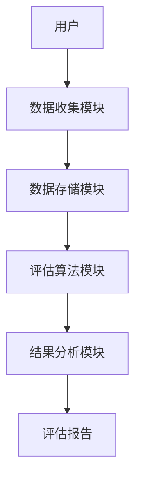

                 

# 如何评估企业的知识产权价值

---

## 关键词  
知识产权评估，无形资产评估，企业价值，专利评估，技术价值，知识产权保护，知识产权交易，资产评估方法，收益法，成本法，市场法，知识产权系统架构，知识产权案例分析

---

## 摘要  
知识产权是企业的核心资产之一，其价值评估对企业融资、并购、技术研发和市场竞争力具有重要影响。本文从知识产权的基本概念出发，分析其价值评估的核心方法，包括收益法、成本法和市场法，并结合实际案例深入探讨知识产权系统的架构设计与评估流程。通过系统化的分析与实战案例，本文为读者提供一套完整的知识产权价值评估解决方案，帮助企业更好地管理和优化其知识产权资产。

---

## 第一部分：知识产权价值评估的背景与核心概念

### 第1章：知识产权价值评估的背景与问题描述

#### 1.1 知识产权的基本概念
- **1.1.1 知识产权的定义与范围**  
  知识产权是指法律保护的智力成果，包括专利、商标、版权、商业秘密等。这些权利赋予持有人对特定创新或创作的独占使用权。
  
- **1.1.2 知识产权的主要类型**  
  - 专利：保护发明的实用性，包括发明专利、实用新型专利和外观设计专利。  
  - 商标：用于区分商品或服务的来源，具有显著性和独特性。  
  - 版权：保护文学、艺术和科学作品的原创性。  
  - 商业秘密：未公开的技术诀窍、配方或策略，具有商业价值。  

- **1.1.3 知识产权在企业中的重要性**  
  知识产权不仅是企业的核心竞争力，也是其市场价值的重要组成部分。它能够通过技术授权、侵权诉讼等方式为企业创造收益。

#### 1.2 知识产权价值评估的背景与问题背景
- **1.2.1 知识产权交易的兴起**  
  随着全球化的深入，知识产权交易日益频繁，专利拍卖、技术转让等成为企业获取技术的重要途径。  

- **1.2.2 企业融资、并购中的知识产权价值评估需求**  
  在企业融资或并购过程中，知识产权的价值直接影响企业的估值。例如，一家高科技企业的专利组合可能占其整体估值的60%以上。  

- **1.2.3 知识产权保护与市场竞争的关系**  
  知识产权保护能够激励创新，但过度保护可能导致市场垄断，限制竞争。因此，合理评估知识产权价值是平衡保护与市场竞争的关键。

#### 1.3 知识产权价值评估的核心问题
- **1.3.1 什么是知识产权价值**  
  知识产权的价值是其为企业带来的未来收益的现值。  

- **1.3.2 知识产权价值的测量维度**  
  - 技术价值：基于技术的先进性和实用性。  
  - 法律价值：基于知识产权的法律保护力度和稳定性。  
  - 市场价值：基于市场对知识产权的需求和替代品的可获得性。  

- **1.3.3 知识产权价值评估的边界与外延**  
  知识产权价值评估不仅关注其直接收益，还需考虑其对企业发展战略的支持作用。例如，一项专利可能无法直接创造收益，但能够为企业在特定市场中建立技术壁垒。

#### 1.4 知识产权价值评估的核心要素
- **1.4.1 知识产权的法律状态**  
  包括专利的申请状态、授权时间、保护范围等。  

- **1.4.2 知识产权的技术价值**  
  技术的创新性、实用性和市场前景是评估其技术价值的关键因素。  

- **1.4.3 知识产权的市场价值**  
  市场需求、竞争对手的知识产权布局、行业发展趋势等都会影响知识产权的市场价值。

---

## 第二部分：知识产权价值评估的核心概念与联系

### 第2章：知识产权价值评估的核心概念

#### 2.1 知识产权的属性与特征
- **2.1.1 知识产权的独占性**  
  知识产权赋予持有人在特定领域内的独占使用权，他人未经许可不得擅自使用。  

- **2.1.2 知识产权的地域性**  
  知识产权的保护范围具有地域性，需在不同国家或地区分别申请保护。  

- **2.1.3 知识产权的时间性**  
  知识产权的有效期有限，例如专利的保护期通常为20年（发明专利）。  

- **2.1.4 知识产权的可转让性**  
  知识产权可以通过转让、许可等方式进行交易，为企业创造经济价值。

#### 2.2 知识产权价值的影响因素
- **2.2.1 技术创新性**  
  技术的创新性越高，其市场价值通常越大。  

- **2.2.2 市场需求**  
  知识产权的应用场景越广泛，市场需求越大，其价值也越高。  

- **2.2.3 法律保护力度**  
  法律保护越完善，知识产权的稳定性越高，其价值也越大。  

- **2.2.4 竞争环境**  
  如果市场上存在大量相似的知识产权，其价值可能被稀释。

#### 2.3 知识产权价值评估的理论基础
- **2.3.1 资产评估的基本原理**  
  资产评估的核心是将资产的未来收益折现为现值。  

- **2.3.2 知识产权作为无形资产的特殊性**  
  知识产权作为无形资产，其价值高度依赖于其技术先进性和市场前景。  

- **2.3.3 价值评估中的主观与客观因素**  
  评估过程中，主观因素（如专家判断）与客观因素（如市场需求数据）共同影响最终结果。

---

## 第三部分：知识产权价值评估的算法与数学模型

### 第3章：知识产权价值评估的主要方法

#### 3.1 收益法
- **3.1.1 收益法的基本原理**  
  收益法基于知识产权的未来收益进行评估。公式为：
  $$ V = \frac{R}{r} $$
  其中，\( V \) 为价值，\( R \) 为预期年收益，\( r \) 为折现率。

- **3.1.2 收益法的适用场景**  
  适用于能够明确预测未来收益的知识产权，如专利技术。

- **3.1.3 收益法的步骤**  
  1. 预测未来收益。  
  2. 确定合适的折现率。  
  3. 计算现值。

#### 3.2 成本法
- **3.2.1 成本法的基本原理**  
  成本法基于知识产权的开发成本进行评估。公式为：
  $$ V = C + D $$
  其中，\( C \) 为开发成本，\( D \) 为机会成本。

- **3.2.2 成本法的适用场景**  
  适用于无法直接预测未来收益，但开发成本较低的知识产权。

- **3.2.3 成本法的步骤**  
  1. 计算开发成本。  
  2. 估算机会成本。  
  3. 计算总价值。

#### 3.3 市场法
- **3.3.1 市场法的基本原理**  
  市场法基于市场上类似知识产权的交易价格进行评估。公式为：
  $$ V = \alpha \times V_{\text{可比}} + \beta $$
  其中，\( \alpha \) 为调整系数，\( \beta \) 为调整项。

- **3.3.2 市场法的适用场景**  
  适用于市场上有较多类似交易案例的知识产权。

- **3.3.3 市场法的步骤**  
  1. 收集类似交易案例。  
  2. 确定调整系数。  
  3. 计算评估价值。

---

## 第四部分：知识产权价值评估的系统分析与架构设计

### 第4章：知识产权价值评估的系统架构

#### 4.1 问题场景介绍
- 知识产权价值评估系统需要整合多种数据源，包括专利数据库、市场数据、法律信息等。

#### 4.2 知识产权价值评估系统的功能模块
- **数据收集模块**：从专利数据库、市场数据源获取相关信息。  
- **评估算法模块**：实现收益法、成本法和市场法的计算。  
- **结果分析模块**：生成评估报告并提供优化建议。

#### 4.3 知识产权价值评估系统的架构设计
- 使用Mermaid图展示系统架构：

---

## 第五部分：项目实战与总结

### 第5章：知识产权价值评估的项目实战

#### 5.1 项目背景与目标
- 某高科技公司拥有多项专利技术，需评估其专利组合的市场价值。

#### 5.2 数据收集与处理
- 收集专利的法律状态、技术领域、市场应用等数据。

#### 5.3 评估方法的选择
- 选择收益法和市场法进行综合评估。

#### 5.4 实际案例分析
- 假设某专利的年收益为100万元，折现率为8%，则其价值为：
  $$ V = \frac{100}{0.08} = 1250 \text{万元} $$

#### 5.5 项目总结
- 知识产权价值评估需要结合多种方法，综合考虑技术、法律和市场因素。

---

## 第六部分：总结与注意事项

### 第6章：总结与注意事项

#### 6.1 总结
- 知识产权价值评估是企业管理和决策的重要工具。通过系统化的评估方法，企业可以更好地管理和优化其知识产权资产。

#### 6.2 注意事项
- 评估过程中需综合考虑技术、法律和市场因素。  
- 数据收集和处理需确保准确性和完整性。  
- 评估结果需结合企业的实际业务需求进行调整。

#### 6.3 未来展望
- 随着人工智能技术的发展，知识产权价值评估将更加智能化和精准化。

---

## 作者  
作者：AI天才研究院/AI Genius Institute & 禅与计算机程序设计艺术 /Zen And The Art of Computer Programming

