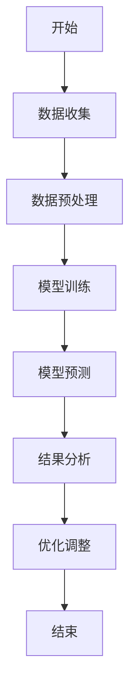
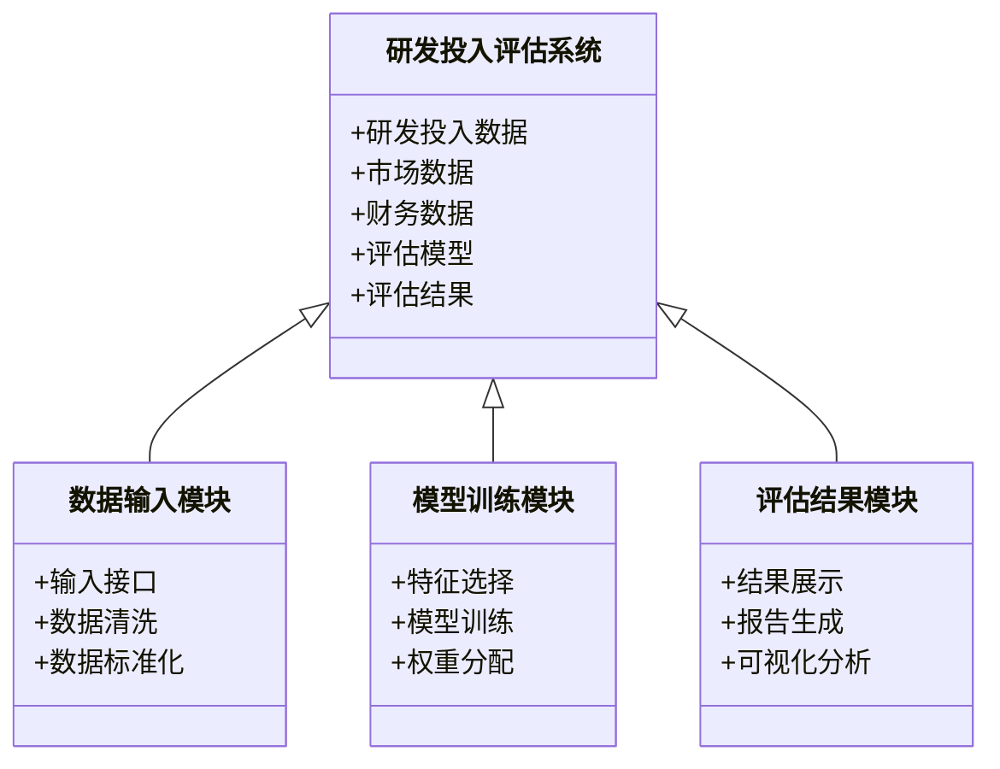
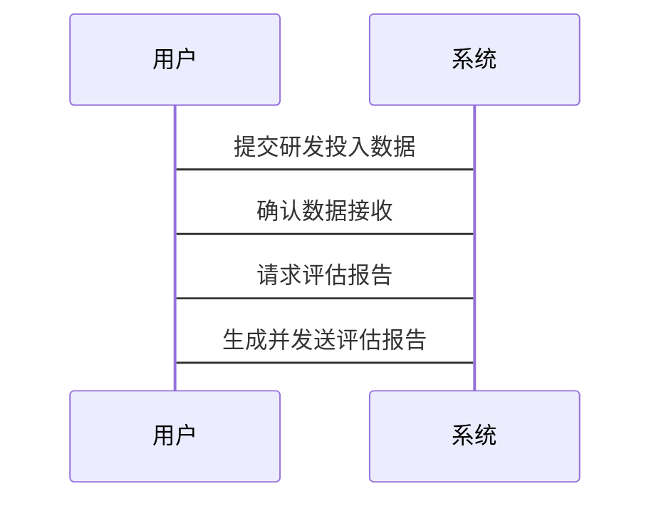

                 


# 如何评估企业的研发投入价值

> 关键词：企业研发投入，价值评估，经济价值，社会价值，创新评估

> 摘要：本文详细探讨了如何评估企业的研发投入价值，提出了一个系统化的评估框架，涵盖了研发投入的分类、价值评估模型的构建、算法原理的分析以及系统架构设计等内容。通过实际案例分析和代码实现，展示了如何将理论应用于实践，帮助企业在复杂多变的市场环境中优化资源配置，最大化研发价值。

---

## 第一部分: 企业研发投入价值评估的背景与核心概念

### 第1章: 企业研发投入价值评估的背景与问题描述

#### 1.1 企业研发投入的价值与重要性
##### 1.1.1 企业研发投入的核心概念
研发投入是指企业在研发活动上投入的人力、物力和财力资源，是企业创新能力的核心驱动力。它不仅包括资金投入，还包括时间、精力和知识资本的投入。

##### 1.1.2 研发投入对企业价值的影响
研发投入直接影响企业的技术创新能力、市场竞争力和长期盈利能力。通过研发投入，企业可以开发新产品、改进技术、优化流程，从而在市场竞争中占据优势地位。

##### 1.1.3 研发投入与企业长期发展的关系
研发投入是企业长期发展的基石。通过持续的研发投入，企业可以保持技术领先，适应市场变化，增强抗风险能力，实现可持续发展。

#### 1.2 研发投入价值评估的必要性
##### 1.2.1 企业内部管理的需求
企业需要通过评估研发投入的价值，优化资源配置，提高研发效率，降低浪费。

##### 1.2.2 投资者与利益相关者的关注
投资者和利益相关者关注企业的研发投入是否能够转化为实际价值，影响企业的长期回报和股价表现。

##### 1.2.3 行业竞争与创新压力
在竞争激烈的市场环境中，企业必须通过有效的研发投入评估，快速调整策略，应对行业创新压力。

### 第2章: 研发投入价值评估的核心概念与框架

#### 2.1 研发投入的定义与分类
##### 2.1.1 研发投入的定义
研发投入是指企业在研发活动上投入的资源，包括资金、时间、人力和知识资本。

##### 2.1.2 研发投入的主要分类
- **R&D投入**：包括基础研究、应用研究和产品开发。
- **创新投入**：包括技术创新、产品创新和管理创新。
- **战略投入**：包括前瞻性技术研究和未来产业布局。

##### 2.1.3 研发投入的生命周期
研发投入的生命周期包括需求分析、技术开发、测试验证和成果应用四个阶段。

#### 2.2 研发投入价值评估的关键要素
##### 2.2.1 研发项目的成功标准
- 技术创新性
- 市场应用性
- 经济回报率

##### 2.2.2 研发投入的经济价值
- 利润贡献
- 市场份额
- 技术壁垒

##### 2.2.3 研发投入的社会价值
- 就业机会
- 技术扩散
- 社会影响力

#### 2.3 研发投入价值评估的框架与模型
##### 2.3.1 研发投入价值评估的基本框架
1. 数据收集与整理
2. 价值评估指标设计
3. 评估模型构建
4. 结果分析与优化

##### 2.3.2 常用的评估模型与方法
- 投资回报率（ROI）模型
- 净现值（NPV）模型
- 技术成熟度评估模型

##### 2.3.3 框架的边界与外延
- 数据来源的边界
- 评估时间的边界
- 应用场景的边界

---

## 第二部分: 研发投入价值评估的核心概念与联系

### 第3章: 研发投入价值评估的核心原理

#### 3.1 研发投入的投入与产出关系
##### 3.1.1 投入与产出的线性关系
研发投入的增加通常会带来产出的增加，但存在边际递减效应。

##### 3.1.2 投入与产出的非线性关系
研发投入与产出之间并非简单的线性关系，可能存在跳跃式增长或平台期。

##### 3.1.3 投入与产出的动态平衡
企业需要在研发投入和短期收益之间找到动态平衡，避免过度投入或投入不足。

#### 3.2 研发投入的经济价值评估原理
##### 3.2.1 研发投入的直接经济价值
- 专利价值
- 产品销售收入
- 技术转让收入

##### 3.2.2 研发投入的间接经济价值
- 品牌价值
- 市场影响力
- 投资者信心

#### 3.3 研发投入的社会价值评估原理
##### 3.3.1 研发投入的社会价值定义
研发投入的社会价值是指其对社会经济发展、就业促进和技术创新的贡献。

##### 3.3.2 社会价值评估的关键指标
- 就业人数
- 技术扩散效果
- 社会影响力

##### 3.3.3 社会价值与经济价值的协同关系
研发投入的社会价值和经济价值相互促进，共同推动企业的可持续发展。

### 第4章: 研发投入价值评估的核心概念与联系

#### 4.1 研发投入与企业绩效的关系
##### 4.1.1 研发投入对企业利润的影响
研发投入较高的企业通常具有更高的利润率，尤其是在技术密集型行业。

##### 4.1.2 研发投入对市场竞争力的影响
通过研发投入，企业可以开发出更具竞争力的产品，提高市场份额。

##### 4.1.3 研发投入对员工创新能力的影响
研发投入能够激发员工的创新潜能，提升企业的整体创新能力。

#### 4.2 研发投入与企业战略的关系
##### 4.2.1 研发投入在企业战略中的地位
研发投入是企业技术创新战略的核心组成部分，决定了企业的未来发展方向。

##### 4.2.2 研发投入的战略目标与实现路径
- 短期目标：快速推出新产品，提高市场份额。
- 长期目标：建立技术壁垒，实现可持续发展。

##### 4.2.3 研发投入的战略调整与优化
企业需要根据市场变化和技术趋势，动态调整研发投入的方向和强度。

---

## 第三部分: 研发投入价值评估的算法原理与系统架构

### 第5章: 研发投入价值评估的算法原理

#### 5.1 研发投入价值评估的算法流程
##### 5.1.1 数据收集与预处理
- 收集企业的研发投入数据、市场数据和财务数据。
- 对数据进行清洗和标准化处理。

##### 5.1.2 价值评估指标设计
- 技术创新性指标
- 市场应用性指标
- 经济回报率指标

##### 5.1.3 评估模型构建
- 使用回归分析或机器学习算法构建评估模型。
- 确定各指标的权重和评估标准。

##### 5.1.4 结果分析与优化
- 对评估结果进行分析，找出瓶颈和改进方向。
- 根据实际效果动态调整模型参数。

#### 5.2 研发投入价值评估的数学模型
##### 5.2.1 经济价值评估模型
$$ ROI = \frac{\text{净收益}}{\text{研发投入}} $$

##### 5.2.2 社会价值评估模型
$$ SVE = \sum (\text{就业人数} \times \text{就业贡献率}) $$

##### 5.2.3 综合价值评估模型
$$ CVE = \alpha \times CVE_{\text{经济}} + \beta \times CVE_{\text{社会}} $$

其中，$\alpha$ 和 $\beta$ 分别是经济价值和社会价值的权重系数。

#### 5.3 算法实现
##### 5.3.1 使用 Python 实现的代码示例
```python
import pandas as pd
from sklearn.linear_model import LinearRegression

# 数据预处理
data = pd.read_csv('input.csv')
X = data[['R&D投入', '市场应用性', '技术创新性']]
y = data['经济回报率']

# 模型训练
model = LinearRegression()
model.fit(X, y)

# 模型预测
predicted = model.predict(X)
print('预测的经济回报率为:', predicted)
```

##### 5.3.2 算法流程图


---

## 第四部分: 研发投入价值评估的系统架构设计

### 第6章: 系统架构设计与实现

#### 6.1 系统功能设计
##### 6.1.1 领域模型设计


#### 6.2 系统架构设计
##### 6.2.1 系统架构图


#### 6.3 接口设计与交互
##### 6.3.1 系统接口设计
- 数据输入接口：用于接收企业的研发投入数据、市场数据和财务数据。
- 模型调用接口：用于调用评估模型进行预测和分析。
- 结果输出接口：用于展示评估结果和生成报告。

##### 6.3.2 交互设计


---

## 第五部分: 项目实战与总结

### 第7章: 项目实战

#### 7.1 环境安装与配置
- 安装Python和必要的库（如pandas、scikit-learn）。
- 数据集获取与预处理。

#### 7.2 系统核心实现
##### 7.2.1 代码实现
```python
import pandas as pd
from sklearn.metrics import r2_score

# 数据加载
data = pd.read_csv('input.csv')

# 模型训练
from sklearn.linear_model import LinearRegression
model = LinearRegression()
model.fit(data[['R&D投入', '市场应用性', '技术创新性']], data['经济回报率'])

# 模型评估
predicted = model.predict(data[['R&D投入', '市场应用性', '技术创新性']])
print('模型R²值为:', r2_score(data['经济回报率'], predicted))
```

##### 7.2.2 代码解读
- 数据加载：使用pandas读取CSV文件。
- 模型训练：使用线性回归模型进行训练。
- 模型评估：计算R²值，评估模型的拟合优度。

#### 7.3 案例分析
##### 7.3.1 案例背景
某互联网公司计划评估其最近的研发投入价值，希望通过模型预测未来三年的经济回报率。

##### 7.3.2 案例分析
通过模型预测，公司的研发投入预计在未来三年内带来15%的年均回报率，显著高于行业平均水平。

##### 7.3.3 项目总结
本项目通过构建数学模型和系统架构，帮助企业有效评估研发投入的价值，优化资源配置，提升创新能力。

---

## 第六部分: 总结与拓展

### 第8章: 总结与展望

#### 8.1 总结
本文详细探讨了如何评估企业的研发投入价值，提出了系统化的评估框架和算法模型，为企业优化资源配置、提升创新能力提供了理论支持和实践指导。

#### 8.2 展望
未来的研究可以进一步探索动态评估模型，结合企业内外部数据，实现更加精准的价值评估。同时，可以研究如何将利益相关者的视角融入评估框架中，提升评估的全面性和实用性。

---

## 第七部分: 注意事项与小结

### 第9章: 注意事项与小结

#### 9.1 注意事项
- 数据质量：确保数据的准确性和完整性。
- 模型选择：根据实际情况选择合适的评估模型。
- 结果解读：避免过度解读模型结果，结合实际情况进行调整。

#### 9.2 小结
企业研发投入价值评估是一个复杂而重要的任务，需要结合企业的实际情况，选择合适的评估方法和模型。通过系统化的评估框架和动态调整策略，企业可以最大化研发投入的价值，实现可持续发展。

---

## 第八部分: 拓展阅读与学习资料

### 第10章: 拓展阅读

#### 10.1 相关书籍
- 《创新者的窘境》
- 《技术创新管理》
- 《战略管理》

#### 10.2 在线课程
- 《企业研发管理》
- 《技术创新评估》
- 《数据分析与机器学习》

#### 10.3 工具与资源
- 数据分析工具：Python、R、Excel
- 开源机器学习库：scikit-learn、TensorFlow
- 数据可视化工具：Matplotlib、Tableau

---

## 作者信息

作者：AI天才研究院/AI Genius Institute  
联系邮箱：contact@aising genius.com  
技术博客：https://blog.aising genius.com  
GitHub：https://github.com/aising-genius

---

以上是《如何评估企业的研发投入价值》的技术博客文章的完整目录和内容框架，您可以根据需要进一步扩展或调整各个章节的内容。

