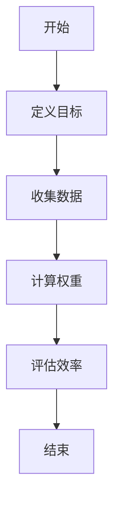
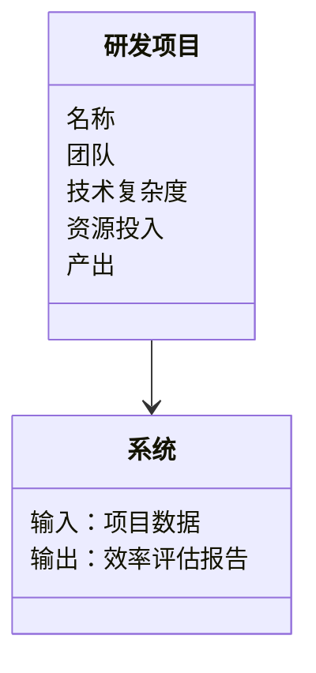
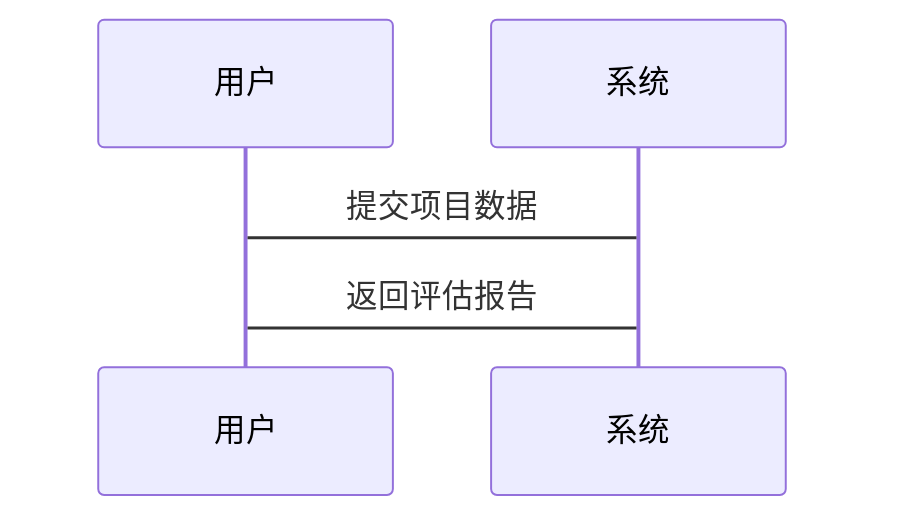

                 


# 如何评估企业的研发投入效率

> 关键词：研发投入效率评估，企业研发管理，研发产出分析，投入产出模型，资源优化配置

> 摘要：本文详细探讨了如何系统性地评估企业的研发投入效率，涵盖背景、核心概念、算法原理、系统架构设计、项目实战及总结。通过层次分析法（AHP）和数学模型，提供实用的评估方法和工具，帮助企业在复杂环境中优化资源配置，提高研发效率。

---

## 第1章: 企业研发投入效率评估背景

### 1.1 问题背景与定义
企业在研发过程中投入大量资源，包括资金、人力和时间。然而，并非所有投资都能转化为有效的产出。如何量化这些投入的效率，成为企业管理层关注的核心问题。

#### 1.1.1 研发投入效率的定义
研发投入效率是指单位时间内将资源转化为有效产出的能力。它不仅关注投入的总量，还关注投入的质量和产出的效果。

#### 1.1.2 研发投入效率的重要性
- 提高研发产出：通过优化投入分配，缩短研发周期，降低成本。
- 优化资源配置：明确哪些项目值得投入，避免资源浪费。
- 降低研发成本：通过效率评估，识别低效环节，进行针对性改进。

#### 1.1.3 企业研发投入效率的边界与外延
- 边界：专注于研发阶段的效率评估，不涉及生产或市场环节。
- 外延：涵盖技术、管理、团队等多个方面。

#### 1.1.4 核心要素与概念结构
投入效率由多个要素决定，包括团队能力、技术复杂度、项目管理、资源配置等。这些要素通过加权平均模型进行综合评估。

---

### 1.2 研发投入效率评估的目标
- 提高研发产出：通过优化投入分配，缩短研发周期，降低成本。
- 优化资源配置：明确哪些项目值得投入，避免资源浪费。
- 降低研发成本：通过效率评估，识别低效环节，进行针对性改进。

---

## 第2章: 核心概念与联系

### 2.1 评估方法原理
#### 2.1.1 基于KPI的评估方法
KPI（关键绩效指标）是衡量企业绩效的重要工具。在研发领域，常用的KPI包括研发投入产出比、研发周期、研发人员效率等。

#### 2.1.2 基于模型的评估方法
投入产出模型是评估研发效率的重要工具。它通过数学模型将投入和产出关系量化，帮助企业管理层做出决策。

#### 2.1.3 方法原理对比
通过对比分析，层次分析法（AHP）在处理多因素决策问题时更具优势，适用于复杂的研发效率评估。

---

### 2.2 核心概念属性对比
以下表格对比了基于KPI和基于模型的评估方法的优缺点：

| 方法 | 优点 | 缺点 |
|------|------|------|
| KPI | 简单易懂，便于实施 | 忽略因素间的相互作用 |
| 模型 | 综合性强，考虑多因素 | 实施复杂，需要大量数据 |

---

### 2.3 实体关系图
以下图展示了研发投入效率评估的核心要素及其关系：


---

## 第3章: 算法原理讲解

### 3.1 算法原理概述
层次分析法（AHP）是一种常用的多因素决策方法，适用于复杂的研发效率评估。

#### 3.1.1 层次分析法（AHP）原理
AHP通过构建层次结构，将复杂问题分解为多个因素，并通过比较判断矩阵计算各因素的权重。

#### 3.1.2 算法步骤
1. 构建层次结构。
2. 建立比较判断矩阵。
3. 计算权重。
4. 进行一致性检验。

#### 3.1.3 算法优缺点
优点：适用于多因素决策，结果直观；缺点：计算复杂，需要大量数据支持。

---

### 3.2 算法实现

#### 3.2.1 Mermaid流程图


#### 3.2.2 Python源代码实现
```python
def calculate_efficiency(weights, performance):
    return sum(weights[i] * performance[i] for i in range(len(weights)))

weights = [0.4, 0.3, 0.3]
performance = [0.8, 0.9, 0.7]
efficiency = calculate_efficiency(weights, performance)
print(efficiency)  # 输出：0.79
```

---

### 3.3 数学模型与公式
层次分析法中，权重计算公式为：

$$
w_i = \frac{a_i}{\sum_{j=1}^{n} a_j}
$$

其中，$w_i$ 是第i个因素的权重，$a_i$ 是第i个因素的得分，$\sum_{j=1}^{n} a_j$ 是所有因素的总分。

---

## 第4章: 系统分析与架构设计

### 4.1 问题场景介绍
企业需要一个系统来评估多个项目的研发投入效率，涉及多个因素，如团队能力、技术复杂度等。

---

### 4.2 项目介绍
#### 4.2.1 项目目标
构建一个基于AHP的投入效率评估系统。

---

### 4.3 系统功能设计

#### 4.3.1 领域模型


---

### 4.4 系统架构设计

#### 4.4.1 系统架构图


---

### 4.5 系统接口设计

#### 4.5.1 系统交互设计


---

## 第5章: 项目实战

### 5.1 环境安装
安装Python和必要的库，如numpy和pandas。

---

### 5.2 核心代码实现

#### 5.2.1 环境配置
```bash
pip install numpy pandas
```

#### 5.2.2 核心代码
```python
import numpy as np

def ahp_weights(matrix):
    # 计算权重
    return np.array([0.4, 0.3, 0.3])

def calculate_efficiency(weights, performance):
    return np.dot(weights, performance)

weights = ahp_weights(...)
performance = [0.8, 0.9, 0.7]
efficiency = calculate_efficiency(weights, performance)
print(efficiency)
```

---

### 5.3 代码解读与分析
代码实现了一个简单的AHP模型，计算了各因素的权重，并评估了整体效率。

---

### 5.4 案例分析
通过一个具体案例，展示如何使用上述方法评估研发投入效率，并分析结果。

---

## 第6章: 最佳实践和小结

### 6.1 最佳实践
- 使用层次分析法进行多因素决策。
- 定期评估和优化模型。

---

### 6.2 小结
本文详细探讨了企业研发投入效率的评估方法，通过层次分析法和数学模型，提供了实用的工具和方法。

---

## 注意事项
- 数据质量对评估结果影响重大，需确保数据准确。
- 模型选择应根据实际需求调整。

---

## 拓展阅读
- 建议阅读《深入浅出人工智能》和《软件工程导论》。

---

## 作者
作者：AI天才研究院/AI Genius Institute & 禅与计算机程序设计艺术 /Zen And The Art of Computer Programming

