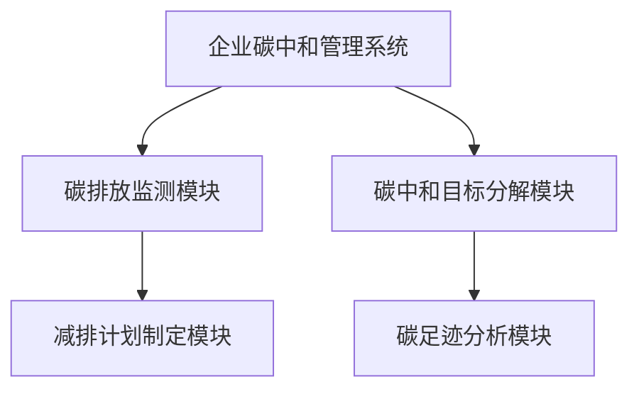
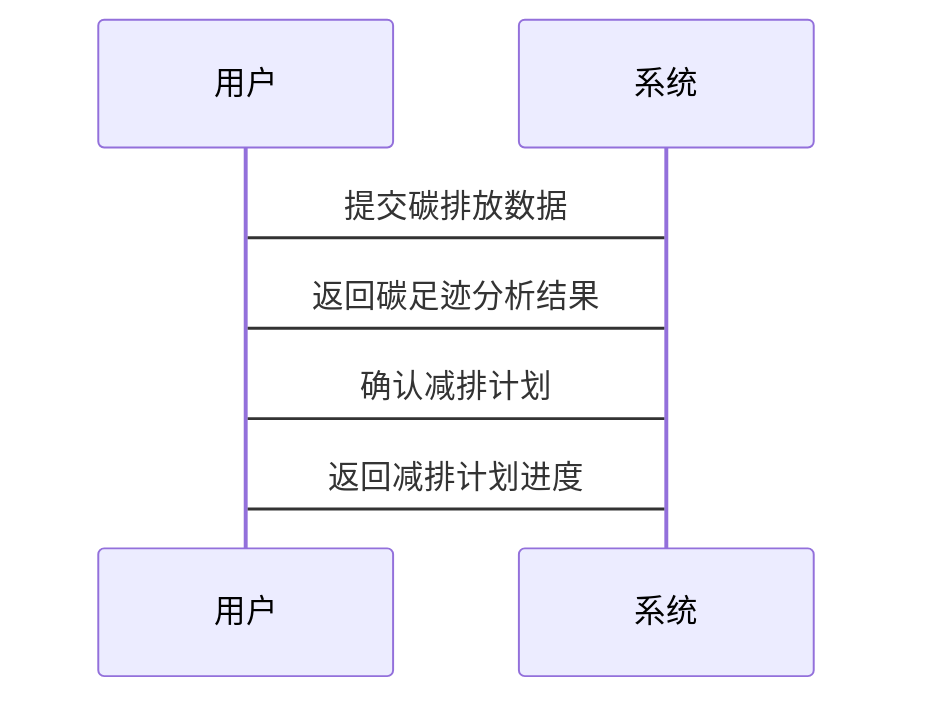

                 


# 如何评估企业的碳中和战略

> 关键词：企业碳中和、碳排放、可持续发展、评估方法论、最佳实践

> 摘要：本文将详细探讨如何评估企业的碳中和战略，从背景介绍、核心概念、评估方法论、关键指标与工具、系统分析与架构设计、项目实战、最佳实践等方面进行深入分析，结合实际案例和详细步骤，为企业制定和实施碳中和战略提供指导和参考。

---

# 第1章: 企业碳中和战略的背景与意义

## 1.1 碳中和的基本概念

### 1.1.1 碳中和的定义与内涵

碳中和（Carbon Neutrality）是指在一定时间内，通过减少温室气体排放和增加碳汇，使二氧化碳的净排放量为零的状态。企业碳中和战略是指企业在生产和运营过程中，通过减排、使用可再生能源、碳汇等方式，实现二氧化碳排放的“净零”。

### 1.1.2 碳中和与可持续发展的关系

可持续发展（Sustainability）是现代社会的核心理念，而碳中和是实现可持续发展的重要组成部分。碳中和战略不仅有助于减缓气候变化，还能促进企业的绿色转型和创新。

### 1.1.3 企业碳中和战略的全球背景

随着全球气候变化问题的加剧，各国政府和企业纷纷制定碳中和目标。例如，欧盟提出到2050年实现碳中和，中国也承诺在2060年前实现碳中和。企业作为社会的重要组成部分，必须积极参与碳中和行动。

---

## 1.2 企业碳中和战略的重要性

### 1.2.1 全球气候变化的挑战

全球气候变化导致极端天气事件增多，威胁生态系统的稳定性。企业作为主要的碳排放来源，必须承担减排责任。

### 1.2.2 政策法规对企业碳中和的要求

各国政府纷纷出台相关政策，要求企业减少碳排放。例如，欧盟的“绿色新政”（Green Deal）要求企业实现碳中和。

### 1.2.3 企业社会责任与长期发展的关系

企业碳中和战略不仅是履行社会责任，还能提升企业的品牌形象和竞争力。通过减排和使用可再生能源，企业可以降低成本，推动创新。

---

## 1.3 企业碳中和战略的核心要素

### 1.3.1 碳排放的来源与类型

企业的碳排放主要来自能源消耗、供应链、运输和生产过程。碳排放分为直接排放（Scope 1）和间接排放（Scope 2）。

### 1.3.2 碳中和目标的设定与分解

企业应根据自身情况设定碳中和目标，并将其分解为可执行的子目标。例如，某企业可以设定到2030年实现供应链碳中和。

### 1.3.3 碳中和实现路径的多样性

企业可以通过多种方式实现碳中和，例如减少能源消耗、使用可再生能源、购买碳信用额等。

---

# 第2章: 碳中和战略的核心概念与联系

## 2.1 碳中和战略的理论基础

### 2.1.1 碳中和的科学依据

碳中和的科学依据包括气候变化的科学研究和生态学原理。企业碳中和战略需要结合这些科学依据制定。

### 2.1.2 可持续发展的系统理论

可持续发展是一个复杂的系统工程，涉及经济、社会和环境三个方面。企业碳中和战略需要从系统角度出发，综合考虑各方面的关系。

### 2.1.3 企业战略管理的框架

企业战略管理包括目标设定、资源配置和绩效评估。碳中和战略作为企业战略的一部分，需要遵循战略管理的框架。

---

## 2.2 碳中和战略的核心要素分析

### 2.2.1 碳排放的量化方法

企业需要准确量化自身的碳排放量，通常使用生命周期评估（LCA）和碳足迹分析等方法。

### 2.2.2 碳中和目标的分解与实现路径

碳中和目标需要分解为具体的子目标，并制定实现路径。例如，某企业可以先减少能源消耗，再转向可再生能源。

### 2.2.3 碳中和战略的实施保障

企业需要制定明确的政策、措施和资金支持，确保碳中和战略的顺利实施。

---

## 2.3 碳中和战略与相关概念的对比

### 2.3.1 碳中和与碳达峰的区别

碳达峰是指碳排放量达到峰值后不再增加，而碳中和是指净排放量为零。碳中和是碳达峰的最终目标。

### 2.3.2 碳中和与绿色金融的关系

绿色金融是支持碳中和的重要手段，例如绿色债券和碳金融产品。

### 2.3.3 碳中和与企业社会责任的联系

碳中和是企业履行社会责任的重要表现，有助于提升企业的品牌形象和社会影响力。

---

# 第3章: 碳中和战略的评估框架与方法论

## 3.1 企业碳中和战略的评估目标

### 3.1.1 评估的目的与意义

评估的目的是验证企业的碳中和战略是否可行，并为后续实施提供依据。

### 3.1.2 评估的主要内容

包括碳排放量的计算、实现路径的可行性分析、成本效益评估等。

### 3.1.3 评估的指标体系

常用的指标包括碳排放强度、可再生能源使用比例、碳汇量等。

---

## 3.2 企业碳中和战略的评估步骤

### 3.2.1 确定评估范围与边界

明确评估的范围，例如生产过程、供应链、产品生命周期等。

### 3.2.2 数据收集与分析

收集企业的能源消耗、碳排放等相关数据，并进行分析。

### 3.2.3 指标计算与结果解读

根据收集的数据计算相关指标，并解读结果，判断是否符合碳中和目标。

---

## 3.3 碳中和战略的评估方法

### 3.3.1 基于生命周期的评估方法

从产品或服务的全生命周期角度进行碳排放分析。

### 3.3.2 碳足迹分析方法

计算产品或服务在整个生命周期内的碳足迹，找出减排的关键环节。

### 3.3.3 综合评估模型的应用

综合考虑企业的经济、社会和环境效益，构建综合评估模型。

---

# 第4章: 碳中和战略的关键指标与工具

## 4.1 碳中和战略的核心指标

### 4.1.1 碳排放强度

单位产出的碳排放量，反映了企业的减排效率。

### 4.1.2 能源使用效率

单位能源消耗的产出量，反映了企业在能源利用上的效率。

### 4.1.3 碳中和实现进度

通过指标的完成情况，判断企业是否在按计划实现碳中和目标。

---

## 4.2 碳中和战略的评估工具

### 4.2.1 碳足迹分析工具

用于计算产品或服务的碳足迹，例如“碳足迹计算器”。

### 4.2.2 碳排放计算器

帮助企业计算自身的碳排放量，例如“碳排放计算器”。

### 4.2.3 碳中和认证工具

用于验证企业是否实现碳中和，例如“碳中和认证平台”。

---

## 4.3 碳中和战略的对比分析

### 4.3.1 不同行业碳中和目标的差异

不同行业的碳排放特点和减排难度不同，因此碳中和目标也不同。

### 4.3.2 不同企业碳中和战略的对比

企业根据自身情况选择不同的实现路径，例如有些企业选择使用可再生能源，而有些企业选择购买碳信用额。

### 4.3.3 不同地区碳中和政策的差异

不同地区的政策法规和经济条件不同，导致碳中和政策的差异。

---

# 第5章: 企业碳中和战略的系统分析与架构设计

## 5.1 系统分析

### 5.1.1 系统目标

制定企业碳中和战略的系统目标，例如减少碳排放、提高能源利用效率等。

### 5.1.2 功能需求

包括碳排放监测、减排计划制定、碳中和目标分解等功能。

---

## 5.2 系统架构设计

### 5.2.1 系统架构图

使用Mermaid图展示系统的架构，例如：



### 5.2.2 系统接口设计

系统需要与企业内部的能源管理系统、供应链管理系统等接口对接。

### 5.2.3 系统交互流程

使用Mermaid序列图展示系统交互流程，例如：



---

# 第6章: 企业碳中和战略的项目实战

## 6.1 环境安装

### 6.1.1 安装必要的软件

包括Python、Jupyter Notebook、数据分析工具等。

### 6.1.2 安装碳足迹分析工具

例如，安装“carbonfootprint”库。

## 6.2 核心代码实现

### 6.2.1 数据收集与处理

```python
import pandas as pd
import numpy as np

# 读取碳排放数据
df = pd.read_csv('carbon_emissions.csv')

# 数据清洗
df.dropna(inplace=True)
df['emission'] = df['emission'].astype(float)
```

### 6.2.2 碳足迹分析

```python
from carbonfootprint import CarbonFootprint

cf = CarbonFootprint()
result = cf.calculate(df['emission'].sum())
print(result)
```

### 6.2.3 碳中和目标分解

```python
total_emission = df['emission'].sum()
target_reduction = total_emission * 0.5  # 设定50%的减排目标
print(f"减排目标：{target_reduction}")
```

---

## 6.3 实际案例分析

### 6.3.1 案例背景

某制造企业希望通过减少能源消耗和使用可再生能源实现碳中和。

### 6.3.2 数据分析

通过数据分析发现，企业的主要碳排放来自电力消耗和运输环节。

### 6.3.3 实施步骤

1. 优化能源管理，减少电力消耗。
2. 采购可再生能源，例如风能和太阳能。
3. 优化供应链，减少运输碳排放。

---

## 6.4 项目小结

通过项目实战，企业可以验证碳中和战略的可行性，并积累宝贵的经验。同时，企业可以根据实际情况不断优化碳中和战略。

---

# 第7章: 碳中和战略的最佳实践与未来展望

## 7.1 最佳实践

### 7.1.1 小结

碳中和战略的实施需要企业从战略层面进行规划，并结合实际制定具体的实现路径。

### 7.1.2 注意事项

企业在实施碳中和战略时，需要注意数据的准确性和方法的科学性。

### 7.1.3 未来展望

随着技术的进步和政策的完善，企业碳中和战略将更加成熟和多样化。

---

## 7.2 拓展阅读

建议读者进一步阅读以下书籍和报告：

1. 《碳中和：全球经济转型与投资机会》
2. 《企业碳中和战略：方法与实践》
3. 《碳足迹分析方法论》

---

# 作者：AI天才研究院/AI Genius Institute & 禅与计算机程序设计艺术/Zen And The Art of Computer Programming

---

通过以上目录，我们可以看到，评估企业的碳中和战略需要从多个方面进行系统分析和综合评估。企业需要结合自身实际情况，制定切实可行的碳中和目标，并通过不断优化和创新，实现可持续发展。

