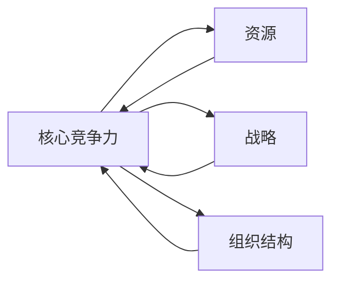

                 

# 如何评估企业的竞争优势

## 关键词：企业竞争优势、核心竞争力、SWOT分析、PEST分析、价值链分析

## 摘要：本文详细探讨了如何系统性地评估企业的竞争优势，从核心竞争力的构成要素、竞争优势的动态变化、竞争优势的评估方法以及企业竞争优势的实现路径等方面展开分析，结合实际案例，为企业制定有效的竞争策略提供参考。

---

# 第一部分：企业竞争优势评估的背景与核心概念

## 第1章：企业竞争优势的定义与重要性

### 1.1 什么是企业竞争优势

#### 1.1.1 企业竞争优势的定义
企业竞争优势是指企业在市场上相对于竞争对手的独特优势，这些优势可以是资源、技术、品牌、成本、管理等方面的优势，能够使企业在竞争中占据有利地位。

#### 1.1.2 竞争优势的核心要素
竞争优势的核心要素包括：
- **资源**：企业的核心资源，如技术、人才、资金等。
- **能力**：企业的核心能力，如研发能力、生产能力、营销能力等。
- **市场定位**：企业在市场中的定位，包括目标市场、产品定位等。
- **创新**：企业的创新能力，包括产品创新、技术创新、管理创新等。

#### 1.1.3 竞争优势的类型与特点
竞争优势的类型包括：
- **成本优势**：在成本控制上具有优势。
- **差异化优势**：通过产品或服务的差异化获得竞争优势。
- **品牌优势**：通过强大的品牌影响力获得竞争优势。
- **技术优势**：通过技术创新获得竞争优势。

### 1.2 企业竞争优势的重要性

#### 1.2.1 竞争优势对企业生存与发展的意义
竞争优势是企业在激烈的市场竞争中生存和发展的关键，没有竞争优势的企业很难在市场中立足。

#### 1.2.2 竞争优势与企业长期价值创造的关系
竞争优势不仅影响企业的短期业绩，还影响企业的长期价值创造能力。

#### 1.2.3 竞争优势在不同行业中的表现差异
不同行业的竞争优势可能有所不同，例如制造业可能更注重成本和技术，而服务业可能更注重服务质量和客户体验。

---

## 第2章：企业竞争优势的评估背景

### 2.1 当前商业环境的竞争特点

#### 2.1.1 全球化与市场竞争的加剧
全球化使得市场竞争更加激烈，企业需要面对来自全球的竞争压力。

#### 2.1.2 数字化转型对企业竞争优势的影响
数字化转型使得企业能够通过技术创新和数据分析获得竞争优势。

#### 2.1.3 新兴技术对企业竞争优势的重塑
新兴技术如人工智能、大数据、区块链等正在重塑企业的竞争优势。

### 2.2 企业竞争优势评估的必要性

#### 2.2.1 识别核心竞争力的需求
企业需要通过评估竞争优势，识别自身的核心竞争力。

#### 2.2.2 应对市场变化的挑战
市场环境不断变化，企业需要通过竞争优势评估，及时调整战略。

#### 2.2.3 优化资源配置的需要
竞争优势评估能够帮助企业优化资源配置，提高效率。

### 2.3 企业竞争优势评估的边界与外延

#### 2.3.1 竞争优势的内部与外部维度
竞争优势既有内部因素（如资源、能力）也有外部因素（如市场需求、竞争对手）。

#### 2.3.2 竞争优势的时间与空间维度
竞争优势可能随着时间推移而变化，也可能在不同的市场区域表现出不同的特征。

#### 2.3.3 竞争优势的动态变化特征
竞争优势是动态变化的，企业需要持续关注和调整。

---

## 第3章：企业竞争优势的核心要素与结构

### 3.1 核心竞争力的构成要素

#### 3.1.1 企业的资源与能力
企业的资源包括有形资源（如资金、设备）和无形资源（如品牌、技术）。企业的能力包括研发能力、生产能力、营销能力等。

#### 3.1.2 企业的战略定位
企业的战略定位包括目标市场、产品定位、竞争战略等。

#### 3.1.3 企业的组织结构与文化
企业的组织结构和文化会影响企业的运作效率和创新能力。

### 3.2 企业竞争优势的概念结构

#### 3.2.1 资源基础观（RBV）模型
资源基础观（Resource-Based View, RBV）认为企业的竞争优势来源于内部资源，特别是那些独特且难以模仿的资源。

#### 3.2.2 核心竞争力分析框架
核心竞争力分析框架强调企业核心能力在竞争优势中的作用。

#### 3.2.3 价值链分析模型
价值链分析模型将企业分为基本活动和辅助活动，通过优化这些活动来提升竞争优势。

### 3.3 企业竞争优势的核心要素对比

#### 3.3.1 资源与能力的对比分析
资源和能力是竞争优势的重要组成部分，资源是基础，能力是资源的转化。

#### 3.3.2 战略定位与组织结构的关联
战略定位决定了企业的发展方向，组织结构则支持战略的实施。

#### 3.3.3 文化与创新对企业竞争优势的影响
企业文化和创新能力是竞争优势的重要来源，能够提升企业的适应能力和创新能力。

---

# 第二部分：企业竞争优势评估的核心概念与联系

## 第4章：核心概念的原理与特征

### 4.1 核心竞争力的原理

#### 4.1.1 核心竞争力的定义与特征
核心竞争力是企业在市场上胜过竞争对手的独特能力。

#### 4.1.2 核心竞争力与企业绩效的关系
核心竞争力强的企业通常具有更高的绩效表现。

#### 4.1.3 核心竞争力的动态更新机制
核心竞争力需要不断更新和优化，以适应市场变化。

### 4.2 核心竞争力的属性特征对比

#### 4.2.1 核心竞争力的可测量性
核心竞争力可以通过企业的财务表现、市场份额等指标进行测量。

#### 4.2.2 核心竞争力的可持续性
核心竞争力的可持续性取决于企业的创新能力、资源储备等因素。

#### 4.2.3 核心竞争力的可模仿性
核心竞争力的可模仿性较低，否则它将失去竞争优势。

### 4.3 核心竞争力的ER实体关系图

---

## 第5章：竞争优势评估的核心工具与方法

### 5.1 SWOT分析

#### 5.1.1 SWOT分析的原理
SWOT分析（优势、劣势、机会、威胁分析）是一种常用的战略分析工具，用于评估企业内部优势和劣势，以及外部机会和威胁。

#### 5.1.2 SWOT分析的步骤
1. **识别内部优势和劣势**：列出企业内部资源和能力的优势和劣势。
2. **识别外部机会和威胁**：分析外部市场环境的机会和威胁。
3. **制定战略**：根据SWOT分析结果，制定相应的竞争策略。

#### 5.1.3 SWOT分析的实际应用
以一家科技公司为例，SWOT分析可以帮助其识别技术优势和市场机会，制定技术创新和市场扩展战略。

### 5.2 PEST分析

#### 5.2.1 PEST分析的原理
PEST分析（政治、经济、社会、技术环境分析）用于评估外部宏观环境对企业的影响。

#### 5.2.2 PEST分析的步骤
1. **分析政治环境**：评估政府政策对企业的影响。
2. **分析经济环境**：评估经济状况对企业成本和需求的影响。
3. **分析社会环境**：评估社会文化对企业市场的影响。
4. **分析技术环境**：评估技术创新对企业竞争力的影响。

#### 5.2.3 PEST分析的实际应用
以一家制造企业为例，PEST分析可以帮助其了解政策变化、经济波动、社会需求和技术进步对企业的影响。

### 5.3 价值链分析

#### 5.3.1 价值链分析的原理
价值链分析将企业价值创造过程分解为基本活动和辅助活动，分析每项活动的成本和价值。

#### 5.3.2 价值链分析的步骤
1. **分解企业价值链**：将企业活动分为基本活动和辅助活动。
2. **分析每项活动的成本和价值**：识别成本较高的活动和价值贡献大的活动。
3. **优化价值链**：通过优化价值链中的活动来提升竞争优势。

#### 5.3.3 价值链分析的实际应用
以一家汽车制造公司为例，价值链分析可以帮助其优化生产流程、降低成本，提升产品质量。

### 5.4 综合竞争优势评估模型

#### 5.4.1 综合竞争优势评估模型的构建
综合竞争优势评估模型结合了SWOT分析、PEST分析和价值链分析，从多个维度全面评估企业的竞争优势。

#### 5.4.2 综合竞争优势评估模型的应用
以一家互联网公司为例，综合竞争优势评估模型可以帮助其全面评估技术优势、市场机会、成本控制和组织结构等方面的优势和劣势，制定综合竞争策略。

---

## 第6章：企业竞争优势的实现路径

### 6.1 核心竞争力的打造

#### 6.1.1 核心竞争力的识别
通过分析企业资源、能力和战略定位，识别企业的核心竞争力。

#### 6.1.2 核心竞争力的培养
通过技术创新、人才培养、管理优化等方式，持续提升核心竞争力。

#### 6.1.3 核心竞争力的保护
通过专利保护、品牌建设等方式，保护核心竞争力不被竞争对手模仿。

### 6.2 市场定位与战略选择

#### 6.2.1 市场定位的策略
根据企业核心竞争力和目标市场需求，选择合适的市场定位。

#### 6.2.2 竞争战略的选择
根据市场环境和企业优势，选择成本领先战略、差异化战略或集中化战略。

#### 6.2.3 战略实施的保障
通过组织结构、资源配置、激励机制等方式，保障战略的有效实施。

### 6.3 持续优化与创新

#### 6.3.1 持续优化的必要性
市场环境不断变化，企业需要持续优化竞争优势。

#### 6.3.2 创新的重要性
创新是保持竞争优势的关键，企业需要不断创新产品、技术、管理等方面。

#### 6.3.3 创新能力的提升
通过研发投入、人才培养、开放合作等方式，提升企业的创新能力。

---

## 第7章：企业竞争优势评估的实战案例

### 7.1 案例背景介绍

#### 7.1.1 案例企业简介
以一家中型制造企业为例，分析其竞争优势。

#### 7.1.2 案例企业的竞争环境
分析该企业在市场中的位置、竞争对手情况、市场需求等。

### 7.2 竞争优势评估的步骤

#### 7.2.1 收集数据
通过市场调研、内部数据分析等方式，收集企业资源、能力、市场定位等方面的数据。

#### 7.2.2 分析评估
运用SWOT分析、PEST分析、价值链分析等工具，对企业竞争优势进行全面评估。

#### 7.2.3 制定策略
根据评估结果，制定竞争策略，优化资源配置，提升竞争优势。

### 7.3 竞争优势评估的实际应用

#### 7.3.1 核心竞争力的识别
识别企业在技术、成本、品牌等方面的核心竞争力。

#### 7.3.2 市场定位的调整
根据市场环境和竞争情况，调整企业市场定位。

#### 7.3.3 战略实施的优化
优化战略实施过程，确保战略目标的实现。

### 7.4 竞争优势评估的成果

#### 7.4.1 核心竞争力的提升
通过评估和优化，提升企业在技术、成本等方面的核心竞争力。

#### 7.4.2 市场竞争力的增强
通过优化市场定位和竞争策略，增强企业在市场中的竞争力。

#### 7.4.3 企业绩效的提升
竞争优势的提升能够带来企业绩效的提升，包括销售额、利润率、市场份额等。

---

## 第8章：企业竞争优势评估的总结与最佳实践

### 8.1 总结与回顾

#### 8.1.1 企业竞争优势评估的核心要点
企业竞争优势评估需要从资源、能力、市场定位等多个维度进行全面分析。

#### 8.1.2 企业竞争优势评估的难点
市场竞争的动态变化、企业内部资源的复杂性等，增加了竞争优势评估的难度。

#### 8.1.3 企业竞争优势评估的未来趋势
随着数字化转型和新兴技术的发展，企业竞争优势评估将更加依赖数据分析和技术创新。

### 8.2 最佳实践与建议

#### 8.2.1 建立竞争优势评估的长效机制
企业应建立竞争优势评估的长效机制，定期评估和优化竞争优势。

#### 8.2.2 加强数据驱动的分析能力
通过大数据分析和人工智能技术，提高竞争优势评估的准确性和效率。

#### 8.2.3 注重创新能力的培养
创新是保持竞争优势的关键，企业应注重创新能力的培养。

### 8.3 注意事项与风险提示

#### 8.3.1 竞争优势评估的局限性
竞争优势评估的结果可能受到数据质量和分析方法的影响，存在一定的局限性。

#### 8.3.2 竞争优势的动态变化
竞争优势是动态变化的，企业需要持续关注市场环境的变化，及时调整战略。

#### 8.3.3 竞争优势的外部依赖性
竞争优势不仅取决于企业内部因素，还受到外部环境的影响，企业需要综合考虑内外部因素。

### 8.4 拓展阅读与学习资源

#### 8.4.1 推荐书籍
- 《竞争优势》（Competitive Advantage）——迈克尔·波特
- 《战略管理》（Strategy Management）——加里·哈默尔
- 《企业战略》（Corporate Strategy）——理查德·鲁梅特

#### 8.4.2 推荐在线课程
- Coursera：竞争战略课程
- edX：战略管理课程
- Udemy：企业竞争优势分析课程

#### 8.4.3 推荐工具与平台
- SWOT分析工具：Lucidchart、Draw.io
- PEST分析工具：MindMaple、XMind
- 价值链分析工具：Lucidchart、Mermaid

---

## 作者：AI天才研究院/AI Genius Institute & 禅与计算机程序设计艺术 /Zen And The Art of Computer Programming

