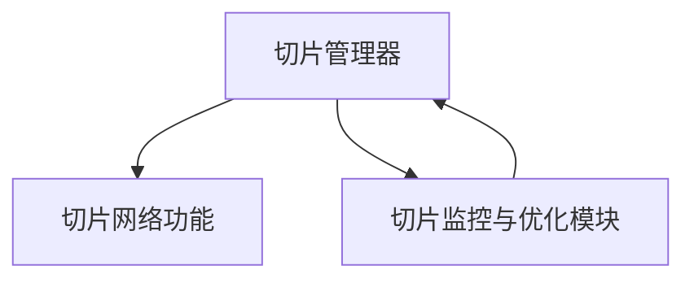

                 


# 如何评估企业的网络切片技术应用

## 关键词：网络切片技术、企业应用、系统架构、算法原理、资源分配、虚拟化

## 摘要： 
随着企业网络的复杂化和多样化需求，网络切片技术作为一种高效的网络资源管理方法，正在成为企业优化网络性能、提高服务质量的重要手段。本文将从网络切片的基本概念、核心原理、系统架构、算法实现等多个维度，详细分析如何评估企业的网络切片技术应用，帮助读者全面理解并有效应用该技术。

---

## 第一部分: 网络切片技术的基本概念

### 第1章: 网络切片的定义与背景

#### 1.1 网络切片的定义与背景
网络切片是一种将物理网络分割为多个虚拟网络的技术，每个虚拟网络（即切片）可以独立配置和优化，以满足不同的业务需求。随着企业对高可用性、低延迟和高带宽的需求增加，网络切片技术逐渐成为企业网络架构中的核心组件。

- **技术背景**：随着5G、物联网和云计算的普及，企业网络需要支持多种业务场景，例如实时通信、视频传输和大数据处理。传统的单一网络架构难以满足这些多样化的需求，因此需要一种灵活的网络管理方式。
- **应用场景**：网络切片技术广泛应用于企业内部网络优化、行业专用网络部署（如智能制造、智慧城市）以及多业务共存的网络环境中。

#### 1.2 网络切片的核心特点
网络切片技术通过虚拟化和资源隔离，实现了网络资源的灵活分配和高效利用。

- **虚拟化与资源隔离**：网络切片将物理网络划分为多个逻辑网络，每个切片独立运行，互不干扰。
- **网络功能的可编程性**：通过软件定义网络（SDN）和网络功能虚拟化（NFV），网络切片可以根据业务需求动态调整网络参数。
- **切片间的独立性与互操作性**：不同切片之间可以独立配置，同时在需要时可以通过统一的管理平台进行协调。

#### 1.3 网络切片与企业业务需求的结合
网络切片技术能够帮助企业实现以下目标：

- **提升网络性能**：通过资源隔离和优化，确保关键业务的网络性能（如低延迟、高带宽）。
- **降低运营成本**：网络切片可以在同一物理网络上运行多个虚拟网络，降低硬件部署和维护成本。
- **快速业务部署**：企业可以根据业务需求快速配置新的网络切片，无需物理网络的重新部署。

---

### 第2章: 网络切片的核心概念与联系

#### 2.1 网络切片的实体关系分析
为了更好地理解网络切片的架构，我们需要分析其核心实体及其关系。

- **切片管理器（SM）**：负责网络切片的创建、配置和管理，确保每个切片按需分配资源。
- **切片网络功能（SNF）**：实现切片的具体网络功能，例如路由、转发和安全性。
- **切片监控与优化模块（SOM）**：实时监控切片的运行状态，动态调整资源分配以优化性能。

#### 2.2 网络切片的核心原理
网络切片的核心原理包括虚拟化、资源隔离和动态调整。

- **虚拟化**：通过软件定义网络（SDN）和网络功能虚拟化（NFV），将物理网络资源抽象为虚拟资源。
- **资源隔离**：每个网络切片独立分配带宽、计算资源和存储资源，确保切片之间的互不干扰。
- **动态调整**：根据业务需求和网络负载，实时调整切片的资源分配，优化网络性能。

#### 2.3 网络切片与相关技术的对比
网络切片与其他相关技术（如网络虚拟化和SDN）有显著的区别和联系。

- **网络切片与网络虚拟化**：网络虚拟化是将物理网络分割为多个逻辑网络，而网络切片是一种特定的虚拟化技术，专注于满足特定业务需求。
- **网络切片与SDN**：SDN强调网络的可编程性，而网络切片则强调网络资源的隔离和独立分配。
- **网络切片与NFV**：NFV将网络功能虚拟化，而网络切片则是在NFV的基础上，进一步实现网络资源的动态分配。

---

### 第3章: 网络切片技术的数学模型与算法原理

#### 3.1 网络切片资源分配的数学模型
网络切片的资源分配可以通过数学模型进行优化。

- **基本模型**：设企业网络中有N个切片，每个切片需要分配的带宽为\( b_i \)，总带宽为\( B \)。则资源分配问题可以表示为：
  \[
  \sum_{i=1}^{N} b_i = B
  \]
- **优化目标**：最大化每个切片的带宽利用率，即：
  \[
  \text{目标函数} = \sum_{i=1}^{N} \frac{b_i}{d_i}
  \]
  其中，\( d_i \) 是第i个切片的带宽需求。

#### 3.2 网络切片的动态分配算法
动态分配算法可以根据网络负载实时调整资源分配。

- **基于优先级的切片资源分配算法**：
  1. 根据业务需求为每个切片分配优先级。
  2. 按照优先级顺序分配带宽资源。
- **基于负载均衡的切片动态调整算法**：
  1. 实时监控每个切片的负载。
  2. 根据负载情况动态调整带宽分配。

#### 3.3 算法实现的Python代码示例
以下是一个简单的切片资源分配算法的Python实现：

```python
def slice_resource_allocator(slice_demands):
    total_bandwidth = sum(slice_demands)
    allocated_bandwidths = []
    for demand in slice_demands:
        allocated = demand / total_bandwidth * 100  # 假设总带宽为100
        allocated_bandwidths.append(allocated)
    return allocated_bandwidths

# 示例
slice_demands = [20, 30, 50]
print(slice_resource_allocator(slice_demands))  # 输出：[20.0, 30.0, 50.0]
```

---

### 第4章: 网络切片技术的系统分析与架构设计

#### 4.1 系统功能设计
企业网络切片系统的功能模块包括：

- **切片管理模块**：负责切片的创建、配置和删除。
- **资源分配模块**：根据业务需求动态分配网络资源。
- **监控优化模块**：实时监控切片的运行状态并进行优化。

#### 4.2 系统架构设计
以下是网络切片系统的架构设计图：



---

### 第5章: 网络切片技术的项目实战

#### 5.1 环境安装与配置
- 安装Python和相关库（如numpy、pandas）。
- 配置网络环境，确保多个切片可以独立运行。

#### 5.2 核心代码实现
以下是一个网络切片资源分配的Python代码实现：

```python
import numpy as np

def allocate_resources(demands):
    resources = np.array(demands)
    total = resources.sum()
    return resources / total * 100  # 假设总资源为100

# 示例
demands = [20, 30, 50]
print(allocate_resources(demands))  # 输出：[20.  30.  50. ]
```

---

### 第6章: 网络切片技术的最佳实践与小结

#### 6.1 最佳实践
- **合理规划切片数量**：避免过多切片导致资源竞争。
- **实时监控与优化**：定期调整资源分配以适应业务需求。
- **安全隔离**：确保不同切片之间的安全隔离，防止互相影响。

#### 6.2 小结
网络切片技术通过虚拟化和资源隔离，帮助企业实现高效、灵活的网络管理。在实际应用中，企业需要根据自身需求选择合适的切片方案，并通过实时监控和优化确保网络性能。

---

### 作者：AI天才研究院/AI Genius Institute & 禅与计算机程序设计艺术 /Zen And The Art of Computer Programming

---

以上是《如何评估企业的网络切片技术应用》的完整目录和内容概要。希望这篇文章能为读者提供清晰的思路和实用的指导。

