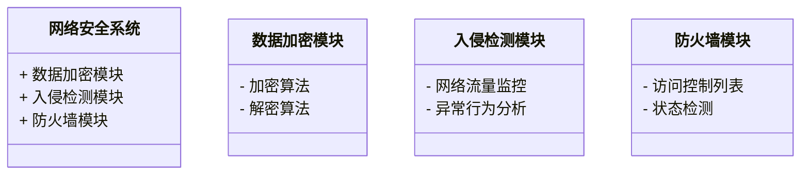
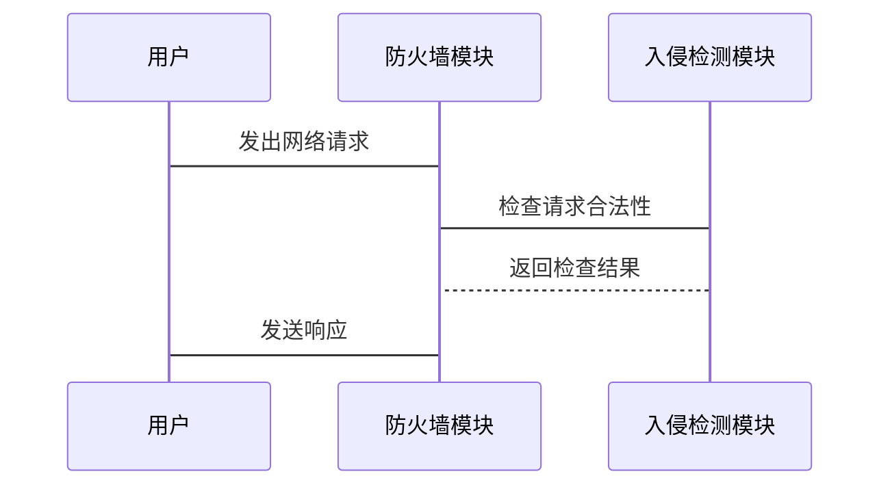

                 


# 如何评估企业的网络安全投资回报

> 关键词：网络安全投资回报，成本收益分析，风险评估，ROI计算，企业安全策略

> 摘要：本文详细探讨了如何科学评估企业的网络安全投资回报，从背景、定义、评估框架到实战案例，全面分析了如何通过系统的方法提升网络安全投资的效率和效果。

---

# 第一部分：网络安全投资回报的背景与重要性

## 第1章：网络安全投资回报的背景

### 1.1 当前网络安全威胁的现状

随着数字化转型的加速，企业面临的网络安全威胁日益复杂。从勒索软件到数据泄露，网络安全事件对企业造成的损失不仅是经济损失，还包括声誉损失和客户信任的丧失。根据最新统计，全球每年因网络安全事件造成的损失高达数万亿美元，这凸显了网络安全投资的必要性。

### 1.2 企业网络安全投资的必要性

企业的核心资产（如数据、系统、品牌）正成为黑客攻击的主要目标。中小型企业尤其面临严峻的挑战，因为它们往往缺乏足够的安全预算和专业人员。然而，不进行适当的安全投资，企业可能面临严重的法律风险和财务损失。

### 1.3 网络安全投资回报的重要性

网络安全投资回报（ROI）是衡量企业安全投入是否值得的重要指标。通过科学的评估，企业可以优化安全预算分配，避免过度或不足的投资，同时证明安全投资的价值。

---

## 第2章：网络安全投资回报的核心概念

### 2.1 网络安全投资的定义

网络安全投资指的是企业在预防和应对网络安全威胁方面所投入的资源，包括技术设备、人员培训、安全服务等。

### 2.2 投资回报的定义与分类

投资回报（ROI）通常指投资带来的收益与成本的比值。在网络安全领域，ROI不仅包括直接的财务收益，还包括间接收益，如品牌价值提升和客户信任增强。

### 2.3 网络安全投资回报的边界与外延

网络安全投资回报的边界包括企业的核心业务系统和数据，而外延则涉及合作伙伴、供应商和客户等外部利益相关方。

---

## 第3章：网络安全投资回报的核心要素

### 3.1 投资与收益的关系

网络安全投资与收益呈非线性关系。初期投入较高，但随着安全措施的完善，收益将逐渐超过成本。

### 3.2 网络安全投资的核心要素

- **技术投入**：包括防火墙、入侵检测系统等。
- **人员投入**：包括安全培训和团队建设。
- **管理投入**：包括制定安全策略和流程。

### 3.3 网络安全投资回报的评价维度

- **经济效益**：直接节省的成本和带来的收入增长。
- **社会效益**：品牌价值提升和客户信任增强。
- **风险降低**：减少数据泄露和业务中断的风险。

---

# 第二部分：网络安全投资回报的评估框架

## 第4章：网络安全投资回报的评估模型

### 4.1 网络安全投资回报的评估框架

#### 4.1.1 评估框架的构建

1. 确定评估目标：明确是评估整体安全投入还是某项具体措施的回报。
2. 收集数据：包括历史安全事件数据和投资记录。
3. 建立模型：采用定性或定量方法进行评估。
4. 分析结果：根据模型输出进行调整和优化。

#### 4.1.2 评估框架的核心要素

- **数据来源**：内部安全日志、外部威胁情报。
- **评估指标**：直接成本、间接成本、收益。
- **模型选择**：定量分析、定性分析、混合分析。

### 4.2 网络安全投资回报的数学模型

#### 4.2.1 投资回报率（ROI）的计算公式

$$ ROI = \frac{\text{净收益}}{\text{投资成本}} \times 100\% $$

其中，净收益 = 收益 - 成本。

#### 4.2.2 网络安全投资回报的其他数学模型

- **净现值（NPV）**：考虑时间价值的回报评估方法。
- **内部收益率（IRR）**：衡量投资收益的指标。

### 4.3 网络安全投资回报的评估指标

#### 4.3.1 评估指标的选择

- **定量指标**：成本节省、收入增长、事件响应时间。
- **定性指标**：品牌价值、客户满意度、合规性。

#### 4.3.2 指标权重的确定

通过层次分析法（AHP）确定各指标的权重，确保评估结果的客观性。

---

## 第5章：网络安全投资回报的定性分析

### 5.1 定性分析的定义与作用

定性分析侧重于非财务因素，如品牌价值和客户信任。通过定性分析，企业可以全面评估安全投资的综合效益。

### 5.2 网络安全投资回报的定性评估方法

#### 5.2.1 风险评估法

通过评估安全措施降低风险的程度，间接反映投资回报。

#### 5.2.2 投资影响分析法

分析安全投资对企业整体运营的影响，包括正面和负面影响。

### 5.3 定性分析的优缺点

- **优点**：全面考虑了非财务因素，评估结果更全面。
- **缺点**：主观性强，难以量化。

---

## 第6章：网络安全投资回报的定量分析

### 6.1 定量分析的定义与作用

定量分析侧重于财务数据，通过具体数字评估投资回报。

### 6.2 网络安全投资回报的定量评估方法

#### 6.2.1 成本-收益分析法

通过比较安全投资的成本和带来的收益，计算投资回报率。

#### 6.2.2 投资回收期分析法

计算安全投资的总成本与收益平衡所需的时间。

### 6.3 定量分析的数学模型

#### 6.3.1 成本-收益分析模型

$$ 收益 = 收入增加 - 成本增加 $$

#### 6.3.2 投资回收期计算

$$ 投资回收期 = \frac{初始投资}{年均净收益} $$

### 6.4 定量分析的优缺点

- **优点**：结果客观，易于比较。
- **缺点**：忽视了非财务因素的影响。

---

# 第三部分：网络安全投资回报的系统分析与架构设计

## 第7章：网络安全投资回报的系统分析

### 7.1 系统分析的定义与作用

系统分析是从整体角度评估网络安全投资的回报，确保各部分协同工作，最大化投资效益。

### 7.2 网络安全投资回报的系统分析方法

#### 7.2.1 需求分析

明确企业安全需求，包括合规性要求和业务连续性需求。

#### 7.2.2 系统设计

设计安全系统架构，确保各模块协同工作。

### 7.3 网络安全投资回报的系统架构设计

#### 7.3.1 系统功能设计

- **入侵检测系统（IDS）**：实时监控网络流量。
- **防火墙**：阻止未经授权的访问。
- **数据加密**：保护数据在传输过程中的安全性。

#### 7.3.2 系统架构设计

使用分层架构，将安全措施分布在网络的各个层次，确保全面保护。

---

## 第8章：网络安全投资回报的系统架构设计

### 8.1 项目介绍

某中型制造企业计划通过优化网络安全投资，提升企业整体安全性。

### 8.2 系统功能设计

#### 8.2.1 领域模型设计

使用 Mermaid 绘制领域模型类图，展示系统的主要功能模块。



### 8.3 系统架构设计

使用 Mermaid 绘制系统架构图，展示各模块的交互关系。


### 8.4 系统接口设计

定义各模块之间的接口，确保模块间协同工作。

### 8.5 系统交互设计

使用 Mermaid 绘制序列图，展示系统在安全事件中的交互流程。



---

# 第四部分：项目实战与总结

## 第9章：项目实战

### 9.1 环境安装

安装必要的安全工具，如防火墙、入侵检测系统和数据加密工具。

### 9.2 核心实现

编写Python脚本，实现安全事件的日志分析和 ROI 计算。

```python
def calculateROI(net_cost, net_benefit):
    return (net_benefit - net_cost) / net_cost * 100

cost = 100000  # 安全投资成本
benefit = 120000  # 安全投资收益

roi = calculateROI(cost, benefit)
print(f"投资回报率：{roi}%")
```

### 9.3 案例分析

通过具体案例，分析安全投资的 ROI，并总结经验教训。

### 9.4 项目小结

总结项目的实施过程，提出改进建议。

---

## 第10章：总结与展望

### 10.1 总结

通过系统的方法，企业可以科学评估网络安全投资的回报，优化安全预算分配，降低风险。

### 10.2 展望

未来，随着人工智能和大数据技术的发展，网络安全投资回报的评估将更加精准和自动化。

---

作者：AI天才研究院/AI Genius Institute & 禅与计算机程序设计艺术/Zen And The Art of Computer Programming

