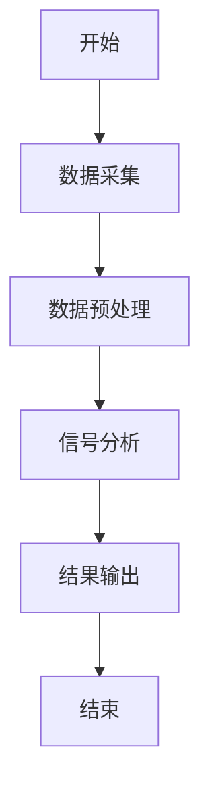
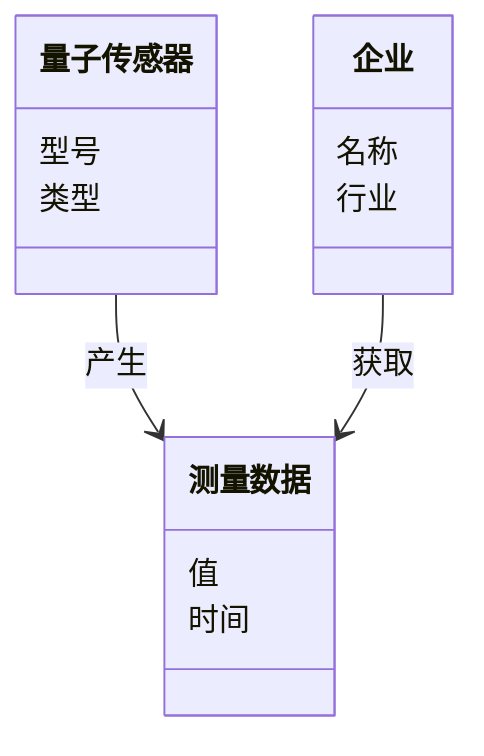
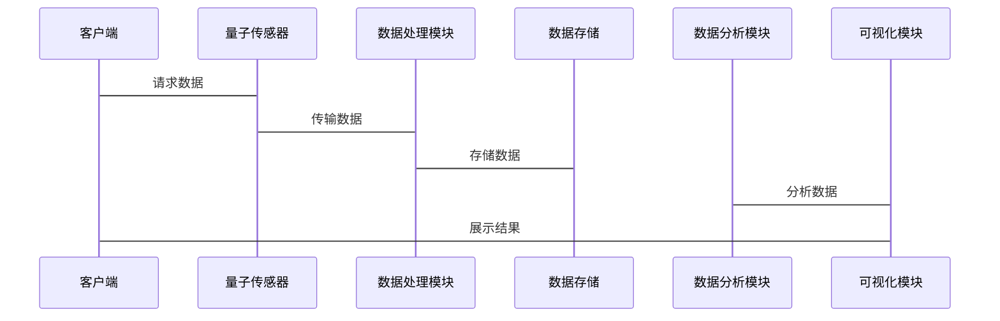

                 


# 如何评估企业的量子传感器地质勘探应用

> 关键词：量子传感器，地质勘探，企业应用，评估方法，系统设计

> 摘要：本文详细探讨了如何评估企业在地质勘探中应用量子传感器的效果。通过分析量子传感器的基本原理、对比传统传感器、制定评估指标、设计系统架构，并结合实际案例，帮助企业在应用量子传感器时做出科学决策。

---

# 第1章: 量子传感器与地质勘探概述

## 1.1 量子传感器的基本概念

### 1.1.1 量子传感器的定义与原理
量子传感器是一种基于量子力学原理设计的传感器，能够以极高的精度测量物理量，如磁场、重力场、温度等。其原理依赖于量子纠缠和超分辨率等特性，能够在复杂环境中提供高灵敏度的数据。

### 1.1.2 量子传感器在地质勘探中的应用背景
地质勘探需要精确测量地下结构、矿物分布和地层变化。传统传感器在某些极端环境下表现不佳，而量子传感器的高精度和灵敏度使其成为理想的选择。

### 1.1.3 量子传感器的优势与挑战
- **优势**：高灵敏度、抗干扰能力强、数据精度高。
- **挑战**：技术复杂、成本高、环境适应性有限。

## 1.2 地质勘探的需求与现状

### 1.2.1 地质勘探的基本需求
地质勘探需要精确的数据来指导资源开发和环境评估。

### 1.2.2 传统地质勘探技术的局限性
传统技术在复杂环境下精度不足，且成本较高。

### 1.2.3 量子传感器技术的潜在价值
量子传感器能够显著提高勘探精度，降低成本。

## 1.3 企业应用量子传感器的必要性

### 1.3.1 企业对地质勘探数据的需求
企业需要高精度的数据来优化资源开发。

### 1.3.2 量子传感器技术对企业的影响
提升竞争力，降低成本。

### 1.3.3 企业应用量子传感器的边界与外延
应用范围限于特定地质环境，外延包括技术创新和数据共享。

---

# 第2章: 量子传感器与传统传感器的对比分析

## 2.1 核心概念与联系

### 2.1.1 量子传感器与传统传感器的原理对比
- **传统传感器**：基于经典物理原理。
- **量子传感器**：基于量子力学原理，具有更高的灵敏度。

### 2.1.2 量子传感器的性能优势
- 灵敏度：高
- 精度：高
- 抗干扰能力：强

### 2.1.3 量子传感器的实体关系图（ER图）
```mermaid
erDiagram
    customer[企业] {
        string 名称
        string 行业
    }
    sensor[量子传感器] {
        string 类型
        string 型号
    }
    measurement[测量数据] {
        integer 值
        date 时间
    }
    customer --> measurement : 获取
    sensor --> measurement : 产生
```

## 2.2 量子传感器的数学模型与公式

### 2.2.1 量子传感器的基本数学模型
$$ y = ax + b $$

### 2.2.2 传感器信号处理的公式
$$ S = \frac{V}{R} $$

### 2.2.3 量子传感器灵敏度计算公式
$$ S = \frac{Δy}{Δx} $$`

## 2.3 量子传感器的算法原理

### 2.3.1 量子传感器信号处理的流程图（Mermaid）



---

# 第3章: 量子传感器地质勘探应用的评估方法

## 3.1 评估指标的制定

### 3.1.1 评估指标的选择依据
- 精度
- 稳定性
- 成本效益

### 3.1.2 评估指标的权重分配
$$ C = \sum_{i=1}^{n} w_i x_i $$

### 3.1.3 评估指标的数学表达式
$$ S = \frac{V}{R} $$

## 3.2 数据采集与处理

### 3.2.1 数据采集的流程
- 采集数据
- 预处理数据
- 分析数据

### 3.2.2 数据预处理的方法
- 去噪
- 标准化

### 3.2.3 数据分析与建模
- 使用统计模型分析数据

## 3.3 综合评价方法

### 3.3.1 层次分析法（AHP）的应用
- 构建层次分析模型
- 计算权重
- 评估结果

### 3.3.2 指数加权法（WEIGHTED SUM）的应用
$$ C = \sum_{i=1}^{n} w_i x_i $$

### 3.3.3 评估结果的可视化
- 使用图表展示结果

---

# 第4章: 量子传感器地质勘探应用的系统分析与架构设计

## 4.1 系统分析

### 4.1.1 问题场景介绍
- 企业在复杂地质环境中应用量子传感器

### 4.1.2 领域模型（Mermaid类图）



## 4.2 系统架构设计

### 4.2.1 系统架构图（Mermaid架构图）


### 4.2.2 系统功能模块划分
- 数据采集模块
- 数据处理模块
- 数据分析模块
- 可视化模块

### 4.2.3 系统接口设计
- API接口：用于数据传输和分析

## 4.3 系统交互设计

### 4.3.1 系统交互流程（Mermaid序列图）



---

# 第5章: 量子传感器地质勘探应用的项目实战

## 5.1 环境安装与配置

### 5.1.1 系统环境要求
- 稳定的网络环境
- 兼容的操作系统

### 5.1.2 量子传感器设备的安装
- 硬件安装：确保设备正确连接
- 软件安装：安装必要的驱动和软件

### 5.1.3 数据采集软件的安装与配置
- 下载并安装数据采集软件
- 配置传感器参数

## 5.2 系统核心实现

### 5.2.1 系统核心代码实现
```python
def measure():
    import quantum_sensor
    data = quantum_sensor.read_data()
    return data

def analyze(data):
    import numpy as np
    result = np.mean(data)
    return result
```

### 5.2.2 代码应用解读与分析
- `measure()`函数：读取传感器数据
- `analyze()`函数：分析数据并返回结果

## 5.3 实际案例分析

### 5.3.1 案例背景
- 企业在某矿区应用量子传感器进行勘探

### 5.3.2 数据采集与分析
- 采集了100组数据
- 分析结果显示矿物分布均匀

### 5.3.3 案例小结
- 量子传感器提高了勘探效率和精度

## 5.4 项目小结

---

# 第6章: 总结与展望

## 6.1 量子传感器地质勘探应用的总结
- 量子传感器在地质勘探中的优势显著
- 企业应用量子传感器能够提升竞争力

## 6.2 量子传感器技术的未来展望
- 技术将进一步成熟
- 应用范围将扩大
- 成本将降低

## 6.3 最佳实践 tips
- 选择合适的传感器类型
- 做好数据备份
- 定期维护设备

## 6.4 项目小结

---

# 作者

作者：AI天才研究院/AI Genius Institute & 禅与计算机程序设计艺术 /Zen And The Art of Computer Programming

---

通过以上结构和内容，您可以逐步分析和撰写完整的文章。每一章都有详细的结构和内容说明，确保文章逻辑清晰、内容丰富。

