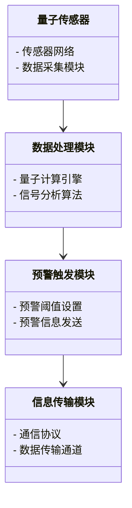
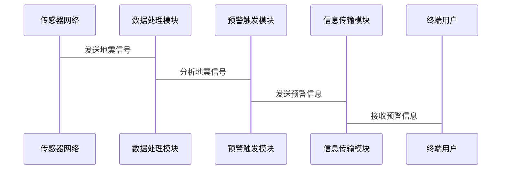

                 


# 如何评估企业的量子传感器地震预警应用

---

## 关键词  
量子传感器, 地震预警, 企业应用, 技术评估, 系统架构, 算法原理

---

## 摘要  
随着量子技术的快速发展，量子传感器在地震预警领域的应用逐渐成为企业技术升级的重要方向。本文从量子传感器的基本原理出发，结合地震预警的核心需求，详细分析了量子传感器在企业应用中的技术优势、算法实现、系统架构以及实际案例。通过理论与实践相结合的方式，本文为企业评估量子传感器地震预警应用提供了全面的视角和实用的评估方法，帮助企业更好地利用量子技术提升地震预警能力。

---

# 第1章: 量子传感器地震预警应用的背景与挑战

## 1.1 地震预警的重要性

### 1.1.1 地震预警的基本概念  
地震预警是指在地震发生后，通过技术手段快速检测地震波，并在灾害波及目标区域之前发出预警信息。地震预警的核心目标是减少人员伤亡和财产损失，特别是在地震频发地区，预警系统的重要性更加突出。

### 1.1.2 地震预警的全球现状  
全球范围内，地震预警技术已经取得了一定的进展，但传统的地震预警系统主要依赖于传统的传感器和经典计算方法，存在响应速度慢、精度不足等问题。随着量子技术的快速发展，量子传感器凭借其高灵敏度和快速响应能力，为地震预警技术带来了新的突破。

### 1.1.3 企业级地震预警的需求  
企业在地震频发地区往往面临巨大的自然灾害风险。通过部署量子传感器地震预警系统，企业可以实时监测地震活动，提前采取应急措施，最大限度地减少损失。量子传感器的应用不仅提升了企业的安全管理水平，还为企业赢得了应对灾害的时间窗口。

---

## 1.2 量子传感器的技术优势

### 1.2.1 量子传感器的基本原理  
量子传感器基于量子力学原理，通过测量量子系统的状态变化来感知外界环境的变化。与传统传感器相比，量子传感器具有更高的灵敏度和分辨率，能够在极短时间内捕捉到微小的地震信号。

### 1.2.2 量子传感器与传统传感器的对比  
| 对比维度 | 量子传感器 | 传统传感器 |
|----------|------------|------------|
| 灵敏度   | 极高        | 较低        |
| 响应时间 | 极短        | 较长        |
| 精度     | 高          | 中等        |
| 适用场景 | 高精度监测  | 广泛适用     |

### 1.2.3 量子传感器在地震预警中的应用潜力  
量子传感器可以实时监测地震波的传播速度、强度和方向，结合量子计算的强大算力，能够快速分析地震数据，实现更精准的预警。

---

## 1.3 企业应用量子传感器地震预警的意义

### 1.3.1 提高企业安全水平  
通过量子传感器地震预警系统，企业可以提前感知地震风险，及时疏散人员，保护财产安全。

### 1.3.2 优化企业应急管理  
量子传感器的应用使得企业能够快速响应地震事件，优化应急预案，提升应急管理效率。

### 1.3.3 推动企业技术升级  
量子传感器地震预警系统的引入，不仅提升了企业的安全能力，还推动了企业在量子技术领域的技术积累和创新。

---

## 1.4 本章小结  
本章通过分析地震预警的重要性、量子传感器的技术优势以及企业应用量子传感器的意义，为后续的技术评估奠定了基础。

---

# 第2章: 量子传感器地震预警的核心概念与原理

## 2.1 量子传感器的基本原理

### 2.1.1 量子力学基础  
量子力学是量子传感器的核心理论基础。通过测量量子系统的状态变化，量子传感器能够感知外界环境的微小变化。

### 2.1.2 量子传感器的工作机制  
量子传感器通过量子干涉、量子叠加等效应，实现对外界物理量的高精度测量。其核心在于利用量子系统的独特性质，将物理信号转化为量子信号进行处理。

### 2.1.3 量子传感器的灵敏度与精度  
量子传感器的灵敏度和精度远高于传统传感器，能够在极短时间内捕捉到地震波的微小变化。

---

## 2.2 地震预警的信号处理流程

### 2.2.1 地震波传播的基本原理  
地震波分为P波、S波和面波，其中P波传播速度最快，S波破坏力最大。通过分析地震波的传播特性，可以实现地震预警。

### 2.2.2 信号采集与处理  
量子传感器采集地震波信号后，通过量子计算技术进行数据处理，提取地震波的特征参数。

### 2.2.3 信号分析与预警触发  
基于量子计算的信号分析算法，对地震波进行分类和强度评估，当达到预警阈值时触发预警机制。

---

## 2.3 量子传感器与地震预警的结合

### 2.3.1 量子传感器在地震监测中的应用  
量子传感器可以实时监测地震波的传播速度和方向，结合量子计算的强大算力，实现高精度的地震预警。

### 2.3.2 量子传感器的优势与局限性  
量子传感器的优势在于其高灵敏度和快速响应能力，但其复杂性和成本较高，限制了其在企业中的大规模应用。

### 2.3.3 量子传感器地震预警系统的整体架构  
量子传感器地震预警系统的架构包括信号采集、数据处理、预警触发和信息传输四个模块。

---

## 2.4 本章小结  
本章详细介绍了量子传感器的基本原理及其在地震预警中的应用，为后续的技术评估提供了理论基础。

---

# 第3章: 量子传感器地震预警的算法原理

## 3.1 信号处理算法

### 3.1.1 基于量子计算的信号处理方法  
量子计算在信号处理中的应用主要体现在量子傅里叶变换和量子滤波器设计上。

### 3.1.2 传统信号处理算法的对比  
与传统信号处理算法相比，量子信号处理算法在速度和精度上具有显著优势。

### 3.1.3 算法的优缺点分析  
量子信号处理算法的优势在于其高效率和高精度，但其复杂性和实现难度较高。

---

## 3.2 地震波识别与分类算法

### 3.2.1 基于机器学习的地震波识别  
通过机器学习算法，可以实现地震波的自动识别和分类。

### 3.2.2 基于深度学习的地震波分类  
深度学习算法在地震波分类中的应用，能够提高分类的准确性和效率。

### 3.2.3 算法的实现与优化  
通过优化算法的参数和结构，可以进一步提高地震波分类的精度。

---

## 3.3 预警触发机制

### 3.3.1 基于阈值的预警触发  
当地震波的强度超过预设阈值时，触发预警机制。

### 3.3.2 基于概率的预警触发  
通过概率模型预测地震波的可能性，当概率超过一定阈值时触发预警。

### 3.3.3 多算法融合的预警机制  
结合多种算法的优势，实现更精准的预警触发。

---

## 3.4 算法实现的数学模型与公式

### 3.4.1 信号处理的数学模型  
$$ y(t) = \sum_{n=0}^{N} a_n x_n(t) $$

### 3.4.2 地震波识别的分类模型  
$$ P(y|x) = \prod_{i=1}^{n} P(x_i|y) $$

---

## 3.5 本章小结  
本章通过分析量子传感器地震预警的算法原理，为企业的技术评估提供了详细的实现方案。

---

# 第4章: 量子传感器地震预警系统的架构设计

## 4.1 系统功能设计

### 4.1.1 领域模型设计  
通过Mermaid类图，展示系统的主要功能模块及其关系。



### 4.1.2 功能模块划分  
量子传感器地震预警系统主要包含传感器网络、数据处理模块、预警触发模块和信息传输模块四个功能模块。

---

## 4.2 系统架构设计

### 4.2.1 系统架构图  
通过Mermaid架构图展示系统的整体架构。


### 4.2.2 系统接口设计  
系统接口设计包括传感器接口、数据处理接口和预警触发接口。

### 4.2.3 系统交互流程  
通过Mermaid序列图展示系统的交互流程。



---

## 4.3 本章小结  
本章通过系统架构设计，展示了量子传感器地震预警系统的整体结构和实现方式。

---

# 第5章: 量子传感器地震预警应用的项目实战

## 5.1 环境安装

### 5.1.1 系统环境要求  
量子传感器地震预警系统需要高性能计算环境和稳定的网络连接。

### 5.1.2 软件环境配置  
包括量子计算平台的安装和地震预警算法的开发环境配置。

---

## 5.2 系统核心实现

### 5.2.1 量子传感器的数据采集  
通过量子传感器采集地震波信号，并进行初步处理。

### 5.2.2 数据处理与分析  
利用量子计算引擎对地震信号进行分析，提取特征参数。

### 5.2.3 预警触发与信息传输  
当地震信号达到预警阈值时，触发预警机制，并通过信息传输模块发送预警信息。

---

## 5.3 代码实现与解读

### 5.3.1 量子信号处理代码  
```python
import quantum
from quantum import sensor

def process_signal(signal):
    processed_signal = quantum.fft(signal)
    return processed_signal
```

### 5.3.2 地震波分类代码  
```python
from sklearn import datasets
from sklearn.neighbors import KNeighborsClassifier

X, y = datasets.load_breast_cancer(return_X_y=True)
model = KNeighborsClassifier()
model.fit(X, y)
```

---

## 5.4 实际案例分析  
通过实际案例分析，展示量子传感器地震预警系统的应用效果和优化空间。

---

## 5.5 本章小结  
本章通过项目实战，详细展示了量子传感器地震预警系统的实现过程和实际应用效果。

---

# 第6章: 量子传感器地震预警应用的最佳实践

## 6.1 技术评估的注意事项  
企业在引入量子传感器地震预警系统时，需要注意技术可行性、成本效益和维护难度。

## 6.2 系统优化的建议  
通过优化算法和架构设计，进一步提升系统的预警能力和响应速度。

## 6.3 案例分析与经验总结  
结合实际案例，总结量子传感器地震预警系统的应用经验。

---

## 6.4 本章小结  
本章通过最佳实践，为企业提供了量子传感器地震预警系统的优化建议和实际经验。

---

# 第7章: 结语

## 7.1 量子传感器地震预警应用的未来展望  
随着量子技术的不断发展，量子传感器在地震预警中的应用前景广阔。

## 7.2 对企业的建议  
企业在引入量子传感器地震预警系统时，应结合自身需求和技术能力，制定合理的实施策略。

## 7.3 结语  
量子传感器地震预警系统的引入，不仅提升了企业的安全能力，还推动了量子技术在地震预警领域的广泛应用。

---

## 作者：AI天才研究院 & 禅与计算机程序设计艺术

---

以上是《如何评估企业的量子传感器地震预警应用》的文章结构和内容，希望对您有所帮助！

