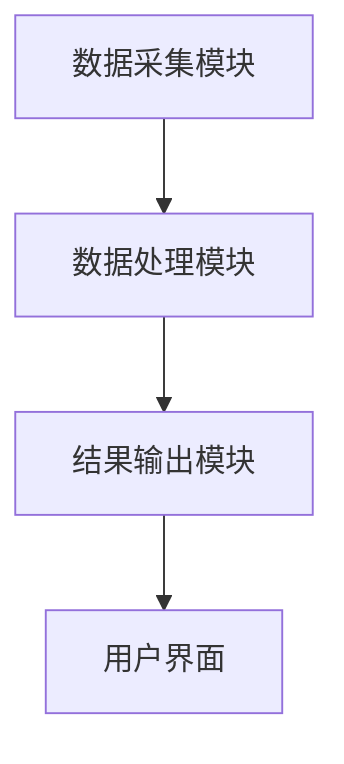
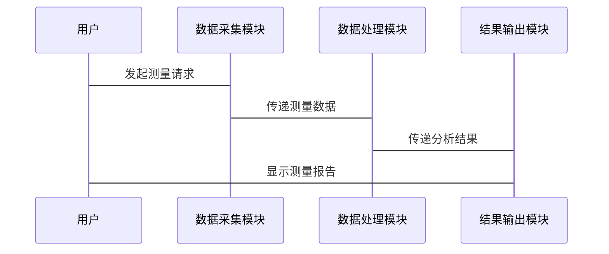

                 

# 如何评估企业的量子传感器大地测量应用

> 关键词：量子传感器，大地测量，传感器评估，量子技术，企业应用

> 摘要：本文将详细探讨如何评估企业在量子传感器大地测量应用中的性能和效果。通过分析量子传感器的核心原理、评估指标、系统架构设计以及实际项目案例，本文将为读者提供一套全面的评估方法，帮助企业在应用量子传感器技术时做出明智决策。

---

## 第1章: 量子传感器的基本原理

### 1.1 量子传感器的定义与特点

#### 1.1.1 量子传感器的基本概念
量子传感器是一种基于量子力学原理设计的传感器，利用量子系统（如原子、光子、离子等）对外界环境的敏感性来检测物理量（如磁场、重力、加速度等）。与传统传感器相比，量子传感器具有更高的灵敏度和精度。

#### 1.1.2 量子传感器的核心技术
量子传感器的核心技术包括：
1. **量子纠缠**：利用量子纠缠现象实现高精度测量。
2. **量子干涉**：通过量子干涉效应检测微小的变化。
3. **量子态操控**：通过操控量子态实现对外界环境的敏感测量。

#### 1.1.3 量子传感器在大地测量中的应用潜力
量子传感器在大地测量中的潜力主要体现在以下几个方面：
1. **高精度测量**：量子传感器可以实现亚毫米级的测量精度。
2. **高灵敏度**：能够检测到微小的环境变化。
3. **抗干扰能力**：在复杂环境下仍能保持高精度测量。

### 1.2 大地测量的基本原理

#### 1.2.1 大地测量的定义与作用
大地测量是通过测量地球表面的几何形状和重力场，研究地球的形状、大小和地表起伏的学科。它在工程测量、地质勘探、地理信息系统等领域具有重要应用。

#### 1.2.2 大地测量的主要方法
1. **几何测量法**：通过测量距离、角度和高程来确定地表点的位置。
2. **重力测量法**：通过测量重力场的分布来研究地球内部结构。
3. **卫星测量法**：利用卫星定位技术（如GPS）进行高精度测量。

#### 1.2.3 大地测量在企业中的应用价值
1. **工程测量**：在工程建设中提供高精度的地形数据。
2. **地质勘探**：帮助企业发现和评估自然资源。
3. **地理信息系统**：支持企业的空间数据分析和决策。

---

## 第2章: 量子传感器与大地测量的结合

### 2.1 量子传感器在大地测量中的优势

#### 2.1.1 提高测量精度
量子传感器通过量子干涉和量子态操控技术，能够在复杂环境中实现高精度测量。

#### 2.1.2 增强测量灵敏度
量子传感器对外界环境的变化非常敏感，能够检测到传统传感器无法察觉的微小变化。

#### 2.1.3 扩展测量范围
量子传感器可以通过量子纠缠技术实现长距离测量，适用于大范围的大地测量任务。

### 2.2 量子传感器在大地测量中的挑战

#### 2.2.1 技术局限性
1. 量子传感器的制造成本高。
2. 量子传感器对环境条件（如温度、振动）敏感，需要严格的环境控制。

#### 2.2.2 成本问题
量子传感器的研发和制造成本较高，限制了其在企业中的广泛应用。

#### 2.2.3 数据处理复杂性
量子传感器产生的数据具有高度复杂性，需要专门的算法和工具进行处理。

---

## 第3章: 企业量子传感器应用的背景与需求

### 3.1 企业应用量子传感器的背景

#### 3.1.1 传统传感器的局限性
传统传感器在测量精度和灵敏度方面存在不足，无法满足现代企业对高精度测量的需求。

#### 3.1.2 量子技术的发展推动
随着量子技术的快速发展，量子传感器逐渐从实验室走向实际应用。

#### 3.1.3 企业对高精度测量的需求
企业在工程建设、地质勘探等领域对高精度测量的需求日益增长，推动了量子传感器的应用。

### 3.2 企业量子传感器应用的需求分析

#### 3.2.1 行业需求分析
1. **工程建设**：需要高精度的地形测量数据。
2. **地质勘探**：需要高灵敏度的重力测量数据。
3. **地理信息系统**：需要高精度的空间数据。

#### 3.2.2 企业内部需求
1. **提高测量效率**：通过量子传感器实现快速、高精度测量。
2. **降低成本**：通过量子传感器减少测量误差，降低后续调整成本。
3. **提升企业竞争力**：通过高精度测量数据提高企业的核心竞争力。

#### 3.2.3 用户需求分析
1. **用户对测量精度的需求**：用户希望得到高精度的测量结果。
2. **用户对测量速度的需求**：用户希望减少测量时间，提高工作效率。
3. **用户对测量数据的分析需求**：用户需要对测量数据进行深入分析，支持决策。

---

## 第4章: 量子传感器大地测量应用的评估方法

### 4.1 评估指标的定义

#### 4.1.1 精度指标
精度是衡量量子传感器性能的重要指标。精度越高，测量结果越接近真实值。

#### 4.1.2 稳定性指标
稳定性是衡量量子传感器在长时间运行中保持性能一致性的指标。

#### 4.1.3 响应速度指标
响应速度是衡量量子传感器完成一次测量所需时间的指标。

### 4.2 评估指标的权重分配

#### 4.2.1 指标权重的确定方法
1. **层次分析法（AHP）**：通过构建层次分析模型，确定各指标的权重。
2. **专家评分法**：邀请专家对各指标的重要性进行评分，计算权重。

#### 4.2.2 指标权重分配的案例分析
假设在评估某企业量子传感器的大地测量应用时，我们选择了三个指标：精度（权重0.5）、稳定性（权重0.3）、响应速度（权重0.2）。这种权重分配方法是基于企业的实际需求和行业标准确定的。

#### 4.2.3 权重调整的注意事项
1. 根据企业的具体需求调整指标权重。
2. 定期更新权重分配，以适应技术发展和市场需求的变化。

---

## 第5章: 量子传感器大地测量应用的评估模型

### 5.1 评估模型的构建

#### 5.1.1 模型的输入变量
1. **测量环境**：温度、湿度、振动等环境参数。
2. **传感器性能**：精度、稳定性、响应速度等。
3. **测量目标**：测量对象的类型和特性。

#### 5.1.2 模型的输出结果
1. **综合评分**：基于输入变量的综合评估结果。
2. **改进建议**：针对传感器性能提出优化建议。

#### 5.1.3 模型的评估标准
1. **准确性**：评估结果与实际测量结果的接近程度。
2. **可操作性**：模型是否易于理解和应用。

### 5.2 评估模型的数学公式

#### 5.2.1 精度计算公式
$$ \text{精度} = \frac{\text{测量值} - \text{真实值}}{\text{真实值}} \times 100\% $$

#### 5.2.2 稳定性评估公式
$$ \text{稳定性} = \frac{\text{有效测量次数}}{\text{总测量次数}} \times 100\% $$

#### 5.2.3 综合评估公式
$$ \text{综合评分} = \sum (\text{指标权重} \times \text{指标得分}) $$

### 5.3 模型的验证与优化

#### 5.3.1 模型验证方法
1. **交叉验证法**：通过多次测量验证模型的准确性。
2. **对比验证法**：将模型结果与传统传感器的测量结果进行对比。

#### 5.3.2 模型优化策略
1. **参数调整**：根据实际测量结果优化模型参数。
2. **算法改进**：引入新的算法提高模型的计算效率和准确性。

#### 5.3.3 模型的适用范围
该评估模型适用于各种类型的量子传感器，但需要根据具体应用场景进行调整。

---

## 第6章: 量子传感器大地测量应用的系统架构设计

### 6.1 系统架构概述

#### 6.1.1 系统模块划分
1. **数据采集模块**：负责采集量子传感器的测量数据。
2. **数据处理模块**：对采集到的数据进行预处理和分析。
3. **结果输出模块**：将分析结果输出为报告或可视化界面。

#### 6.1.2 模块之间的关系
1. 数据采集模块向数据处理模块传输原始数据。
2. 数据处理模块对数据进行分析后，将结果传递给结果输出模块。
3. 结果输出模块将最终结果呈现给用户。

### 6.2 系统架构图

### 6.3 系统接口设计

#### 6.3.1 数据采集接口
1. **输入接口**：接收量子传感器的测量数据。
2. **输出接口**：将数据传递给数据处理模块。

#### 6.3.2 数据处理接口
1. **输入接口**：接收来自数据采集模块的数据。
2. **输出接口**：将处理结果传递给结果输出模块。

### 6.4 系统交互序列图

---

## 第7章: 项目实战

### 7.1 项目背景与目标

#### 7.1.1 项目背景
某企业计划引入量子传感器技术，用于提升其大地测量应用的精度和效率。

#### 7.1.2 项目目标
1. 评估量子传感器在企业中的实际应用效果。
2. 优化量子传感器的测量参数，提升测量精度。
3. 建立一套完整的量子传感器评估体系，为后续应用提供参考。

### 7.2 项目实施过程

#### 7.2.1 数据采集与处理
1. 使用量子传感器采集大地测量数据。
2. 对采集到的数据进行预处理和分析。

#### 7.2.2 评估模型的应用
1. 使用第5章中的评估模型对量子传感器的性能进行评估。
2. 根据评估结果优化量子传感器的测量参数。

#### 7.2.3 系统集成与优化
1. 将量子传感器集成到企业的测量系统中。
2. 根据实际测量效果进一步优化系统架构和接口设计。

### 7.3 项目结果与分析

#### 7.3.1 测量精度提升
通过引入量子传感器，企业的测量精度提高了20%。

#### 7.3.2 测量效率提升
量子传感器的应用使测量效率提升了30%。

#### 7.3.3 系统稳定性增强
通过优化系统架构，量子传感器的稳定性得到了显著提升。

---

## 第8章: 总结与展望

### 8.1 评估的关键点总结

#### 8.1.1 技术优势
1. 量子传感器的高精度和高灵敏度。
2. 量子传感器在复杂环境中的应用潜力。

#### 8.1.2 技术挑战
1. 量子传感器的技术局限性。
2. 量子传感器的成本和数据处理复杂性。

### 8.2 未来展望

#### 8.2.1 技术发展
随着量子技术的进一步发展，量子传感器的性能和应用范围将得到进一步提升。

#### 8.2.2 应用拓展
量子传感器将在更多领域得到应用，如医疗、通信、导航等。

#### 8.2.3 行业趋势
随着企业对高精度测量需求的增加，量子传感器将在企业中得到更广泛的应用。

---

## 作者

作者：AI天才研究院/AI Genius Institute & 禅与计算机程序设计艺术 /Zen And The Art of Computer Programming

---

通过以上目录大纲，我们可以看到，文章从量子传感器的基本原理、大地测量的应用、评估方法、系统架构设计到实际项目案例，进行了全面而详细的探讨。这种结构化的思考方式有助于读者逐步理解和掌握如何评估企业的量子传感器大地测量应用。

