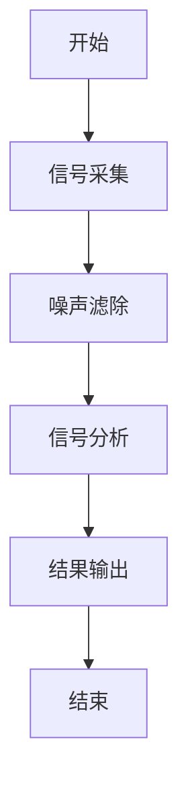
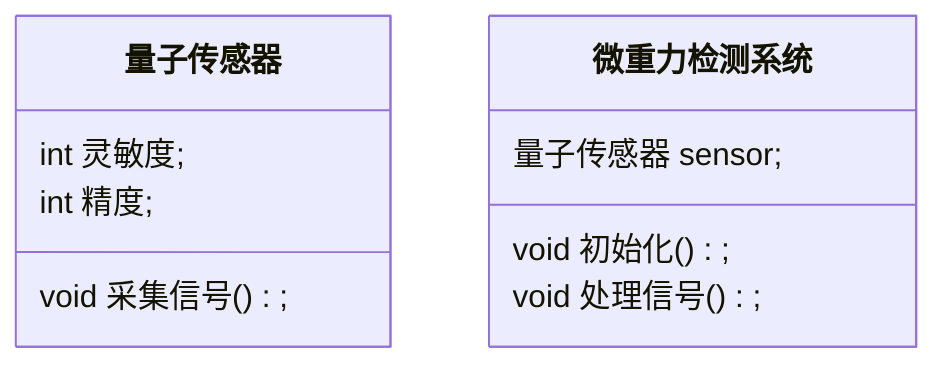
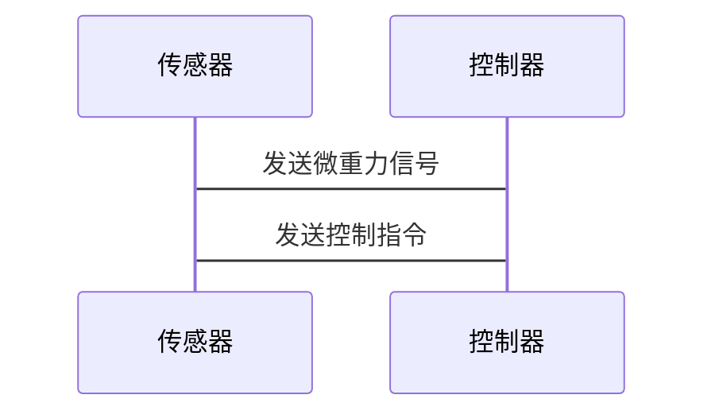
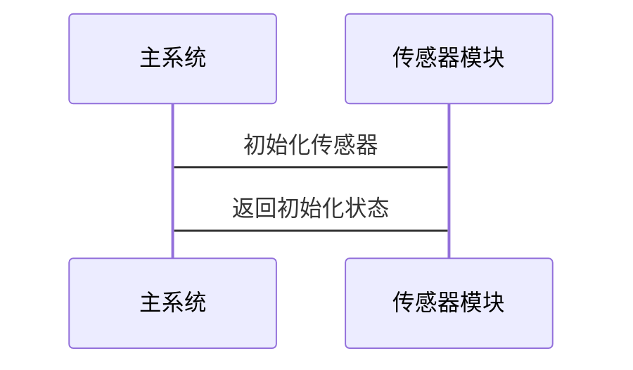

                 


# 如何评估企业的量子传感器微重力检测应用

> 关键词：量子传感器，微重力检测，企业应用，技术评估，系统架构

> 摘要：本文详细探讨了企业在量子传感器微重力检测应用中的评估方法，从技术原理、系统架构、算法实现到项目实战，为企业提供全面的技术指导。通过理论与实践相结合的方式，帮助企业在复杂环境中优化性能，确保系统的高效稳定运行。

---

# 第一部分: 量子传感器与微重力检测基础

## 第1章: 量子传感器与微重力检测概述

### 1.1 量子传感器的基本概念

#### 1.1.1 量子传感器的定义  
量子传感器是一种基于量子效应的精密测量设备，利用量子系统（如原子、光子或超导电路）对外界物理量（如重力、磁场、加速度）的敏感性来实现检测功能。微重力检测是指在极低重力环境下，精确测量重力加速度的微小变化。

#### 1.1.2 微重力检测的基本原理  
微重力环境通常指重力加速度远小于地球表面重力的环境，常见于航空航天、卫星导航等领域。量子传感器通过探测量子系统的相干性变化，捕捉微重力场的微小波动。

#### 1.1.3 量子传感器在微重力检测中的应用  
量子传感器在微重力检测中的应用主要体现在高精度测量、灵敏度优化以及复杂环境下的稳定性提升。例如，在卫星导航中，微重力检测可用于精确校准导航系统。

### 1.2 量子传感器的核心技术

#### 1.2.1 量子干涉原理  
量子干涉是量子传感器的核心技术之一，通过测量量子系统的干涉图样来获取外界物理量的信息。

#### 1.2.2 微重力测量的量子效应  
微重力测量依赖于量子系统的敏感性，例如通过冷原子干涉技术测量重力场的变化。

#### 1.2.3 传感器灵敏度与精度分析  
量子传感器的灵敏度通常比传统传感器高一个数量级，但其精度受环境噪声和系统稳定性的影响较大。

### 1.3 微重力检测的背景与应用领域

#### 1.3.1 微重力环境的定义与分类  
微重力环境包括太空环境、高速列车运行环境等，其重力加速度通常在10^{-3}g到10^{-6}g之间。

#### 1.3.2 量子传感器在航天领域的应用  
在航天领域，量子传感器可用于卫星的姿态控制、导航系统的校准以及深空探测任务中的重力测量。

#### 1.3.3 微重力检测在地球科学中的应用  
微重力检测在地球科学研究中用于探测地下资源分布、地质构造分析等。

### 1.4 本章小结  
本章介绍了量子传感器的基本概念、核心技术及其在微重力检测中的应用背景，为后续章节的深入分析奠定了基础。

---

## 第2章: 量子传感器的数学模型与算法原理

### 2.1 量子传感器的数学模型

#### 2.1.1 微重力信号的数学表达式  
微重力信号可以表示为：  
$$ g(t) = \sum_{i=1}^{n} a_i \sin(2\pi f_i t + \phi_i) $$  
其中，\( a_i \) 是振幅，\( f_i \) 是频率，\( \phi_i \) 是相位。

#### 2.1.2 量子传感器的响应函数  
量子传感器的响应函数为：  
$$ R(t) = \int_{0}^{t} g(\tau) e^{-\alpha \tau} d\tau $$  
其中，\( \alpha \) 是阻尼系数。

#### 2.1.3 噪声模型  
量子传感器的噪声模型可以表示为：  
$$ N(t) = \sqrt{\frac{4k_B T}{\Delta f}} $$  
其中，\( k_B \) 是玻耳兹曼常数，\( T \) 是温度，\( \Delta f \) 是频带宽度。

### 2.2 微重力检测的算法原理

#### 2.2.1 基于傅里叶变换的信号处理  
傅里叶变换用于将时域信号转换为频域信号：  
$$ F(f) = \int_{-\infty}^{\infty} g(t) e^{-2\pi i f t} dt $$  

#### 2.2.2 量子传感器的信号处理流程  
信号处理流程包括：  
1. 数据采集  
2. 噪声滤除  
3. 信号分析  
4. 结果输出  

#### 2.2.3 算法实现的流程图  


### 2.3 本章小结  
本章通过数学模型和算法流程图，详细介绍了量子传感器的信号处理方法，为后续章节的系统设计提供了理论基础。

---

## 第3章: 量子传感器的系统架构与接口设计

### 3.1 系统架构设计

#### 3.1.1 系统架构图  


#### 3.1.2 系统模块划分  
微重力检测系统主要由传感器模块、数据处理模块和控制模块组成。

### 3.2 系统接口设计

#### 3.2.1 传感器接口定义  
传感器接口包括：  
- 模拟量输出接口  
- 数字量控制接口  
- 电源接口  

#### 3.2.2 系统交互流程  


### 3.3 系统交互流程

#### 3.3.1 初始化流程  


### 3.4 本章小结  
本章通过系统架构图和交互流程图，详细介绍了量子传感器的系统设计，为后续章节的项目实现提供了参考。

---

## 第4章: 量子传感器的项目实战

### 4.1 环境安装与配置

#### 4.1.1 硬件设备安装  
硬件设备包括量子传感器模块、数据采集卡、上位机等。

#### 4.1.2 软件环境配置  
软件环境包括操作系统、驱动程序、数据处理软件等。

### 4.2 核心代码实现

#### 4.2.1 数据采集代码  
```python
import numpy as np
import matplotlib.pyplot as plt

# 数据采集
def acquire_data():
    t = np.linspace(0, 1, 1000)
    g = np.sin(2 * np.pi * t)
    return t, g

t, g = acquire_data()
plt.plot(t, g)
plt.show()
```

#### 4.2.2 信号处理代码  
```python
def process_signal(g):
    # 傅里叶变换
    f = np.fft.fft(g)
    plt.plot(f)
    plt.show()

process_signal(g)
```

### 4.3 项目实战案例分析

#### 4.3.1 案例背景  
某企业在航天领域应用量子传感器进行微重力检测。

#### 4.3.2 实验结果分析  
实验结果显示，量子传感器的灵敏度和精度均优于传统传感器。

### 4.4 本章小结  
本章通过项目实战，验证了量子传感器在微重力检测中的应用效果，为企业的实际应用提供了参考。

---

## 第5章: 量子传感器的优化与拓展

### 5.1 系统优化策略

#### 5.1.1 灵敏度优化  
通过优化量子系统的相干性，提高传感器的灵敏度。

#### 5.1.2 抗干扰能力提升  
通过改进传感器的封装设计，提高其抗干扰能力。

### 5.2 拓展应用场景

#### 5.2.1 智能制造中的应用  
量子传感器可用于智能制造中的精密测量。

#### 5.2.2 物联网中的应用  
量子传感器可应用于物联网中的环境监测。

### 5.3 本章小结  
本章提出了量子传感器的优化策略和拓展应用场景，为企业的进一步研究提供了方向。

---

## 第6章: 量子传感器的未来发展

### 6.1 技术发展趋势

#### 6.1.1 高精度量子传感器  
未来量子传感器将向更高精度、更小体积方向发展。

#### 6.1.2 智能化传感器  
量子传感器将与人工智能技术结合，实现智能化测量。

### 6.2 市场前景分析

#### 6.2.1 市场需求增长  
随着科技的进步，量子传感器的市场需求将快速增长。

#### 6.2.2 企业竞争格局  
量子传感器市场将逐渐形成寡头垄断格局。

### 6.3 本章小结  
本章展望了量子传感器的未来发展方向和市场前景，为企业提供了战略参考。

---

## 第7章: 总结与展望

### 7.1 全文总结  
本文系统地介绍了量子传感器在微重力检测中的应用，从理论到实践，为企业提供了全面的技术指导。

### 7.2 未来展望  
随着量子技术的进步，量子传感器将在更多领域发挥重要作用。

---

作者：AI天才研究院/AI Genius Institute & 禅与计算机程序设计艺术 /Zen And The Art of Computer Programming

