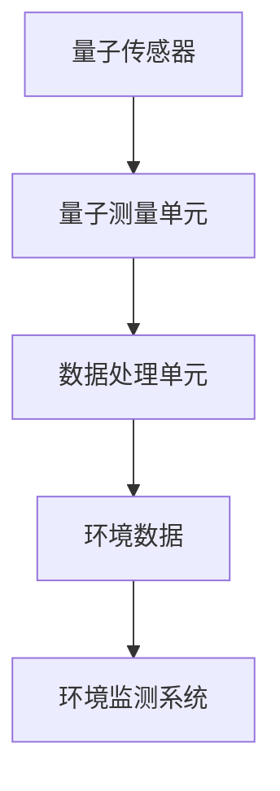
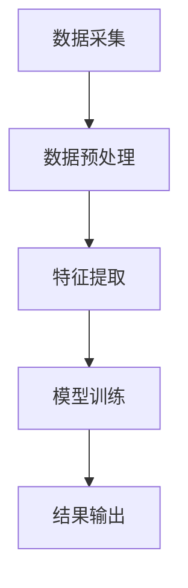
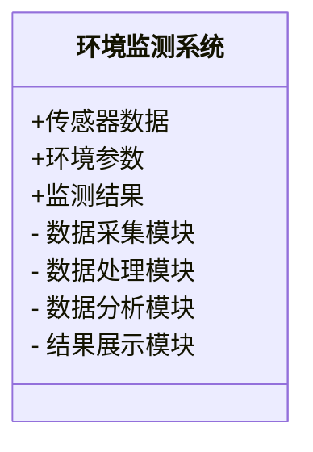
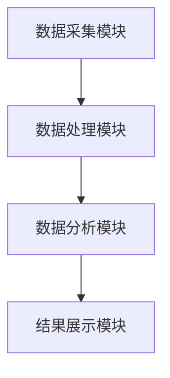
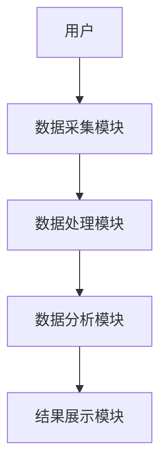

                 


# 如何评估企业的量子传感器环境监测应用

**关键词**：量子传感器，环境监测，企业应用，系统架构，算法原理，数据处理

**摘要**：本文详细探讨了如何评估企业在环境监测中应用量子传感器的各个方面，从基本概念到系统架构，再到算法原理和项目实战，全面分析了量子传感器在环境监测中的应用前景、技术挑战及解决方案。

---

# 第一部分: 量子传感器环境监测应用概述

## 第1章: 量子传感器与环境监测概述

### 1.1 量子传感器的基本概念

#### 1.1.1 量子传感器的定义
量子传感器是一种基于量子效应进行测量的装置，利用量子系统的特性（如量子叠加、量子纠缠）来实现高精度的测量。与传统传感器相比，量子传感器具有更高的灵敏度和分辨率，能够在复杂环境中检测到微弱信号。

#### 1.1.2 量子传感器的核心原理
量子传感器的核心原理是通过量子态的变化来反映被测物理量的变化。例如，利用量子干涉效应可以实现对微弱磁场的高精度测量，而利用量子纠缠技术可以实现对复杂系统的精确建模。

#### 1.1.3 环境监测的基本概念
环境监测是指通过各种技术手段对环境中的物理、化学和生物参数进行测量和分析，以评估环境质量及其变化趋势。环境监测在环境保护、气候变化研究等领域具有重要意义。

---

### 1.2 量子传感器在环境监测中的应用背景

#### 1.2.1 环境监测的重要性
环境监测是环境保护的基础，能够帮助我们及时发现和解决环境问题。例如，空气污染监测可以帮助政府制定有效的环保政策，水质监测可以保障饮用水的安全。

#### 1.2.2 传统环境监测技术的局限性
传统环境监测技术主要依赖于光学传感器和化学传感器，虽然这些技术已经相对成熟，但在灵敏度、稳定性等方面存在一定的局限性。例如，传统传感器在检测微弱信号时容易受到噪声干扰，导致测量精度不足。

#### 1.2.3 量子传感器的优势
量子传感器具有以下显著优势：
- **高灵敏度**：能够检测到极微弱的信号。
- **高分辨率**：能够区分非常接近的物理量变化。
- **抗干扰能力**：能够在复杂环境中保持较高的测量精度。

---

### 1.3 量子传感器环境监测应用的边界与外延

#### 1.3.1 应用场景的边界
量子传感器在环境监测中的应用主要集中在以下几个方面：
- **空气污染监测**：检测空气中的有害气体浓度。
- **水质监测**：检测水体中的污染物浓度。
- **地质监测**：监测地震前兆等。

#### 1.3.2 相关技术的外延
量子传感器的应用涉及多种技术，包括：
- **量子计算**：用于数据处理和建模。
- **人工智能**：用于数据分析和预测。
- **物联网（IoT）**：用于数据采集和传输。

#### 1.3.3 应用范围的界定
量子传感器的应用范围主要限于需要高精度测量的场景，例如：
- **高灵敏度需求**：如痕量气体检测。
- **复杂环境**：如深海探测、地下工程监测。

---

### 1.4 量子传感器环境监测应用的核心要素

#### 1.4.1 传感器硬件
量子传感器的硬件部分包括量子测量单元和数据采集模块。其中，量子测量单元负责将被测物理量转化为量子态的变化，数据采集模块则负责将这些变化转化为数字信号。

#### 1.4.2 量子测量技术
量子测量技术是量子传感器的核心，主要包括：
- **量子干涉技术**：通过测量光波的干涉图样来获取被测物理量。
- **量子纠缠技术**：利用量子纠缠的特性进行高精度测量。

#### 1.4.3 数据处理算法
数据处理算法是量子传感器的关键，负责将采集到的量子信号转化为可读的环境参数。常用的算法包括：
- **量子傅里叶变换**：用于信号处理。
- **最大似然估计**：用于参数估计。

---

### 1.5 本章小结
本章从基本概念出发，介绍了量子传感器在环境监测中的应用背景、优势及核心要素。通过对比传统传感器和量子传感器，读者可以更好地理解量子传感器在环境监测中的独特价值。

---

# 第二部分: 量子传感器环境监测应用的核心概念与联系

## 第2章: 量子传感器的核心原理

### 2.1 量子传感器的工作原理

#### 2.1.1 量子力学基础
量子力学是量子传感器的核心理论基础，主要包括以下内容：
- **波函数**：描述量子系统的状态。
- **不确定性原理**：ΔxΔp ≥ ħ/2，反映了测量的精度限制。

#### 2.1.2 量子传感器的测量机制
量子传感器通过测量量子系统的状态变化来实现对物理量的测量。例如，通过测量光子的偏振变化可以实现磁场的测量。

#### 2.1.3 量子传感器的敏感性
量子传感器的敏感性是指其能够检测到的最小物理量变化。通过优化量子系统的参数（如纠缠态的保真度），可以提高传感器的敏感性。

---

### 2.2 量子传感器与传统传感器的对比

#### 2.2.1 技术原理对比
| 技术原理 | 量子传感器 | 传统传感器 |
|----------|-------------|-------------|
| 基础理论 | 量子力学    | 经典物理    |
| 测量机制 | 量子态变化   | 电信号变化   |

#### 2.2.2 性能指标对比
| 性能指标 | 量子传感器 | 传统传感器 |
|----------|-------------|-------------|
| 灵敏度   | 极高        | 较低        |
| 稳定性   | 较高        | 较低        |
| 抗干扰能力 | 极强       | 较弱        |

#### 2.2.3 应用场景对比
| 应用场景 | 量子传感器适用 | 传统传感器适用 |
|----------|----------------|----------------|
| 微弱信号检测 | 是            | 否            |
| 复杂环境监测 | 是            | 否            |

---

### 2.3 量子传感器的实体关系图



---

### 2.4 本章小结
本章详细介绍了量子传感器的核心原理，通过对比传统传感器，突出了量子传感器在环境监测中的独特优势。

---

# 第三部分: 量子传感器环境监测应用的算法原理

## 第3章: 量子传感器数据处理算法

### 3.1 量子传感器数据处理流程

#### 3.1.1 数据采集阶段
数据采集阶段包括量子信号的生成和采集。例如，通过量子干涉仪生成光信号，并通过光电探测器采集光信号。

#### 3.1.2 数据预处理阶段
数据预处理阶段包括信号滤波、去噪和归一化。例如，通过小波变换去除信号中的噪声。

#### 3.1.3 数据分析阶段
数据分析阶段包括特征提取、模型训练和结果输出。例如，通过支持向量机（SVM）对环境参数进行分类。

---

### 3.2 量子传感器数据处理算法的实现

#### 3.2.1 算法流程图



#### 3.2.2 算法实现代码

```python
import numpy as np
from sklearn.svm import SVC

def preprocess(data):
    # 数据预处理
    return data

def extract_features(data):
    # 特征提取
    return data

def train_model(features):
    # 模型训练
    model = SVC()
    model.fit(features)
    return model

# 示例数据
data = np.random.rand(100, 2)
processed_data = preprocess(data)
features = extract_features(processed_data)
model = train_model(features)
result = model.predict(features)
print(result)
```

---

### 3.3 量子传感器数据处理的数学模型

#### 3.3.1 数据预处理公式
$$ y = f(x) $$

#### 3.3.2 特征提取公式
$$ z = g(y) $$

#### 3.3.3 模型训练公式
$$ \theta = \arg\min \sum (y_i - h_\theta(x_i))^2 $$

---

### 3.4 本章小结
本章通过流程图和代码示例，详细介绍了量子传感器数据处理的算法原理，帮助读者理解如何通过算法实现高精度的环境监测。

---

# 第四部分: 量子传感器环境监测应用的系统架构设计

## 第4章: 量子传感器环境监测系统的架构与实现

### 4.1 问题场景介绍
环境监测系统需要实时采集和处理大量的环境数据，对系统的性能要求较高。量子传感器的应用可以显著提高系统的灵敏度和准确性。

---

### 4.2 项目介绍

#### 4.2.1 项目目标
实现一个基于量子传感器的环境监测系统，能够实时监测空气质量和水质。

#### 4.2.2 项目范围
系统包括数据采集、数据处理、数据分析和结果展示四个模块。

---

### 4.3 系统功能设计

#### 4.3.1 领域模型类图



#### 4.3.2 系统架构图



---

### 4.4 系统接口设计

#### 4.4.1 接口描述
- **数据采集接口**：负责与量子传感器通信，获取环境数据。
- **数据处理接口**：负责对数据进行预处理和特征提取。
- **数据分析接口**：负责训练模型并输出结果。

#### 4.4.2 接口交互序列图



---

### 4.5 本章小结
本章通过系统架构设计，详细介绍了量子传感器环境监测系统的实现方案，包括功能模块、接口设计和交互流程。

---

# 第五部分: 量子传感器环境监测应用的项目实战

## 第5章: 量子传感器环境监测系统实战

### 5.1 环境安装

#### 5.1.1 系统要求
- 操作系统：Linux/Windows/MacOS
- 量子传感器硬件：支持量子测量的传感器模块
- 软件工具：Python 3.6+

#### 5.1.2 安装依赖
```bash
pip install numpy scikit-learn matplotlib
```

---

### 5.2 系统核心实现

#### 5.2.1 数据采集模块

```python
import serial

def read_sensor_data(port):
    ser = serial.Serial(port, 9600)
    data = ser.readline().decode()
    ser.close()
    return data
```

#### 5.2.2 数据处理模块

```python
import numpy as np

def preprocess(data):
    processed_data = np.array(data.split(), dtype=float)
    return processed_data
```

---

### 5.3 代码应用解读与分析

#### 5.3.1 代码解读
- **数据采集模块**：通过串口读取量子传感器的数据。
- **数据处理模块**：对采集到的数据进行预处理，提取特征。

#### 5.3.2 代码分析
通过上述代码，我们可以实现量子传感器数据的采集和预处理，为后续的分析提供高质量的数据。

---

### 5.4 实际案例分析

#### 5.4.1 空气质量监测案例
假设我们部署了一个量子传感器用于监测空气中的PM2.5浓度。通过上述系统，我们可以实现PM2.5浓度的实时监测和预警。

---

### 5.5 项目小结
本章通过实际案例，详细介绍了量子传感器环境监测系统的实现过程，帮助读者掌握如何在实际中应用量子传感器技术。

---

# 第六部分: 量子传感器环境监测应用的优化与总结

## 第6章: 量子传感器环境监测应用的优化

### 6.1 优化策略

#### 6.1.1 系统优化
- **硬件优化**：提高量子传感器的灵敏度和稳定性。
- **软件优化**：优化数据处理算法，提高系统的响应速度。

#### 6.1.2 数据优化
- **数据预处理**：通过更先进的滤波算法降低噪声。
- **数据存储**：采用分布式存储技术提高数据存储效率。

---

### 6.2 量子传感器环境监测应用的最佳实践

#### 6.2.1 系统设计
- **模块化设计**：便于系统的扩展和维护。
- **容错设计**：提高系统的可靠性。

#### 6.2.2 系统维护
- **定期校准**：确保传感器的准确性。
- **系统升级**：及时更新软件和硬件。

---

### 6.3 量子传感器环境监测应用的注意事项

#### 6.3.1 数据安全
- 确保环境数据的安全性，防止数据泄露。

#### 6.3.2 系统兼容性
- 确保系统与现有环境监测系统的兼容性。

#### 6.3.3 系统成本
- 量子传感器的成本较高，需要在成本和性能之间进行权衡。

---

### 6.4 量子传感器环境监测应用的未来展望

#### 6.4.1 技术进步
随着量子计算和人工智能技术的进步，量子传感器在环境监测中的应用将更加广泛。

#### 6.4.2 应用场景扩展
未来，量子传感器将应用于更多领域，如医疗监测、智能制造等。

---

### 6.5 本章小结
本章总结了量子传感器环境监测应用的优化策略和最佳实践，为读者提供了实际应用中的注意事项和未来展望。

---

# 第七部分: 总结与展望

## 第7章: 总结与展望

### 7.1 本章总结
本文详细探讨了如何评估企业在环境监测中应用量子传感器的各个方面，从基本概念到系统架构，再到算法原理和项目实战，全面分析了量子传感器在环境监测中的应用前景、技术挑战及解决方案。

---

### 7.2 未来展望
随着量子技术的不断发展，量子传感器在环境监测中的应用将更加广泛和深入。未来的研究方向包括：
- **新型量子传感器的开发**：探索更灵敏、更稳定的量子传感器。
- **量子传感器与人工智能的结合**：通过人工智能技术提高环境监测的智能化水平。

---

# 作者

作者：AI天才研究院/AI Genius Institute & 禅与计算机程序设计艺术 /Zen And The Art of Computer Programming

---

通过本文的详细分析，读者可以全面了解如何评估企业的量子传感器环境监测应用，并能够在实际中应用这些技术。希望本文能够为相关领域的研究和实践提供有价值的参考。

