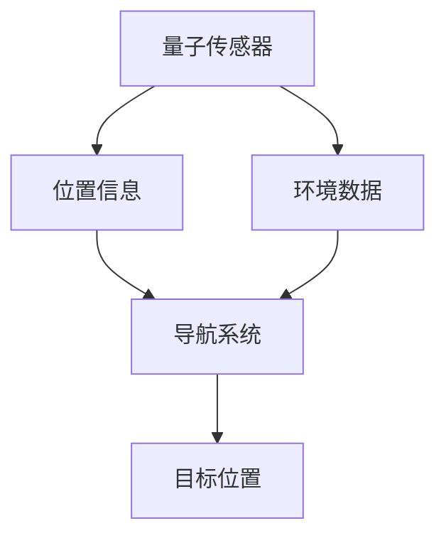
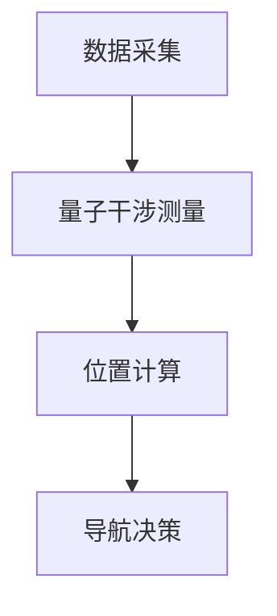
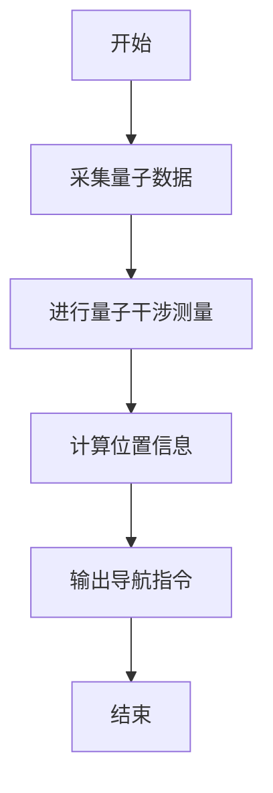
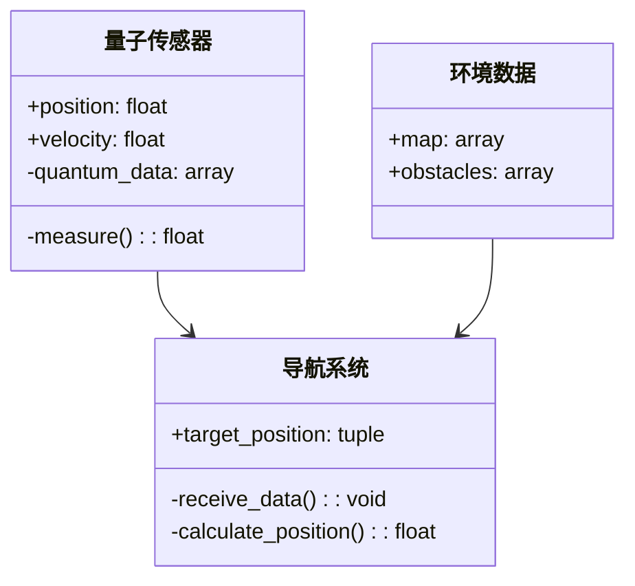
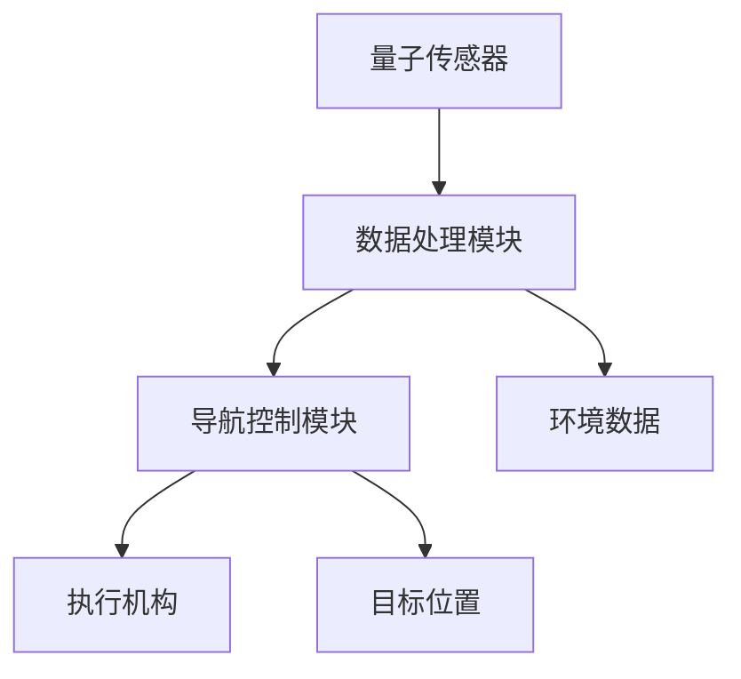
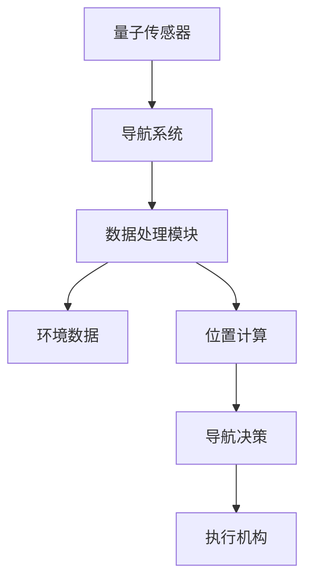

                 


# 如何评估企业的量子传感器精密导航技术潜力

> 关键词：量子传感器，精密导航技术，企业评估，技术潜力，算法原理

> 摘要：本文将详细探讨如何评估企业的量子传感器精密导航技术潜力。首先，我们从量子传感器的基本概念和精密导航技术的核心原理入手，分析其在企业中的应用场景和价值。接着，我们深入讲解量子传感器精密导航技术的算法原理，包括量子干涉测量法的数学模型和公式。然后，我们通过系统架构设计和项目实战，展示如何在企业中实现量子传感器精密导航技术。最后，我们总结了评估量子传感器精密导航技术潜力的关键点，并提出了最佳实践建议。

---

## 第一部分: 量子传感器精密导航技术概述

### 第1章: 量子传感器精密导航技术的背景与概念

#### 1.1 量子传感器的基本概念

量子传感器是一种利用量子效应进行测量的设备，其核心原理基于量子干涉测量法。量子传感器能够提供高精度的位置信息，尤其是在复杂环境中，其性能远超传统导航技术。

#### 1.2 精密导航技术的核心要素

精密导航技术依赖于高精度的位置计算能力，通常结合多种传感器数据（如加速度计、陀螺仪）和环境信息，通过复杂的算法实现精确导航。

#### 1.3 量子传感器在导航中的应用场景

量子传感器在自动驾驶、航空航天、机器人导航等领域具有广泛的应用潜力。特别是在室内导航和复杂地形中，其高精度和抗干扰能力使其成为传统导航技术的理想替代方案。

---

### 第2章: 量子传感器精密导航技术的核心概念与联系

#### 2.1 核心概念原理

量子传感器精密导航技术的核心在于量子干涉测量法。该方法通过测量量子状态的变化来确定位置信息，其数学模型如下：

$$
\text{位置} = \text{初始位置} + \text{量子干涉测量结果} \times \text{方向向量}
$$

#### 2.2 核心概念属性特征对比表格

表2-1展示了量子传感器与其他导航技术的对比分析：

| 技术         | 优点                           | 缺点                             |
|--------------|--------------------------------|----------------------------------|
| 量子传感器   | 高精度，抗干扰能力强           | 成本高，技术复杂                 |
| GPS          | 实时性好，覆盖范围广           | 易受干扰，室内精度低             |
| 激光雷达     | 精度高，适用于视觉导航         | 依赖环境特征，计算复杂           |

#### 2.3 ER实体关系图架构

图2-1展示了量子传感器精密导航技术的实体关系图：



---

## 第二部分: 量子传感器精密导航技术的算法原理

### 第3章: 量子传感器精密导航技术的算法原理

#### 3.1 算法原理概述

量子传感器精密导航算法的核心步骤包括数据采集、量子干涉测量和位置计算。整个过程可以通过以下流程图表示：



#### 3.2 算法流程图

图3-1展示了量子传感器数据处理流程图：



#### 3.3 算法实现的Python源代码

以下是一个量子传感器数据处理的Python示例代码：

```python
import numpy as np

def quantum_interference_measurement(data):
    # 量子干涉测量的核心算法
    interference = np.fft.fft(data)
    result = np.argmax(abs(interference))
    return result

def main():
    # 模拟量子数据
    data = np.random.randn(1000)
    # 进行测量
    position = quantum_interference_measurement(data)
    print(f"计算出的位置：{position}")

if __name__ == "__main__":
    main()
```

---

## 第三部分: 量子传感器精密导航技术的系统分析与架构设计

### 第4章: 量子传感器精密导航技术的系统分析与架构设计

#### 4.1 问题场景介绍

企业需要在复杂环境中实现高精度导航，传统技术难以满足需求，因此需要评估量子传感器精密导航技术的潜力。

#### 4.2 系统功能设计

图4-1展示了量子传感器精密导航系统的领域模型类图：



#### 4.3 系统架构设计

图4-2展示了量子传感器精密导航系统的架构图：



#### 4.4 系统接口设计

表4-1展示了系统主要接口及交互协议：

| 接口名称       | 描述               | 交互协议       |
|----------------|--------------------|----------------|
| measure()       | 量子测量接口       | 返回位置信息   |
| receive_data()  | 数据接收接口       | 返回环境数据   |
| calculate_position() | 位置计算接口 | 返回目标位置   |

#### 4.5 系统交互流程

图4-3展示了量子传感器精密导航系统的交互流程：



---

## 第四部分: 量子传感器精密导航技术的项目实战

### 第5章: 项目实战

#### 5.1 环境安装

需要安装量子传感器硬件、相关数据处理库（如NumPy）和导航系统框架。

#### 5.2 核心实现源代码

以下是一个量子传感器导航系统的实现代码：

```python
import numpy as np

class QuantumSensor:
    def __init__(self):
        self.position = (0.0, 0.0)
        self.velocity = (0.0, 0.0)
    
    def measure(self):
        data = np.random.randn(100)
        interference = np.fft.fft(data)
        result = np.argmax(abs(interference))
        return result

class NavigationSystem:
    def __init__(self, sensor):
        self.sensor = sensor
        self.target_position = (10.0, 10.0)
    
    def receive_data(self):
        return self.sensor.position
    
    def calculate_position(self):
        data = self.sensor.measure()
        position = self.receive_data()
        return position

if __name__ == "__main__":
    sensor = QuantumSensor()
    system = NavigationSystem(sensor)
    position = system.calculate_position()
    print(f"计算出的位置：{position}")
```

#### 5.3 代码解读与分析

上述代码展示了量子传感器的测量过程和导航系统的数据处理流程。通过量子干涉测量，系统能够计算出精确的位置信息。

#### 5.4 实际案例分析

在自动驾驶汽车中，量子传感器可以提供高精度的位置信息，帮助车辆在复杂环境中实现精准导航。

---

## 第五部分: 最佳实践与总结

### 第6章: 最佳实践与总结

#### 6.1 小结

量子传感器精密导航技术具有高精度和抗干扰能力强等优势，但在实际应用中需要考虑成本和复杂性。

#### 6.2 注意事项

企业在评估量子传感器技术时，应综合考虑技术成熟度、成本效益和实际需求。

#### 6.3 拓展阅读

推荐读者进一步阅读量子传感器和精密导航技术的相关文献，了解最新的研究成果和技术进展。

---

## 结语

评估企业的量子传感器精密导航技术潜力需要综合考虑技术原理、算法实现、系统架构和实际应用等多个方面。通过本文的详细分析，读者可以更好地理解量子传感器精密导航技术的优势和挑战，并为企业制定合适的技术战略提供参考。

---

作者：AI天才研究院/AI Genius Institute & 禅与计算机程序设计艺术 /Zen And The Art of Computer Programming

