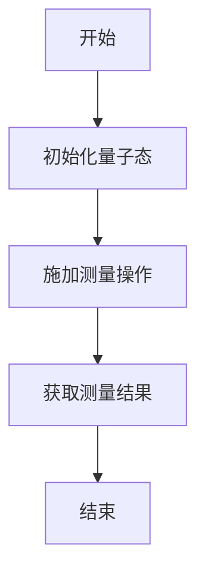
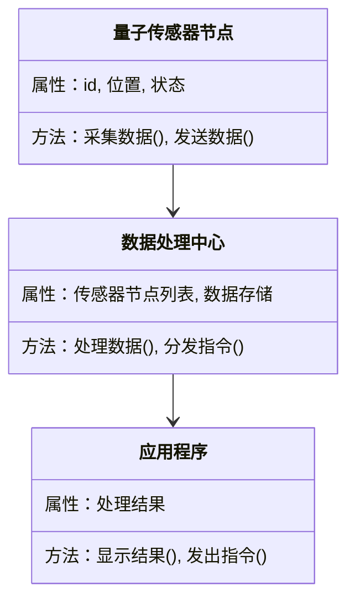

                 


# 如何评估企业的量子传感器网络应用

## 关键词：量子传感器网络、企业应用、传感器技术、量子技术、网络架构

## 摘要：量子传感器网络是一种新兴的技术，结合了量子技术和传统传感器网络的优势，为企业提供了更高的感知能力和数据处理效率。本文将详细介绍量子传感器网络的核心概念、工作原理、系统架构，并通过实际案例分析和项目实战，指导读者如何评估和应用量子传感器网络于企业环境中。

---

## 第一部分: 量子传感器网络应用背景与概述

### 第1章: 量子传感器网络的基本概念

#### 1.1 量子传感器的定义与特点

量子传感器是一种基于量子力学原理设计的传感器，能够以量子尺度感知环境信息。与传统传感器相比，量子传感器具有更高的灵敏度和分辨率，能够在更复杂的环境中检测微弱信号。

- **量子传感器的基本概念**  
  量子传感器利用量子系统的特性（如叠加态和纠缠态）来感知物理量，例如磁场、电场、温度等。其核心优势在于能够在极低信号条件下检测到细微的变化。

- **量子传感器与传统传感器的对比**  
  | 特性         | 量子传感器                     | 传统传感器                   |
  |--------------|-------------------------------|-----------------------------|
  | 灵敏度       | 极高                          | 较低                        |
  | 适用场景     | 微弱信号检测、量子计算等       | 温度、压力等普通物理量测量   |
  | 技术复杂度   | 高                           | 中等                        |

- **量子传感器网络的定义与特点**  
  量子传感器网络是将多个量子传感器通过网络连接，协同工作以实现更高精度和覆盖范围的感知系统。其特点包括高灵敏度、高可靠性、低功耗等。

---

#### 1.2 量子传感器网络的应用场景

量子传感器网络在企业中的应用潜力巨大，尤其在以下几个领域：

- **工业检测**：用于设备故障预测、产品质量检测等。  
- **环境监测**：用于空气质量和辐射监测等。  
- **智能交通**：用于车辆定位和交通流量监控等。

---

#### 1.3 量子传感器网络的架构与组成

量子传感器网络的架构通常包括以下几个部分：

- **数据采集层**：量子传感器负责采集环境数据。  
- **数据传输层**：通过无线或有线网络将数据传输到处理中心。  
- **数据处理层**：对数据进行分析和处理，提供决策支持。

---

## 第二部分: 量子传感器网络的核心概念与联系

### 第2章: 量子传感器网络的核心原理

#### 2.1 量子传感器的工作原理

量子传感器的工作原理基于量子力学的基本原理，尤其是叠加态和纠缠态的特性。例如，通过测量量子系统的状态变化来感知外界环境的变化。

- **量子叠加态**  
  $$|\psi\rangle = \alpha|0\rangle + \beta|1\rangle$$  
  其中，$|0\rangle$和$|1\rangle$是基态，$\alpha$和$\beta$是对应的概率幅。

- **量子纠缠态**  
  $$|\psi\rangle = \frac{1}{\sqrt{2}}(|0\rangle|1\rangle + |1\rangle|0\rangle)$$  
  通过纠缠态的测量结果，可以推断出外界环境的变化。

#### 2.2 量子传感器网络的信号处理流程

量子传感器网络的信号处理流程可以分为以下几个步骤：

1. **信号采集**：量子传感器采集环境数据。  
2. **信号放大**：将微弱信号放大以便后续处理。  
3. **信号滤波**：去除噪声，提取有用信号。  
4. **信号分析**：通过算法分析信号，得出结论。

---

### 第3章: 量子传感器网络的核心概念与联系

#### 3.1 量子传感器网络的实体关系模型

以下是量子传感器网络的实体关系模型：

```mermaid
er
    actor 企业用户
    actor 网络管理器
    actor 数据分析师
    node 量子传感器节点
    node 数据处理中心
    node 应用程序
    edge from 量子传感器节点 to 数据处理中心
    edge from 数据处理中心 to 应用程序
    edge from 企业用户 to 量子传感器节点
    edge from 网络管理器 to 数据处理中心
    edge from 数据分析师 to 应用程序
```

---

## 第三部分: 量子传感器网络的算法原理

### 第3章: 量子传感器网络的算法原理

#### 3.1 量子传感器数据处理算法

量子传感器数据处理算法的核心思想是利用量子叠加原理对信号进行增强和去噪。以下是算法的流程图：



以下是具体的Python代码实现：

```python
import numpy as np

def quantum_algorithm(data):
    # 初始化量子态
    alpha = np.sqrt(0.5)
    beta = np.sqrt(0.5)
    psi = alpha * |0> + beta * |1>
    
    # 施加测量操作
    result = np.random.choice([0, 1], p=[alpha**2, beta**2])
    
    return result

# 示例数据
data = [1, 2, 3, 4, 5]
result = quantum_algorithm(data)
print(result)
```

---

## 第四部分: 量子传感器网络的系统分析与架构设计

### 第4章: 量子传感器网络的系统分析

#### 4.1 问题场景介绍

企业在使用量子传感器网络时，可能面临以下问题：

1. **数据采集延迟**：传感器节点之间的通信延迟较高。  
2. **数据处理复杂性**：量子数据的处理需要复杂的算法支持。  
3. **网络安全性**：量子传感器网络的数据传输需要更高的安全性保障。

---

### 第4章: 量子传感器网络的系统架构设计

#### 4.2 系统功能设计

以下是量子传感器网络的领域模型：



---

## 第五部分: 量子传感器网络的项目实战

### 第5章: 项目实战

#### 5.1 环境安装

首先，需要安装以下工具：

```bash
pip install qiskit
pip install numpy
pip install matplotlib
```

---

#### 5.2 核心代码实现

以下是量子传感器网络的核心代码实现：

```python
from qiskit import QuantumCircuit, Aer, execute
from qiskit.visualization import plot_histogram

# 初始化量子电路
qc = QuantumCircuit(2, 2)

# 实施量子叠加
qc.h(0)
qc.ccx(0,1)
qc.measure(0,0)
qc.measure(1,1)

# 执行量子模拟
backend = Aer.get_backend('qasm_simulator')
job = execute(qc, backend)
result = job.result()
counts = result.get_counts()

# 可视化结果
plot_histogram(counts)
```

---

## 第六部分: 量子传感器网络的最佳实践

### 第6章: 最佳实践

#### 6.1 选择合适的量子传感器

在选择量子传感器时，需要考虑以下因素：

- **灵敏度**：传感器的灵敏度是否满足企业的需求。  
- **适用场景**：传感器是否适用于企业的应用场景。  
- **成本**：传感器的成本是否在企业的预算范围内。

---

## 附录

### 附录A: 工具安装指南

以下是安装量子传感器网络所需工具的安装指南：

```bash
pip install qiskit
pip install numpy
pip install matplotlib
```

---

### 附录B: 关键术语表

- **量子传感器**：基于量子力学原理设计的传感器。  
- **量子叠加态**：量子系统的一种状态，表示为 $|\psi\rangle = \alpha|0\rangle + \beta|1\rangle$。  
- **量子纠缠态**：两个或多个量子系统之间的纠缠状态，表示为 $|\psi\rangle = \frac{1}{\sqrt{2}}(|0\rangle|1\rangle + |1\rangle|0\rangle)$。

---

## 作者

作者：AI天才研究院/AI Genius Institute & 禅与计算机程序设计艺术 /Zen And The Art of Computer Programming

---

通过本文，读者可以系统地了解量子传感器网络的核心概念、算法原理和系统架构，并通过实际案例分析和项目实战，掌握如何评估和应用量子传感器网络于企业环境中。

