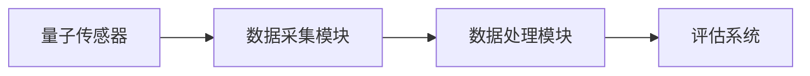
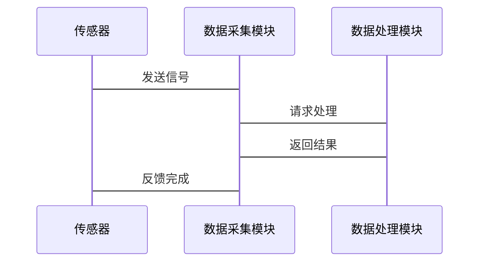

                 


# 如何评估企业的量子传感器重力测量应用

> 关键词：量子传感器, 重力测量, 企业应用, 技术评估, 传感器原理, 系统架构, 算法原理

> 摘要：随着量子技术的快速发展，量子传感器在重力测量中的应用逐渐成为企业关注的焦点。本文从量子传感器的基本原理出发，分析其在企业中的应用需求，并详细介绍评估方法和系统架构设计，结合实际案例，为企业提供科学的评估和应用建议。

---

## 第一章: 引言

### 1.1 背景介绍
量子传感器是一种基于量子效应的新型传感器，能够在高精度和灵敏度方面超越传统传感器。重力测量作为其重要应用之一，为企业提供了精准的地质勘探、环境监测等解决方案。

### 1.2 问题描述
企业在采用量子传感器时，需评估其性能、成本和适用性，以确保技术的有效应用。

### 1.3 问题解决
本文将系统地介绍量子传感器的评估方法，帮助企业做出明智决策。

### 1.4 边界与外延
本文仅讨论量子传感器在重力测量中的应用，不涉及其在其他领域的应用。

### 1.5 核心要素组成
- 量子效应
- 传感器结构
- 重力测量算法

---

## 第二章: 量子传感器的基本概念与背景

### 2.1 核心概念术语说明
- **量子传感器**：利用量子效应进行测量的设备。
- **重力测量**：通过传感器检测重力场变化的技术。

### 2.2 发展历程
从经典传感器到量子传感器的演进，展示了技术的进步。

### 2.3 核心原理
量子传感器通过干涉测量等方法实现高精度测量。

### 2.4 企业应用前景
企业采用量子传感器可以提升地质勘探和环境监测的效率。

---

## 第三章: 量子传感器的核心原理与技术

### 3.1 物理基础
量子传感器基于量子干涉原理，提供高精度测量。

### 3.2 测量方法
- **量子干涉测量**：通过干涉现象检测重力变化。
- **灵敏度分析**：量子传感器的灵敏度远高于传统传感器。

### 3.3 技术挑战
- **稳定性问题**：量子传感器易受环境影响。
- **成本问题**：制造成本较高。

---

## 第四章: 企业应用中的量子传感器重力测量需求分析

### 4.1 行业需求
- **地质勘探**：寻找矿产资源。
- **环境监测**：检测地质变化。

### 4.2 技术匹配
企业需评估现有技术与量子传感器的兼容性。

### 4.3 应用案例
- **案例一**：地质勘探中的应用。
- **案例二**：环境监测中的应用。

---

## 第五章: 量子传感器重力测量的评估方法

### 5.1 评估指标
- **精度**：测量的准确度。
- **灵敏度**：检测微小变化的能力。

### 5.2 评估流程
- **步骤一**：确定评估指标。
- **步骤二**：收集数据。
- **步骤三**：分析结果。

### 5.3 数学模型
量子传感器的灵敏度可通过公式计算：
$$ S = \frac{\Delta G}{\Delta t} $$
其中，S为灵敏度，ΔG为重力变化，Δt为时间间隔。

---

## 第六章: 系统架构与设计

### 6.1 系统架构设计
使用Mermaid图展示系统架构：


### 6.2 接口设计
- 数据采集接口：接收传感器信号。
- 数据处理接口：处理并输出结果。

### 6.3 交互流程
使用Mermaid序列图展示交互流程：


---

## 第七章: 项目实战

### 7.1 环境安装
安装量子传感器和相关设备，确保稳定运行。

### 7.2 核心实现
编写数据采集和处理的Python代码：

```python
def measure_gravity():
    # 初始化传感器
    sensor = QuantumSensor()
    # 采集数据
    data = sensor采集数据()
    # 处理数据
    result = 处理数据(data)
    return result
```

### 7.3 案例分析
分析地质勘探中的实际案例，验证评估方法的有效性。

---

## 第八章: 总结与展望

### 8.1 总结
本文详细介绍了量子传感器在企业中的应用评估方法，为企业提供了科学的指导。

### 8.2 注意事项
企业在采用量子传感器时，需考虑技术成熟度和成本问题。

### 8.3 拓展阅读
建议阅读相关量子传感器的技术文献，深入了解其发展动态。

---

## 作者

作者：AI天才研究院/AI Genius Institute & 禅与计算机程序设计艺术 /Zen And The Art of Computer Programming

---

这篇文章系统地介绍了量子传感器在企业中的应用评估，从原理到实践，为企业提供了全面的指导。

