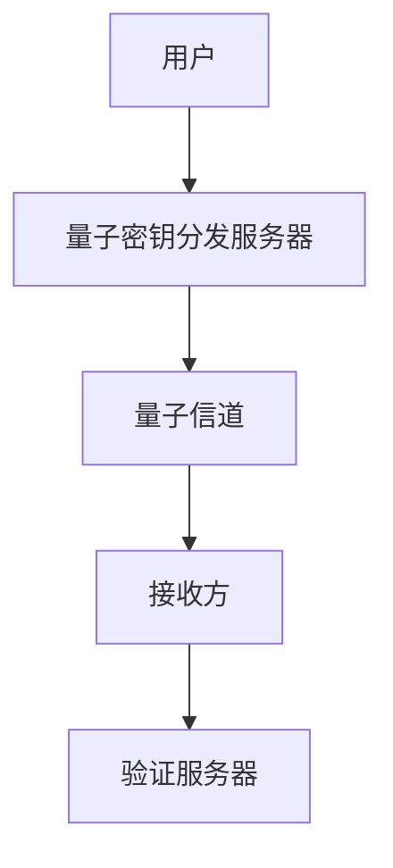
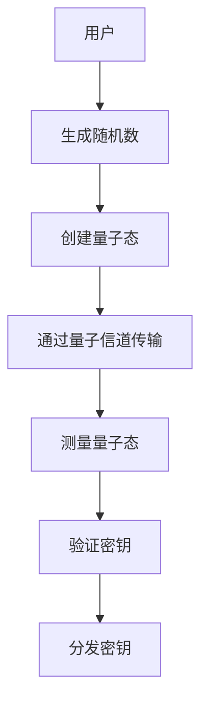
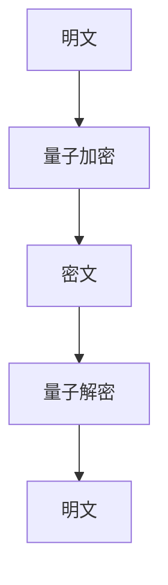

                 


# 如何评估企业的量子加密技术应用

> 关键词：量子加密技术，企业应用，评估标准，系统架构，安全防护

> 摘要：本文将详细探讨如何评估企业在量子加密技术上的应用，涵盖技术背景、核心概念、算法原理、系统架构、实际案例分析以及评估标准与方法。通过本文，读者将能够系统地了解量子加密技术的核心原理，掌握企业应用量子加密技术的关键点，并学习如何进行有效的评估与优化。

---

## 第一部分：量子加密技术应用背景与基础

### 第1章：量子加密技术概述

#### 1.1 量子计算与量子加密的基本概念

##### 1.1.1 量子计算的基本原理

量子计算是一种基于量子力学原理的计算方式，其核心在于利用量子叠加和量子纠缠的特性来处理信息。与经典计算机中的二进制位（0和1）不同，量子计算机使用量子位（qubit），可以在同一时间表示0、1以及两者之间的叠加状态。

量子计算的基本单位是量子比特（qubit），其状态可以表示为：

$$ | \psi \rangle = \alpha |0\rangle + \beta |1\rangle $$

其中，$\alpha$ 和 $\beta$ 是复数，且满足归一化条件：

$$ |\alpha|^2 + |\beta|^2 = 1 $$

##### 1.1.2 量子加密技术的定义与特点

量子加密技术是一种利用量子力学原理实现数据加密的技术。其核心思想是通过量子密钥分发（QKD）等手段，确保加密密钥的安全分发。量子加密技术的主要特点包括：

1. **不可分割性**：量子信息无法被复制或窃听而不被察觉。
2. **安全性**：基于量子力学的基本原理，量子加密技术能够抵抗量子计算机的攻击。
3. **高效性**：量子加密技术可以在更短的时间内完成密钥分发和加密过程。

##### 1.1.3 量子加密与传统加密的区别

| 特性           | 传统加密技术       | 量子加密技术       |
|----------------|--------------------|--------------------|
| 加密基础       | 离散数学           | 量子力学           |
| 加密速度       | 较慢               | 较快               |
| 安全性         | 可能被量子计算机破解 | 免疫于量子计算机攻击 |
| 适用场景       | 经典计算环境       | 量子计算环境       |

#### 1.2 量子加密技术的核心原理

##### 1.2.1 量子密钥分发（QKD）的原理

量子密钥分发是一种通过量子通信技术实现密钥安全分发的方法。其基本流程如下：

1. **密钥生成**：发送方和接收方通过量子信道生成共享的量子密钥。
2. **密钥分发**：通过量子信道将密钥分发给接收方。
3. **密钥验证**：验证密钥的完整性和安全性。

量子密钥分发的数学模型可以表示为：

$$ QKD = \{ q \in \{0,1\}^n | \text{通过量子信道传输} \} $$

##### 1.2.2 量子加密算法的数学模型

量子加密算法的核心是利用量子态的不可测量性和不可复制性来实现加密。其数学模型可以表示为：

$$ E(x) = \{ y | y = x \oplus k \} $$
$$ D(y) = \{ x | x = y \oplus k \} $$

其中，$x$ 是明文，$k$ 是量子密钥，$y$ 是密文，$\oplus$ 表示异或运算。

##### 1.2.3 量子叠加与量子纠缠在加密中的应用

量子叠加和量子纠缠是量子加密技术的核心原理。通过量子叠加，可以实现信息的并行处理；通过量子纠缠，可以实现信息的远程传输。

### 第2章：量子加密技术的核心概念与联系

#### 2.1 量子加密技术的核心原理

##### 2.1.1 量子密钥分发（QKD）的数学模型

$$ QKD = \{ q \in \{0,1\}^n | \text{通过量子信道传输} \} $$

##### 2.1.2 量子加密算法的实体关系图



#### 2.2 量子加密技术与传统加密技术的对比

| 特性           | 传统加密技术       | 量子加密技术       |
|----------------|--------------------|--------------------|
| 加密基础       | 离散数学           | 量子力学           |
| 加密速度       | 较慢               | 较快               |
| 安全性         | 可能被量子计算机破解 | 免疫于量子计算机攻击 |
| 适用场景       | 经典计算环境       | 量子计算环境       |

### 第3章：量子加密技术的算法原理

#### 3.1 量子密钥分发（QKD）算法

##### 3.1.1 QKD算法的流程图



##### 3.1.2 QKD算法的数学模型

$$ QKD = \{ q \in \{0,1\}^n | \text{通过量子信道传输} \} $$

#### 3.2 量子加密算法的实现

##### 3.2.1 量子加密算法的流程图



##### 3.2.2 量子加密算法的数学模型

$$ E(x) = \{ y | y = x \oplus k \} $$
$$ D(y) = \{ x | x = y \oplus k \} $$

---

## 第二部分：量子加密技术的系统分析与架构设计

### 第4章：量子加密技术的系统分析

#### 4.1 系统分析

##### 4.1.1 问题场景介绍

在企业应用中，传统的加密技术面临着被量子计算机破解的风险。因此，企业需要引入量子加密技术来提高数据安全性。

##### 4.1.2 项目介绍

本项目旨在为企业提供量子加密技术解决方案，包括量子密钥分发、量子加密算法设计与实现、系统架构设计等。

##### 4.1.3 系统功能设计

```mermaid
classDiagram
    class 用户 {
        用户身份
        用户请求
    }
    class 量子密钥分发服务器 {
        生成密钥
        分发密钥
    }
    class 量子信道 

---

### 第5章：量子加密技术的架构设计

#### 5.1 系统架构设计

##### 5.1.1 系统架构图

```mermaid
graph TD
    A[用户] --> B[量子密钥分发服务器]
    B --> C[量子信道]
    C --> D[接收方]
    D --> E[验证服务器]
```

##### 5.1.2 系统交互流程图


---

## 第三部分：量子加密技术的实际应用与评估

### 第6章：量子加密技术的实际应用案例

#### 6.1 案例分析

##### 6.1.1 金融行业的应用

在金融行业中，量子加密技术可以用于保护交易数据的安全。例如，某银行通过量子加密技术实现了交易数据的加密传输，有效防止了数据泄露。

##### 6.1.2 政府行业的应用

在政府行业中，量子加密技术可以用于保护敏感数据的安全。例如，某政府机构通过量子加密技术实现了文件加密和通信加密，确保了数据的安全性。

##### 6.1.3 医疗行业的应用

在医疗行业中，量子加密技术可以用于保护患者隐私数据的安全。例如，某医院通过量子加密技术实现了患者数据的加密存储和传输，防止了数据被窃取。

##### 6.1.4 能源行业的应用

在能源行业中，量子加密技术可以用于保护能源数据的安全。例如，某能源公司通过量子加密技术实现了能源数据的加密传输和存储，确保了数据的安全性。

### 第7章：企业量子加密技术应用的评估标准与方法

#### 7.1 评估标准

##### 7.1.1 功能性评估

功能性评估包括量子加密技术是否能够满足企业的业务需求，例如是否支持多种加密算法、是否支持大规模数据加密等。

##### 7.1.2 性能评估

性能评估包括量子加密技术的加密速度、解密速度、密钥分发效率等。

##### 7.1.3 安全性评估

安全性评估包括量子加密技术是否能够抵抗量子计算机的攻击、是否具有抗窃听能力等。

##### 7.1.4 兼容性评估

兼容性评估包括量子加密技术是否能够与现有系统兼容、是否支持多种平台和设备等。

##### 7.1.5 经济性评估

经济性评估包括量子加密技术的实施成本、维护成本、运行成本等。

#### 7.2 评估方法

##### 7.2.1 功能性评估方法

功能性评估可以通过对比测试、性能测试等方式进行。

##### 7.2.2 性能评估方法

性能评估可以通过基准测试、压力测试等方式进行。

##### 7.2.3 安全性评估方法

安全性评估可以通过安全性测试、漏洞扫描等方式进行。

##### 7.2.4 兼容性评估方法

兼容性评估可以通过兼容性测试、互操作性测试等方式进行。

##### 7.2.5 经济性评估方法

经济性评估可以通过成本分析、预算比较等方式进行。

---

## 第四部分：量子加密技术的未来发展趋势

### 第8章：量子加密技术的未来发展趋势

#### 8.1 未来发展趋势

##### 8.1.1 标准化发展

随着量子加密技术的不断发展，相关标准的制定和推广将成为重要趋势。

##### 8.1.2 技术创新

量子加密技术的不断创新将推动其在更多领域的应用。

##### 8.1.3 全球合作

全球范围内的合作与交流将加速量子加密技术的发展。

---

## 作者简介

作者：AI天才研究院/AI Genius Institute & 禅与计算机程序设计艺术 /Zen And The Art of Computer Programming

---

通过本文，读者可以系统地了解如何评估企业的量子加密技术应用，掌握量子加密技术的核心原理、系统架构设计、实际应用案例以及评估标准与方法。希望本文能够为企业在量子加密技术的应用中提供有价值的参考与指导。

