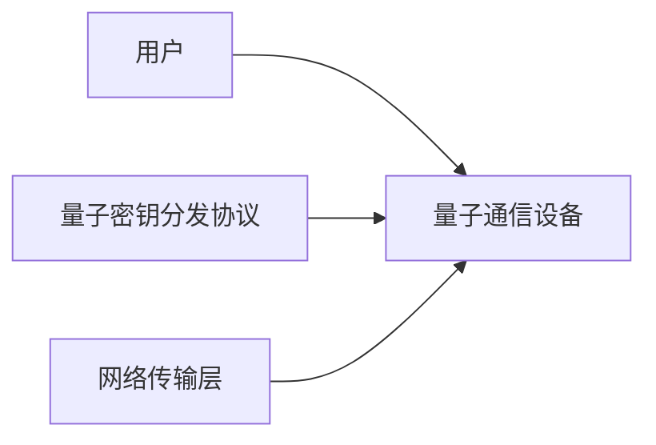
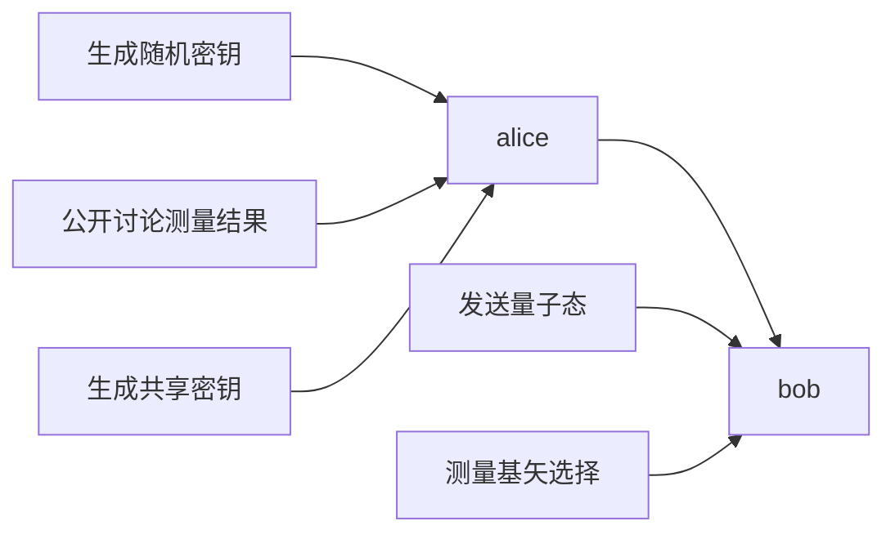
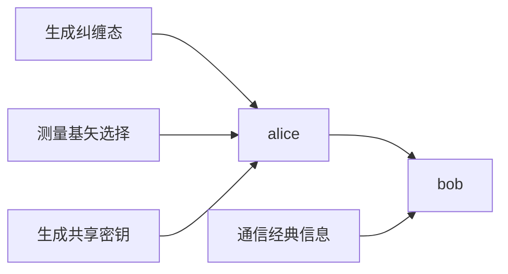
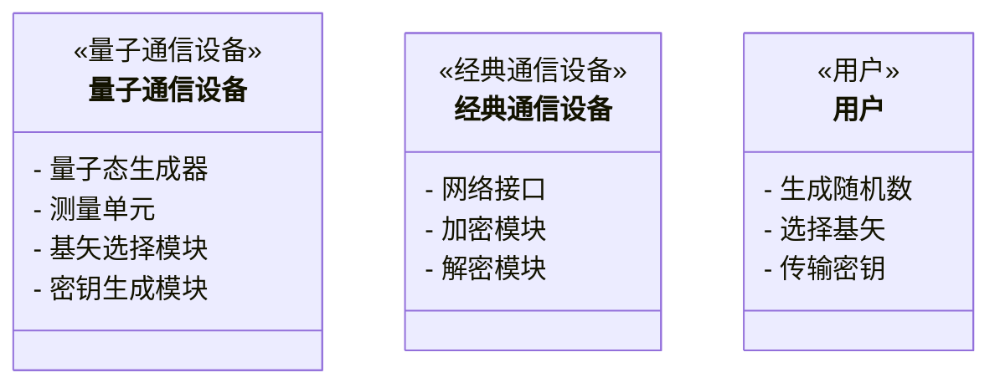
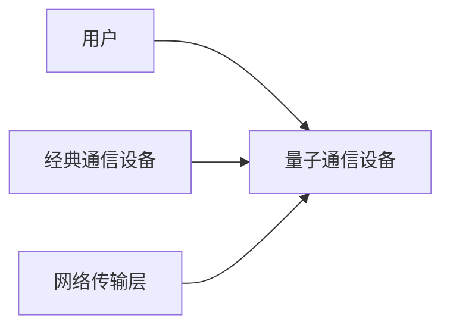
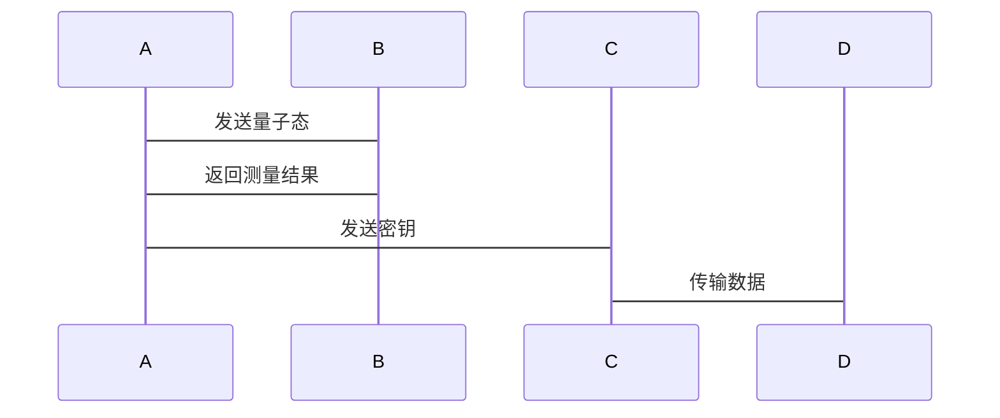

                 


# 如何评估企业的量子密码通信网络

## 关键词：量子密码通信网络、量子密钥分发、企业网络安全、密码学、量子技术

## 摘要：  
随着量子技术的快速发展，量子密码通信网络逐渐成为企业网络安全的重要组成部分。本文将从量子密码通信的核心原理、系统架构、安全性评估、实际案例分析等多个方面，详细探讨如何评估企业的量子密码通信网络，为企业在量子时代构建安全的通信网络提供指导。

---

## 第一部分: 量子密码通信网络基础

## 第1章: 量子密码通信网络概述

### 1.1 量子通信的基本概念

#### 1.1.1 量子通信的定义与特点
量子通信是一种利用量子力学原理进行信息传输的技术，主要包括量子密钥分发（QKD）、量子隐形传态等。其特点包括：  
- **安全性**：基于量子力学的不确定性原理，无法被窃听或破解。  
- **高效性**：在特定场景下，量子通信的传输速度远超传统通信方式。  
- **抗量子计算攻击**：量子通信技术能够抵抗未来可能出现的量子计算机的攻击。  

#### 1.1.2 量子密码通信的背景与意义
随着量子计算机的快速发展，传统密码学中的RSA、AES等加密算法面临被破解的风险。量子密码通信技术能够提供更高的安全性，是企业网络安全的重要补充手段。  

#### 1.1.3 企业量子密码通信网络的应用场景
企业可以利用量子密码通信技术保护敏感数据的传输，例如：  
- **金融行业**：保护交易数据的安全性。  
- **政府机构**：保护机密信息的传输。  
- **企业内部通信**：保护员工之间的敏感信息交流。  

### 1.2 量子密码通信的核心技术

#### 1.2.1 量子密钥分发（QKD）原理
量子密钥分发是一种通过量子态传输密钥的技术，其核心原理如下：  
1. **量子态传输**：通信双方通过量子态（如光子的偏振）传输信息。  
2. **基矢选择**：双方随机选择测量基矢，只有在基矢一致的情况下，才能获得相同的密钥。  
3. **误差检测**：通过公开讨论测量结果，检测传输过程中的噪声或窃听行为。  

#### 1.2.2 量子隐形传态
量子隐形传态是一种将量子态从一个位置传输到另一个位置的技术，其核心是利用量子纠缠和经典通信的结合，实现信息的无载体传输。  

#### 1.2.3 量子叠加与量子纠缠
量子叠加和量子纠缠是量子通信的核心现象：  
- **量子叠加**：一个量子系统可以同时处于多个状态的叠加态。  
- **量子纠缠**：两个或多个量子系统之间存在纠缠关系，一个系统的状态会直接影响另一个系统。  

### 1.3 量子密码通信的现状与挑战

#### 1.3.1 当前技术发展现状
目前，量子密码通信技术仍处于试验和试点阶段，主要应用于特定场景，如政府机构和金融机构的高安全需求领域。  

#### 1.3.2 量子密码通信的主要挑战
- **技术成熟度**：量子通信设备的成本高、稳定性差。  
- **标准化问题**：缺乏统一的行业标准和协议。  
- **实际应用限制**：量子通信的传输距离和带宽有限。  

#### 1.3.3 企业网络中的量子密码通信应用前景
随着技术的进步和成本的降低，量子密码通信将在企业网络中发挥越来越重要的作用，尤其是在高安全需求的领域。

---

## 第2章: 量子密码通信网络的背景与问题描述

### 2.1 传统密码学的局限性

#### 2.1.1 对称加密与公钥加密的优缺点
- **对称加密**：速度快，但密钥分发困难。  
- **公钥加密**：密钥分发方便，但计算复杂，安全性依赖于数学难题。  

#### 2.1.2 传统密码学的安全性挑战
- **量子计算机威胁**：传统加密算法可能被量子计算机破解。  
- **侧信道攻击**：通过物理侧信道获取加密信息。  

#### 2.1.3 量子计算机对传统密码学的威胁
量子计算机的出现使得许多传统加密算法面临被破解的风险，尤其是基于因式分解和离散对数的公钥加密算法。

### 2.2 量子密码通信的必要性

#### 2.2.1 企业网络的安全需求
企业网络中传输的大量敏感数据需要高强度的安全保护，量子密码通信能够提供更高的安全性。  

#### 2.2.2 量子密码通信的核心价值
- 提供抗量子计算攻击的安全性。  
- 保护企业核心数据的机密性和完整性。  

#### 2.2.3 企业网络中量子密码通信的解决方案
通过引入量子密钥分发技术，企业在网络中构建安全的密钥分发通道，确保数据传输的安全性。

### 2.3 量子密码通信的边界与外延

#### 2.3.1 量子密码通信的适用范围
- 适用于高安全需求的场景，如金融交易、政府通信等。  
- 适用于需要抗量子计算攻击的场景。  

#### 2.3.2 与经典密码学的结合
- 量子密码通信可以与经典密码学结合，形成多层次的安全防护体系。  
- 在某些场景下，量子密码通信作为补充手段，增强整体安全性。  

#### 2.3.3 量子密码通信的未来发展
随着技术的进步，量子密码通信将逐步从试验阶段走向实际应用，成为企业网络安全的重要组成部分。

---

## 第3章: 量子密码通信网络的核心概念与联系

### 3.1 量子密码通信的核心原理

#### 3.1.1 量子密钥分发（QKD）的数学模型
量子密钥分发的数学模型基于量子态的测量和基矢的选择，其核心公式如下：  
$$ K = \{k_i\}_{i=1}^{n} $$  
其中，$K$ 表示生成的密钥序列，$k_i$ 表示第 $i$ 个密钥位。  

#### 3.1.2 量子叠加与量子纠缠的数学表达
量子叠加和量子纠缠的数学表达如下：  
- 量子叠加：$|\psi\rangle = \alpha|0\rangle + \beta|1\rangle$  
- 量子纠缠：$|\phi\rangle = \frac{1}{\sqrt{2}}(|0\rangle|1\rangle + |1\rangle|0\rangle)$  

#### 3.1.3 量子密码通信的安全性证明
量子密码通信的安全性基于量子力学的不确定性原理，任何窃听行为都会引入噪声，从而被通信双方检测到。

### 3.2 核心概念对比分析

#### 3.2.1 量子密码通信与经典密码学的对比
| 对比维度       | 量子密码通信                     | 经典密码学                     |
|----------------|----------------------------------|---------------------------------|
| 安全性         | 抗量子计算攻击，安全性更高       | 易受量子计算机攻击             |
| 实现复杂度     | 技术复杂，设备成本高             | 技术相对简单，设备成本低       |
| 传输距离       | 传输距离受限                   | 传输距离较长                 |

#### 3.2.2 量子密钥分发与经典密钥分发的对比
| 对比维度       | 量子密钥分发（QKD）             | 经典密钥分发（传统方法）       |
|----------------|----------------------------------|---------------------------------|
| 安全性         | 抗量子计算攻击                   | 易受量子计算机攻击             |
| 密钥生成速度   | 较慢                             | 较快                           |
| 设备成本       | 高                               | 低                             |

#### 3.2.3 量子密码通信的安全性评估指标
- **密钥生成效率**：密钥生成的速度和数量。  
- **传输距离**：量子通信的传输距离限制。  
- **安全性**：抗窃听和抗攻击的能力。  

### 3.3 实体关系架构图



---

## 第4章: 量子密码通信网络的算法原理

### 4.1 量子密钥分发（QKD）算法

#### 4.1.1 BB84协议



#### 4.1.2 EPR协议



#### 4.1.3 Python实现示例

```python
import random

def generate_key():
    key = []
    for _ in range(10):
        if random.choice([0, 1]):
            key.append(1)
        else:
            key.append(0)
    return key

def compare_bases(alice_bases, bob_bases):
    matching = [i for i in range(len(alice_bases)) if alice_bases[i] == bob_bases[i]]
    return matching

# 示例代码
alice_bases = [random.choice([0, 1]) for _ in range(10)]
bob_bases = [random.choice([0, 1]) for _ in range(10)]
matching_indices = compare_bases(alice_bases, bob_bases)
print(matching_indices)
```

---

## 第5章: 量子密码通信网络的系统分析与架构设计

### 5.1 问题场景介绍
企业需要在内部网络中实现量子密码通信，以保护敏感数据的传输。  

### 5.2 系统功能设计



### 5.3 系统架构设计



### 5.4 接口设计与交互流程



---

## 第6章: 项目实战

### 6.1 环境安装
安装量子通信设备和相关软件，例如：  
- **QKD协议实现库**：如Qudit或Q#。  

### 6.2 系统核心实现

```python
import random

def generate_quantum_state():
    return random.choice([0, 1])

def measure_state(basis):
    state = generate_quantum_state()
    if basis == 0:
        return state
    else:
        return 1 - state

# 示例代码
alice_basis = 0
bob_basis = 1
alice_state = generate_quantum_state()
bob_state = measure_state(alice_basis)
print(alice_state, bob_state)
```

### 6.3 实际案例分析
通过实际案例分析，验证量子密码通信网络的安全性和效率。  

### 6.4 项目小结
总结项目实施的经验和教训，提出改进建议。

---

## 第7章: 最佳实践

### 7.1 实用小结
- 量子密码通信网络的安全性依赖于设备的稳定性和协议的正确实现。  
- 在实际应用中，需要结合经典密码学技术，形成多层次的安全防护体系。  

### 7.2 注意事项
- 量子通信设备的成本较高，需要充分考虑预算。  
- 量子通信的传输距离有限，需要合理规划网络架构。  

### 7.3 拓展阅读
- 推荐阅读《量子计算与密码学》和《量子通信技术与应用》等书籍。  

---

## 作者：AI天才研究院/AI Genius Institute & 禅与计算机程序设计艺术 /Zen And The Art of Computer Programming

