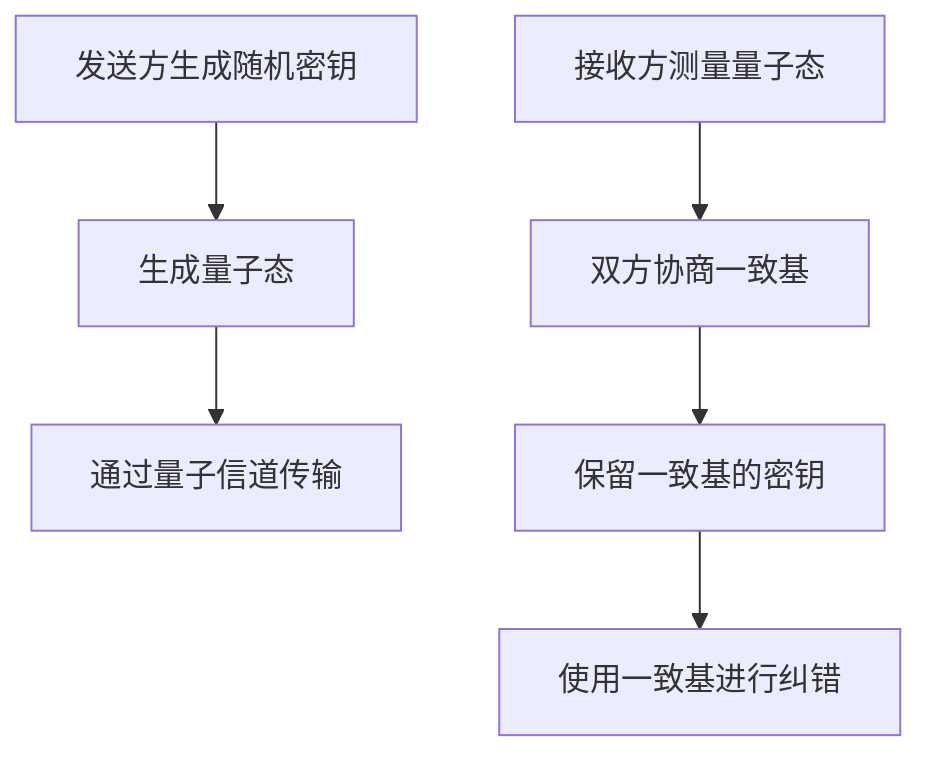
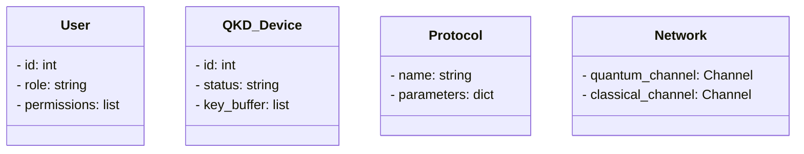
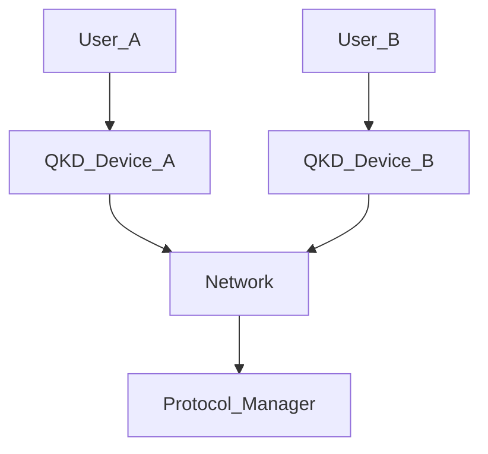
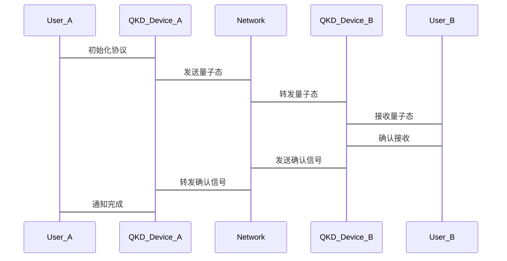

                 


# 如何评估企业的量子密钥分发城际网络安全性

> 关键词：量子密钥分发，安全性评估，企业网络，城际网络，协议分析，系统架构，密码学

> 摘要：本文详细探讨了如何评估企业在量子密钥分发（QKD）技术下的城际网络安全性。通过分析QKD的基本原理、协议优劣、数学模型和系统架构，结合实际案例和项目实战，为企业提供切实可行的安全性评估方法和最佳实践建议。

---

## 第一部分: 量子密钥分发（QKD）基础

### 第1章: 量子密钥分发概述

#### 1.1 量子密钥分发的基本概念
- **1.1.1 量子密钥分发的定义**
  - QKD是一种基于量子力学原理的密钥分发技术，用于安全地在两个或多个用户之间分发加密密钥。
- **1.1.2 量子密钥分发的核心原理**
  - 利用量子叠加和量子不可克隆定理，确保密钥的分发过程无法被窃听。
- **1.1.3 量子密钥分发在企业网络中的应用背景**
  - 企业级网络通信中，数据安全需求日益增长，QKD提供了一种理论上无条件安全的加密方案。

#### 1.2 量子密钥分发的发展现状
- **1.2.1 国际与国内量子密钥分发技术的发展现状**
  - 国际上，QKD技术已经进入实用化阶段，部分国家已经部署了城市级的量子通信网络。
  - 国内，量子通信技术发展迅速，多地已开展量子通信网络的试验和建设。
- **1.2.2 量子密钥分发技术在企业网络中的应用趋势**
  - 随着技术成熟，企业级QKD应用逐步从实验阶段向实际部署过渡。
- **1.2.3 量子密钥分发技术的主要优势与局限性**
  - 优势：无条件安全性，抗量子计算攻击。
  - 局限性：距离限制，实际部署成本高，技术复杂性。

#### 1.3 量子密钥分发的安全性评估
- **1.3.1 量子密钥分发的安全性核心要素**
  - 协议安全性：BB84、EPR等协议的安全性分析。
  - 设备安全性：量子设备的可靠性与安全性。
  - 传输安全性：量子信道的稳定性与抗干扰能力。
- **1.3.2 量子密钥分发的安全性评估标准**
  - 国际标准：如ISO/IEC 11889等。
  - 国内标准：如GB/T 39732-2021等。
- **1.3.3 量子密钥分发的安全性与经典密码学的对比**
  - 经典密码学依赖计算安全性，存在被量子计算机破解的风险。
  - QKD提供无条件安全性，但实际部署中面临更多挑战。

### 第2章: 量子密钥分发的核心概念与联系

#### 2.1 量子密钥分发的原理与协议
- **2.1.1 BB84协议**
  - **2.1.1.1 BB84协议的基本原理**
    - 发送方和接收方分别随机选择不同的基来编码和解码量子态。
  - **2.1.1.2 BB84协议的实现步骤**
    - 发送方生成随机密钥并用量子态传输。
    - 接收方测量量子态，双方通过公钥协商一致的基。
    - 根据一致的基保留密钥，其余部分用于误差检测和纠错。
  - **2.1.1.3 BB84协议的安全性分析**
    - 安全性基于量子不可克隆定理。
    - 对抗窃听者的概率可量化。
- **2.1.2 EPR协议**
  - **2.1.2.1 EPR协议的基本原理**
    - 基于纠缠态的量子通信。
  - **2.1.2.2 EPR协议的实现步骤**
    - 发送方生成一对纠缠态量子比特，一端发送给接收方。
    - 双方通过测量纠缠态来验证密钥。
  - **2.1.2.3 EPR协议的安全性分析**
    - 需要双方同时进行测量，实际应用中复杂性较高。

#### 2.2 量子密钥分发的核心概念对比
- **2.2.1 经典密码学与量子密码学的核心区别**
  - 经典密码学依赖计算复杂度，量子密码学依赖量子力学原理。
- **2.2.2 量子密钥分发与传统加密算法的对比**
  - QKD提供密钥分发，传统加密算法用于数据加密。
  - QKD提供无条件安全性，传统加密算法依赖计算安全性。
- **2.2.3 量子密钥分发与量子隐形传态的联系**
  - QKD与量子隐形传态均基于量子纠缠原理，但用途不同。

#### 2.3 量子密钥分发的ER实体关系图
```mermaid
er
actor: 企业网络
protocol: 量子密钥分发协议
qkd_device: 量子密钥分发设备
user: 用户
role: 权限角色
```

### 第3章: 量子密钥分发的算法原理

#### 3.1 BB84协议的流程


#### 3.2 BB84协议的Python实现示例
```python
import random
import math

def generate_key(length):
    return random.getrandbits(length)

def encode_qubit(key, basis):
    qubit = []
    for i in range(len(key)):
        if basis[i] == 'Z':
            qubit.append(int(key[i]))
        else:
            qubit.append(int(key[i]) ^ 1)
    return qubit

def decode_qubit(qubit, basis):
    decoded = []
    for i in range(len(qubit)):
        if basis[i] == 'Z':
            decoded.append(qubit[i])
        else:
            decoded.append(qubit[i] ^ 1)
    return decoded

def bb84_protocol():
    # 双方协商一致的基
    basis_alice = ['Z'] * 100  # 示例：100位密钥，全部使用Z基
    basis_bob = ['X'] * 100  # 示例：100位密钥，全部使用X基

    # 发送方生成随机密钥
    key = generate_key(100)
    # 发送方编码量子态
    qubit_alice = encode_qubit(key, basis_alice)
    # 接收方测量量子态
    qubit_bob = encode_qubit(key, basis_bob)
    # 双方协商一致的基
    common_basis = [i for i in range(100) if basis_alice[i] == basis_bob[i]]
    # 提取一致的密钥
    secret_key = []
    for i in common_basis:
        secret_key.append(str(key[i]))
    return ''.join(secret_key)

# 示例运行
print(bb84_protocol())
```

#### 3.3 QKD的数学模型和公式
- **量子态表示**
  - 利用向量空间表示量子态：$|\psi\rangle = a|0\rangle + b|1\rangle$，其中$a^2 + b^2 = 1$。
- **量子测量**
  - 测量基的选择影响结果：$|\langle 0|\psi\rangle|^2 = |a|^2$，$|\langle 1|\psi\rangle|^2 = |b|^2$。
- **密钥生成过程**
  - 发送方和接收方分别选择基$B_a$和$B_r$，只有当$B_a = B_r$时，测量结果才一致。

---

## 第二部分: 量子密钥分发系统的安全性评估

### 第4章: 系统分析与架构设计

#### 4.1 问题场景介绍
- **QKD系统的组成**
  - 发送设备、接收设备、量子信道、经典通信信道。
- **主要威胁模型**
  - 中间人攻击、窃听攻击、设备缺陷等。

#### 4.2 系统功能设计


#### 4.3 系统架构设计


#### 4.4 接口设计与交互流程


---

## 第三部分: 项目实战与最佳实践

### 第5章: 项目实战

#### 5.1 环境安装与配置
- **量子设备驱动安装**
  - 需要支持QKD协议的硬件设备。
- **协议管理软件安装**
  - 安装QKD协议栈，如Openssl-QKD扩展。

#### 5.2 系统核心实现
- **量子态生成与传输**
  - 使用量子随机数生成器。
- **协议管理**
  - 实现BB84协议的基协商与密钥提取。

#### 5.3 代码实现与解读
```python
def qkd_framework():
    import quantum_device
    import classical_comm

    # 初始化设备
    q_device = quantum_device.QKD_Device()
    c_comm = classical_comm.Channel()

    # 协议协商
    q_device.init_protocol('BB84')
    q_device.start()

    # 传输量子态
    q_device.send_qubits(c_comm)

    # 接收量子态
    q_device.receive_qubits(c_comm)

    # 提取密钥
    key = q_device.extract_key()
    print(f"生成密钥：{key}")

    return key

# 运行框架
qkd_framework()
```

#### 5.4 案例分析与详细解读
- **实际案例：企业级QKD网络部署**
  - 部署场景：城市间的QKD网络。
  - 安全性评估：通过实际测试验证协议的安全性。
  - 性能优化：优化量子信道的传输效率。

### 第6章: 最佳实践

#### 6.1 安全性评估建议
- **定期安全性测试**
  - 使用标准化测试方法评估QKD系统的安全性。
- **设备校准与维护**
  - 定期校准量子设备，确保其正常工作。
- **协议优化**
  - 根据实际需求调整协议参数，提升安全性与效率。

#### 6.2 小结
- 通过科学的评估方法和实际案例分析，可以有效提升企业QKD系统的安全性。
- 在实际部署中，需要综合考虑技术、成本和管理等多方面因素。

#### 6.3 注意事项
- 避免过度依赖单一协议，建议采用多协议结合的方式。
- 严格控制设备的物理安全性，防止侧信道攻击。
- 定期更新系统和协议，应对潜在的安全威胁。

#### 6.4 拓展阅读
- 推荐阅读：《量子密码学原理与应用》
- 推荐学习：量子通信协议的研究进展
- 推荐工具：QKD协议模拟与测试工具

---

## 作者信息

作者：AI天才研究院/AI Genius Institute & 禅与计算机程序设计艺术 /Zen And The Art of Computer Programming

---

以上是关于如何评估企业量子密钥分发城际网络安全性的技术博客的完整目录和部分内容。文章详细阐述了量子密钥分发的基本原理、协议分析、系统架构设计以及实际项目实战，为企业提供了一套完整的安全性评估方案和实践指南。

