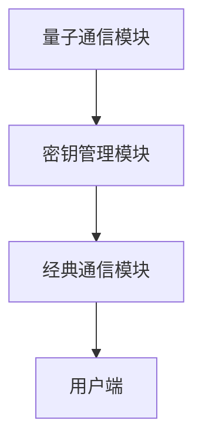

                 


# 《如何评估企业的量子密钥分发网络安全性》

> 关键词：量子密钥分发、网络安全、安全性评估、企业网络、量子通信

> 摘要：本文旨在探讨如何系统性地评估企业量子密钥分发网络的安全性。首先，我们介绍了量子密钥分发的基本概念和核心原理，接着分析了可能的安全威胁与风险，提出了具体的评估方法与工具。通过实际案例分析，我们展示了如何在企业网络中实施量子密钥分发的安全性评估，并提出了最佳实践建议。

---

## 第4章: 量子密钥分发网络的安全威胁与风险分析

### 4.1 安全威胁分析

#### 4.1.1 量子密钥分发网络的主要威胁

- **侧信道攻击**：通过监测设备的侧信道信息（如光子数、设备噪声等）来推断密钥。
- **设备漏洞攻击**：利用设备制造过程中的缺陷或不完美实现来窃取密钥。
- **传输过程中的干扰**：环境噪声或设备缺陷导致量子态信息被破坏，进而被攻击者利用。

#### 4.1.2 安全威胁的分类与特征

- **基于物理层的攻击**：直接针对量子通信信道的物理特性进行攻击。
- **基于协议层的攻击**：利用协议实现中的漏洞或不完善性进行攻击。
- **基于管理层的攻击**：通过控制或干扰密钥管理过程来窃取密钥。

### 4.2 安全风险的评估方法

#### 4.2.1 风险评估的基本框架

- **威胁识别**：识别可能的威胁来源和攻击方式。
- **脆弱性分析**：评估系统在面对威胁时的脆弱性。
- **风险量化**：通过概率和影响程度对风险进行量化评估。

#### 4.2.2 风险评估的指标与标准

- **威胁发生的概率**：基于历史数据和当前环境评估威胁发生的可能性。
- **威胁的影响程度**：评估威胁对系统造成的影响，包括数据泄露、密钥被窃取等。
- **安全措施的有效性**：评估现有安全措施对威胁的防护能力。

#### 4.2.3 风险评估的实施步骤

1. **威胁识别**：通过安全审计和漏洞扫描等方法识别潜在威胁。
2. **脆弱性分析**：对系统进行全面的安全评估，识别可能的漏洞。
3. **风险量化**：结合威胁发生的概率和影响程度，对风险进行排序和优先级划分。
4. **风险处理**：根据风险评估结果，制定相应的安全策略和防护措施。

### 4.3 本章小结

本章主要分析了量子密钥分发网络面临的安全威胁，并提出了风险评估的基本框架和实施步骤。通过识别威胁来源和评估系统的脆弱性，我们可以更好地理解量子密钥分发网络的安全性问题，并采取有效的防护措施。

---

## 第5章: 量子密钥分发网络的安全性测试与验证

### 5.1 安全性测试框架

#### 5.1.1 测试目标

- 验证量子密钥分发网络在实际运行环境中的安全性。
- 检测系统在面对各种攻击时的响应能力和防护效果。

#### 5.1.2 测试方法

- **黑盒测试**：从外部模拟攻击者的行为，测试系统的抗攻击能力。
- **白盒测试**：对系统内部进行详细检查，验证系统的实现是否符合安全要求。

### 5.2 协议验证

#### 5.2.1 协议实现的完整性验证

- 验证量子密钥分发协议在实际实现中的完整性，确保协议符合设计规范。

#### 5.2.2 协议的安全性验证

- 检测协议在实际运行中是否存在漏洞，验证协议的安全性保证。

### 5.3 漏洞检测

#### 5.3.1 设备漏洞检测

- 检测设备是否存在制造或配置上的缺陷，可能导致攻击者利用。

#### 5.3.2 传输过程中的漏洞检测

- 监测量子通信信道的稳定性，确保信道不会因环境干扰导致信息泄露。

### 5.4 安全性能测试

#### 5.4.1 密钥分发效率测试

- 测量密钥分发的速率和成功率，确保系统在高负载下的性能。

#### 5.4.2 系统抗干扰能力测试

- 在不同环境干扰下测试系统的稳定性，确保系统在复杂环境中的安全运行。

### 5.5 测试结果分析

#### 5.5.1 测试数据的收集与整理

- 对测试过程中收集的数据进行分析，找出系统中的潜在问题。

#### 5.5.2 测试结果的可视化

- 使用图表和报告形式展示测试结果，帮助更好地理解系统的安全性。

### 5.6 本章小结

本章重点介绍了量子密钥分发网络的安全性测试与验证方法，包括测试框架的设计、协议验证、漏洞检测和安全性能测试。通过系统性地测试和验证，我们可以确保量子密钥分发网络在实际应用中的安全性。

---

## 第6章: 量子密钥分发网络安全性评估的数学模型与算法

### 6.1 熵值计算

#### 6.1.1 熵值的定义

- 熵值是衡量数据随机性的指标，熵值越高，数据的随机性越强，安全性越高。

#### 6.1.2 熵值计算公式

$$ H = -\sum_{i=1}^{n} p_i \log_2 p_i $$

其中，\( p_i \) 是第 \( i \) 个事件发生的概率。

#### 6.1.3 熵值在安全性评估中的应用

- 通过计算密钥的熵值，评估密钥的随机性和安全性。

### 6.2 量子噪声模型

#### 6.2.1 量子噪声的定义

- 量子噪声是指在量子通信过程中由于环境干扰导致的信息损失。

#### 6.2.2 量子噪声模型的建立

$$ P(\text{错误}) = \text{函数}(信道噪声水平) $$

#### 6.2.3 量子噪声对密钥分发的影响

- 信道噪声水平越高，密钥分发的错误率越高，安全性越低。

### 6.3 密钥分发效率计算

#### 6.3.1 密钥分发效率的定义

- 密钥分发效率是指单位时间内成功分发的密钥数量。

#### 6.3.2 密钥分发效率计算公式

$$ \text{效率} = \frac{\text{成功分发的密钥数量}}{\text{时间}} $$

#### 6.3.3 密钥分发效率与系统安全性的关系

- 高效率的密钥分发意味着系统在高负载下仍能保持较高的安全性。

### 6.4 本章小结

本章通过数学模型和算法，详细讲解了量子密钥分发网络安全性评估的方法。包括熵值计算、量子噪声模型和密钥分发效率计算等内容，帮助我们从理论角度理解系统的安全性。

---

## 第7章: 量子密钥分发网络系统架构与安全性优化

### 7.1 系统架构分析

#### 7.1.1 系统功能模块

- **量子通信模块**：负责量子态信息的传输和处理。
- **经典通信模块**：负责经典信息的传输和处理。
- **密钥管理模块**：负责密钥的生成、分发和存储。

#### 7.1.2 系统架构图



### 7.2 安全性优化策略

#### 7.2.1 加强设备安全性

- 使用高质量的量子设备，减少设备缺陷导致的安全威胁。

#### 7.2.2 提高协议安全性

- 对协议进行优化和改进，确保协议在实际应用中的安全性。

#### 7.2.3 加强环境监控

- 实时监控量子通信信道的环境参数，确保信道的稳定性。

### 7.3 优化方法

#### 7.3.1 硬件优化

- 选择更高性能和更安全的量子通信设备。

#### 7.3.2 软件优化

- 对协议实现进行优化，减少漏洞和缺陷。

#### 7.3.3 管理优化

- 建立完善的密钥管理策略和安全管理制度。

### 7.4 本章小结

本章通过分析量子密钥分发网络的系统架构，提出了安全性优化策略和具体方法。通过硬件、软件和管理三个层面的优化，可以显著提高系统的安全性。

---

## 第8章: 量子密钥分发网络安全性评估的项目实战

### 8.1 项目背景与目标

#### 8.1.1 项目背景

- 某企业希望通过量子密钥分发技术实现企业内部的安全通信。

#### 8.1.2 项目目标

- 评估量子密钥分发网络的安全性，确保系统的安全运行。

### 8.2 环境搭建

#### 8.2.1 硬件环境

- 配置高性能的量子通信设备和经典通信设备。

#### 8.2.2 软件环境

- 安装量子密钥分发协议实现软件和相关测试工具。

### 8.3 核心代码实现

#### 8.3.1 量子密钥生成代码

```python
import random

def generate_key(length):
    key = [random.choice([0, 1]) for _ in range(length)]
    return ''.join(map(str, key))
```

#### 8.3.2 密钥分发代码

```python
def distribute_key(receiver, key):
    # 模拟经典通信模块
    print(f"密钥已分发给 {receiver}: {key}")
```

### 8.4 测试案例分析

#### 8.4.1 测试用例1：侧信道攻击测试

- 模拟侧信道攻击，测试系统是否能检测并抵御攻击。

#### 8.4.2 测试用例2：设备漏洞测试

- 检测设备是否存在漏洞，确保设备的安全性。

### 8.5 测试结果与分析

#### 8.5.1 测试结果展示

- 通过测试用例分析系统在不同情况下的表现。

#### 8.5.2 结果解读

- 根据测试结果提出改进建议，进一步优化系统安全性。

### 8.6 本章小结

本章通过实际项目案例，详细讲解了量子密钥分发网络安全性评估的实施过程。包括环境搭建、核心代码实现和测试案例分析等内容，帮助读者更好地理解如何在实际中应用这些评估方法。

---

## 第9章: 量子密钥分发网络安全性评估的最佳实践与总结

### 9.1 最佳实践

#### 9.1.1 定期进行安全评估

- 定期对系统进行安全评估，确保系统安全性。

#### 9.1.2 加强员工培训

- 提高员工的安全意识，减少人为因素导致的安全威胁。

#### 9.1.3 建立完善的应急预案

- 针对可能出现的安全问题，制定应急预案，确保快速响应。

### 9.2 小结

本章总结了量子密钥分发网络安全性评估的关键点，并提出了实际应用中的注意事项和未来的发展方向。

### 9.3 注意事项

- 在实际应用中，需要结合具体的网络环境和业务需求，灵活调整评估方法。

### 9.4 拓展阅读

- 推荐阅读相关领域的最新研究论文和技术报告，保持对技术发展的关注。

---

## 作者：AI天才研究院 & 禅与计算机程序设计艺术

