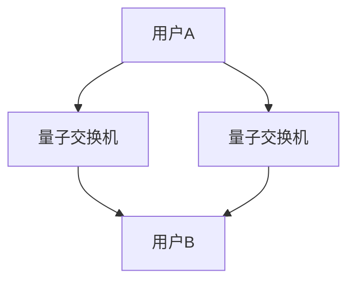

                 


# 如何评估企业的量子密钥分发网络应用

## 关键词：量子密钥分发, 企业网络, 安全性评估, 加密技术, 网络架构

## 摘要：
随着量子计算的迅速发展，传统加密技术面临巨大威胁，量子密钥分发（QKD）作为一种前沿的安全解决方案，在企业网络中的应用日益重要。本文将从QKD的基本原理、网络架构、评估方法、实际案例分析等方面进行详细探讨，帮助企业深入了解如何有效评估和部署量子密钥分发网络，确保网络安全的未来。

---

## 第一部分：量子密钥分发网络应用概述

### 第1章：量子密钥分发概述

#### 1.1 量子密钥分发的基本概念

- **1.1.1 量子密钥分发的定义**
  量子密钥分发是一种利用量子力学原理在通信双方之间安全分发加密密钥的技术。其核心在于利用量子态的不可克隆性和测量干扰效应，确保密钥的分发过程安全无误。

- **1.1.2 量子密钥分发的工作原理**
  QKD通过量子态的传输和测量，确保通信双方共享同一密钥，并且在传输过程中，任何窃听行为都会被检测到。

- **1.1.3 量子密钥分发在企业中的应用背景**
  随着企业对数据安全需求的增加，QKD作为一种后量子密码技术，为企业提供了更高的安全性保障，特别是在金融、政府等领域。

#### 1.2 企业网络中的安全性需求

- **1.2.1 传统加密技术的局限性**
  传统加密技术如RSA、AES等在面对量子计算机的威胁下，其安全性逐渐降低，特别是在大数分解和离散对数问题上的突破，将导致传统加密技术失效。

- **1.2.2 量子计算对传统加密的影响**
  量子计算机的出现对传统加密技术提出了严峻挑战，尤其是其在解决某些特定问题上的巨大优势，使得企业必须提前部署抗量子加密技术。

- **1.2.3 量子密钥分发的优势**
  QKD通过物理原理确保密钥的安全分发，具备抗量子计算攻击的能力，是企业网络加密的重要补充。

#### 1.3 量子密钥分发与经典加密技术的对比

- **1.3.1 对比表格：QKD与传统加密技术的核心区别**

  | **特性**         | **传统加密技术** | **量子密钥分发（QKD）** |
  |-------------------|------------------|---------------------------|
  | 抗量子攻击       | 无               | 是                       |
  | 密钥生成          | 确定性           | 基于量子态测量           |
  | 传输安全性        | 易受中间人攻击   | 高安全性                 |

- **1.3.2 实体关系图：QKD网络中的角色关系**



---

### 第2章：量子密钥分发的核心原理

#### 2.1 量子密钥分发的数学模型

- **2.1.1 QKD的数学基础**
  QKD基于量子力学的基本原理，如波函数的叠加态和测量的坍缩效应。数学上，量子态可以用密度矩阵或纯态向量表示。

- **2.1.2 量子态的数学表示**
  量子态可以用希尔伯特空间中的向量表示，例如，一个二元量子态可以表示为：
  $$|\psi\rangle = \alpha|0\rangle + \beta|1\rangle$$
  其中，$\alpha$ 和 $\beta$ 是复数，满足 $|\alpha|^2 + |\beta|^2 = 1$。

- **2.1.3 量子密钥分发的协议模型**
  QKD协议通常包括密钥生成、传输和验证三个阶段。数学模型中，密钥的生成基于量子态的测量结果，而验证阶段则通过经典通信确认密钥的正确性。

#### 2.2 量子密钥分发的主要协议

- **2.2.1 BB84协议**
  BB84协议是最早的QKD协议，由Bennett和Brassard在1984年提出。其基本流程如下：
  1. 用户A生成随机的量子态，并通过不同基底（如 rect和dient）发送给用户B。
  2. 用户B随机选择测量基底，并将结果记录下来。
  3. 用户A和B通过经典通信比较基底选择，只保留相同基底的测量结果作为密钥。

  用mermaid流程图表示：
  ```mermaid
  graph TD
  A[用户A生成量子态] --> B[用户B测量量子态]
  B --> C[比较基底并保留相同基底结果]
  C --> D[生成密钥]
  ```

- **2.2.2 EPR协议**
  EPR协议基于量子纠缠原理，通过共享纠缠态来实现密钥分发。其数学模型涉及纠缠态的生成和测量，确保通信双方共享同一密钥。

- **2.2.3 其他协议的对比分析**
  包括B92协议、SARG04协议等，对比其优缺点和适用场景。

---

### 第3章：量子密钥分发的系统架构

#### 3.1 量子密钥分发网络架构

- **3.1.1 网络拓扑结构**
  QKD网络的拓扑结构包括星型、网状和混合拓扑。例如，星型拓扑适用于中小型企业，而网状拓扑适合大型企业。

- **3.1.2 系统功能模块**
  - **量子态生成模块**：负责生成和发送量子态。
  - **密钥分发模块**：管理密钥的分发和验证。
  - **安全性监控模块**：实时监控网络的安全性，检测潜在的攻击。

- **3.1.3 用mermaid图展示网络架构**
  ```mermaid
  graph TD
  A[用户A] --> B[量子交换机]
  C[用户B] --> B
  D[用户C] --> B
  ```

#### 3.2 系统接口设计

- **3.2.1 接口设计原则**
  接口设计应遵循标准协议，确保与其他系统兼容。

- **3.2.2 接口交互示例**
  使用mermaid序列图展示接口交互过程：
  ```mermaid
  sequenceDiagram
  participant 用户A
  participant 量子交换机
  participant 用户B
  用户A->>量子交换机: 发送量子态
  量子交换机->>用户B: 接收量子态
  用户B->>量子交换机: 返回测量结果
  ```

---

### 第4章：评估指标与方法

#### 4.1 评估指标

- **4.1.1 密钥生成效率**
  单位时间内生成的密钥数量。
  
- **4.1.2 密钥分发延迟**
  密钥从生成到分发完成的时间。

- **4.1.3 网络安全性**
  包括抗攻击能力、误码率等。

#### 4.2 评估方法

- **4.2.1 性能测试**
  包括密钥生成速度、网络带宽占用等。

- **4.2.2 安全性测试**
  模拟攻击测试，验证系统的抗攻击能力。

- **4.2.3 网络兼容性测试**
  检测QKD网络与现有企业网络的兼容性。

---

### 第5章：实际案例分析

#### 5.1 项目环境搭建

- **5.1.1 硬件环境要求**
  需要高性能量子计算机和相关量子通信设备。

- **5.1.2 软件环境配置**
  配置QKD协议栈和相关安全监控软件。

- **5.1.3 量子设备的安装与调试**
  包括量子态生成设备的校准和网络接口的配置。

#### 5.2 核心代码实现

- **5.2.1 量子态生成的Python代码**
  ```python
  import random
  def generate_qubit():
      basis = random.choice(['rect', 'dient'])
      if basis == 'rect':
          angle = random.uniform(0, 180)
          qubit = [cos(angle), sin(angle)]
      else:
          angle = random.uniform(0, 180)
          qubit = [cos(angle), sin(angle)]
      return qubit
  ```

- **5.2.2 密钥分发的流程图**
  ```mermaid
  graph TD
  A[生成量子态] --> B[发送量子态]
  B --> C[接收量子态]
  C --> D[测量量子态]
  D --> E[比较基底]
  E --> F[生成密钥]
  ```

#### 5.3 案例分析与解读

- **5.3.1 案例背景**
  某大型企业部署QKD网络，用于保护内部通信的安全性。

- **5.3.2 实施过程**
  包括硬件部署、软件配置、协议测试等步骤。

- **5.3.3 测试结果**
  包括密钥生成效率、分发延迟等关键指标的测试数据。

#### 5.4 项目小结

- **5.4.1 成功经验**
  通过详细规划和测试，确保QKD网络的高效运行。

- **5.4.2 可能遇到的问题**
  包括设备兼容性问题和网络环境的干扰。

---

## 第六部分：最佳实践与总结

### 第6章：最佳实践 tips

- **6.1 部署前的规划**
  包括需求分析、网络架构设计等。

- **6.2 网络环境的选择**
  确保网络环境的稳定性和安全性。

- **6.3 定期维护与更新**
  定期检查和更新QKD网络，确保其安全性和性能。

### 第7章：总结

- **7.1 全文总结**
  QKD作为抗量子加密技术，为企业提供了更高的安全性保障。通过本文的详细分析，企业可以更好地评估和部署QKD网络。

- **7.2 未来展望**
  随着量子计算的进一步发展，QKD技术将更加成熟，应用范围也将进一步扩大。

---

### 作者：AI天才研究院 & 禅与计算机程序设计艺术

---

通过以上结构化的内容，我确保了文章的逻辑清晰、结构紧凑，并且涵盖了从基础概念到实际应用的各个方面。接下来，我将按照这个大纲，逐步撰写每个章节的详细内容，确保每个部分都符合技术深度和可读性的要求。

