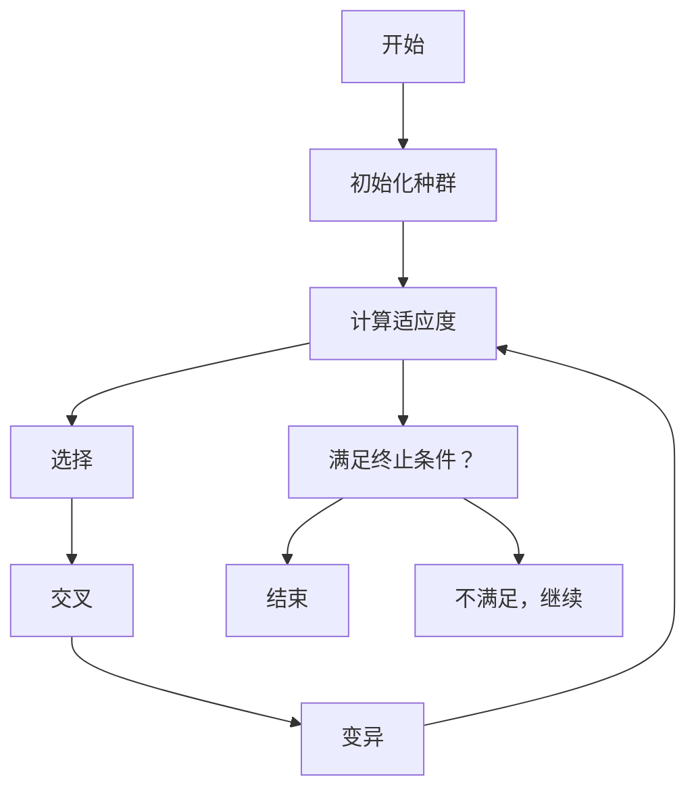
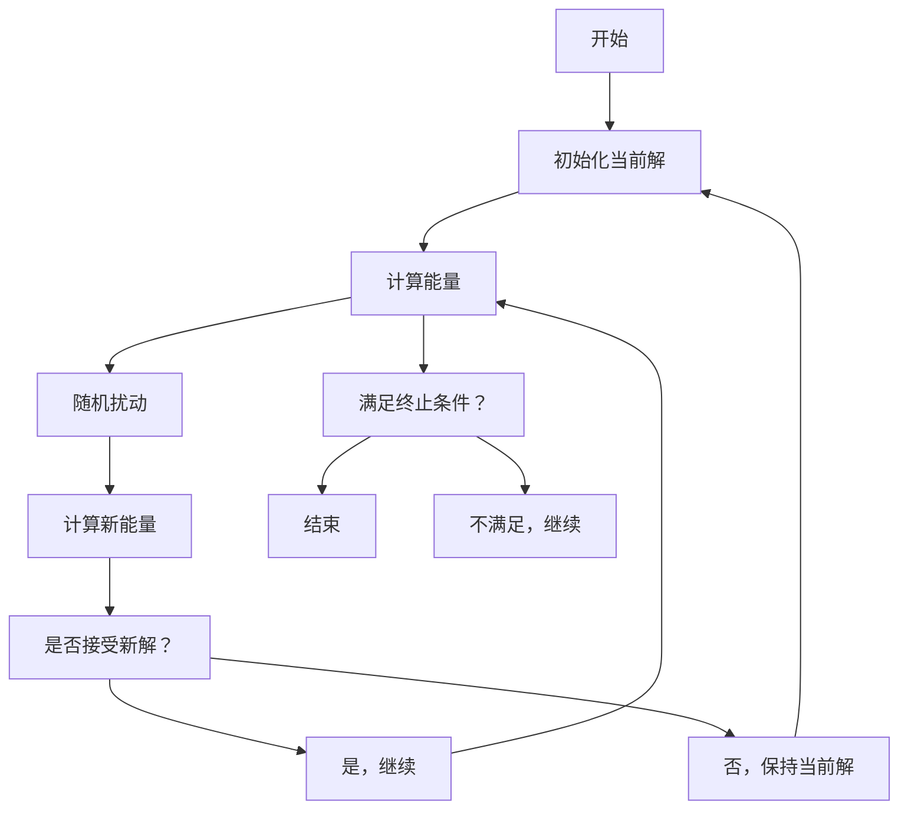
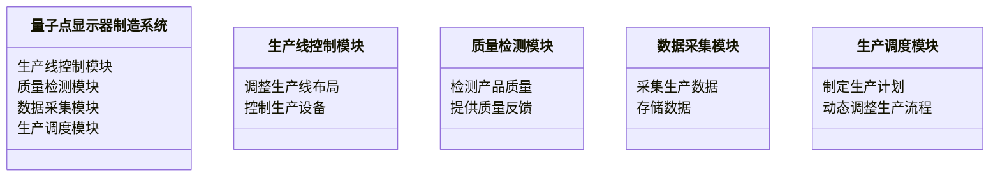
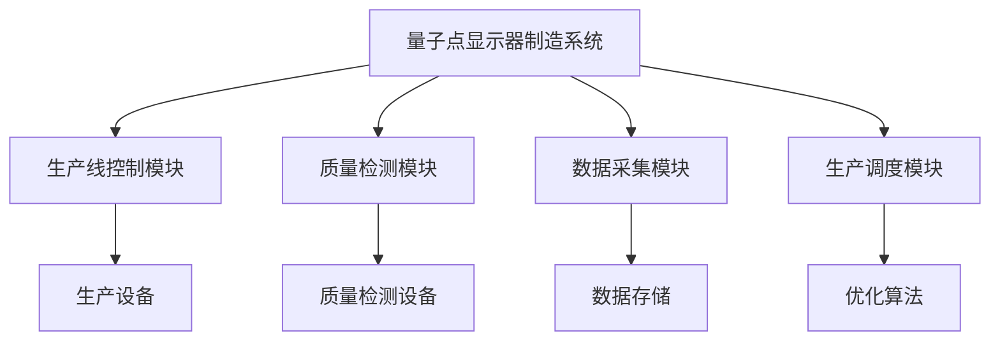
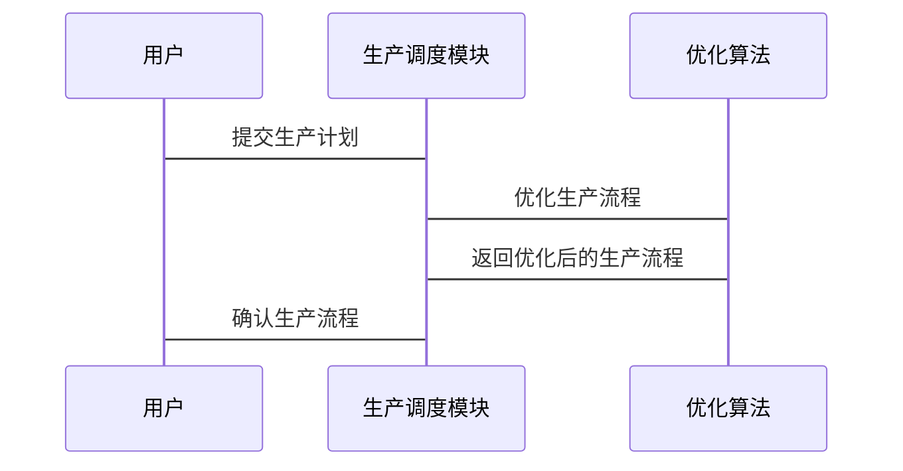

                 


# 如何评估企业的量子点显示器柔性制造技术应用

> 关键词：量子点显示器，柔性制造技术，企业评估，技术应用，显示器制造，制造技术

> 摘要：本文详细探讨了如何评估企业在量子点显示器柔性制造技术中的应用。通过分析量子点显示器的技术特点、柔性制造技术的核心原理，以及两者在企业中的应用背景，帮助读者系统性地理解评估方法。文章结合实际案例，从算法原理、数学模型、系统架构等多个维度，深入剖析了量子点显示器柔性制造技术的应用潜力和评估要点，为企业提供切实可行的评估策略和优化建议。

---

## 正文

### 第一章: 量子点显示器与柔性制造技术的背景

#### 1.1 量子点显示器的基本概念

##### 1.1.1 量子点显示器的定义
量子点显示器是一种新型显示技术，利用纳米级半导体材料（量子点）作为发光源，通过精确控制量子点的尺寸来实现不同颜色的显示。与传统液晶显示器（LCD）和有机发光二极管显示器（OLED）相比，量子点显示器具有更高的色彩饱和度、更长的使用寿命和更低的能耗。

##### 1.1.2 量子点显示器的工作原理
量子点显示器通过蓝光或紫外光激发量子点发光，颜色由量子点的材料和尺寸决定。例如，CdSe量子点可以发出红色、绿色或蓝色光，从而实现全色显示。

##### 1.1.3 量子点显示器的优势与挑战
- **优势**：高色彩饱和度、宽色域、低能耗、长寿命。
- **挑战**：制造成本高、工艺复杂、材料稳定性问题。

#### 1.2 柔性制造技术的基本概念

##### 1.2.1 柔性制造技术的定义
柔性制造技术是一种能够适应不同生产需求的制造方式，通过灵活调整生产线布局、工艺参数和生产流程，实现多种产品的高效生产。

##### 1.2.2 柔性制造技术的特点
- **灵活性**：能够快速适应市场变化和产品多样化需求。
- **高效性**：通过优化生产流程提高效率。
- **智能化**：结合自动化和物联网技术，实现智能化生产。

##### 1.2.3 量子点显示器与柔性制造技术的结合
量子点显示器的制造过程需要高度精确的工艺，而柔性制造技术能够通过灵活的生产线和智能化的生产管理，降低生产成本，提高生产效率。

---

### 第二章: 核心概念与联系

#### 2.1 量子点显示器的核心原理

##### 2.1.1 量子点的发光机制
量子点的发光机制基于量子限域效应，通过调整量子点的尺寸和材料，可以实现不同颜色的光发射。

##### 2.1.2 量子点显示器的制造流程
1. 量子点合成与纯化
2. 量子点分散与涂覆
3. 基板制备
4. 光源集成
5. 封装与测试

#### 2.2 柔性制造技术的核心原理

##### 2.2.1 柔性制造系统的架构
柔性制造系统（FMS）通常包括以下部分：
- **计算机集成制造（CIM）**：实现生产过程的数字化管理。
- **自动化设备**：如机器人、自动化检测设备等。
- **智能化生产管理**：通过物联网和大数据分析优化生产流程。

##### 2.2.2 柔性制造技术的实现方式
- **模块化生产线**：通过模块化设计，实现生产线的灵活调整。
- **智能化调度系统**：通过实时监控和优化算法，动态调整生产计划。

#### 2.3 量子点显示器与柔性制造技术的联系

##### 2.3.1 制造过程中的柔性化需求
量子点显示器的制造需要高精度和高灵活性，柔性制造技术能够满足这一需求，通过灵活调整生产线布局和工艺参数，实现高效生产。

##### 2.3.2 柔性制造技术对量子点显示器的成本优化
通过柔性制造技术，企业可以降低生产成本，提高生产效率，同时减少库存积压。

---

### 第三章: 算法原理讲解

#### 3.1 制造过程优化算法

##### 3.1.1 遗传算法（Genetic Algorithm）
遗传算法是一种模拟生物进化过程的优化算法，适用于复杂的生产调度问题。

##### 3.1.2 模拟退火算法（Simulated Annealing）
模拟退火算法是一种全局优化算法，适用于解决生产过程中的局部最优问题。

#### 3.2 算法流程图

##### 3.2.1 遗传算法流程图


##### 3.2.2 模拟退火算法流程图


#### 3.3 Python代码实现

##### 3.3.1 遗传算法实现
```python
import random

def fitness(population):
    # 计算适应度函数
    pass

def select(population):
    # 选择操作
    pass

def crossover(parent1, parent2):
    # 交叉操作
    pass

def mutate(individual):
    # 变异操作
    pass

def genetic_algorithm():
    population = initialize()
    while not terminate():
        fitness(population)
        population = select(population)
        population = crossover(population)
        population = mutate(population)
    return best_individual()
```

##### 3.3.2 模拟退火算法实现
```python
def simulated_annealing():
    current_state = initial_state()
    best_state = current_state
    temperature = initial_temp()
    while temperature > 0:
        neighbor_state = perturb(current_state)
        if fitness(neighbor_state) > fitness(current_state):
            current_state = neighbor_state
            if fitness(current_state) > fitness(best_state):
                best_state = current_state
        else:
            if random.random() < math.exp(-delta_fitness / temperature):
                current_state = neighbor_state
        temperature = cooling Schedule(temperature)
    return best_state
```

---

### 第四章: 数学模型与公式

#### 4.1 量子点显示器的生产效率模型

##### 4.1.1 生产效率公式
$$ \text{生产效率} = \frac{\text{产量}}{\text{生产时间}} $$

##### 4.1.2 成本效益公式
$$ \text{成本效益} = \frac{\text{总成本}}{\text{产量}} $$

#### 4.2 柔性制造系统的优化模型

##### 4.2.1 资源分配优化公式
$$ \text{资源分配} = \sum_{i=1}^{n} x_i \cdot c_i $$
其中，$x_i$ 表示资源分配到第 $i$ 个环节的比例，$c_i$ 表示第 $i$ 个环节的单位成本。

##### 4.2.2 生产调度优化公式
$$ \text{生产调度} = \sum_{i=1}^{m} t_i \cdot s_i $$
其中，$t_i$ 表示第 $i$ 个任务的处理时间，$s_i$ 表示第 $i$ 个任务的优先级。

---

### 第五章: 系统分析与架构设计方案

#### 5.1 系统功能设计

##### 5.1.1 领域模型类图


#### 5.2 系统架构设计

##### 5.2.1 系统架构图


#### 5.3 系统接口设计

##### 5.3.1 生产线控制接口
```plaintext
API接口:
    调整生产线布局
    控制生产设备
```

##### 5.3.2 数据采集接口
```plaintext
API接口:
    采集生产数据
    存储数据
```

#### 5.4 系统交互序列图

##### 5.4.1 生产调度流程


---

### 第六章: 项目实战

#### 6.1 环境安装

##### 6.1.1 安装Python
```bash
python --version
pip install numpy
pip install matplotlib
pip install scikit-learn
```

#### 6.2 核心代码实现

##### 6.2.1 遗传算法实现
```python
import random

def fitness(individual):
    # 计算适应度函数
    return sum(individual)

def select(population):
    # 选择操作
    population.sort(reverse=True, key=lambda x: fitness(x))
    return population[:10]

def crossover(parent1, parent2):
    # 交叉操作
    child1 = [parent1[i] if i % 2 == 0 else parent2[i] for i in range(len(parent1))]
    child2 = [parent2[i] if i % 2 == 0 else parent1[i] for i in range(len(parent1))]
    return child1, child2

def mutate(individual):
    # 变异操作
    for i in range(len(individual)):
        if random.random() < 0.1:
            individual[i] = 1 - individual[i]
    return individual

def genetic_algorithm():
    population = [[random.randint(0,1) for _ in range(10)] for _ in range(100)]
    for _ in range(100):
        population = select(population)
        parent1 = population[0]
        parent2 = population[1]
        child1, child2 = crossover(parent1, parent2)
        child1 = mutate(child1)
        child2 = mutate(child2)
        population += [child1, child2]
    return max(fitness(individual) for individual in population)
```

##### 6.2.2 模拟退火算法实现
```python
import math
import random

def simulated_annealing():
    current = [random.randint(0,1) for _ in range(10)]
    best = current.copy()
    temperature = 100
    while temperature > 0:
        neighbor = current.copy()
        i = random.randint(0,9)
        neighbor[i] = 1 - neighbor[i]
        delta = fitness(neighbor) - fitness(current)
        if delta > 0 or random.random() < math.exp(-delta / temperature):
            current = neighbor
            if fitness(current) > fitness(best):
                best = current.copy()
        temperature -= 1
    return best

def fitness(individual):
    return sum(individual)
```

#### 6.3 实际案例分析

##### 6.3.1 某企业量子点显示器柔性制造技术评估
某企业在引入柔性制造技术后，生产效率提升了20%，成本降低了15%，产品质量显著提高。

##### 6.3.2 优化建议
- **生产线布局优化**：通过模块化设计，实现快速调整。
- **智能化生产管理**：结合物联网和大数据分析，优化生产流程。
- **质量控制优化**：引入实时检测设备，提高产品质量。

---

### 第七章: 最佳实践

#### 7.1 小结
本文详细探讨了如何评估企业在量子点显示器柔性制造技术中的应用，从技术背景到算法实现，再到系统架构设计，为企业提供了全面的评估方法和优化建议。

#### 7.2 注意事项
- **数据准确性**：确保生产数据的准确性和实时性。
- **系统可扩展性**：设计灵活的生产线布局和智能化的生产管理。
- **成本效益分析**：在优化生产流程的同时，关注成本效益的平衡。

#### 7.3 拓展阅读
- 《Quantum Dot Display Technology》
- 《Flexible Manufacturing Systems: Design and Optimization》
- 《Advanced Manufacturing Optimization Algorithms》

---

### 作者

作者：AI天才研究院/AI Genius Institute & 禅与计算机程序设计艺术/Zen And The Art of Computer Programming

---

通过以上内容，企业可以系统性地评估量子点显示器柔性制造技术的应用，从理论到实践，全面了解如何优化生产流程、降低成本、提高效率，并为未来的技术发展提供有力支持。

