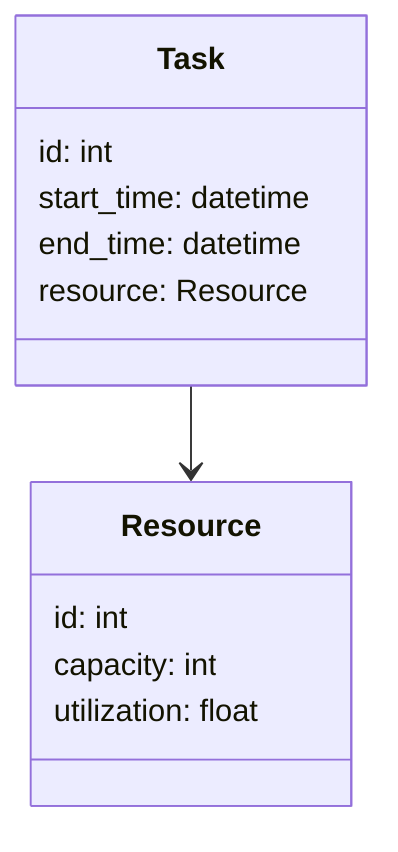

                 


# 如何评估企业的量子计算优化调度应用

## 关键词：量子计算、优化调度、企业应用、评估指标、数学模型

## 摘要：  
量子计算优化调度应用是企业在复杂问题求解中的重要工具。本文系统性地介绍量子计算的基本原理、优化调度的核心概念，并通过算法原理、数学模型和系统架构设计等多维度分析，帮助企业评估量子计算优化调度应用的可行性和效果。通过实际案例分析和最佳实践分享，为企业的技术决策提供参考。

---

## 第1章: 量子计算与优化调度的基本概念

### 1.1 量子计算的背景与现状

#### 1.1.1 量子计算的基本概念
量子计算是一种利用量子力学原理进行计算的新型计算模式。与经典计算不同，量子计算的核心在于利用量子叠加和量子纠缠的特性，通过量子位（qubit）进行信息处理。量子位可以同时处于多个状态的叠加态，从而在某些特定问题上比经典计算更高效。

#### 1.1.2 量子计算与经典计算的主要区别
- **量子叠加**：量子位可以同时表示多个状态，而经典位只能表示0或1。
- **量子纠缠**：量子位之间可以通过纠缠形成强关联，这种关联可以用于信息传输和计算加速。
- **并行计算能力**：量子计算机可以在一次运算中处理大量的可能性，而经典计算机需要通过串行处理来完成。

#### 1.1.3 量子计算在企业中的潜在价值
量子计算在企业中的应用主要体现在优化问题求解、密码学、材料科学等领域。对于优化调度问题，量子计算的并行处理能力可以显著提高计算效率，降低企业运营成本。

---

### 1.2 优化调度问题的定义与特点

#### 1.2.1 优化调度问题的定义
优化调度问题是指在给定的约束条件下，寻找最优的资源分配、任务安排或路径规划等问题。例如，企业可能需要优化供应链中的物流调度、生产过程中的任务分配等。

#### 1.2.2 优化调度问题的核心特征
- **目标函数**：通常是一个需要最小化或最大化的函数，例如最小化成本或最大化效率。
- **约束条件**：问题中必须满足的一系列限制条件，例如时间、资源、容量等。
- **复杂性**：优化调度问题通常属于NP-hard问题，随着问题规模的增加，求解难度指数级增长。

#### 1.2.3 优化调度问题的分类与应用场景
- **供应链管理**：优化物流路径、库存管理等。
- **生产调度**：优化生产流程、设备利用率等。
- **资源分配**：优化人员、资金等资源的分配。

---

### 1.3 量子计算与优化调度的结合

#### 1.3.1 量子计算在优化调度中的优势
量子计算在处理复杂优化问题时具有显著优势，尤其是在处理高维问题和大规模数据时。量子算法可以通过并行计算大幅减少计算时间。

#### 1.3.2 优化调度问题的量子化方法
优化调度问题的量子化方法包括将问题转化为量子态表示，利用量子叠加和量子纠缠特性进行求解，最终将量子态还原为经典解。

#### 1.3.3 企业应用量子计算优化调度的可行性
目前，量子计算仍处于发展阶段，但已经在一些领域展现出潜力。企业需要根据自身需求和问题复杂度，评估是否适合采用量子计算优化调度。

---

## 第2章: 企业为什么要评估量子计算优化调度应用

### 2.1 企业优化调度问题的现状与挑战

#### 2.1.1 传统优化调度方法的局限性
传统优化调度方法主要依赖于贪心算法或动态规划等技术，但在处理大规模问题时效率较低，且难以找到全局最优解。

#### 2.1.2 企业优化调度问题的复杂性
企业优化调度问题通常涉及多个变量和约束条件，例如时间、成本、资源限制等，导致问题复杂性高。

#### 2.1.3 量子计算在优化调度中的潜在突破
量子计算的并行处理能力和高效求解能力为优化调度问题提供了新的解决方案。

---

### 2.2 量子计算优化调度的应用场景

#### 2.2.1 供应链管理中的优化调度
量子计算可以优化物流路径，减少运输成本和时间，提高供应链效率。

#### 2.2.2 生产调度中的优化应用
量子计算可以帮助企业优化生产流程，提高设备利用率和生产效率。

#### 2.2.3 资源分配问题的量子计算解决方案
量子计算可以优化人员、资金等资源的分配，提高企业资源利用率。

---

### 2.3 量子计算优化调度的评估意义

#### 2.3.1 评估量子计算优化调度的必要性
企业需要评估量子计算优化调度的可行性和效果，以决定是否采用量子计算技术。

#### 2.3.2 评估指标与评估方法的选择
评估指标包括计算效率、资源利用率、成本效益等。评估方法包括实验验证、模拟仿真等。

#### 2.3.3 评估结果对企业决策的影响
评估结果可以帮助企业制定技术路线图，优化资源配置，提升竞争力。

---

## 第3章: 量子计算的基本原理

### 3.1 量子叠加与量子纠缠

#### 3.1.1 量子叠加的概念与数学表达
量子叠加是指量子位可以同时处于多个状态的叠加态。数学表达式为：
$$|\psi\rangle = a|0\rangle + b|1\rangle$$
其中，$a$ 和 $b$ 是复数，满足归一化条件 $|a|^2 + |b|^2 = 1$。

#### 3.1.2 量子纠缠的定义与应用
量子纠缠是指两个或多个量子位之间形成强关联，一个量子位的状态会直接影响另一个量子位的状态。纠缠态的数学表达式为：
$$|\psi\rangle = \frac{1}{\sqrt{2}}(|0\rangle\otimes|1\rangle + |1\rangle\otimes|0\rangle)$$

---

## 第4章: 量子计算优化调度的核心概念与原理

### 4.1 量子计算在优化调度中的应用原理

#### 4.1.1 量子优化算法的核心思想
量子优化算法通过构建量子叠加态，利用量子搜索算法（如Grover算法）快速找到最优解。

#### 4.1.2 量子优化算法的数学模型
量子优化问题的数学模型通常表示为：
$$\min_{x} f(x)$$
其中，$f(x)$ 是目标函数，$x$ 是决策变量。

#### 4.1.3 量子优化算法的实现步骤
1. 将优化问题转化为量子态表示。
2. 构建量子叠加态，利用量子搜索算法进行优化。
3. 通过测量得到最优解。

---

## 第5章: 量子计算优化调度的系统架构设计

### 5.1 系统功能设计

#### 5.1.1 领域模型设计
领域模型是优化调度问题的抽象表示，通常包括任务、资源、约束等核心要素。领域模型的类图如下：



---

## 第6章: 量子计算优化调度的项目实战

### 6.1 环境安装与配置

#### 6.1.1 安装量子计算开发框架
常用的量子计算开发框架包括Qiskit（IBM）和Q#（微软）。以下是安装Qiskit的示例代码：
```bash
pip install qiskit
```

#### 6.1.2 安装优化调度相关库
安装优化调度常用的库，例如Scipy和Cvxpy：
```bash
pip install scipy cvxpy
```

---

## 第7章: 最佳实践与注意事项

### 7.1 最佳实践

#### 7.1.1 确保问题与量子计算的匹配性
量子计算在某些特定问题上具有优势，企业需要确保优化调度问题适合量子计算处理。

#### 7.1.2 选择合适的量子计算平台
根据企业需求选择合适的量子计算平台，例如IBM的Quantum Experience或谷歌的Quantum Computing Service。

#### 7.1.3 注重量子算法的实现细节
量子算法的实现需要考虑量子位的初始化、叠加态构建、测量等步骤。

---

## 第8章: 小结与展望

### 8.1 小结
本文系统性地介绍了量子计算优化调度应用的评估方法，从基本概念到实际应用进行了详细阐述。企业可以通过评估量子计算在优化调度中的优势，结合自身需求选择合适的解决方案。

### 8.2 展望
随着量子计算技术的不断发展，优化调度问题的求解将更加高效。企业需要持续关注量子计算技术的进步，积极探索其在优化调度中的应用潜力。

---

## 作者：AI天才研究院 & 禅与计算机程序设计艺术

---

通过本文的系统性分析，企业可以更好地评估量子计算优化调度应用的可行性，为未来的技术决策提供参考。

