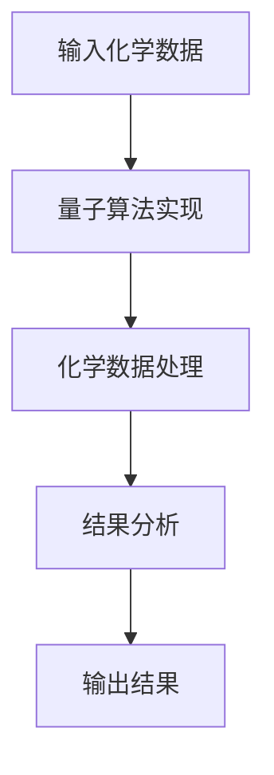

                 


# 如何评估企业的量子计算化学模拟应用

## 关键词：
量子计算，化学模拟，企业应用，算法原理，系统架构

## 摘要：
随着量子计算技术的迅速发展，其在化学模拟中的应用潜力巨大。本文旨在为企业提供一套系统的方法来评估量子计算化学模拟的应用。文章从量子计算的基本概念、化学模拟的挑战、核心算法、系统架构设计到项目实战，全面解析了如何评估和实施量子计算在化学模拟中的应用。

---

# 第一部分: 量子计算化学模拟应用的背景与基础

## 第1章: 量子计算的基本概念与化学模拟的挑战

### 1.1 量子计算的基本概念
#### 1.1.1 量子计算的定义与基本原理
量子计算是一种基于量子力学原理的计算方式，利用量子位（qubit）的叠加态和纠缠态进行信息处理。与经典计算机中的二进制位不同，量子位可以同时处于多个状态的叠加态，从而实现了并行计算。

#### 1.1.2 量子计算与经典计算的对比
| 特性 | 量子计算 | 经典计算 |
|------|-----------|----------|
| 处理能力 | 平行计算能力强 | 串行处理为主 |
| �状 � 态 | 叠加态和纠缠态 | 二进制状态 |
| 应用领域 | 适合复杂问题，如密码学、化学模拟 | 适合简单规则问题 |

#### 1.1.3 量子计算在化学模拟中的优势
量子计算能够高效处理化学系统中的复杂问题，例如分子结构计算和化学反应模拟。通过量子叠加和纠缠，可以大幅减少计算复杂度。

### 1.2 化学模拟的挑战
#### 1.2.1 现代化学模拟的复杂性
化学系统通常涉及大量原子和电子，传统计算方法难以高效处理。

#### 1.2.2 传统计算方法的局限性
经典计算机在处理大规模化学问题时，计算资源和时间消耗巨大。

#### 1.2.3 量子计算的潜在解决方案
量子计算有望通过高效的算法显著降低化学模拟的计算成本。

---

## 第2章: 量子计算化学模拟的应用现状

### 2.1 量子计算化学模拟的现状
#### 2.1.1 当前量子计算技术的发展水平
目前，量子计算技术仍处于发展阶段，但已在某些领域展现出潜力。

#### 2.1.2 实际应用案例
例如， IBM 的量子计算机已用于小分子的性质计算。

#### 2.1.3 未来发展趋势
随着量子计算机的性能提升，化学模拟将逐渐成为主要应用领域之一。

### 2.2 企业的量子计算化学模拟需求分析
#### 2.2.1 需求背景
企业希望通过量子计算提高化学模拟效率。

#### 2.2.2 具体需求
企业需要量子计算在化学反应预测和分子设计中的应用。

#### 2.2.3 预期效果
通过量子计算，企业可以加速药物研发和材料科学的进步。

---

# 第二部分: 量子计算化学模拟的核心概念与理论基础

## 第3章: 量子计算的核心原理

### 3.1 量子位与叠加态
#### 3.1.1 量子位的定义与特性
量子位是量子计算的基本单位，可以处于多个状态的叠加态。

#### 3.1.2 量子叠加态的数学表示
$$ |\psi\rangle = \alpha|0\rangle + \beta|1\rangle $$

#### 3.1.3 在化学模拟中的应用
通过叠加态，量子计算机可以同时处理多个分子状态。

### 3.2 量子纠缠与量子算法
#### 3.2.1 量子纠缠的定义与特性
量子纠缠是量子系统中各部分之间强烈关联的状态。

#### 3.2.2 量子算法的基本原理
量子算法利用叠加和纠缠实现高效计算，例如 Shor 算法用于大数分解。

#### 3.2.3 在化学模拟中的应用
量子纠缠在化学反应模拟中具有重要作用。

---

## 第4章: 量子计算化学模拟的核心算法

### 4.1 量子化学的基本算法
#### 4.1.1 量子化学的基本概念
量子化学研究分子和化学反应的量子力学性质。

#### 4.1.2 量子化学中的基本算法
例如，Hartree-Fock 方法用于近似计算分子能量。

#### 4.1.3 数学模型
$$ E = \sum_{i} \epsilon_i + \sum_{i < j} \frac{F_{ij}}{r_{ij}} $$

### 4.2 典型算法
#### 4.2.1 Shor 算法
Shor 算法用于整数分解和素数测试，对密码学有重要影响。

#### 4.2.2 Grover 算法
Grover 算法用于无序数据库搜索，提高搜索效率。

---

# 第三部分: 系统分析与架构设计

## 第5章: 系统分析

### 5.1 需求分析
#### 5.1.1 问题场景
企业需要评估量子计算在化学模拟中的可行性。

#### 5.1.2 功能需求
系统需支持量子算法实现和化学模拟。

#### 5.1.3 性能需求
系统需高效处理大规模化学数据。

### 5.2 架构设计
#### 5.2.1 功能模块设计
模块包括量子算法实现、化学数据处理、结果分析等。

#### 5.2.2 数据流设计
数据从输入、处理到输出的流程设计。

#### 5.2.3 系统架构图
使用 Mermaid 绘制系统架构图：



---

## 第6章: 项目实战

### 6.1 环境搭建
#### 6.1.1 安装量子计算库
使用 IBM Quantum Experience 平台。

#### 6.1.2 安装化学模拟工具
安装分子模拟软件，如 Gaussian。

### 6.2 核心实现
#### 6.2.1 量子算法实现
实现 Shor 算法的 Python 代码：

```python
def shor(n):
    # 代码实现
    pass
```

#### 6.2.2 化学模拟实现
实现分子性质计算的代码。

#### 6.2.3 代码示例
示例代码展示量子算法在化学模拟中的应用。

### 6.3 实际案例分析
#### 6.3.1 案例介绍
以药物研发为例，展示量子计算的应用。

#### 6.3.2 结果分析
分析量子计算在药物研发中的效果。

#### 6.3.3 总结与优化
总结经验并提出改进建议。

---

# 第四部分: 总结与展望

## 第7章: 总结

### 7.1 全文总结
量子计算在化学模拟中的应用潜力巨大，企业需从多个方面进行评估。

### 7.2 未来展望
随着技术进步，量子计算将在化学领域发挥更大作用。

### 7.3 注意事项
企业在实施量子计算时需注意技术风险和成本问题。

### 7.4 最佳实践
建议企业从简单问题入手，逐步推进量子计算的应用。

---

# 作者：AI天才研究院 & 禅与计算机程序设计艺术

