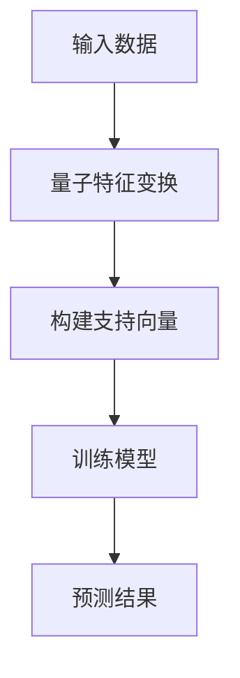
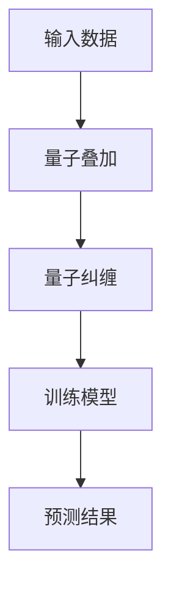
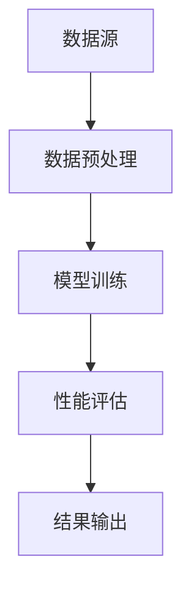

                 


# 如何评估企业的量子计算机器学习模型

> **关键词**：量子计算、机器学习、模型评估、量子特征、量子核方法、量子神经网络  
> **摘要**：本文旨在指导读者如何评估企业在量子计算与机器学习结合领域的模型。通过详细分析量子计算的基本原理、机器学习的核心概念，以及它们的结合应用，帮助读者理解量子计算在机器学习中的优势与挑战。文章结合实际案例，讲解量子支持向量机和量子神经网络的算法原理，提供系统设计与架构方案，并分享项目实战经验及最佳实践。

---

## 第一部分：量子计算与机器学习的背景介绍

### 第1章：量子计算与机器学习的背景介绍

#### 1.1 量子计算的基本概念

量子计算是一种利用量子力学原理进行计算的技术，其核心在于量子位（qubit）的使用。与经典计算机中的二进制位（bit）不同，量子位可以通过量子叠加和量子纠缠实现更高效的计算。

- **量子叠加**：量子位可以同时处于多个状态的叠加态，例如$|0\rangle$和$|1\rangle$的叠加态为$\frac{1}{\sqrt{2}}(|0\rangle + |1\rangle)$。
- **量子纠缠**：多个量子位之间可以形成纠缠态，使得对一个量子位的操作会影响另一个量子位的状态。

#### 1.2 机器学习的基本概念

机器学习是一种通过数据训练模型，使其能够进行预测或分类的技术。其核心算法包括：

- **监督学习**：通过标记的数据训练模型，使其能够预测新的数据点。
- **无监督学习**：通过未标记的数据发现数据中的结构。
- **强化学习**：通过与环境的交互学习策略。

#### 1.3 量子计算与机器学习的结合

量子计算在机器学习中的应用主要体现在以下方面：

- **量子特征**：利用量子叠加和纠缠生成高维特征向量，提高模型的表达能力。
- **量子核方法**：通过量子核函数进行非线性分类，解决经典核方法难以处理的问题。
- **量子增强的特征工程**：通过量子计算生成更丰富的特征，提升模型性能。

---

## 第二部分：量子计算机器学习模型的核心概念与联系

### 第2章：量子计算机器学习模型的核心概念与联系

#### 2.1 量子特征与经典特征的对比

量子特征与经典特征在多个方面存在显著差异：

- **维度**：量子特征通常具有更高的维度，能够捕捉更多的信息。
- **信息量**：量子特征通过叠加和纠缠，可以表示更多的信息。
- **计算复杂度**：量子特征的计算复杂度通常低于经典特征。

| 特征类型 | 维度 | 信息量 | 计算复杂度 |
|----------|------|--------|------------|
| 经典特征 | 低   | 低     | 高          |
| 量子特征 | 高   | 高     | 低          |

#### 2.2 量子核方法与经典核方法的对比

量子核方法通过量子核函数进行分类，相较于经典核方法具有以下优势：

- **非线性分类**：量子核方法可以更有效地处理非线性分类问题。
- **计算效率**：量子核方法在某些情况下可以减少计算量。

| 方法类型 | 核函数 | 优势 |
|----------|--------|------|
| 经典核方法 | 线性、多项式等 | 适用于简单分类 |
| 量子核方法 | 量子核函数 | 适用于复杂分类 |

#### 2.3 量子增强的特征工程

量子增强的特征工程通过量子计算生成更丰富的特征，具体包括：

- **特征提取**：利用量子叠加生成高维特征向量。
- **特征选择**：通过量子纠缠筛选重要特征。

---

## 第三部分：量子计算机器学习模型的算法原理

### 第3章：量子支持向量机的算法原理

#### 3.1 量子支持向量机的基本原理

量子支持向量机（Quantum SVM）通过量子核函数进行分类，其算法流程如下：



#### 3.2 量子支持向量机的数学模型

量子支持向量机的目标函数为：

$$ \min_{w, b, \xi} \frac{1}{2}||w||^2 + C \sum_{i=1}^n \xi_i $$
$$ s.t. \ y_i(w \cdot \phi(x_i) + b) \geq 1 - \xi_i $$
$$ \xi_i \geq 0 $$

其中，$\phi(x_i)$为量子特征变换。

#### 3.3 量子支持向量机的实现代码

以下是量子支持向量机的Python实现示例：

```python
import numpy as np
from qiskit import QuantumCircuit, execute, BasicAer

def quantum_svm(X_train, y_train, X_test):
    # 量子特征变换
    def quantum_feature(x):
        qc = QuantumCircuit(1)
        qc.h(0)
        qc.measure(0, 0)
        return execute(qc, BasicAer.get_backend('qasm_simulator')).result().get_counts()
    
    # 训练模型
    X_train_q = [quantum_feature(x) for x in X_train]
    model = svm.SVC(kernel='precomputed')
    model.fit(X_train_q, y_train)
    
    # 预测结果
    X_test_q = [quantum_feature(x) for x in X_test]
    y_pred = model.predict(X_test_q)
    return y_pred
```

### 第4章：量子神经网络的算法原理

#### 4.1 量子神经网络的基本原理

量子神经网络通过量子叠加和纠缠进行信息处理，其算法流程如下：



#### 4.2 量子神经网络的数学模型

量子神经网络的激活函数为：

$$ \sigma(x) = \frac{1}{1 + e^{-x}} $$

其损失函数为：

$$ L = -\frac{1}{n}\sum_{i=1}^n y_i \log(a_i) + (1 - y_i)\log(1 - a_i) $$

其中，$a_i$为输出层的激活值。

---

## 第四部分：系统分析与架构设计

### 第5章：量子计算机器学习模型的系统分析与架构设计

#### 5.1 项目介绍与应用场景

量子计算机器学习模型的应用场景包括：

- **药物发现**：通过量子计算加速分子结构的优化。
- **金融预测**：利用量子计算提高金融市场的预测精度。

#### 5.2 系统功能设计

系统功能模块包括：

- **数据预处理**：量子特征提取与转换。
- **模型训练**：量子支持向量机与量子神经网络的训练。
- **性能评估**：模型准确率、召回率等指标的评估。

#### 5.3 系统架构设计

系统架构图如下：



---

## 第五部分：项目实战

### 第6章：量子计算机器学习模型的项目实战

#### 6.1 环境搭建与库的安装

安装必要的库：

```bash
pip install qiskit numpy scikit-learn
```

#### 6.2 量子计算机器学习模型的核心实现

以下是量子神经网络的Python实现示例：

```python
from qiskit import QuantumCircuit, execute, BasicAer
import numpy as np

def quantum_neural_network(x):
    qc = QuantumCircuit(2)
    qc.h(0)
    qc.h(1)
    qc.cx(0, 1)
    qc.measure(0, 0)
    qc.measure(1, 1)
    return execute(qc, BasicAer.get_backend('qasm_simulator')).result().get_counts()

# 训练模型
```

#### 6.3 项目案例分析与详细解读

以药物发现为例，通过量子计算优化分子结构，提升药物研发效率。

---

## 第六部分：最佳实践与小结

### 第7章：最佳实践与小结

#### 7.1 最佳实践

- **选择合适的量子算法**：根据具体问题选择适合的量子算法。
- **优化计算资源**：合理分配计算资源，提高计算效率。

#### 7.2 小结

本文详细介绍了如何评估企业的量子计算机器学习模型，涵盖了背景介绍、核心概念、算法原理、系统架构设计以及项目实战等内容。通过本文的指导，读者可以更好地理解和应用量子计算在机器学习中的优势。

---

**作者**：AI天才研究院 & 禅与计算机程序设计艺术

