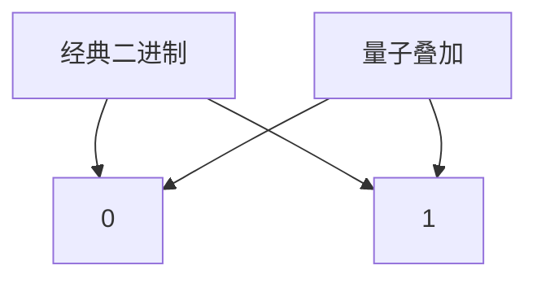
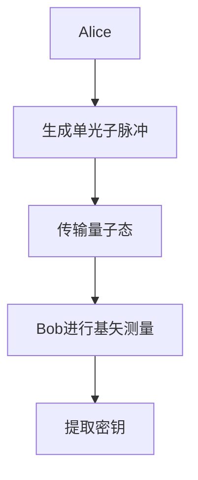
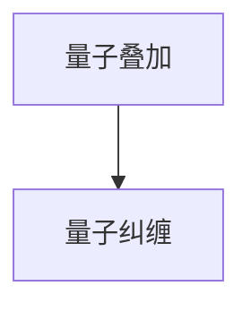
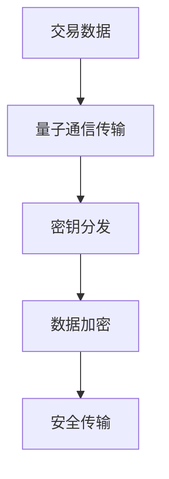
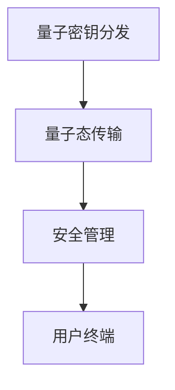

                 

# 如何评估企业的量子通信网络应用

> 关键词：量子通信网络、企业应用、安全性评估、量子密钥分发、抗量子密码

> 摘要：随着量子计算技术的快速发展，量子通信网络作为下一代通信技术的核心，正在逐步从理论走向实际应用。本文将详细分析如何评估企业在量子通信网络中的应用，涵盖量子通信的基本原理、评估指标、实际应用场景、安全性评估以及系统架构设计等方面，为企业在量子通信领域的投资和决策提供参考。

---

## 第1章：量子通信网络概述

### 1.1 量子通信的基本概念

量子通信是一种基于量子力学原理的通信技术，与传统经典通信不同，它利用量子态（如量子叠加和量子纠缠）来实现信息的传输。以下是量子通信的核心概念：

- **量子叠加**：信息以$|0\rangle$和$|1\rangle$叠加的形式存在，即$|0\rangle + |1\rangle$，表示为$\{|0\rangle, |1\rangle\}$的线性组合。
- **量子纠缠**：两个或多个量子系统处于相关联的状态，其中一个系统的状态会瞬间影响另一个系统，即使它们相隔很远。

**图1.1 量子叠加与经典二进制状态对比**

### 1.2 量子通信的背景与重要性

随着经典密码学的逐渐被量子计算破解的风险增加，量子通信被认为是保障未来数据安全的关键技术。企业需要提前布局量子通信网络，以应对潜在的安全威胁。

---

## 第2章：量子通信网络的核心技术

### 2.1 量子密钥分发（QKD）

QKD是一种利用量子力学原理生成和分发加密密钥的技术。其核心流程如下：

1. **量子态生成**：通过量子光源生成单光子脉冲。
2. **量子态传输**：通过光纤或自由空间传输量子态。
3. **基矢测量**：双方选择相同的基矢进行测量，提取密钥。

**图2.1 量子密钥分发流程图**

### 2.2 量子叠加与纠缠

量子叠加和纠缠是量子通信的核心原理。以下是它们的区别与联系：

| **特性** | **量子叠加** | **量子纠缠** |
|----------|--------------|--------------|
| **定义** | 系统处于多个状态的叠加态 | 系统之间高度相关，测量其中一个会影响另一个 |
| **应用** | 数据传输 | 密钥分发和通信安全 |

**图2.2 量子叠加与纠缠的关系**

---

## 第3章：量子通信网络的评估指标与方法

### 3.1 评估指标的分类

企业评估量子通信网络时，需要从技术、经济和可用性三个维度进行综合考量：

- **技术指标**：安全性、传输效率、误码率
- **经济指标**：成本、投入产出比
- **可用性指标**：稳定性、可靠性

### 3.2 评估模型与方法

基于指标的加权评分模型是一种常用的评估方法。以下是其数学模型：

$$
\text{综合评分} = \sum_{i=1}^{n} w_i \cdot s_i
$$

其中，$w_i$是第$i$个指标的权重，$s_i$是第$i$个指标的评分。

---

## 第4章：企业中的量子通信应用

### 4.1 金融领域的量子通信应用

在金融领域，量子通信主要用于证券交易和数据加密。以下是其实现流程：

1. **数据传输**：通过量子通信网络传输交易数据。
2. **密钥分发**：利用QKD技术分发加密密钥。
3. **数据加密**：对敏感数据进行加密，确保传输安全。

**图4.1 金融领域的量子通信应用流程**

---

## 第5章：量子通信网络的安全性评估

### 5.1 抗量子密码学

抗量子密码是一种能够抵御量子计算攻击的加密算法。以下是常见的抗量子加密算法：

- **格密钥加密**：基于格理论，具有较高的安全性。
- **哈希签名**：基于哈希函数的数字签名算法。

### 5.2 量子通信中的潜在威胁

尽管量子通信具有强大的安全性，但仍需注意以下潜在威胁：

- **侧信道攻击**：通过侧信道信息窃取密钥。
- **设备缺陷**：由于设备不完美，可能引入漏洞。

---

## 第6章：企业量子通信系统架构

### 6.1 系统功能设计

企业量子通信系统通常包括以下功能模块：

- **量子密钥分发模块**：负责生成和分发密钥。
- **量子态传输模块**：负责量子态的传输和测量。
- **安全管理模块**：负责安全策略的制定和执行。

**图6.1 企业量子通信系统功能模块图**

---

## 第7章：实际案例分析

### 7.1 某金融企业的量子通信应用

某金融企业通过部署量子通信网络，实现了证券交易数据的安全传输。以下是其实现步骤：

1. **需求分析**：评估现有通信系统的安全性。
2. **系统设计**：设计量子通信网络架构。
3. **设备采购**：采购量子通信设备。
4. **系统部署**：部署量子通信网络。
5. **测试与优化**：进行测试并优化系统性能。

---

## 第8章：总结与展望

### 8.1 总结

量子通信网络作为未来通信技术的核心，其安全性、高效性和抗干扰能力为企业提供了强有力的支持。企业需要从技术、经济和可用性三个维度综合评估量子通信网络的应用。

### 8.2 展望

随着量子计算技术的不断发展，量子通信网络的应用场景将更加广泛。未来，企业需要更加关注量子通信的安全性和系统架构设计，以应对潜在的安全威胁。

---

## 作者信息

作者：AI天才研究院（AI Genius Institute） & 禅与计算机程序设计艺术（Zen And The Art of Computer Programming）

---

以上是《如何评估企业的量子通信网络应用》的详细目录和内容概要。希望这篇文章能为企业的量子通信网络应用评估提供有价值的参考。

