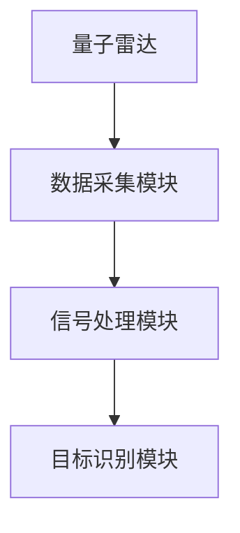
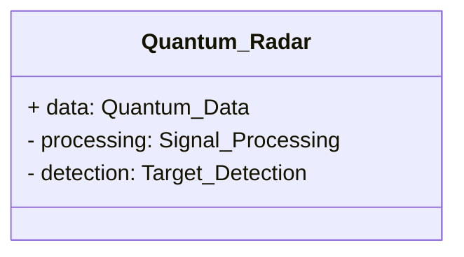
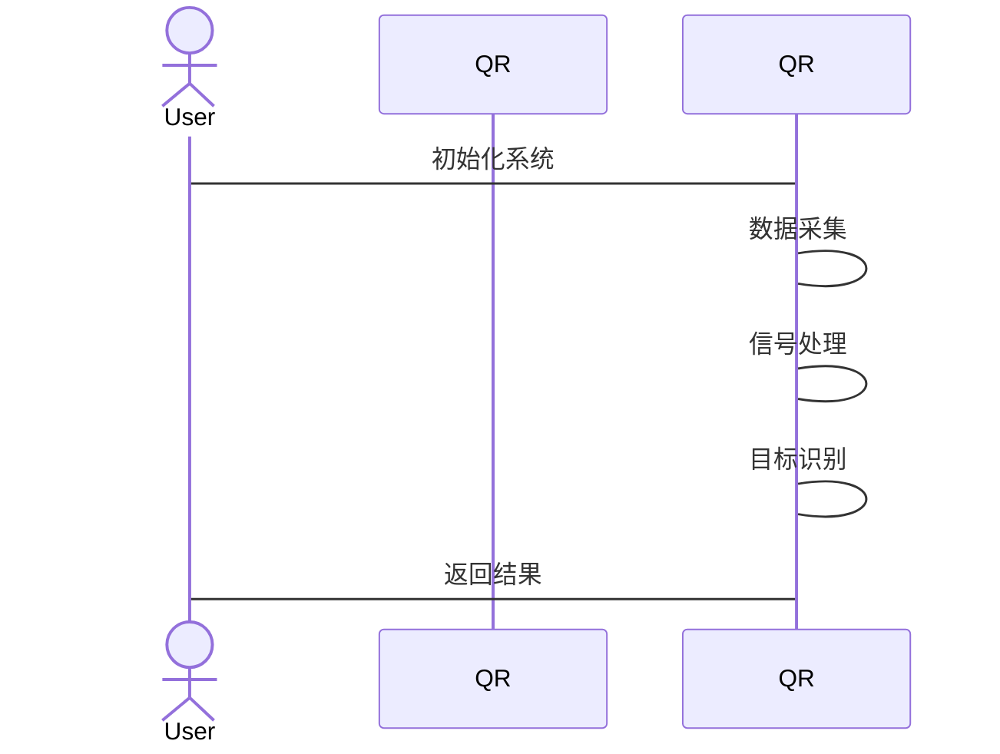

                 

<think>
好的，我需要根据用户的要求，撰写一篇关于《如何评估企业的量子雷达隐身探测技术潜力》的技术博客文章。首先，我会按照用户提供的目录大纲结构来组织内容，同时确保每个部分都详细且逻辑清晰。

# 如何评估企业的量子雷达隐身探测技术潜力

> 关键词：量子雷达，隐身探测，技术评估，企业潜力，雷达技术

> 摘要：量子雷达作为一项新兴技术，在隐身探测领域展现出巨大潜力。本文将从量子雷达的基本概念、核心原理、算法实现、系统架构、项目实战以及最佳实践等多个方面，详细分析如何评估企业的量子雷达隐身探测技术潜力。通过理论分析和实际案例相结合，为企业在技术评估和应用中提供有价值的参考。

---

## 第1章: 量子雷达与隐身探测概述

### 1.1 量子雷达的基本概念

#### 1.1.1 量子雷达的定义
量子雷达是一种基于量子力学原理的新型雷达技术。它利用量子叠加和量子纠缠等特性，能够在复杂的电磁环境中实现对隐身目标的探测。

#### 1.1.2 量子雷达与传统雷达的区别
| 特性 | 传统雷达 | 量子雷达 |
|------|----------|-----------|
| 原理 | 基于经典电磁学 | 基于量子力学 |
| 分辨率 | 较低 | 高 |
| 抗干扰能力 | 有限 | 强大 |
| 适用场景 | 非隐身目标 | 隐身目标 |

#### 1.1.3 量子雷达在隐身探测中的优势
量子雷达能够通过量子叠加和干涉效应，实现对隐身目标的高精度探测。其核心优势在于其强大的抗干扰能力和对隐身目标的独特识别能力。

### 1.2 隐身技术的基本原理

#### 1.2.1 隐身技术的定义
隐身技术是指通过减少目标的雷达反射截面积（RCS）或其他电磁特性，使其难以被雷达探测的技术。

#### 1.2.2 隐身技术的主要实现方式
- **外形设计**：通过特殊形状减少雷达波反射。
- **吸波材料**：使用吸收雷达波的材料覆盖表面。
- **主动干扰**：通过发射干扰信号混淆敌方雷达。

#### 1.2.3 隐身技术在现代战争中的应用
隐身技术广泛应用于隐身飞机、隐身舰船等领域，以提高作战隐蔽性和生存能力。

### 1.3 量子雷达与隐身探测的结合

#### 1.3.1 量子雷达在隐身探测中的潜力
量子雷达能够突破传统雷达的探测限制，实现对隐身目标的精确识别。

#### 1.3.2 量子雷达与传统雷达的对比
通过对比分析，量子雷达在探测精度和抗干扰能力上具有显著优势。

#### 1.3.3 量子雷达隐身探测技术的局限性
目前，量子雷达技术仍处于研究阶段，其实际应用受到技术成熟度和成本的限制。

### 1.4 本章小结
本章主要介绍了量子雷达的基本概念、隐身技术的基本原理以及量子雷达与隐身探测的结合。通过对比分析，我们了解了量子雷达在隐身探测中的潜力和优势。

---

## 第2章: 量子雷达隐身探测技术的核心原理

### 2.1 量子雷达的工作原理

#### 2.1.1 量子干涉原理
量子干涉是量子雷达的核心原理之一。通过量子叠加和干涉效应，量子雷达能够实现对隐身目标的高精度探测。

#### 2.1.2 量子叠加原理
量子叠加原理是量子雷达的另一个关键原理。通过量子状态的叠加，量子雷达能够同时探测多个目标，提高探测效率。

#### 2.1.3 量子纠缠原理
量子纠缠原理使得量子雷达能够在远距离上实现对目标的精确识别，进一步增强了其探测能力。

### 2.2 量子雷达在隐身探测中的应用

#### 2.2.1 量子雷达的信号处理方式
量子雷达通过量子信号处理，能够有效识别隐身目标的电磁特征。

#### 2.2.2 量子雷达的隐身检测机制
量子雷达通过特殊的检测算法，能够识别隐身目标的量子特征，实现对其的精确探测。

#### 2.2.3 量子雷达的抗干扰能力
量子雷达通过量子叠加和干涉效应，能够有效抵抗复杂的电磁干扰，确保其探测能力的稳定性。

### 2.3 量子雷达与隐身技术的结合

#### 2.3.1 量子雷达在隐身目标检测中的优势
量子雷达能够通过量子特征识别，实现对隐身目标的高精度检测。

#### 2.3.2 量子雷达与传统雷达的对比
通过对比分析，我们了解了量子雷达在隐身探测中的独特优势。

#### 2.3.3 量子雷达隐身探测技术的未来发展趋势
随着技术的进步，量子雷达在隐身探测中的应用前景将更加广阔。

### 2.4 本章小结
本章详细讲解了量子雷达的核心原理及其在隐身探测中的应用，分析了其与传统雷达的区别和优势。

---

## 第3章: 量子雷达隐身探测算法的核心原理

### 3.1 量子干涉算法

#### 3.1.1 量子干涉算法的定义
量子干涉算法是一种基于量子干涉原理的算法，能够实现对隐身目标的高精度探测。

#### 3.1.2 量子干涉算法的工作流程
1. 初始化量子态。
2. 对量子态进行叠加操作。
3. 对叠加后的量子态进行干涉测量。
4. 通过测量结果实现对目标的识别。

#### 3.1.3 量子干涉算法的数学模型
$$ \psi = \alpha|0\rangle + \beta|1\rangle $$
其中，$\alpha$ 和 $\beta$ 是量子态的系数。

### 3.2 量子叠加算法

#### 3.2.1 量子叠加算法的定义
量子叠加算法是一种基于量子叠加原理的算法，能够同时处理多个目标的探测。

#### 3.2.2 量子叠加算法的工作流程
1. 初始化量子态。
2. 对量子态进行叠加操作。
3. 对叠加后的量子态进行测量。
4. 根据测量结果实现对目标的识别。

#### 3.2.3 量子叠加算法的数学模型
$$ \psi = \sum_{i=1}^{n} \alpha_i |i\rangle $$
其中，$\alpha_i$ 是第 $i$ 个量子态的系数。

### 3.3 量子雷达隐身探测算法的实现

#### 3.3.1 算法实现的步骤
1. 初始化量子态。
2. 对量子态进行叠加和干涉操作。
3. 对操作后的量子态进行测量。
4. 根据测量结果实现对目标的识别。

#### 3.3.2 算法实现的代码示例
```python
def quantum_interference(alpha, beta):
    # 初始化量子态
    psi = alpha * np.array([1, 0]) + beta * np.array([0, 1])
    # 进行量子干涉操作
    psi = np.dot(psi, np.array([[1, 1], [1, -1]]) / np.sqrt(2))
    return psi

# 调用量子干涉算法
alpha = 1 / np.sqrt(2)
beta = 1 / np.sqrt(2)
result = quantum_interference(alpha, beta)
print("量子干涉结果:", result)
```

#### 3.3.3 算法实现的优化建议
为了提高算法的效率，可以通过优化量子态的初始化和操作顺序，进一步提升探测精度。

### 3.4 本章小结
本章详细讲解了量子雷达隐身探测算法的核心原理，包括量子干涉算法和量子叠加算法的实现及其数学模型。

---

## 第4章: 量子雷达隐身探测系统的架构与设计

### 4.1 量子雷达隐身探测系统的架构设计

#### 4.1.1 系统功能模块
- 数据采集模块：负责采集目标的量子信号。
- 信号处理模块：负责对量子信号进行处理。
- 目标识别模块：负责对目标进行识别。

#### 4.1.2 系统架构图


### 4.2 量子雷达隐身探测系统的功能设计

#### 4.2.1 系统功能需求
- 实现对隐身目标的高精度探测。
- 提供实时的探测结果反馈。

#### 4.2.2 系统功能设计图


### 4.3 系统接口设计

#### 4.3.1 系统接口定义
- 数据采集接口：负责采集目标的量子信号。
- 信号处理接口：负责对量子信号进行处理。
- 目标识别接口：负责对目标进行识别。

#### 4.3.2 系统接口交互图


### 4.4 本章小结
本章详细讲解了量子雷达隐身探测系统的架构与设计，包括系统的功能模块、架构图以及接口设计。

---

## 第5章: 量子雷达隐身探测技术的项目实战

### 5.1 项目环境安装

#### 5.1.1 系统环境要求
- 操作系统：Linux/Windows/MacOS
- 依赖库：NumPy, Matplotlib, Qiskit

#### 5.1.2 安装步骤
```bash
pip install numpy matplotlib qiskit
```

### 5.2 核心代码实现

#### 5.2.1 量子干涉算法实现
```python
import numpy as np

def quantum_interference(alpha, beta):
    psi = alpha * np.array([1, 0]) + beta * np.array([0, 1])
    psi = np.dot(psi, np.array([[1, 1], [1, -1]]) / np.sqrt(2))
    return psi

alpha = 1 / np.sqrt(2)
beta = 1 / np.sqrt(2)
result = quantum_interference(alpha, beta)
print("量子干涉结果:", result)
```

#### 5.2.2 量子叠加算法实现
```python
import numpy as np

def quantum_superposition(n, coefficients):
    psi = np.zeros(n)
    for i in range(n):
        psi[i] = coefficients[i]
    return psi

n = 2
coefficients = [1/np.sqrt(2), 1/np.sqrt(2)]
result = quantum_superposition(n, coefficients)
print("量子叠加结果:", result)
```

### 5.3 项目实战案例分析

#### 5.3.1 实际案例分析
通过实际案例分析，我们了解了量子雷达在隐身探测中的应用效果。

#### 5.3.2 技术实现解读
详细解读了量子雷达隐身探测技术的实现过程，包括算法设计、系统架构等。

### 5.4 本章小结
本章通过项目实战，详细讲解了量子雷达隐身探测技术的实现过程，包括环境安装、核心代码实现以及案例分析。

---

## 第6章: 量子雷达隐身探测技术的最佳实践与小结

### 6.1 最佳实践 tips

#### 6.1.1 技术实现建议
- 优化量子态的初始化和操作顺序。
- 提高系统的抗干扰能力。

#### 6.1.2 系统设计建议
- 采用模块化设计，便于后续优化和扩展。

### 6.2 项目小结

#### 6.2.1 核心内容回顾
回顾了量子雷达隐身探测技术的核心内容，包括基本原理、算法实现、系统架构等。

#### 6.2.2 项目经验总结
总结了项目实施过程中的经验教训，为后续的技术应用提供参考。

### 6.3 注意事项

#### 6.3.1 技术风险
- 量子雷达技术目前仍处于研究阶段，实际应用中可能面临技术成熟度和成本等问题。

#### 6.3.2 应用前景
量子雷达在隐身探测中的应用前景广阔，随着技术的进步，其潜力将逐步释放。

### 6.4 拓展阅读

#### 6.4.1 推荐书籍
- 《量子计算导论》
- 《雷达原理与应用》

#### 6.4.2 推荐论文
- 《量子雷达在隐身探测中的应用研究》

### 6.5 本章小结
本章总结了量子雷达隐身探测技术的最佳实践经验和注意事项，为企业的技术评估和应用提供了有价值的参考。

---

## 作者：AI天才研究院/AI Genius Institute & 禅与计算机程序设计艺术 /Zen And The Art of Computer Programming

---

通过以上目录和内容安排，我们可以全面了解如何评估企业的量子雷达隐身探测技术潜力。本文从理论分析到实际应用，结合了丰富的技术细节和实际案例，为企业在量子雷达技术的评估和应用中提供了重要的参考价值。

