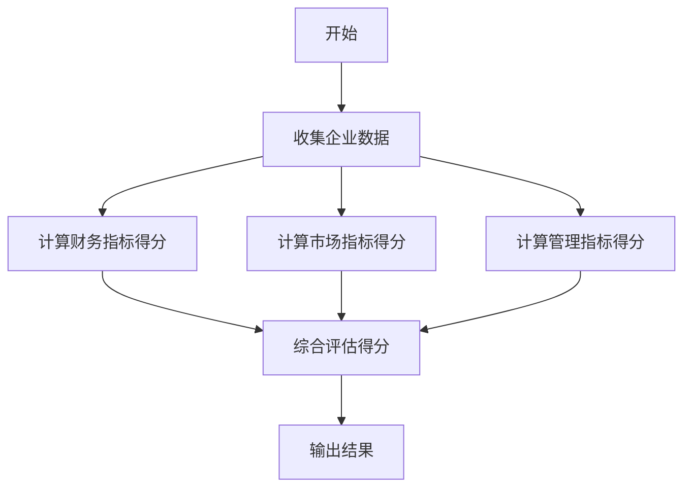
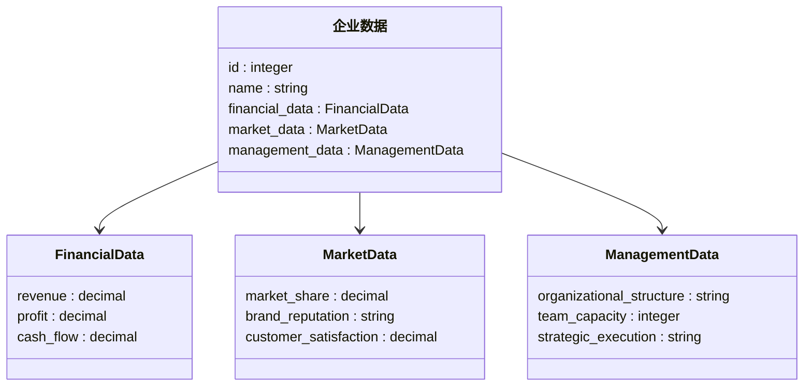
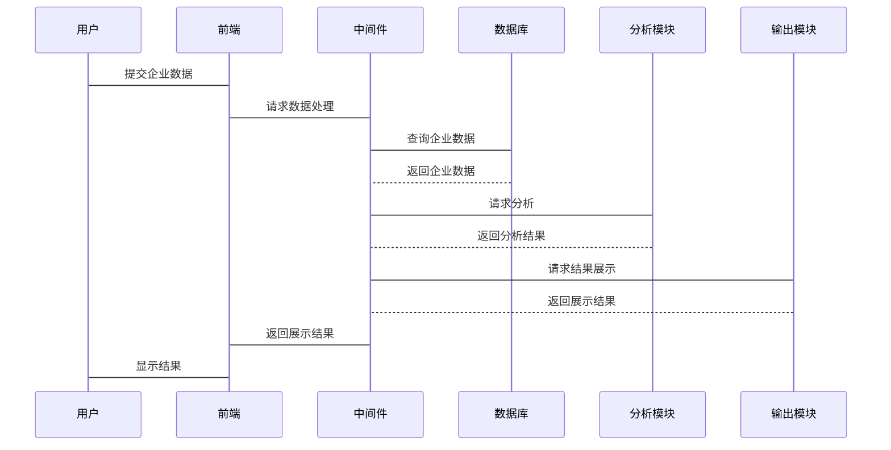

                 


# 如何评估企业的长期增长潜力

---

## 关键词

- 企业增长潜力
- 评估框架
- 财务指标
- 市场竞争力
- 管理能力
- 创新能力
- 系统设计

---

## 摘要

评估企业的长期增长潜力是企业战略管理中的核心任务之一。本文从企业战略、财务状况、市场竞争力、管理能力等多个维度出发，系统地介绍企业增长潜力的评估框架和方法。通过分析核心要素之间的关系，结合数学模型和系统设计，为读者提供实用的评估工具和方法。文章还通过实际案例分析，展示如何将理论应用于实践，帮助企业制定科学的增长战略。

---

## 第一部分: 企业长期增长潜力评估的背景与核心概念

### 第1章: 企业长期增长潜力评估的背景与问题描述

#### 1.1 企业增长潜力的核心概念

##### 1.1.1 企业增长潜力的定义

企业的长期增长潜力是指企业在未来一段时间内，在市场、财务、技术和管理等多个方面实现持续增长的可能性。这种潜力不仅取决于当前的表现，还与企业战略、资源分配、创新能力和外部环境密切相关。

##### 1.1.2 企业增长潜力的重要性

企业增长潜力是投资者、管理层和利益相关者关注的核心问题。通过评估增长潜力，企业可以制定合理的战略规划，优化资源配置，规避潜在风险，抓住市场机会。

##### 1.1.3 企业增长潜力的边界与外延

企业增长潜力的评估需要考虑企业内部资源和外部环境的双重因素。内部因素包括财务状况、管理能力、技术创新等；外部因素包括市场需求、行业竞争、政策环境等。增长潜力的外延涉及企业扩张、市场份额提升、技术创新等多个方面。

#### 1.2 企业增长潜力评估的必要性

##### 1.2.1 当前企业面临的增长挑战

现代企业面临日益复杂的市场环境和竞争压力。技术创新、市场需求变化、政策调整等因素都可能影响企业的增长潜力。企业需要通过科学的评估方法，识别潜在的增长机会和风险。

##### 1.2.2 企业增长潜力评估的现实意义

通过评估增长潜力，企业可以制定长期战略规划，优化资源配置，提升核心竞争力。同时，增长潜力评估也是投资者评估企业价值的重要依据。

##### 1.2.3 企业增长潜力评估的误区与常见问题

企业在评估增长潜力时，常见的误区包括过于依赖财务指标、忽视市场环境变化、忽略内部管理能力等。这些问题可能导致评估结果的偏差，影响决策的准确性。

#### 1.3 企业增长潜力评估的框架与方法

##### 1.3.1 企业增长潜力的评估维度

企业增长潜力的评估可以从以下几个维度进行：

1. **财务状况**：包括收入、利润、现金流等财务指标。
2. **市场竞争力**：包括市场份额、品牌影响力、客户忠诚度等。
3. **管理能力**：包括组织结构、团队能力、战略执行力等。
4. **技术创新**：包括研发投入、技术储备、创新能力等。
5. **外部环境**：包括行业趋势、政策法规、宏观经济环境等。

##### 1.3.2 企业增长潜力的评估模型

企业增长潜力评估模型可以采用多维度综合评估的方法，将各个维度的指标进行量化，并赋予不同的权重，计算综合得分。

##### 1.3.3 企业增长潜力评估的工具与技术

常用的评估工具包括财务分析模型、市场分析工具、管理能力评估框架等。技术方面，可以利用大数据分析、人工智能等方法，提高评估的准确性和效率。

---

### 第2章: 企业增长潜力的核心要素与关联关系

#### 2.1 企业增长潜力的核心要素分析

##### 2.1.1 企业战略与愿景

企业的战略和愿景是增长潜力的核心驱动力。清晰的战略目标和愿景能够指导企业资源的合理分配，确保各项决策与长期目标一致。

##### 2.1.2 企业财务状况

财务状况是评估企业增长潜力的重要指标。健康的财务状况能够为企业提供充足的资金支持，确保增长计划的实施。

##### 2.1.3 企业市场竞争力

市场竞争力决定了企业在市场中的地位和份额。强大的市场竞争力能够为企业带来更多的增长机会。

##### 2.1.4 企业组织与管理能力

高效的组织结构和管理能力是企业增长的保障。良好的管理能够提高资源利用效率，确保战略目标的实现。

##### 2.1.5 企业创新与研发投入

创新能力和研发投入是企业保持长期增长的关键因素。通过技术创新和产品创新，企业可以不断提升市场竞争力。

#### 2.2 企业增长潜力核心要素的属性特征对比

以下是核心要素的属性特征对比表格：

| 核心要素       | 属性特征 |
|----------------|----------|
| 企业战略与愿景 | 战略性、长期性、导向性 |
| 企业财务状况   | 数量化、可衡量性、稳定性 |
| 企业市场竞争力 | 竞争性、可比较性、动态性 |
| 企业组织与管理能力 | 系统性、效率性、适应性 |
| 企业创新与研发投入 | 创新性、前瞻性、持续性 |

#### 2.3 企业增长潜力的ER实体关系图

以下是企业增长潜力的ER实体关系图（使用 Mermaid 流程图）：

```mermaid
erDiagram
    customer[客户] {
        id : integer
        name : string
        purchase_history : string
    }
    product[产品] {
        id : integer
        name : string
        price : decimal
    }
    order[订单] {
        id : integer
        customer_id : integer
        product_id : integer
        order_date : date
    }
    customer-|{orders}order
    product-|{orders}order
```

---

### 第3章: 企业增长潜力评估的算法原理与数学模型

#### 3.1 企业增长潜力评估的算法原理

##### 3.1.1 基于财务指标的评估算法

财务指标评估算法主要关注企业的收入、利润、现金流等财务数据。通过分析这些数据的变化趋势，评估企业的财务健康状况和增长潜力。

##### 3.1.2 基于市场分析的评估算法

市场分析算法关注企业的市场份额、品牌影响力、客户满意度等市场指标。通过分析这些指标，评估企业在市场中的竞争力和增长潜力。

##### 3.1.3 基于管理能力的评估算法

管理能力评估算法关注企业的组织结构、团队能力、战略执行力等管理指标。通过分析这些指标，评估企业的管理效率和增长潜力。

#### 3.2 企业增长潜力评估的数学模型与公式

##### 3.2.1 财务指标评估模型

财务指标评估模型可以表示为：

$$
E = \frac{EBITDA}{D}
$$

其中，$EBITDA$ 是息税折旧及摊销前利润，$D$ 是企业总债务。

##### 3.2.2 市场潜力评估模型

市场潜力评估模型可以表示为：

$$
M = \frac{市场份额}{行业增长率}
$$

其中，$市场份额$ 是企业在市场中的份额，$行业增长率$ 是行业整体增长速度。

##### 3.2.3 综合评估公式

综合评估公式可以表示为：

$$
G = \alpha E + \beta M + \gamma C
$$

其中，$\alpha + \beta + \gamma = 1$，$E$ 是财务指标得分，$M$ 是市场指标得分，$C$ 是管理指标得分。

#### 3.3 企业增长潜力评估的算法流程图

以下是企业增长潜力评估的算法流程图（使用 Mermaid 流程图）：



---

### 第4章: 企业增长潜力评估的系统分析与架构设计

#### 4.1 问题场景介绍

企业增长潜力评估系统的目标是通过分析企业的财务、市场和管理数据，评估其长期增长潜力。系统需要具备数据采集、分析和结果展示的功能。

#### 4.2 系统功能设计

##### 4.2.1 领域模型设计（使用 Mermaid 类图）

以下是领域模型设计图（使用 Mermaid 类图）：



#### 4.3 系统架构设计

##### 4.3.1 系统架构设计（使用 Mermaid 架构图）

以下是系统架构设计图（使用 Mermaid 架构图）：

```mermaid
archi
    前端 --> 中间件
    中间件 --> 数据库
    中间件 --> 分析模块
    分析模块 --> 输出模块
    输出模块 --> 前端
```

#### 4.4 系统接口与交互设计

##### 4.4.1 系统接口设计

系统接口主要包括数据采集接口、分析接口和结果展示接口。

##### 4.4.2 系统交互流程（使用 Mermaid 序列图）

以下是系统交互流程图（使用 Mermaid 序列图）：



---

### 第5章: 企业增长潜力评估的项目实战

#### 5.1 项目环境与工具安装

##### 5.1.1 开发环境配置

项目开发需要以下工具和环境：

- Python 3.8+
- Jupyter Notebook
- Pandas、NumPy、Scikit-learn 等数据处理库
- Mermaid 图形库
- Git 用于版本控制

---

## 第6章: 最佳实践与总结

### 6.1 小结

企业增长潜力的评估是一个复杂但重要的任务。通过多维度分析和系统设计，企业可以制定科学的增长战略，抓住市场机会，规避潜在风险。

### 6.2 注意事项

- 在评估过程中，需要注意数据的准确性和完整性。
- 财务指标、市场指标和管理指标需要综合考虑，避免单一指标的偏差。
- 系统设计需要充分考虑可扩展性和可维护性。

### 6.3 拓展阅读

- 《企业战略管理》
- 《财务分析方法》
- 《市场分析与预测》
- 《系统设计与架构》

---

## 作者

作者：AI天才研究院/AI Genius Institute & 禅与计算机程序设计艺术 /Zen And The Art of Computer Programming

