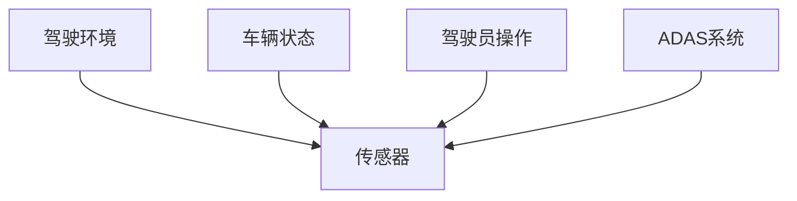
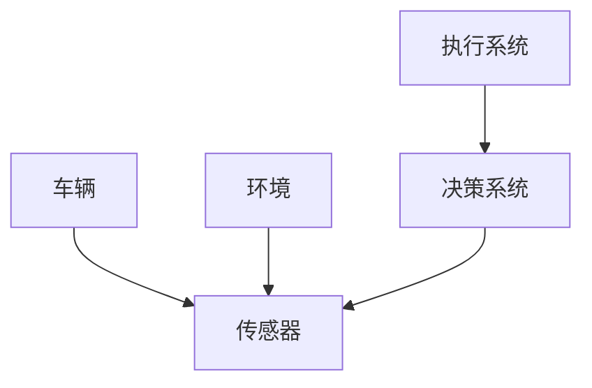
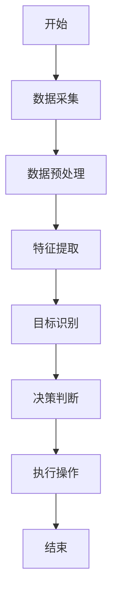
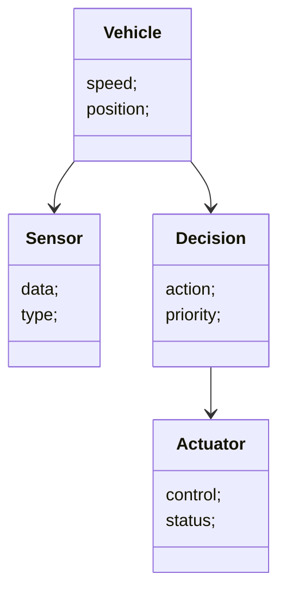
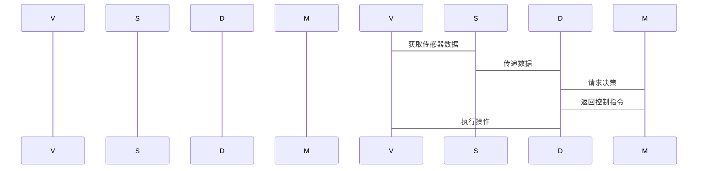

                 


# 如何评估企业的高级驾驶辅助系统

## 关键词：高级驾驶辅助系统（ADAS）、系统评估、传感器融合、算法实现、系统架构、项目实战、最佳实践

## 摘要：本文章详细探讨了如何系统地评估企业的高级驾驶辅助系统（ADAS），从背景介绍、核心概念、算法原理到系统架构和项目实战，全面分析了评估的关键步骤和方法，提供了丰富的技术细节和实际案例。

---

# 第一部分: 高级驾驶辅助系统（ADAS）概述

## 第1章: ADAS的背景与定义

### 1.1 问题背景

#### 1.1.1 传统驾驶方式的局限性
传统驾驶依赖驾驶员的感官和反应能力，存在疲劳驾驶、注意力分散等问题，难以应对复杂多变的交通环境。

#### 1.1.2 高级驾驶辅助系统的出现
随着人工智能和传感器技术的进步，ADAS应运而生，通过技术手段辅助驾驶员完成更安全、更高效的驾驶。

#### 1.1.3 企业为何需要评估ADAS
企业通过评估ADAS，可以提升产品安全性，降低事故风险，增强市场竞争力。

### 1.2 问题描述

#### 1.2.1 ADAS的功能模块
包括目标检测、车道识别、自动刹车、自适应巡航等功能。

#### 1.2.2 评估中的关键问题
如传感器精度、算法准确性、系统实时性等。

#### 1.2.3 企业需求与技术实现的矛盾
企业需求多样化，技术实现需平衡性能与成本。

### 1.3 问题解决

#### 1.3.1 技术解决方案
采用多传感器融合、深度学习算法等技术提升系统性能。

#### 1.3.2 企业策略调整
制定合理的技术路线和评估标准。

#### 1.3.3 用户需求满足
通过优化系统功能满足用户需求。

### 1.4 边界与外延

#### 1.4.1 ADAS的适用范围
主要应用于乘用车、商用车等领域。

#### 1.4.2 与其他技术的界限
如自动驾驶（ADS）的界限，ADAS属于辅助系统，而ADS是完全自主。

#### 1.4.3 未来发展趋势
向更高阶的自动驾驶系统发展。

### 1.5 概念结构与核心要素

#### 1.5.1 核心概念图


#### 1.5.2 关键要素对比表
| 要素 | 描述 | 示例 |
|------|------|------|
| 传感器 | 数据来源 | 摄像头、雷达、激光雷达 |
| 处理器 | 数据处理 | GPU、FPGA |
| 算法 | 数据分析 | 目标检测、路径规划 |

---

## 第2章: ADAS的核心概念与联系

### 2.1 核心概念原理

#### 2.1.1 多传感器融合
通过融合摄像头、雷达等传感器数据，提升系统的感知能力。

#### 2.1.2 智能决策算法
基于传感器数据，利用深度学习等算法做出驾驶决策。

#### 2.1.3 实时控制机制
确保系统快速响应，实现对车辆的实时控制。

### 2.2 概念属性对比

#### 2.2.1 各功能模块对比
| 功能模块 | 输入 | 输出 |
|----------|------|------|
| 目标检测 | 图像数据 | 目标位置、类型 |
| 车道识别 | 图像数据 | 车道线位置 |

#### 2.2.2 技术指标分析
如检测精度、响应时间、环境适应性等。

#### 2.2.3 性能评估标准
如准确率、召回率、F1分数等。

### 2.3 ER实体关系图



---

## 第3章: 算法原理与实现

### 3.1 算法流程图



### 3.2 核心算法代码

```python
def preprocess(image):
    # 图像预处理
    return processed_image

def extract_features(processed_image):
    # 特征提取
    return features

def model_predict(features):
    # 模型预测
    return prediction

def adas_algorithm(image):
    processed = preprocess(image)
    features = extract_features(processed)
    prediction = model_predict(features)
    return prediction
```

### 3.3 数学模型

#### 3.3.1 概率论基础
$$ P(A|B) = \frac{P(B|A)P(A)}{P(B)} $$

#### 3.3.2 优化算法
目标是最小化损失函数：
$$ L = \sum_{i=1}^{n} (y_i - \hat{y_i})^2 $$

---

## 第4章: 系统分析与架构设计方案

### 4.1 问题场景介绍

#### 4.1.1 项目介绍
评估企业ADAS系统，确保其在各种场景下的稳定性和准确性。

### 4.2 系统功能设计

#### 4.2.1 领域模型类图


### 4.3 系统架构设计

#### 4.3.1 系统架构图


### 4.4 系统接口设计

#### 4.4.1 接口设计
如传感器接口、数据处理接口、决策控制接口等。

### 4.5 系统交互序列图



---

## 第5章: 项目实战

### 5.1 环境安装

#### 5.1.1 安装Python
安装Python 3.8及以上版本。

#### 5.1.2 安装深度学习框架
如TensorFlow、PyTorch。

#### 5.1.3 安装传感器驱动
如摄像头、激光雷达驱动。

### 5.2 核心代码实现

#### 5.2.1 传感器数据处理
```python
import numpy as np

def process_sensor_data(data):
    # 数据处理逻辑
    return processed_data
```

#### 5.2.2 目标识别
```python
import tensorflow as tf
model = tf.keras.Sequential([...])
def detect_object(image):
    prediction = model.predict(image)
    return prediction
```

#### 5.2.3 决策控制
```python
def make_decision(features):
    # 决策逻辑
    return action
```

### 5.3 案例分析

#### 5.3.1 测试案例
如在高速公路上的车道保持测试。

#### 5.3.2 测试结果
分析测试中的准确率、响应时间等指标。

### 5.4 项目小结

---

## 第6章: 最佳实践与总结

### 6.1 小结

#### 6.1.1 核心要点
传感器融合、算法优化、系统架构设计。

### 6.2 注意事项

#### 6.2.1 常见问题
如传感器精度不足、算法过拟合等。

#### 6.2.2 解决方案
如数据增强、模型优化等。

### 6.3 拓展阅读

#### 6.3.1 推荐书籍
《深度学习》、《自动驾驶：从算法到系统》。

#### 6.3.2 技术博客
推荐相关技术博客和论坛。

---

# 作者：AI天才研究院/AI Genius Institute & 禅与计算机程序设计艺术 /Zen And The Art of Computer Programming

