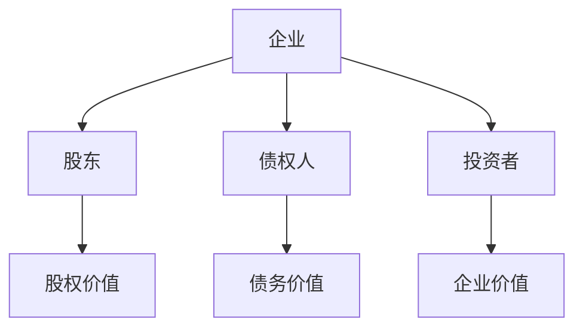
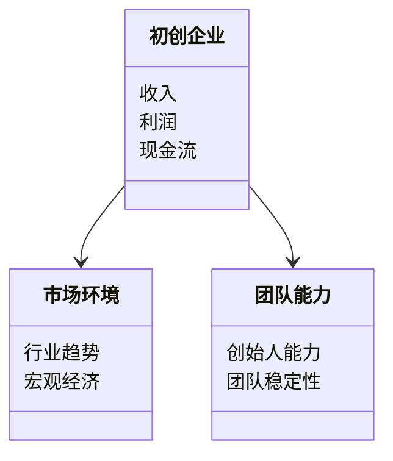

                 


# 如何评估初创企业的价值

> 关键词：初创企业，价值评估，DCF模型，财务指标，市场分析，团队评估，风险评估

> 摘要：本文系统地介绍如何评估初创企业的价值，从背景与核心概念、价值评估的算法原理、系统分析与架构设计、项目实战到总结与最佳实践，详细讲解了评估初创企业价值的全过程。

---

# 第一部分: 初创企业价值评估的背景与核心概念

## 第1章: 初创企业价值评估的背景与问题描述

### 1.1 初创企业价值评估的重要性

#### 1.1.1 初创企业的定义与特点
初创企业是指刚刚成立的、处于早期发展阶段的企业。其特点包括：
- 规模小
- 发展速度快
- 市场不确定性高
- 资源有限
- 创新能力强

#### 1.1.2 价值评估在初创企业中的作用
- **融资支持**：帮助企业获得投资
- **定价参考**：为股权转让提供依据
- **战略规划**：帮助企业管理者制定合理的发展目标
- **风险控制**：帮助投资者降低投资风险

#### 1.1.3 初创企业价值评估的挑战
- 数据有限：初创企业往往没有完整的财务数据
- 市场不确定性：市场需求和技术变化快
- 团队风险：创始人和核心团队的能力对企业价值影响大

---

### 1.2 价值评估的核心问题

#### 1.2.1 价值评估的基本概念
- **企业价值**：企业整体的市场价值
- **股权价值**：股东权益的市场价值
- **贴现现金流（DCF）**：通过未来现金流的现值计算企业价值

#### 1.2.2 价值评估的关键要素
- 财务数据：收入、利润、现金流
- 市场数据：行业竞争、市场需求
- 团队能力：创始人和核心团队的背景
- 风险因素：市场、技术、财务风险

#### 1.2.3 价值评估的边界与外延
- **边界**：仅关注企业本身的价值，不考虑外部市场波动
- **外延**：包括未来潜在的收入和增长机会

---

### 1.3 价值评估的理论基础

#### 1.3.1 贴现现金流模型（DCF）
- **定义**：通过将未来现金流贴现，计算企业当前的价值
- **公式**：
  $$ \text{企业价值} = \sum_{t=1}^{n} \frac{\text{现金流}_t}{(1 + r)^t} + \frac{\text{终值}}{(1 + r)^n} $$
  其中，\( r \) 是折现率，\( \text{现金流}_t \) 是第 \( t \) 年的现金流。

#### 1.3.2 股权价值与企业价值的区分
- **股权价值**：仅考虑股东的权益价值
- **企业价值**：包括股东权益和债务的价值

#### 1.3.3 价值评估的数学模型
- **市盈率法**：
  $$ \text{市盈率} = \frac{\text{股价}}{\text{每股收益}} $$
- **市净率法**：
  $$ \text{市净率} = \frac{\text{股价}}{\text{每股净资产}} $$

---

### 1.4 价值评估的框架与方法

#### 1.4.1 传统财务指标分析
- **市盈率（P/E）**
- **市净率（P/B）**
- **ROE（净资产收益率）**

#### 1.4.2 市场法与收益法
- **市场法**：通过可比公司进行估值
- **收益法**：通过未来现金流折现计算

#### 1.4.3 初创企业的特殊估值方法
- **创业估值法**：基于团队、市场、技术的综合评估
- **指数法**：通过行业指数调整估值

---

## 第2章: 价值评估的核心概念与联系

### 2.1 价值评估的核心概念

#### 2.1.1 企业价值的构成要素
- 股东权益
- 债务价值
- 未来现金流

#### 2.1.2 财务指标与非财务指标
- **财务指标**：收入、利润、现金流
- **非财务指标**：市场占有率、品牌影响力

#### 2.1.3 价值评估的关键假设
- 稳定的现金流增长
- 合理的折现率

---

### 2.2 核心概念的联系

#### 2.2.1 财务指标与企业价值的关系
- **正相关**：收入、利润增长，企业价值增加
- **负相关**：高负债率可能降低企业价值

#### 2.2.2 市场环境对企业价值的影响
- 行业趋势：朝阳行业可能有更高的估值
- 宏观经济：经济下行可能降低企业价值

#### 2.2.3 团队能力与企业价值的关联
- 核心团队能力强，企业价值高
- 团队稳定性影响企业未来的现金流

---

### 2.3 价值评估的数学模型与公式

#### 2.3.1 贴现现金流模型的数学表达
$$ \text{企业价值} = \sum_{t=1}^{n} \frac{\text{现金流}_t}{(1 + r)^t} + \frac{\text{残值}}{(1 + r)^n} $$

#### 2.3.2 市盈率与市净率的计算公式
$$ \text{市盈率} = \frac{\text{股价}}{\text{每股收益}} $$
$$ \text{市净率} = \frac{\text{股价}}{\text{每股净资产}} $$

---

### 2.4 核心概念的ER实体关系图



---

### 2.5 本章小结

---

# 第三部分: 价值评估的算法原理与数学模型

## 第3章: 价值评估的算法原理与数学模型

### 3.1 贴现现金流模型（DCF）的算法原理

#### 3.1.1 DCF模型的基本原理
- **现金流预测**：预测未来每年的现金流
- **贴现率确定**：选择合适的折现率
- **终值计算**：计算未来现金流的终值

#### 3.1.2 现金流预测与贴现率的确定
- 现金流预测：基于企业的历史数据和市场分析
- 贴现率确定：使用WACC（加权平均资本成本）

#### 3.1.3 终值的计算方法
- 终值公式：
  $$ \text{终值} = \text{现金流}_{n+1} \times \frac{1}{(1 + r)^n} $$

---

### 3.2 股权价值评估的数学模型

#### 3.2.1 股权自由现金流模型
$$ \text{股权价值} = \sum_{t=1}^{n} \frac{\text{股权现金流}_t}{(1 + r)^t} + \frac{\text{终值}}{(1 + r)^n} $$

---

## 第4章: 系统分析与架构设计方案

### 4.1 问题场景介绍
- 初创企业价值评估是一个复杂的系统工程，涉及多个模块的协同工作。

### 4.2 系统功能设计（领域模型）



---

### 4.3 系统架构设计（架构图）


---

## 第5章: 项目实战

### 5.1 环境安装与数据准备
- 安装Python和相关库（如pandas、numpy）
- 准备初创企业的财务数据和市场数据

### 5.2 核心实现（Python代码）

```python
import pandas as pd
import numpy as np

def calculate_dcf(cash_flows, discount_rate, terminal_value):
    return sum(cash_flows / (1 + discount_rate)**t for t in range(len(cash_flows))) + terminal_value / (1 + discount_rate)**len(cash_flows)

# 示例数据
cash_flows = [100, 150, 200, 250]
discount_rate = 0.1
terminal_value = 300

value = calculate_dcf(cash_flows, discount_rate, terminal_value)
print(f"企业价值：{value:.2f}")
```

---

## 第6章: 总结与最佳实践

### 6.1 总结
- 价值评估是一个复杂但系统的过程，需要结合财务、市场和团队等多方面因素。
- DCF模型是评估企业价值的重要工具，但需要合理预测现金流和选择贴现率。

### 6.2 最佳实践 tips
- **数据驱动**：尽量使用真实数据进行评估
- **多模型结合**：结合市场法和收益法进行交叉验证
- **动态调整**：定期更新评估结果，应对市场变化

### 6.3 小结
- 初创企业价值评估是投资者和企业管理者的重要工具
- 通过系统的方法和工具，可以更准确地评估企业价值

---

# 作者：AI天才研究院/AI Genius Institute & 禅与计算机程序设计艺术 /Zen And The Art of Computer Programming

