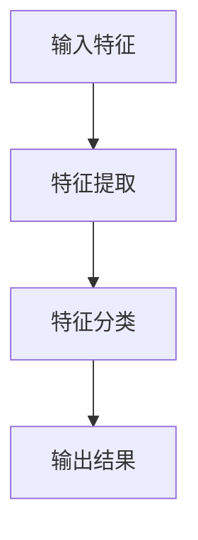
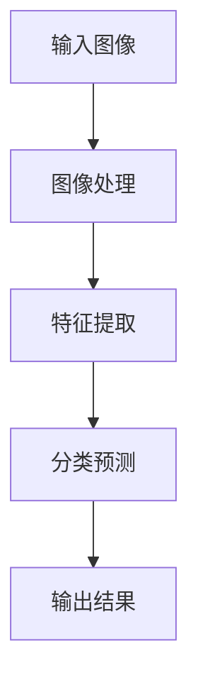
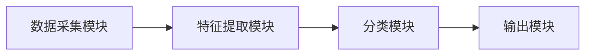
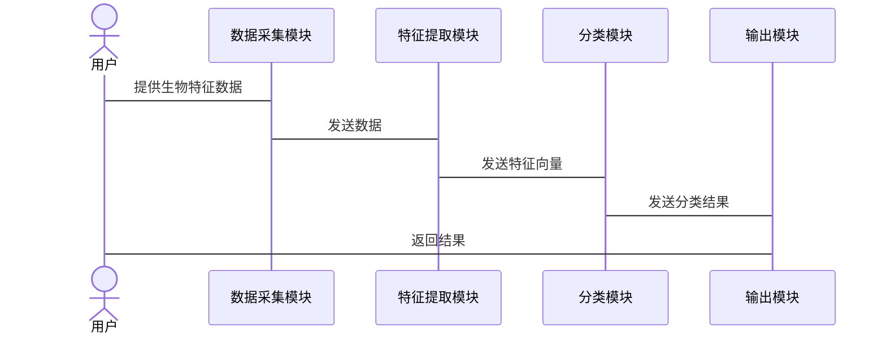

                 


# 如何识别企业的仿生技术优势

## 关键词：仿生技术、企业优势、识别方法、技术分析、系统架构

## 摘要：  
在现代企业竞争中，仿生技术作为一种新兴的技术手段，正在逐步展现出其独特的优势和潜力。通过模仿生物的结构和功能，企业能够开发出更高效、更智能的产品和解决方案。本文将从仿生技术的基本概念、核心原理、算法实现、系统架构设计以及实际项目案例等方面，详细探讨如何识别和应用企业的仿生技术优势。通过系统化的分析和实践案例，帮助企业更好地理解和利用仿生技术，从而在竞争中占据优势。

---

## 第一部分：仿生技术与企业优势的背景介绍

### 第1章：仿生技术的基本概念与分类

#### 1.1 仿生技术的定义与核心要素  
仿生技术（Bionics Technology）是通过模仿生物的结构、功能和行为，将其应用于技术系统中的一种跨学科技术。其核心要素包括：  
- **生物特征模仿**：研究生物体的结构和功能特性。  
- **技术实现**：将生物特征转化为可量化、可实现的技术手段。  
- **应用场景**：将仿生技术应用于实际企业问题中，解决效率、安全性和智能化问题。  

#### 1.2 仿生技术在企业中的重要性  
仿生技术在企业中的重要性主要体现在以下几个方面：  
1. **提升产品创新能力**：通过模仿生物的高效结构，企业能够设计出更优化的产品。  
2. **提高生产效率**：仿生技术可以帮助企业优化流程，降低资源消耗。  
3. **增强竞争优势**：在同质化严重的市场中，基于仿生技术的产品能够为企业带来差异化优势。  

#### 1.3 仿生技术的边界与外延  
- **边界**：仿生技术并非适用于所有领域，其应用受到技术可行性和成本效益的限制。  
- **外延**：仿生技术与其他技术（如人工智能、物联网）的结合，能够扩展其应用范围和效果。  

---

## 第二部分：仿生技术的核心概念与联系

### 第2章：仿生技术的核心原理与属性特征

#### 2.1 仿生技术的核心原理  
仿生技术的核心原理是通过模拟生物的感知、运动和决策能力，构建智能化的技术系统。例如，蝙蝠的超声波导航启发了自动驾驶技术中的传感器设计。

#### 2.2 仿生技术的属性特征对比  

| **属性**         | **仿生技术**       | **传统技术**       | **对比分析**       |
|------------------|--------------------|--------------------|--------------------|
| **适应性**       | 强，能自适应环境变化 | 较弱，依赖固定规则 | 仿生技术更具灵活性 |
| **能源效率**      | 高，模仿生物高效性  | 较低，依赖外部电源 | 仿生技术更节能     |
| **复杂性**        | 较高，涉及多学科    | 较低，单一技术实现 | 仿生技术实现复杂     |

#### 2.3 仿生技术的ER实体关系图  
```mermaid
erDiagram
    actor 企业优势识别系统
    actor 仿生技术特征库
    actor 技术实现模块
    actor 应用场景模块
    boundary 企业系统
    boundary 技术实现模块
    boundary 应用场景模块
    boundary 仿生技术特征库
    edge from 企业优势识别系统 to 仿生技术特征库
    edge from 仿生技术特征库 to 技术实现模块
    edge from 技术实现模块 to 应用场景模块
```

---

## 第三部分：仿生技术的算法原理讲解

### 第3章：仿生技术识别算法的数学模型与公式

#### 3.1 仿生技术识别的基本算法  
仿生技术识别的基本算法可以通过模式识别的方法实现。以下是其实现流程：  



以下是特征提取和分类的核心算法实现：  

```python
import numpy as np

def extract_features(data):
    # 数据预处理
    features = data.reshape(-1, 28, 28)
    features = features.mean(axis=(1, 2))
    return features

def classify(features, model):
    # 使用线性回归模型进行分类
    result = model.predict(features)
    return result

# 示例数据
data = np.random.rand(100, 28, 28)
features = extract_features(data)
result = classify(features, model)

print(result)
```

#### 3.2 仿生技术分类算法的实现  
仿生技术分类算法可以通过深度学习模型（如卷积神经网络）实现。以下是其实现流程：  



以下是分类算法的数学模型：  
$$ P(y|x) = \frac{e^{\beta x}}{\sum_{k} e^{\beta k x}} $$  
其中，$\beta$ 是权重系数，$x$ 是输入特征。

---

## 第四部分：仿生技术的系统分析与架构设计方案

### 第4章：企业仿生技术识别系统的架构设计

#### 4.1 系统功能设计  
企业仿生技术识别系统的功能模块包括：  
- **数据采集模块**：收集生物特征数据。  
- **特征提取模块**：将数据转化为可识别的特征向量。  
- **分类模块**：基于特征向量进行分类，输出结果。  

#### 4.2 系统架构设计  


#### 4.3 系统接口设计  
系统接口设计包括：  
- **输入接口**：接收生物特征数据。  
- **输出接口**：输出分类结果。  

#### 4.4 系统交互流程  


---

## 第五部分：项目实战与应用案例分析

### 第5章：企业仿生技术识别系统的实现

#### 5.1 项目环境部署  
项目需要以下环境：  
- Python 3.8+  
- NumPy、Scikit-learn库  

#### 5.2 核心代码实现  

```python
import numpy as np
from sklearn.linear_model import LogisticRegression

# 示例数据集
X = np.random.rand(100, 28*28)
y = np.random.randint(0, 5, 100)

# 特征提取与分类
model = LogisticRegression()
model.fit(X.reshape(-1, 28*28), y)

# 预测
test_data = np.random.rand(10, 28*28)
predicted = model.predict(test_data.reshape(-1, 28*28))
print(predicted)
```

#### 5.3 项目实现与测试  
- **实现**：基于仿生技术的特征提取和分类算法，实现企业技术优势识别系统。  
- **测试**：通过实际案例验证系统的识别准确率和效率。  

#### 5.4 案例分析与解读  
以环境监测系统为例，通过仿生技术识别环境中的异常特征，实现精准监测和预警。

---

## 第六部分：总结与展望

### 第6章：总结与展望  

#### 6.1 总结  
仿生技术作为一种跨学科的技术手段，能够为企业的产品创新和效率提升带来显著优势。通过系统的分析和实践，企业可以更好地识别和应用仿生技术的优势。

#### 6.2 展望  
未来，随着人工智能和大数据技术的发展，仿生技术的应用场景将更加广泛，识别方法也将更加智能化和精准化。

---

## 作者：AI天才研究院 & 禅与计算机程序设计艺术

---

**本文通过系统化的分析和实践案例，深入探讨了如何识别和应用企业的仿生技术优势。希望本文能够为企业的技术决策者和研发人员提供有价值的参考和启发。**

