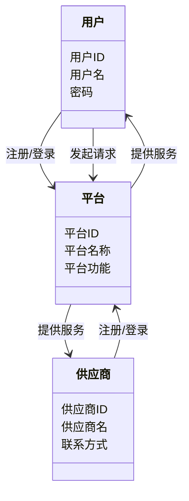

                 


# 如何识别企业的平台战略优势

## 关键词：平台战略，竞争优势，数字化转型，商业模式，生态系统，价值主张

## 摘要：  
在数字化转型的浪潮中，企业平台战略已成为企业获取竞争优势的关键手段。本文将从平台战略的定义、核心要素、识别方法、评估模型、系统架构设计、项目实战等多个维度，详细解析如何识别和构建企业的平台战略优势。通过理论与实践结合的方式，本文将为企业提供一套系统化的平台战略优势识别框架，帮助企业在复杂多变的商业环境中把握先机。

---

## 第一部分: 企业平台战略优势的背景与概念

### 第1章: 平台战略的定义与重要性

#### 1.1 平台战略的核心概念

##### 1.1.1 平台战略的定义  
平台战略是指企业通过构建一个开放的、可扩展的平台，整合内外部资源（如技术、数据、用户、服务等），并通过平台的运作和优化，为企业创造价值并实现可持续发展的战略。平台战略的核心在于通过平台的生态化运作，实现资源的高效配置和价值的倍增。

##### 1.1.2 平台战略的核心要素  
平台战略的核心要素包括：  
- **价值主张**：平台为企业或用户提供独特的价值。  
- **商业模式**：平台如何通过运营实现盈利。  
- **竞争优势**：平台在市场中与众不同的能力。  
- **生态系统**：平台如何整合内外部资源，构建生态体系。  

##### 1.1.3 平台战略与企业竞争优势的关系  
平台战略通过整合资源、优化流程、创新模式，能够显著提升企业的竞争优势。例如，通过平台战略，企业可以快速响应市场需求，降低运营成本，提高客户满意度，从而在市场中占据领先地位。

---

#### 1.2 平台战略的背景与现状

##### 1.2.1 数字化转型对企业平台战略的影响  
随着数字化转型的深入推进，企业意识到单纯依靠传统业务模式难以在竞争中立足。平台战略作为一种新兴的商业模式，为企业提供了更灵活、更具创新性的选择。

##### 1.2.2 当前企业平台战略的发展趋势  
- **生态系统化**：平台不再是一个简单的工具，而是企业构建生态系统的主战场。  
- **智能化**：借助人工智能和大数据技术，平台能够更精准地匹配供需，优化资源配置。  
- **全球化**：平台战略不再局限于本地市场，而是走向全球化，连接更广泛的用户和资源。

##### 1.2.3 平台经济对企业竞争优势的重塑作用  
平台经济通过打破传统的供需匹配方式，降低了交易成本，提高了效率。企业通过平台战略，可以快速触达用户、整合资源、拓展市场，从而重塑竞争优势。

---

#### 1.3 平台战略的重要性

##### 1.3.1 平台战略对企业价值创造的作用  
平台战略通过资源整合、协同创新，能够为企业创造更大的价值。例如，通过平台，企业可以将分散的供应商、客户、合作伙伴等资源整合起来，形成一个高效的价值网络。

##### 1.3.2 平台战略对企业创新的推动作用  
平台战略为企业提供了创新的土壤。通过平台，企业可以快速试验新的商业模式、产品和服务，降低创新成本，加速创新周期。

##### 1.3.3 平台战略对企业生态系统构建的意义  
平台战略是企业构建生态系统的核心。通过平台，企业可以吸引更多的参与者加入，形成一个互利共赢的生态系统，从而增强企业的竞争力和抗风险能力。

---

## 第2章: 平台战略的核心概念与联系

### 2.1 平台战略的核心要素

#### 2.1.1 平台的价值主张  
平台的价值主张是平台存在的核心理由。例如，一家电商平台的价值主张可能是“一站式购物体验”，而一家工业互联网平台的价值主张可能是“工业设备的智能连接与数据共享”。

#### 2.1.2 平台的商业模式  
平台的商业模式决定了平台如何实现盈利。常见的商业模式包括：  
- **双边市场模式**：通过连接供需双方，收取交易佣金。  
- **广告模式**：通过平台上的广告位实现收入。  
- **订阅模式**：通过会员订阅或API调用收费。  

#### 2.1.3 平台的竞争优势  
平台的竞争优势是平台在市场中与众不同的能力。例如，平台的核心技术能力、用户体验设计、资源整合能力等。

---

### 2.2 平台战略的核心概念对比

#### 2.2.1 平台战略与传统业务模式的对比  
| 对比维度 | 平台战略 | 传统业务模式 |
|----------|----------|--------------|
| 价值来源 | 平台的生态价值 | 产品的直接价值 |
| 资源整合 | 高度依赖生态系统的资源整合 | 依赖内部资源 |
| 创新速度 | 快速迭代和创新 | 较慢的创新周期 |

#### 2.2.2 平台战略与企业生态系统的关系  
平台是企业生态系统的核心。通过平台，企业可以整合外部资源（如供应商、客户、合作伙伴），构建一个互利共赢的生态系统。

#### 2.2.3 平台战略与数字化转型的联系  
数字化转型为企业平台战略提供了技术支持和数据基础。平台战略则是数字化转型的重要实现方式。

---

### 2.3 平台战略的ER实体关系图

```mermaid
erDiagram
    actor 顾客 {
        string 用户ID
        string 用户名
        string 密码
    }
    actor 供应商 {
        string 供应商ID
        string 供应商名
        string 联系方式
    }
    actor 平台 {
        string 平台ID
        string 平台名称
        string 平台功能
    }
    顾客 --|{建立连接}--> 平台
    供应商 --|{建立连接}--> 平台
    顾客 --|{发起请求}--> 平台
    平台 --|{提供服务}--> 顾客
    平台 --|{提供服务}--> 供应商
```

---

## 第3章: 平台战略优势的识别方法

### 3.1 平台战略优势的识别维度

#### 3.1.1 平台的用户规模与粘性  
- 用户规模是衡量平台优势的重要指标。  
- 用户粘性反映了平台对用户的吸引力。  

#### 3.1.2 平台的资源整合能力  
- 平台能否整合外部资源（如技术、数据、服务等）。  
- 平台的资源整合能力越强，竞争优势越大。  

#### 3.1.3 平台的创新速度与能力  
- 平台能否快速响应市场需求，推出新产品和服务。  
- 创新能力是平台持续竞争优势的关键。  

---

### 3.2 平台战略优势的评估模型

#### 3.2.1 平台战略优势的评估维度  
- **用户满意度**：用户的反馈是衡量平台优势的重要指标。  
- **市场占有率**：平台在市场中的份额反映了其竞争优势。  
- **盈利能力**：平台的盈利能力是其竞争优势的直接体现。  

#### 3.2.2 平台战略优势的数学模型  
$$ \text{平台竞争优势} = \frac{\text{用户满意度} \times \text{市场占有率}}{\text{运营成本}} $$  

---

## 第4章: 平台战略优势的系统分析与架构设计

### 4.1 问题场景介绍  
假设我们是一家互联网公司，希望通过平台战略实现业务创新和竞争优势提升。

---

### 4.2 系统功能设计

#### 4.2.1 领域模型设计  


---

### 4.3 系统架构设计

#### 4.3.1 系统架构图  
```mermaid
architecturalDiagram
    component 用户端 {
        usecase 登录/注册
        usecase 发起请求
    }
    component 平台端 {
        usecase 提供服务
        usecase 整合资源
    }
    component 供应商端 {
        usecase 提供服务
        usecase 接收请求
    }
    用户端 -->> 平台端
    平台端 -->> 供应商端
```

---

## 第5章: 平台战略优势的项目实战

### 5.1 环境安装与配置

```bash
pip install flask
pip install pymongo
```

---

### 5.2 核心代码实现

```python
from flask import Flask
from pymongo import MongoClient

app = Flask(__name__)
client = MongoClient('mongodb://localhost:27017/')

@app.route('/')
def home():
    return "欢迎来到平台战略优势识别系统！"

@app.route('/api/users', methods=['POST'])
def register_user():
    # 实现用户注册逻辑
    pass

@app.route('/api/providers', methods=['POST'])
def register_provider():
    # 实现供应商注册逻辑
    pass

if __name__ == '__main__':
    app.run(debug=True)
```

---

### 5.3 项目小结  
通过本项目的实战，我们了解了平台战略优势识别的关键步骤和实现方法。未来，我们可以进一步优化系统架构，提升平台的用户体验和资源整合能力。

---

## 第6章: 总结与展望

### 6.1 最佳实践 Tips  
- **持续优化平台功能**：根据用户反馈不断改进平台。  
- **加强生态合作**：通过与合作伙伴的合作，增强平台的资源整合能力。  
- **注重数据安全**：确保平台数据的安全性和隐私性。  

### 6.2 小结  
本文从理论到实践，详细解析了如何识别和构建企业的平台战略优势。通过平台战略，企业可以实现资源的高效配置和价值的倍增。

### 6.3 注意事项  
- 平台战略的实施需要企业内部的高度重视和资源支持。  
- 平台的运营需要持续投入，不能一蹴而就。  

### 6.4 拓展阅读  
- 《平台革命：如何通过平台型商业改造世界》  
- 《数字化转型：企业平台战略的实践与案例》  

---

## 作者：AI天才研究院/AI Genius Institute & 禅与计算机程序设计艺术/Zen And The Art of Computer Programming

