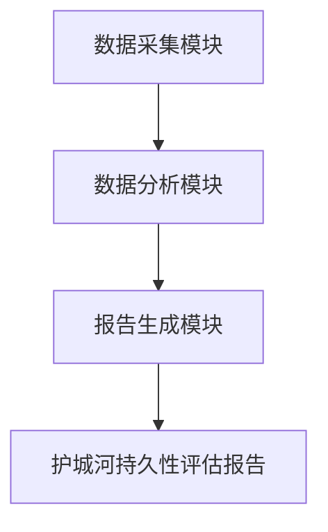
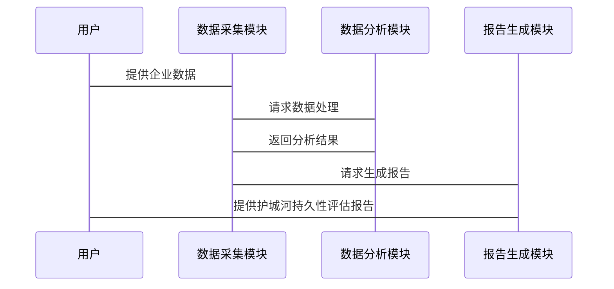

                 


# 如何识别企业的护城河持久性

**关键词**：企业护城河，持久性，竞争优势，市场分析，技术壁垒

**摘要**：  
企业护城河是企业在市场竞争中建立的竞争优势，其持久性决定了企业能否在长期竞争中保持领先地位。本文将从护城河的定义、类型、评估框架、持久性影响因素、算法分析、系统设计和实战案例等方面，深入探讨如何识别和提升企业的护城河持久性。通过结合技术、市场、资源和品牌等多维度的分析，本文为企业提供了一套系统化的护城河持久性评估方法，并通过实际案例展示了如何将理论应用于实践。

---

# 第一部分: 企业护城河与持久性概述

## 第1章: 企业护城河的核心概念

### 1.1 护城河的定义与背景

#### 1.1.1 什么是企业护城河  
企业护城河是指企业在市场竞争中建立的独特优势，使其能够在特定领域内抵御竞争对手的侵袭。这些优势可以是技术、市场、资源或品牌等，能够为企业提供长期的竞争优势。

#### 1.1.2 护城河的起源与演变  
护城河的概念源自经济和商业领域，最早可以追溯到古典经济学中的比较优势理论。在现代商业环境中，护城河的概念被进一步扩展，特别是在科技和互联网行业，护城河的构建变得更加复杂和动态。

#### 1.1.3 护城河在商业竞争中的作用  
护城河是企业维持市场份额、提升利润率和增强抗风险能力的关键因素。通过构建坚固的护城河，企业可以在激烈的市场竞争中立于不败之地。

---

### 1.2 护城河的类型与特征

#### 1.2.1 技术型护城河  
技术型护城河依赖于企业的技术创新能力，包括专利、研发能力和技术积累。这种护城河的特点是难以被竞争对手快速复制。

#### 1.2.2 市场型护城河  
市场型护城河依赖于企业在特定市场的垄断地位，例如独特的商业模式、客户资源或渠道优势。

#### 1.2.3 资源型护城河  
资源型护城河依赖于企业对关键资源的控制，例如原材料、数据或人才等。这些资源往往是稀缺的，能够为企业提供长期的竞争优势。

#### 1.2.4 品牌型护城河  
品牌型护城河依赖于企业的品牌影响力和客户忠诚度。强大的品牌可以吸引更多的客户，并在市场中占据更高的溢价能力。

---

### 1.3 护城河持久性的定义与重要性

#### 1.3.1 护城河持久性的概念  
护城河持久性是指企业在长期竞争中能够维持其护城河优势的能力。持久性越强，企业的竞争优势越持久。

#### 1.3.2 护城河持久性对企业价值的影响  
持久的护城河能够为企业带来更高的市场估值和长期盈利能力。投资者也更倾向于投资具有持久护城河的企业。

#### 1.3.3 护城河持久性与企业长期竞争优势的关系  
护城河持久性是企业长期竞争优势的核心。只有能够持续维持护城河优势的企业，才能在激烈的市场竞争中立于不败之地。

---

## 第2章: 护城河持久性的关键影响因素

### 2.1 技术创新与研发投入

#### 2.1.1 技术创新对企业护城河的贡献  
技术创新是技术型护城河的核心。企业通过持续的技术创新，可以保持技术领先性，从而巩固护城河优势。

#### 2.1.2 研发投入与护城河持久性的关系  
研发投入是技术创新的基础。企业需要不断增加研发投入，以确保技术的持续创新和领先。

---

### 2.2 市场地位与客户粘性

#### 2.2.1 市场领导者的优势  
市场领导者通常具有更强的市场影响力和客户资源，这为企业构建市场型护城河提供了坚实的基础。

#### 2.2.2 客户依赖性与护城河的构建  
客户对企业的依赖性越高，企业护城河的持久性越强。例如，SaaS企业通过提供独特的服务，可以增强客户的依赖性。

---

### 2.3 资源壁垒与成本优势

#### 2.3.1 资源垄断对企业护城河的影响  
企业对关键资源的垄断可以形成强大的资源壁垒，从而增强护城河的持久性。

#### 2.3.2 成本优势的持久性分析  
成本优势是资源型护城河的重要组成部分。企业需要通过优化成本结构，确保成本优势的持久性。

---

### 2.4 品牌影响力与用户忠诚度

#### 2.4.1 品牌影响力对企业护城河的作用  
强大的品牌影响力可以增强企业的市场地位和客户忠诚度，从而巩固品牌型护城河。

#### 2.4.2 用户忠诚度与护城河的巩固  
用户忠诚度是品牌型护城河的重要指标。企业需要通过提供优质服务和用户体验，增强用户的忠诚度。

---

## 第3章: 护城河持久性评估框架

### 3.1 评估框架的构建

#### 3.1.1 评估维度的选择  
护城河持久性评估需要从多个维度进行，包括技术、市场、资源和品牌等。

#### 3.1.2 评估指标的设计  
每个维度需要选择具体的指标，例如技术领先性、市场份额、资源控制力和品牌影响力等。

#### 3.1.3 评估方法的比较  
常用的评估方法包括因子分析、层次分析法（AHP）和专家评分法等。不同的方法适用于不同的场景。

---

### 3.2 护城河持久性评估模型

#### 3.2.1 模型的输入变量  
评估模型需要输入多个变量，例如技术创新能力、市场份额、资源控制力和品牌影响力等。

#### 3.2.2 模型的计算过程  
通过加权评分法，对每个指标进行评分，并根据权重计算综合得分。

#### 3.2.3 模型的输出结果  
输出结果为护城河持久性指数，指数越高，护城河的持久性越强。

---

### 3.3 评估框架的适用性分析

#### 3.3.1 不同行业护城河持久性的差异  
不同行业的护城河持久性差异较大，例如科技行业注重技术，传统行业注重资源。

#### 3.3.2 企业规模对评估框架的影响  
大型企业通常具有更强的资源和市场影响力，护城河持久性更强。

#### 3.3.3 企业生命周期与护城河持久性的关系  
企业生命周期的不同阶段，护城河的构建和持久性也会有所不同。例如，初创企业需要快速构建护城河，而成熟企业需要维护和优化护城河。

---

## 第4章: 护城河持久性识别的核心概念

### 4.1 护城河持久性识别的原理

#### 4.1.1 护城河持久性识别的基本原理  
通过分析企业的核心竞争力和市场环境，识别护城河的类型和持久性。

#### 4.1.2 护城河持久性识别的关键要素  
包括技术创新能力、市场地位、资源控制力和品牌影响力等。

---

### 4.2 护城河持久性识别的核心属性

#### 4.2.1 技术领先性  
技术领先性是技术型护城河的核心属性。企业需要通过持续的技术创新，保持技术领先性。

#### 4.2.2 市场垄断性  
市场垄断性是市场型护城河的核心属性。企业需要通过独特的商业模式和市场策略，维持市场垄断地位。

#### 4.2.3 资源独特性  
资源独特性是资源型护城河的核心属性。企业需要通过垄断关键资源，构建资源壁垒。

#### 4.2.4 品牌影响力  
品牌影响力是品牌型护城河的核心属性。企业需要通过强大的品牌影响力和客户忠诚度，巩固品牌护城河。

---

### 4.3 护城河持久性识别的核心要素对比

| **属性**         | **技术型护城河**       | **市场型护城河**       | **资源型护城河**       | **品牌型护城河**       |
|------------------|-----------------------|-----------------------|-----------------------|-----------------------|
| 核心要素         | 技术创新               | 市场垄断               | 资源控制               | 品牌影响力             |
| 持久性影响因素   | 技术研发               | 客户依赖性             | 资源稀缺性             | 用户忠诚度             |
| 评估指标         | 技术专利数量           | 市场份额               | 资源控制力             | 品牌知名度             |

---

### 4.4 护城河持久性识别的ER实体关系图

```mermaid
erDiagram
    class 技术型护城河 {
        技术专利
        研发投入
        技术领先性
    }
    class 市场型护城河 {
        市场份额
        客户依赖性
        市场垄断性
    }
    class 资源型护城河 {
        资源控制力
        资源稀缺性
        成本优势
    }
    class 品牌型护城河 {
        品牌影响力
        用户忠诚度
        品牌知名度
    }
    关系：技术型护城河 -> 市场型护城河 : 通过技术创新提升市场地位
    关系：市场型护城河 -> 资源型护城河 : 市场垄断依赖资源控制
    关系：资源型护城河 -> 品牌型护城河 : 资源优势转化为品牌影响力
```

---

## 第5章: 护城河持久性识别的算法原理

### 5.1 护城河持久性识别的算法选择

#### 5.1.1 因子分析法  
因子分析法是一种常用的统计方法，可以通过提取关键因子，评估护城河的持久性。

#### 5.1.2 层次分析法（AHP）  
层次分析法是一种定性与定量相结合的方法，适用于多维度评估问题。

#### 5.1.3 专家评分法  
专家评分法通过邀请行业专家对护城河的各个维度进行评分，最终计算综合得分。

---

### 5.2 因子分析法的数学模型

因子分析法的数学模型如下：

$$
F = \sum_{i=1}^{n} w_i x_i
$$

其中，\( F \) 是护城河持久性指数，\( w_i \) 是第 \( i \) 个因子的权重，\( x_i \) 是第 \( i \) 个因子的评分。

---

### 5.3 层次分析法（AHP）的步骤

#### 5.3.1 构建层次结构模型  
将护城河的各个维度和指标进行层次划分，例如目标层、准则层和指标层。

#### 5.3.2 构建比较矩阵  
通过专家评分，构建比较矩阵，并进行一致性检验。

#### 5.3.3 计算权重  
通过特征值和特征向量，计算各指标的权重。

#### 5.3.4 计算综合得分  
根据权重和评分，计算护城河持久性指数。

---

### 5.4 护城河持久性识别的代码实现

```python
import pandas as pd
from sklearn.decomposition import FactorAnalyzer
import numpy as np

# 数据准备
data = pd.DataFrame({
    '技术创新': [8, 7, 9, 6],
    '市场份额': [7, 8, 6, 9],
    '资源控制力': [9, 6, 8, 7],
    '品牌影响力': [6, 8, 7, 8]
})

# 因子分析
fa = FactorAnalyzer(n_components=2, random_state=1)
fa.fit(data)

# 提取因子得分
factor_scores = pd.DataFrame(fa.transform(data))

# 计算综合得分
weights = [0.4, 0.6]
factor_scores['综合得分'] = factor_scores[0] * weights[0] + factor_scores[1] * weights[1]

print(factor_scores)
```

---

## 第6章: 护城河持久性识别的系统设计

### 6.1 系统功能设计

#### 6.1.1 数据采集模块  
数据采集模块负责收集企业的各项数据，包括技术创新、市场份额、资源控制力和品牌影响力等。

#### 6.1.2 数据分析模块  
数据分析模块使用因子分析法或层次分析法，对数据进行处理和分析，计算护城河持久性指数。

#### 6.1.3 报告生成模块  
报告生成模块根据分析结果，生成护城河持久性评估报告，提供改进建议。

---

### 6.2 系统架构设计



---

### 6.3 系统接口设计

#### 6.3.1 数据接口  
数据接口负责与企业数据库对接，获取相关数据。

#### 6.3.2 分析接口  
分析接口负责与数据分析模块对接，执行因子分析或层次分析。

#### 6.3.3 报告接口  
报告接口负责与报告生成模块对接，生成护城河持久性评估报告。

---

### 6.4 系统交互设计



---

## 第7章: 护城河持久性识别的实战案例

### 7.1 案例背景介绍

#### 7.1.1 案例企业介绍  
某互联网企业，主要业务为在线教育。企业希望通过护城河持久性评估，优化其市场和技术策略。

#### 7.1.2 案例目标  
通过评估企业的护城河持久性，识别竞争优势，并提出改进建议。

---

### 7.2 数据采集与处理

#### 7.2.1 数据采集  
收集企业的技术创新、市场份额、资源控制力和品牌影响力等数据。

#### 7.2.2 数据清洗  
对数据进行清洗和预处理，确保数据质量。

---

### 7.3 护城河持久性评估

#### 7.3.1 因子分析法应用  
通过因子分析法，计算企业的护城河持久性指数。

#### 7.3.2 结果解读  
护城河持久性指数为0.85，说明企业的护城河具有较强的持久性。

---

### 7.4 改进建议

#### 7.4.1 技术创新  
加大研发投入，保持技术领先性。

#### 7.4.2 市场策略  
优化市场策略，增强客户依赖性。

#### 7.4.3 资源管理  
优化资源管理，提升资源控制力。

#### 7.4.4 品牌建设  
加强品牌建设，提升品牌影响力。

---

## 第8章: 护城河持久性识别的最佳实践

### 8.1 最佳实践 tips

#### 8.1.1 定期评估  
企业应定期评估护城河的持久性，及时调整策略。

#### 8.1.2 关注核心竞争力  
护城河的构建应围绕企业的核心竞争力展开。

#### 8.1.3 利用数据驱动决策  
通过数据分析和评估模型，科学决策。

---

### 8.2 小结

护城河持久性识别是企业在竞争中立于不败之地的关键。通过科学的评估方法和系统的优化策略，企业可以有效提升护城河的持久性，确保长期竞争优势。

---

### 8.3 注意事项

- 护城河的构建需要长期投入，不能一蹴而就。
- 企业应根据自身特点，选择合适的护城河类型和评估方法。
- 在实际应用中，需要结合行业特点和市场环境，灵活调整策略。

---

### 8.4 拓展阅读

- 技术创新与企业竞争力（推荐阅读：《创新者的窘境》）
- 市场策略与护城河构建（推荐阅读：《竞争优势》）
- 资源管理与企业价值（推荐阅读：《资源基础视角》）
- 品牌建设与用户忠诚度（推荐阅读：《品牌管理》）

---

**作者：AI天才研究院/AI Genius Institute & 禅与计算机程序设计艺术 /Zen And The Art of Computer Programming**

