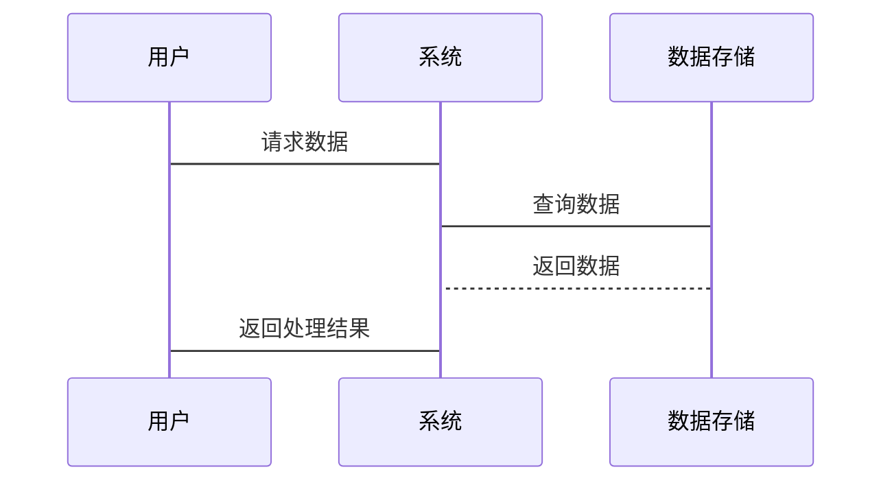

                 


# 如何识别企业的数据安全优势

> 关键词：数据安全、企业优势、风险管理、安全策略、技术架构

> 摘要：本文旨在探讨如何识别企业的数据安全优势，从数据安全的重要性、核心概念、识别方法论、技术实现、系统分析与架构设计、实战案例、管理与最佳实践以及未来趋势等多方面进行详细分析。通过系统性的方法和实际案例，帮助企业在复杂的数字化环境中，有效识别和提升数据安全优势，确保数据资产的安全与价值。

---

## 第五章: 数据安全优势的系统分析与架构设计

### 5.1 数据安全系统分析

#### 5.1.1 数据安全问题场景分析
- 数据流分析：从数据生成、传输、存储到销毁的全生命周期分析。
- 数据流向与依赖关系：绘制数据流图，识别关键数据路径。
- 数据安全风险点：分析数据在不同环节可能面临的安全威胁。

#### 5.1.2 数据安全系统介绍
- 数据安全系统的组成：数据采集、数据处理、数据存储、数据传输、数据访问控制等模块。
- 数据安全系统的功能：数据加密、身份认证、访问控制、安全审计等。
- 数据安全系统的边界：明确系统的输入输出接口和数据交互范围。

### 5.2 数据安全系统架构设计

#### 5.2.1 数据安全领域的领域模型
```mermaid
classDiagram
    class 数据安全系统 {
        数据加密模块
        身份认证模块
        访问控制模块
        安全审计模块
    }
    class 数据资产 {
        用户数据
        业务数据
        系统日志
    }
    数据安全系统 <--| 数据资产
```

#### 5.2.2 数据安全系统的架构设计


#### 5.2.3 数据安全系统的接口设计
- API接口：RESTful API设计，包含增删改查和安全相关操作。
- 数据格式：JSON、XML等结构化数据格式，支持加密传输。
- 接口安全：使用JWT、OAuth等认证协议，确保接口的安全性。

#### 5.2.4 数据安全系统的交互设计


---

## 第六章: 数据安全优势的实战案例分析

### 6.1 某金融企业的数据安全优势识别案例

#### 6.1.1 案例背景
- 企业类型：某大型金融企业
- 数据特点：交易数据、用户信息、财务数据
- 安全需求：防止数据泄露、保障交易安全

#### 6.1.2 数据分类与分级
- 数据分类：交易数据、用户数据、财务数据
- 数据分级：根据敏感程度分为高、中、低三个级别
- 数据保护措施：根据不同级别制定相应的安全策略

#### 6.1.3 数据安全威胁分析
- 威胁来源：外部黑客攻击、内部员工误操作、系统漏洞
- 威胁建模：使用攻击树或威胁建模工具进行分析
- 威胁应对：制定多层次的安全防护策略

#### 6.1.4 数据安全策略制定
- 访问控制策略：基于RBAC（基于角色的访问控制）
- 数据加密策略：采用AES算法加密敏感数据
- 安全监控策略：实时监控数据访问行为，记录日志

### 6.2 数据安全优势识别的实战总结

#### 6.2.1 实战过程总结
- 数据分类与分级的准确性
- 威胁分析的全面性
- 安全策略的可操作性

#### 6.2.2 实战经验与教训
- 数据分类过细可能导致管理复杂
- 威胁分析遗漏了一些潜在威胁
- 安全策略执行成本过高

#### 6.2.3 改进措施与优化建议
- 优化数据分类标准，降低管理复杂度
- 定期更新威胁模型，应对新兴威胁
- 采用自动化工具，降低安全策略执行成本

---

## 第七章: 数据安全优势的管理与最佳实践

### 7.1 数据安全优势的管理框架

#### 7.1.1 数据安全团队建设
- 团队职责分工：安全工程师、渗透测试人员、安全运维人员
- 团队协作机制：制定清晰的协作流程和沟通机制
- 团队培训计划：定期组织安全培训和技术分享

#### 7.1.2 数据安全管理流程
- 数据安全策略制定流程：需求分析、方案设计、审批通过、实施部署
- 数据安全事件响应流程：事件发现、应急处置、问题分析、总结改进
- 数据安全评估与优化流程：定期评估安全状态，持续优化安全策略

#### 7.1.3 数据安全合规要求
- 合规标准：GDPR、ISO 27001、等保2.0
- 合规风险：识别合规差距，制定整改计划
- 合规工具：使用自动化合规管理平台

### 7.2 数据安全优势的持续优化

#### 7.2.1 数据安全持续改进计划
- 定期安全审计：每年至少进行一次全面安全审计
- 持续风险评估：实时监控安全风险，及时调整防护策略
- 技术创新应用：引入新兴技术（如零信任架构、AI驱动的安全分析）

#### 7.2.2 数据安全文化的建设
- 安全意识培养：通过内部培训和宣传提高员工安全意识
- 安全行为规范：制定并严格执行数据安全行为规范
- 安全激励机制：对发现安全漏洞或隐患的员工给予奖励

### 7.3 数据安全优势的管理工具与平台

#### 7.3.1 数据安全管理平台
- 功能模块：数据分类分级、访问控制、安全监控、日志分析
- 平台架构：基于微服务架构，支持高可用性和扩展性
- 集成能力：与企业现有系统（如CRM、ERP）无缝集成

#### 7.3.2 数据安全监控工具
- 实时监控：监控数据访问行为、网络流量、系统日志
- 告警机制：设置阈值和规则，及时发出告警信息
- 可视化界面：提供直观的数据安全状态展示

---

## 第八章: 数据安全优势的未来趋势与挑战

### 8.1 数据安全优势的未来发展趋势

#### 8.1.1 新兴技术对数据安全的影响
- 人工智能：AI在数据安全中的应用，如异常行为检测、威胁情报分析
- 区块链：区块链技术在数据完整性保护和溯源中的应用
- 无处不在的计算：边缘计算环境下的数据安全挑战

#### 8.1.2 数据安全领域的新兴趋势
- 零信任架构：基于最小权限原则，重新定义数据访问控制
- 数据隐私保护：加强数据隐私保护，满足GDPR等严格合规要求
- 数据安全共享：在确保数据安全的前提下，实现数据的共享与协作

### 8.2 数据安全优势识别的挑战与应对

#### 8.2.1 数据安全的挑战
- 复杂的威胁环境：攻击手段多样化、复杂化
- 数据量的爆炸式增长：海量数据带来管理难度
- 技术的快速变革：安全技术更新迭代速度快

#### 8.2.2 数据安全的应对策略
- 加强技术研究：投入资源进行数据安全前沿技术研究
- 提高安全意识：通过培训和宣传提高全员安全意识
- 加强国际合作：积极参与国际数据安全标准制定和经验分享

---

## 作者：AI天才研究院/AI Genius Institute & 禅与计算机程序设计艺术 /Zen And The Art of Computer Programming

---

通过本文的系统性分析，我们从数据安全的背景与重要性出发，逐步深入探讨了如何识别和提升企业的数据安全优势。通过方法论、技术实现、系统架构、实战案例、管理与最佳实践以及未来趋势的多维度分析，为企业提供了全面的指导和实用的建议。希望本文能帮助企业更好地应对数据安全挑战，抓住数据安全优势，实现数据驱动的可持续发展。

