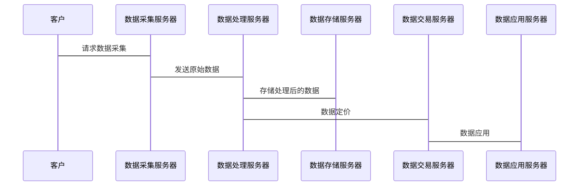

                 


# 如何识别企业的数据货币化潜力

> 关键词：数据货币化，企业数据价值，数据资产，数据交易，数据隐私，数据合规

> 摘要：本文详细探讨了如何识别企业的数据货币化潜力，从数据作为核心资产的重要性出发，分析数据货币化的定义、原理、应用场景以及实现路径。通过算法原理、数学模型、系统架构设计和项目实战，为读者提供一套系统的方法论，帮助企业有效识别和挖掘数据的潜在价值。

---

## 第一部分: 数据货币化潜力的背景与概念

### 第1章: 数据货币化潜力的背景介绍

#### 1.1 数据货币化的核心概念
- **数据作为企业核心资产的演进**  
  数据在数字经济时代已经成为企业最重要的资产之一。从传统的物理资产到数字资产，数据的价值逐渐凸显，尤其是在人工智能和大数据技术的推动下，数据的价值被重新定义。

- **数据货币化的定义与内涵**  
  数据货币化是指将数据转化为可量化的价值，并通过交易、产品化或其他方式实现商业价值的过程。数据货币化不仅仅是技术问题，更涉及到商业模式、法律合规和伦理道德等多个方面。

- **数据货币化的边界与外延**  
  数据货币化的边界包括数据的采集、存储、分析、交易和应用等环节。外延则涉及数据的隐私保护、数据安全、数据治理以及数据生态的构建。

- **数据货币化与企业价值的关系**  
  数据货币化能够为企业创造新的收入来源，提升企业的竞争力。通过数据货币化，企业可以更好地理解客户需求，优化运营效率，并开发新的产品和服务。

#### 1.2 数据货币化的核心要素
- **数据质量与价值的关系**  
  数据质量是数据价值的基础。高质量的数据能够更准确地反映业务场景，从而产生更高的商业价值。

- **数据的可操作性与可变现性**  
  数据的可操作性是指数据能够被分析和处理的能力，而可变现性则是指数据能够通过某种方式转化为经济收益的能力。

- **数据的隐私与合规性挑战**  
  数据货币化过程中，隐私保护和合规性是必须考虑的重要因素。企业需要确保数据的使用符合相关法律法规，并保护用户的隐私权益。

#### 1.3 数据货币化的应用场景
- **金融行业的数据货币化**  
  在金融行业，数据货币化主要体现在信用评分、风险管理、投资决策等领域。例如，银行可以通过分析客户的交易数据来评估信用风险。

- **零售行业的数据货币化**  
  零售企业可以通过分析消费者的购买行为数据，优化库存管理、个性化推荐和精准营销，从而提升销售额和客户满意度。

- **制造业的数据货币化**  
  制造业可以通过物联网技术收集生产设备的数据，分析生产效率、预测设备故障，从而降低生产成本并提高生产效率。

### 1.4 本章小结
本章从数据货币化的背景出发，详细介绍了数据货币化的核心概念、核心要素以及应用场景。通过这些内容，读者可以理解数据货币化的重要性和其对企业价值的提升作用。

---

### 第2章: 数据货币化的核心概念与联系

#### 2.1 数据货币化的原理
- **数据价值的评估模型**  
  数据价值的评估模型包括数据的质量、相关性、稀缺性和可扩展性等多个维度。企业需要根据自身的业务需求和数据特点，选择合适的评估模型。

- **数据的生命周期与货币化阶段**  
  数据的生命周期包括数据的产生、存储、分析、应用和消亡。在数据生命周期的不同阶段，数据的货币化方式也有所不同。

- **数据的供需关系与市场价值**  
  数据的供需关系直接影响其市场价值。供不应求的数据通常具有更高的市场价值，而供过于求的数据则可能难以实现货币化。

#### 2.2 数据货币化的属性特征对比
| 数据属性         | 特征描述                                                                 |
|------------------|--------------------------------------------------------------------------|
| 数据的可量化性    | 数据能够被量化为具体的数值或指标。                                         |
| 数据的可操作性    | 数据能够被处理和分析，产生有用的信息。                                     |
| 数据的可扩展性    | 数据能够被广泛应用到不同的场景和业务中。                                   |
| 数据的隐私性      | 数据涉及个人隐私或敏感信息，需要严格保护。                                 |
| 数据的合规性      | 数据的使用需要符合相关法律法规和行业规范。                                 |

#### 2.3 数据货币化的ER实体关系图
```mermaid
er
    entity Customer {
        id: int
        name: string
        email: string
    }

    entity DataAsset {
        id: int
        name: string
        description: string
        owner: Customer
    }

    entity Transaction {
        id: int
        buyer: Customer
        seller: Customer
        data_asset: DataAsset
        price: float
        timestamp: datetime
    }

    entity ValueChain {
        id: int
        name: string
        participants: [Customer]
        data_assets: [DataAsset]
    }

    entity Role {
        id: int
        name: string
        permissions: [Permission]
    }

    entity Permission {
        id: int
        role: Role
        action: string
        resource: string
    }
```

#### 2.4 本章小结
本章从数据货币化的核心概念出发，分析了数据的价值评估模型、生命周期、供需关系以及属性特征。通过ER实体关系图，展示了数据货币化过程中各实体之间的关系，为后续的系统设计奠定了基础。

---

## 第二部分: 数据货币化潜力的算法原理

### 第3章: 数据货币化潜力的算法原理

#### 3.1 数据价值评估的算法原理
- **数据质量评估算法**  
  数据质量评估算法包括数据的完整性、一致性、准确性等指标的评估。例如，可以使用统计方法来检测数据中的缺失值、重复值和异常值。

- **数据相关性分析算法**  
  数据相关性分析算法用于衡量不同数据之间的关联程度。常用的算法包括皮尔逊相关系数、斯皮尔曼相关系数和 Kendall 相关系数。

- **数据潜在价值预测算法**  
  数据潜在价值预测算法通过分析历史数据，预测未来数据的潜在价值。常用的算法包括线性回归、决策树和随机森林等。

#### 3.2 数据货币化潜力的数学模型
- **数据价值的线性回归模型**  
  线性回归模型用于预测数据的潜在价值。模型的公式如下：
  $$E(value) = \alpha \times quality + \beta \times relevance + \gamma \times quantity$$

  其中，$\alpha$、$\beta$ 和 $\gamma$ 是模型的系数，$quality$ 是数据质量，$relevance$ 是数据的相关性，$quantity$ 是数据的数量。

- **数据交易的定价模型**  
  数据交易的定价模型用于确定数据的交易价格。模型的公式如下：
  $$Pr

---

### 第4章: 数据货币化潜力的系统分析与架构设计

#### 4.1 数据货币化系统的功能设计
- **数据采集模块**  
  数据采集模块负责从各种数据源采集数据，包括结构化数据和非结构化数据。

- **数据分析模块**  
  数据分析模块对采集到的数据进行清洗、转换和分析，提取有用的信息。

- **数据存储模块**  
  数据存储模块负责将处理后的数据存储到数据库或其他存储系统中。

- **数据交易模块**  
  数据交易模块负责数据的定价、交易和结算。

- **数据应用模块**  
  数据应用模块将数据应用于具体的业务场景，例如精准营销、风险控制等。

#### 4.2 数据货币化系统的架构设计


#### 4.3 数据货币化系统的接口设计
- **数据采集接口**  
  数据采集接口用于与各种数据源对接，例如API接口或文件接口。

- **数据存储接口**  
  数据存储接口用于将数据存储到数据库或其他存储系统中。

- **数据交易接口**  
  数据交易接口用于数据的定价、交易和结算。

#### 4.4 数据货币化系统的交互设计


#### 4.5 本章小结
本章从系统架构的角度，详细介绍了数据货币化系统的功能设计、架构设计、接口设计和交互设计。通过这些设计，企业可以更好地管理和应用数据，实现数据的货币化。

---

## 第三部分: 数据货币化潜力的项目实战

### 第5章: 数据货币化潜力的项目实战

#### 5.1 项目背景与目标
- **项目背景**  
  本项目旨在通过数据分析和数据交易，帮助企业识别数据的货币化潜力。

- **项目目标**  
  - 数据采集与清洗
  - 数据分析与建模
  - 数据交易与应用

#### 5.2 环境安装与配置
- **安装Python环境**  
  使用Anaconda安装Python 3.8或更高版本。

- **安装必要的库**  
  ```bash
  pip install numpy pandas scikit-learn matplotlib
  ```

#### 5.3 项目核心实现
- **数据采集与清洗**  
  ```python
  import pandas as pd

  # 数据采集
  df = pd.read_csv('data.csv')

  # 数据清洗
  df.dropna(inplace=True)
  ```

- **数据分析与建模**  
  ```python
  from sklearn.linear_model import LinearRegression

  model = LinearRegression()
  model.fit(X, y)
  ```

- **数据交易与应用**  
  ```python
  # 数据定价
  def calculate_price(quality, relevance, quantity):
      return quality * 10 + relevance * 5 + quantity * 2

  # 数据交易
  price = calculate_price(0.9, 0.8, 1000)
  ```

#### 5.4 案例分析与结果解读
- **案例分析**  
  以某零售企业为例，通过分析客户的购买行为数据，预测客户未来可能的购买行为，并将数据应用于精准营销。

- **结果解读**  
  数据分析结果表明，客户A的购买概率为80%，因此企业可以针对客户A进行精准营销，提升销售额。

#### 5.5 项目总结
- **项目总结**  
  通过本项目，读者可以掌握数据采集、分析和交易的基本方法，为后续的数据货币化实践打下基础。

---

## 第四部分: 数据货币化潜力的总结与展望

### 第6章: 数据货币化的总结与展望

#### 6.1 本章总结
- **总结**  
  本文从数据货币化的背景、核心概念、算法原理、系统架构和项目实战等多个方面，详细介绍了如何识别企业的数据货币化潜力。通过理论与实践相结合，为读者提供了一套系统的方法论。

#### 6.2 未来展望
- **数据隐私与合规性**  
  随着数据隐私保护的加强，数据货币化需要更加注重数据的隐私保护和合规性。

- **数据的可扩展性与应用**  
  未来，随着技术的发展，数据的可扩展性和应用范围将进一步扩大。

- **人工智能在数据货币化中的作用**  
  人工智能技术将为数据货币化提供更多的可能性，例如智能定价、智能交易和智能应用等。

---

## 作者：AI天才研究院/AI Genius Institute & 禅与计算机程序设计艺术/Zen And The Art of Computer Programming

---

通过以上内容，读者可以全面了解如何识别企业的数据货币化潜力，并掌握相关的理论和实践方法。

