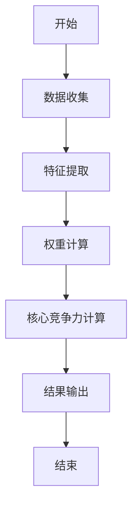
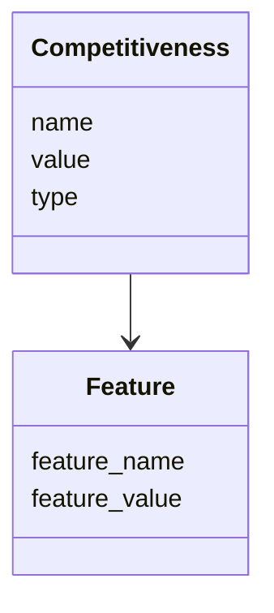

                 


# 如何识别企业的核心竞争力

## 关键词：
- 核心竞争力
- 企业识别
- 战略规划
- 数字化转型
- 企业架构

## 摘要：
识别企业的核心竞争力是企业在竞争激烈的市场中生存和发展的关键。本文通过系统的方法，从理论分析到实际应用，详细探讨了如何有效识别和构建企业的核心竞争力。内容涵盖核心竞争力的定义、分析方法、系统架构设计以及项目实战等，旨在为企业提供全面的指导和实用的工具。

---

## 第1章：核心竞争力的背景与问题背景

### 1.1 核心竞争力的定义与概念

#### 1.1.1 核心竞争力的定义
核心竞争力是企业在市场中能够持续提供独特价值的能力，通常表现为技术、资源、流程或品牌等方面的优势。

#### 1.1.2 核心竞争力的背景与问题背景
在当前全球化和信息化的背景下，企业面临着来自国内外的竞争压力。识别核心竞争力可以帮助企业在激烈的市场竞争中找到立足点。

#### 1.1.3 核心竞争力的重要性与价值
核心竞争力直接关系到企业的生存与发展。它不仅决定了企业的市场地位，还影响着企业的盈利能力和长期发展潜力。

### 1.2 核心竞争力的界定与外延

#### 1.2.1 核心竞争力的界定
核心竞争力是企业内部的能力，通常包括技术、管理、人才等方面。它不仅包括产品的技术含量，还包括企业的组织结构和文化。

#### 1.2.2 核心竞争力的外延
核心竞争力的外延包括企业的外部资源和合作伙伴的能力。例如，供应链管理能力和客户关系管理能力也是核心竞争力的重要组成部分。

#### 1.2.3 核心竞争力与企业其他能力的关系
核心竞争力与其他能力（如运营能力、创新能力）相互作用，共同构成了企业的整体竞争优势。

---

## 第2章：核心竞争力的核心概念与联系

### 2.1 核心竞争力的原理

#### 2.1.1 核心竞争力的形成机制
核心竞争力的形成是一个复杂的过程，涉及企业内外部因素的综合作用。通常包括资源积累、技术创新、管理优化等环节。

#### 2.1.2 核心竞争力的驱动因素
驱动核心竞争力的因素包括市场需求、技术进步、政策环境等。企业需要根据外部环境的变化不断调整自身能力。

#### 2.1.3 核心竞争力的动态变化
核心竞争力不是一成不变的，它会随着市场环境和技术进步而不断变化。企业需要持续投入资源来维持和提升核心竞争力。

### 2.2 核心竞争力的特征与属性

#### 2.2.1 核心竞争力的特征对比表格
| 特征 | 描述 |
|------|------|
| 独特性 | 竞争对手难以模仿的能力 |
| 价值性 | 能够为顾客创造价值 |
| 可持续性 | 能够长期保持竞争优势 |

#### 2.2.2 核心竞争力的属性分析
核心竞争力的属性包括创新性、稀缺性、不可替代性和扩展性。这些属性共同决定了企业在市场中的竞争力。

### 2.3 核心竞争力的ER实体关系图

```mermaid
er
actor Competitiveness
    name
    value
    type
end

actor Competitiveness {
    name --> Competitiveness
    value --> Competitiveness
    type --> Competitiveness
}
```

---

## 第3章：核心竞争力的算法原理

### 3.1 核心竞争力识别的算法原理

#### 3.1.1 算法原理概述
核心竞争力识别算法基于企业内外部数据的分析，通过特征提取和权重计算，最终确定企业的核心竞争力。

#### 3.1.2 算法的数学模型与公式
核心竞争力识别的数学模型如下：

$$ C = \sum_{i=1}^{n} w_i x_i $$

其中，$C$ 表示核心竞争力，$w_i$ 表示第i个特征的权重，$x_i$ 表示第i个特征的值。

#### 3.1.3 算法的流程图



### 3.2 核心竞争力识别的代码实现

#### 3.2.1 环境安装与配置
需要安装Python和相关的数据处理库，如Pandas和NumPy。

#### 3.2.2 核心代码实现

```python
import pandas as pd
import numpy as np

def calculate_core_competitiveness(data, weights):
    return np.dot(data, weights)

data = pd.DataFrame({
    'feature1': [1, 2, 3],
    'feature2': [4, 5, 6]
})

weights = np.array([0.5, 0.5])

result = calculate_core_competitiveness(data, weights)
print(result)
```

#### 3.2.3 代码应用解读与分析
上述代码通过线性组合的方法计算核心竞争力，权重和数据特征共同决定了最终结果。企业可以根据实际需求调整权重和特征选择。

---

## 第4章：核心竞争力的系统分析与架构设计

### 4.1 核心竞争力识别的系统功能设计

#### 4.1.1 领域模型



### 4.2 核心竞争力识别的系统架构设计

#### 4.2.1 系统架构图

```mermaid
client --> server: 请求
server --> database: 查询数据
database --> server: 返回数据
server --> client: 返回结果
```

### 4.3 核心竞争力识别的系统接口设计

#### 4.3.1 接口设计说明
系统提供RESTful API接口，支持GET和POST请求，用于数据查询和结果返回。

---

## 第5章：核心竞争力的项目实战

### 5.1 项目环境安装与配置

#### 5.1.1 环境安装
安装必要的开发工具和库，如Python、Pandas、NumPy等。

### 5.2 核心代码实现

#### 5.2.1 核心代码

```python
import pandas as pd
import numpy as np

def identify_core_competitiveness(data, weights):
    return np.dot(data, weights)

data = pd.DataFrame({
    'feature1': [1, 2, 3],
    'feature2': [4, 5, 6]
})

weights = np.array([0.5, 0.5])

result = identify_core_competitiveness(data, weights)
print(result)
```

### 5.3 项目实战案例分析

#### 5.3.1 案例分析
以某制造企业为例，通过数据分析识别其核心竞争力，包括生产效率、技术创新能力等。

---

## 第6章：核心竞争力的最佳实践

### 6.1 项目小结与总结
通过系统的分析和实践，企业可以有效识别和提升核心竞争力，从而在市场竞争中占据优势。

### 6.2 注意事项与建议
企业应根据自身特点选择合适的方法，同时注重持续优化和创新能力的提升。

### 6.3 拓展阅读与资源推荐
推荐阅读《竞争优势》等书籍，深入理解核心竞争力的理论与实践。

---

## 作者：AI天才研究院 & 禅与计算机程序设计艺术

---

这篇文章系统地介绍了如何识别企业的核心竞争力，从理论分析到实际应用，为企业的战略规划和数字化转型提供了有力的指导和实践工具。

