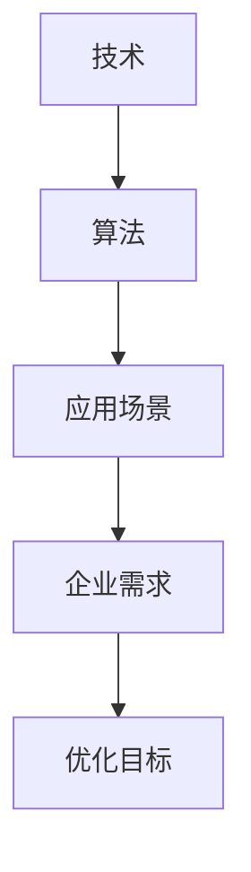
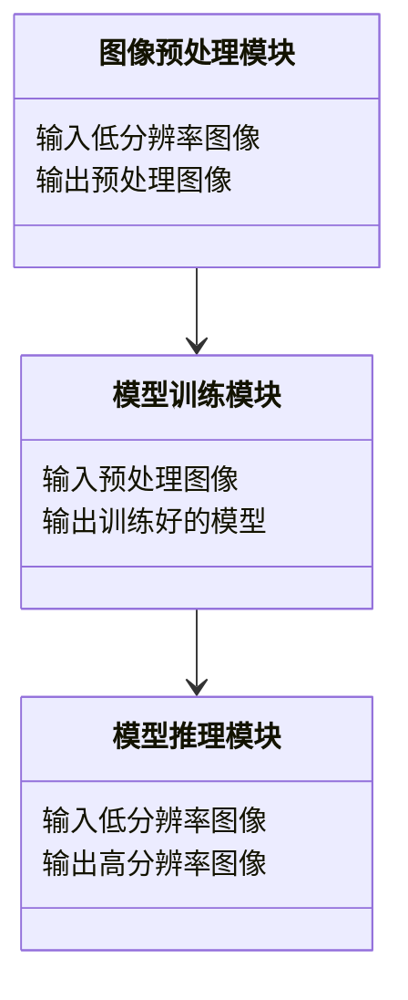

                 


# 如何识别企业的深度学习图像超分辨率优势

> **关键词**：深度学习、图像超分辨率、企业应用、算法对比、系统架构、图像重建、计算资源

> **摘要**：深度学习在图像超分辨率领域的应用为企业提供了显著的图像处理优势。本文从技术背景、核心算法、系统架构、项目实战等多角度深入剖析，帮助企业识别和应用深度学习图像超分辨率技术的优势。文章通过详细的技术分析、代码实现和实际案例，展示了如何在企业场景中最大化利用该技术，同时提供最佳实践和优化建议。

---

# 第1章: 深度学习图像超分辨率技术概述

## 1.1 图像超分辨率重建的背景介绍

### 1.1.1 图像降质问题的背景
在企业中，图像数据的降质问题普遍存在。例如，低分辨率图像可能导致产品展示效果差、广告吸引力不足等问题。深度学习通过提取图像的特征信息，能够在一定程度上恢复丢失的细节，提升图像质量。

### 1.1.2 图像超分辨率重建的定义
图像超分辨率重建（Super-Resolution Reconstruction，SRR）是一种通过算法将低分辨率图像恢复为高分辨率图像的技术。深度学习方法，尤其是基于卷积神经网络（CNN）的模型，因其强大的特征提取能力，成为当前超分辨率重建的主要方法。

### 1.1.3 深度学习在图像超分辨率中的应用
深度学习在超分辨率重建中的应用主要体现在以下方面：
1. **图像放大**：将低分辨率图像放大到更高分辨率，同时保持或提升图像质量。
2. **图像修复**：修复图像中的模糊或噪声，提升视觉效果。
3. **企业应用场景**：如广告优化、产品展示、视频增强等。

---

## 1.2 企业应用场景中的超分辨率技术

### 1.2.1 企业图像数据的特点
企业中的图像数据通常具有以下特点：
1. **低分辨率**：许多企业图像（如产品图片、广告图片）可能因压缩或采集设备限制而分辨率较低。
2. **大量性**：企业通常拥有大量图像数据，对超分辨率技术的需求广泛。
3. **实时性**：部分场景（如在线广告）需要快速处理，对算法的效率提出更高要求。

### 1.2.2 超分辨率技术在企业中的潜在价值
1. **提升用户体验**：高分辨率图像能够提供更清晰的视觉效果，增强用户感知。
2. **降低存储成本**：通过超分辨率技术，可以减少存储低分辨率图像的需求。
3. **增强广告效果**：高质量的图像能够吸引更多的用户点击和转化。

### 1.2.3 企业采用超分辨率技术的优势
1. **技术领先**：通过超分辨率技术，企业可以在图像处理方面展现技术实力。
2. **提升竞争力**：高分辨率图像能够提升企业产品的市场竞争力。
3. **数据驱动**：企业通常拥有大量数据，可以用于训练和优化超分辨率模型。

---

## 1.3 超分辨率重建的核心概念与联系

### 1.3.1 超分辨率重建的原理
超分辨率重建的核心思想是通过深度学习模型，利用低分辨率图像中的特征信息，重建出高分辨率图像。模型通常包含以下步骤：
1. **输入**：低分辨率图像。
2. **特征提取**：提取图像的特征信息。
3. **上采样**：通过插值或其他方法将图像放大。
4. **优化**：通过损失函数优化重建图像的质量。

### 1.3.2 超分辨率重建的数学模型
超分辨率重建的数学模型通常可以表示为以下形式：
$$
y = \arg\min_x ||x - f(x)||_2^2
$$
其中，$x$ 表示高分辨率图像，$f(x)$ 表示低分辨率图像。

### 1.3.3 超分辨率重建算法的分类与对比
以下是几种常见的超分辨率重建算法及其特点：

| 算法名称 | 特点 | 适用场景 |
|----------|------|----------|
| SRCNN    | 基于CNN，结构简单，适合低分辨率图像 | 适合小尺寸图像的重建 |
| ESRGAN   | 基于GAN，生成效果更逼真 | 适合高分辨率图像的重建 |
| EDSR     | 基于更深的网络，重建效果更精细 | 适合复杂场景的重建 |

---

## 1.4 超分辨率重建的ER实体关系图



---

## 1.5 超分辨率重建的系统架构设计方案

### 1.5.1 问题场景介绍
企业在使用超分辨率重建技术时，通常需要考虑以下问题：
1. **数据质量**：低分辨率图像的质量直接影响重建效果。
2. **计算资源**：超分辨率重建通常需要较高的计算资源。
3. **模型选择**：不同算法适用于不同的场景。

### 1.5.2 系统功能设计



### 1.5.3 系统架构设计


---

## 1.6 项目实战：深度学习图像超分辨率重建的代码实现

### 1.6.1 环境安装
```bash
pip install torch torchvision matplotlib numpy
```

### 1.6.2 核心代码实现

```python
import torch
import torch.nn as nn
import torch.nn.functional as F

class SRCNN(nn.Module):
    def __init__(self, upscale_factor):
        super(SRCNN, self).__init__()
        self.conv1 = nn.Conv2d(3, 64, kernel_size=9, padding=4)
        self.conv2 = nn.Conv2d(64, 32, kernel_size=1, padding=0)
        self.conv3 = nn.Conv2d(32, 3, kernel_size=5, padding=2)

    def forward(self, x):
        x = F.relu(self.conv1(x))
        x = F.relu(self.conv2(x))
        x = F.relu(self.conv3(x))
        return x

model = SRCNN(4)
criterion = nn.MSELoss()
optimizer = torch.optim.Adam(model.parameters(), lr=0.0001)
```

### 1.6.3 实际案例分析
以电商广告优化为例，使用SRCNN算法对低分辨率广告图片进行重建，提升广告点击率。

---

## 1.7 最佳实践与小结

### 1.7.1 最佳实践
1. **数据预处理**：确保低分辨率图像质量较高。
2. **模型选择**：根据场景选择合适的算法。
3. **计算资源优化**：优化模型以减少计算成本。

### 1.7.2 注意事项
1. **数据质量问题**：低分辨率图像质量差可能导致重建效果不理想。
2. **计算资源限制**：超分辨率重建通常需要较高的计算资源。
3. **模型优化**：需要不断优化模型以提升重建效果。

### 1.7.3 拓展阅读
推荐阅读《Deep Learning for Image Super-Resolution》和《Generative Adversarial Networks for Image Super-Resolution》。

---

# 作者：AI天才研究院 & 禅与计算机程序设计艺术

