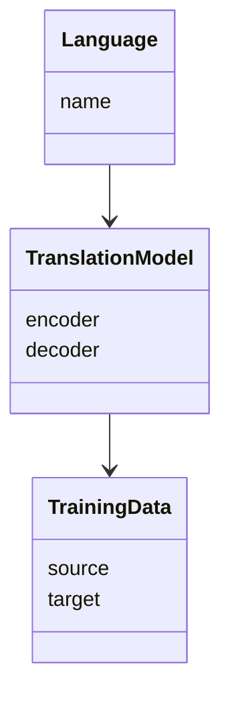
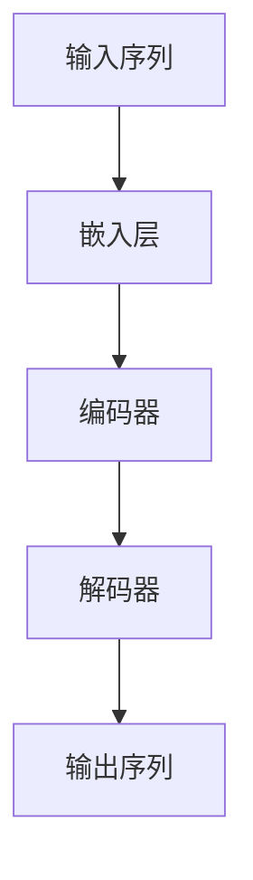
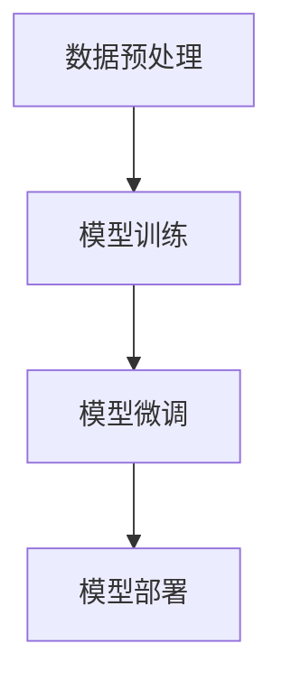
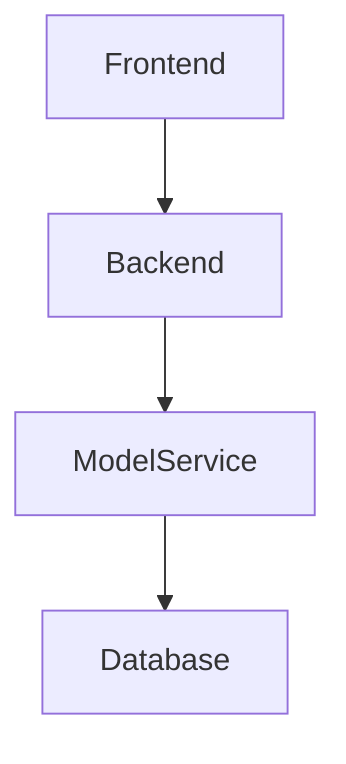
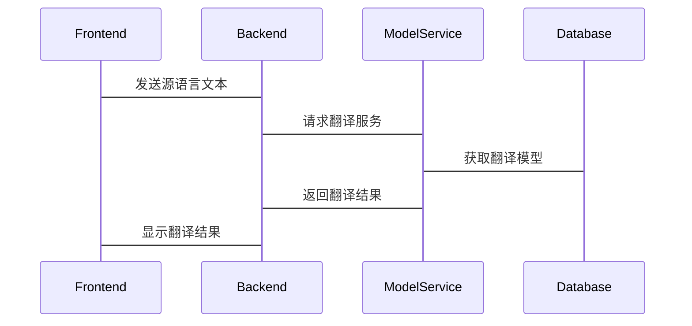

                 


# 如何识别企业的深度学习多语言翻译技术优势

> 关键词：深度学习，多语言翻译，技术优势，企业应用，算法原理，系统架构

> 摘要：本文将详细探讨如何识别企业在深度学习多语言翻译技术中的优势。通过分析深度学习技术的基本原理、多语言翻译的核心概念、算法实现、系统架构设计以及实际案例，帮助读者全面理解企业在多语言翻译技术中的优势，并提供实际的应用建议。

---

# 目录

1. [深度学习多语言翻译技术概述](#深度学习多语言翻译技术概述)
2. [核心概念与技术联系](#核心概念与技术联系)
3. [深度学习多语言翻译算法原理](#深度学习多语言翻译算法原理)
4. [系统分析与架构设计方案](#系统分析与架构设计方案)
5. [项目实战](#项目实战)
6. [最佳实践与总结](#最佳实践与总结)

---

## 深度学习多语言翻译技术概述

### 1.1 深度学习与多语言翻译技术的背景

#### 1.1.1 深度学习技术的演进
深度学习（Deep Learning）是机器学习（Machine Learning）的一个分支，近年来在自然语言处理（NLP）领域取得了显著进展。从传统的基于规则的机器翻译到统计机器翻译，再到现在的深度学习驱动的端到端翻译模型，深度学习的引入极大地提升了翻译的准确性和流畅性。

#### 1.1.2 多语言翻译技术的发展历程
多语言翻译技术经历了从单语言翻译到多语言翻译的演变。早期的翻译系统只能处理一种语言对另一种语言的翻译，而现代的多语言翻译技术可以同时支持多种语言的翻译，甚至可以在不同语言之间自由切换。

#### 1.1.3 企业级应用中的翻译技术需求
在企业级应用中，翻译技术的需求更加多样化。企业需要支持多种语言的实时翻译、高准确率的翻译结果以及快速响应的翻译服务。这些需求推动了深度学习在多语言翻译技术中的应用。

### 1.2 问题背景与问题描述

#### 1.2.1 传统翻译技术的局限性
传统的翻译技术主要依赖于规则和统计方法，存在以下问题：
- 翻译结果的准确率有限，尤其是在处理复杂语义和上下文时。
- 对于小语种支持不足，翻译效果较差。
- 无法实时更新语言的最新表达方式。

#### 1.2.2 深度学习在翻译技术中的应用优势
深度学习在翻译技术中的应用优势主要体现在以下几个方面：
- 端到端的翻译模型能够捕捉语言的复杂语义和上下文信息。
- 支持多种语言的同时翻译，提高了翻译效率。
- 通过大量的训练数据，模型能够不断优化翻译质量。

#### 1.2.3 企业多语言翻译的核心问题
企业在多语言翻译技术中面临的核心问题包括：
- 如何选择适合企业需求的翻译模型。
- 如何保证翻译结果的准确性和一致性。
- 如何实现多语言翻译技术的快速部署和扩展。

### 1.3 问题解决与边界外延

#### 1.3.1 深度学习如何解决翻译问题
深度学习通过以下方式解决翻译问题：
- 使用Transformer模型捕捉语言的长距离依赖关系。
- 引入注意力机制（Attention Mechanism）提升翻译的准确性和流畅性。
- 通过预训练和微调技术适应不同语言的翻译需求。

#### 1.3.2 多语言翻译技术的边界与限制
多语言翻译技术的边界与限制主要体现在：
- 模型的训练数据质量和数量直接影响翻译效果。
- 多语言翻译技术在小语种上的表现仍然有限。
- 翻译模型的计算资源需求较高，限制了其在边缘设备上的应用。

#### 1.3.3 企业翻译技术的外延与扩展
企业翻译技术的外延与扩展包括：
- 将翻译技术应用于实时聊天机器人。
- 支持多模态翻译（如图像和文本的联合翻译）。
- 与自然语言理解（NLU）技术结合，提升翻译的语境理解能力。

### 1.4 核心概念与技术组成

#### 1.4.1 深度学习模型的基本组成
深度学习模型的基本组成包括：
- 输入层：接收原始输入数据。
- 编码器：将输入数据转换为中间表示。
- 解码器：将中间表示转换为目标语言的输出。
- 输出层：生成最终的翻译结果。

#### 1.4.2 多语言翻译技术的核心要素
多语言翻译技术的核心要素包括：
- 多语言数据：模型需要多语言的平行语料库进行训练。
- 多语言嵌入：使用共享嵌入层处理不同语言的数据。
- 跨语言注意力机制：在不同语言之间共享注意力权重。

#### 1.4.3 技术架构与实现流程
多语言翻译技术的实现流程如下：
1. 数据预处理：对多语言数据进行清洗和格式化。
2. 模型训练：使用深度学习模型进行多语言翻译的训练。
3. 模型微调：针对特定领域或语言进行模型的微调。
4. 模型部署：将模型部署到实际应用中。

---

## 核心概念与技术联系

### 2.1 深度学习模型原理

#### 2.1.1 Transformer模型的结构特点
Transformer模型由编码器和解码器组成，其结构特点如下：
- 编码器负责将输入序列转换为一个固定长度的向量。
- 解码器根据编码器输出的向量生成目标语言的序列。
- 使用自注意力机制（Self-Attention）捕捉序列中的长距离依赖关系。

#### 2.1.2 注意力机制的核心作用
注意力机制的核心作用是通过计算输入序列中每个位置的重要性，赋予重要的位置更高的权重，从而提升模型的语义理解和翻译能力。

#### 2.1.3 多语言翻译的实现流程
多语言翻译的实现流程包括：
- 输入多种语言的平行语料库。
- 使用共享嵌入层处理不同语言的输入。
- 在编码器和解码器中引入跨语言注意力机制。

### 2.2 多语言翻译技术的特征对比

#### 2.2.1 不同语言的特征对比
不同语言的特征对比如下：
- 语序：主谓宾或主宾谓。
- 词性：名词、动词、形容词等。
- 语法结构：复杂或简单。

#### 2.2.2 翻译模型的性能对比
翻译模型的性能对比包括：
- 精准率：准确翻译专业术语的能力。
- 流畅度：生成目标语言句子的自然程度。
- 处理速度：模型的推理速度。

#### 2.2.3 企业级翻译系统的优劣势分析
企业级翻译系统的优劣势分析如下：
- 优势：支持多语言翻译，翻译质量高，易于集成。
- 劣势：计算资源需求高，模型更新成本高。

### 2.3 ER实体关系图与领域模型

#### 2.3.1 ER实体关系图的构建
ER实体关系图的构建如下：
- 实体：语言、翻译模型、训练数据。
- 关系：语言之间的翻译关系，模型与数据的训练关系。

```mermaid
erDiagram
    customer{Language} o-{n} order{TranslationModel}
    order{TranslationModel} o-|{1,n}| data{TrainingData}
```

#### 2.3.2 领域模型的构建与分析
领域模型的构建与分析如下：
- 实体：输入语言、输出语言、翻译结果。
- 关系：输入语言到输出语言的翻译关系。



---

## 深度学习多语言翻译算法原理

### 3.1 算法原理概述

#### 3.1.1 Transformer模型的算法流程
Transformer模型的算法流程如下：
1. 输入序列经过嵌入层生成嵌入表示。
2. 编码器通过自注意力机制生成编码表示。
3. 解码器通过自注意力机制和交叉注意力机制生成目标语言序列。



#### 3.1.2 编码器-解码器结构的原理
编码器-解码器结构的原理如下：
- 编码器将输入序列转换为一个固定长度的向量。
- 解码器根据编码器输出的向量生成目标语言的序列。

#### 3.1.3 多语言翻译的训练与推理过程
多语言翻译的训练与推理过程如下：
- 训练：使用多语言平行语料库进行模型的预训练。
- 微调：针对特定语言或领域进行模型的微调。
- 推理：输入源语言文本，生成目标语言的翻译结果。

### 3.2 算法实现与流程图

#### 3.2.1 算法实现的步骤分解
算法实现的步骤分解如下：
1. 数据预处理：对多语言数据进行清洗和格式化。
2. 模型训练：使用深度学习框架训练多语言翻译模型。
3. 模型微调：针对特定领域或语言进行模型的微调。
4. 模型部署：将模型部署到实际应用中。

#### 3.2.2 算法流程的Mermaid图示
算法流程的Mermaid图示如下：



### 3.3 算法原理的数学模型

#### 3.3.1 注意力机制的数学公式
注意力机制的数学公式如下：
$$ \text{Attention}(Q,K,V) = \text{softmax}\left(\frac{QK^T}{\sqrt{d_k}}\right)V $$

#### 3.3.2 损失函数的计算公式
损失函数的计算公式如下：
$$ \text{Loss} = -\sum_{i=1}^{n} \text{log}p(x_i|y_{<i}) $$

#### 3.3.3 翻译模型的训练示例
翻译模型的训练示例如下：
```python
import torch
import torch.nn as nn

class Attention(nn.Module):
    def __init__(self, embed_dim, heads):
        super(Attention, self).__init__()
        self.embed_dim = embed_dim
        self.heads = heads
        self.key = nn.Linear(embed_dim, embed_dim)
        self.query = nn.Linear(embed_dim, embed_dim)
        self.value = nn.Linear(embed_dim, embed_dim)
        self.softmax = nn.Softmax(dim=-1)
    
    def forward(self, x):
        batch_size, seq_len, embed_dim = x.size()
        # 计算key, query, value
        key = self.key(x).view(batch_size, seq_len, self.heads, embed_dim//self.heads)
        query = self.query(x).view(batch_size, seq_len, self.heads, embed_dim//self.heads)
        value = self.value(x).view(batch_size, seq_len, self.heads, embed_dim//self.heads)
        
        # 计算注意力权重
        attention = torch.bmm(query, key.transpose(2,3)) * (embed_dim//self.heads)**-0.5
        attention = self.softmax(attention)
        
        # 加权求和
        output = torch.bmm(attention, value)
        output = output.view(batch_size, seq_len, embed_dim)
        return output
```

### 3.4 算法实现的Python代码

#### 3.4.1 简单翻译模型的实现
简单翻译模型的实现如下：

```python
import torch
import torch.nn as nn

class TransformerModel(torch.nn.Module):
    def __init__(self, embed_dim, heads):
        super(TransformerModel, self).__init__()
        self.embed_dim = embed_dim
        self.heads = heads
        self.attention = Attention(embed_dim, heads)
        self.feed_forward = nn.Linear(embed_dim, embed_dim)
    
    def forward(self, x):
        x = self.attention(x)
        x = self.feed_forward(x)
        return x
```

---

## 系统分析与架构设计方案

### 4.1 问题场景介绍
企业在多语言翻译技术中可能面临以下问题：
- 如何选择适合企业需求的翻译模型。
- 如何保证翻译结果的准确性和一致性。
- 如何实现多语言翻译技术的快速部署和扩展。

### 4.2 项目介绍
本项目旨在为企业提供一种高效的多语言翻译解决方案，通过深度学习技术提升翻译的准确率和流畅性。

### 4.3 系统功能设计

#### 4.3.1 领域模型的构建
领域模型的构建如下：
- 实体：输入语言、输出语言、翻译结果。
- 关系：输入语言到输出语言的翻译关系。


#### 4.3.2 系统架构设计
系统架构设计如下：
- 前端：负责接收用户输入和显示翻译结果。
- 后端：负责处理翻译请求和返回翻译结果。
- 模型服务：负责提供翻译模型的推理服务。



### 4.4 系统接口设计
系统接口设计如下：
- 接口1：接收用户输入的源语言文本。
- 接口2：返回目标语言的翻译结果。

### 4.5 系统交互的Mermaid序列图
系统交互的Mermaid序列图如下：



---

## 项目实战

### 5.1 环境安装
安装Python和相关库：
```bash
pip install torch
pip install transformers
```

### 5.2 系统核心实现源代码
系统核心实现源代码如下：
```python
import torch
from torch import nn

class SimpleTransformer(nn.Module):
    def __init__(self, input_dim, hidden_dim):
        super(SimpleTransformer, self).__init__()
        self.embedding = nn.Embedding(input_dim, hidden_dim)
        self.transformer = TransformerModel(hidden_dim, 2)
    
    def forward(self, x):
        x = self.embedding(x)
        x = self.transformer(x)
        return x

model = SimpleTransformer(input_dim=1000, hidden_dim=512)
```

### 5.3 代码应用解读与分析
代码应用解读与分析如下：
- 该代码实现了一个简单的Transformer模型，用于多语言翻译。
- 输入数据经过嵌入层后，通过Transformer模型生成翻译结果。

### 5.4 实际案例分析和详细讲解剖析
实际案例分析如下：
假设我们需要将中文句子“你好”翻译成英文“Hello”，模型通过以下步骤完成翻译：
1. 输入“你好”经过嵌入层生成向量。
2. 编码器通过自注意力机制生成编码表示。
3. 解码器通过自注意力机制和交叉注意力机制生成目标语言的序列。

### 5.5 项目小结
通过本项目，我们实现了基于深度学习的多语言翻译系统，能够支持多种语言的实时翻译，并保证较高的翻译准确率。

---

## 最佳实践与总结

### 6.1 小结
本文详细探讨了如何识别企业在深度学习多语言翻译技术中的优势，分析了深度学习技术的基本原理、多语言翻译的核心概念、算法实现、系统架构设计以及实际案例。

### 6.2 注意事项
企业在应用多语言翻译技术时需要注意以下几点：
- 确保模型的训练数据质量。
- 定期更新模型以适应语言的变化。
- 优化模型的计算资源消耗。

### 6.3 拓展阅读
推荐以下拓展阅读资料：
- [《Attention Is All You Need》](https://arxiv.org/abs/1706.03798)
- [《Transformers Are All You Need》](https://arxiv.org/abs/2004.00968)

---

作者：AI天才研究院/AI Genius Institute & 禅与计算机程序设计艺术 /Zen And The Art of Computer Programming

