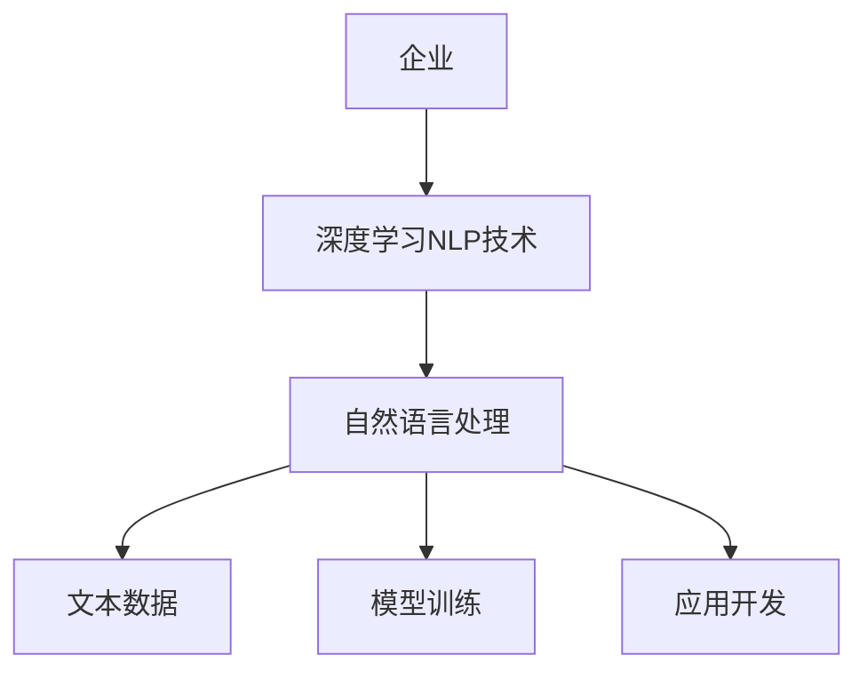
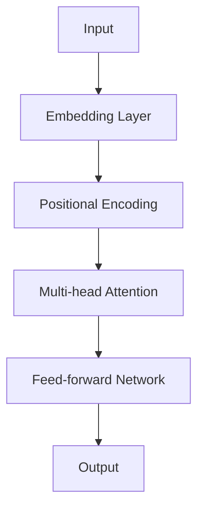
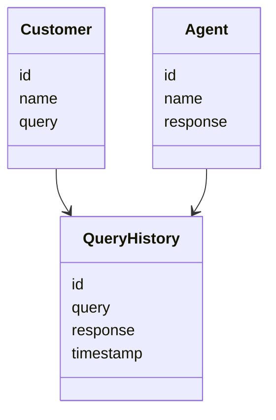
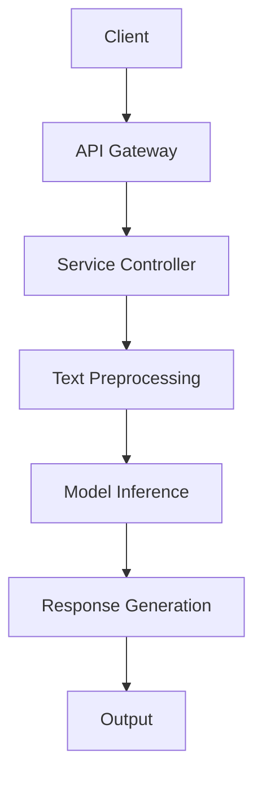
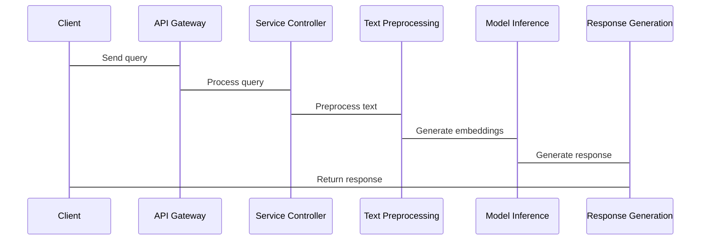

                 


# 如何识别企业的深度学习自然语言处理优势

> 关键词：深度学习，自然语言处理，企业优势，NLP模型，应用案例，技术实现，优势识别

> 摘要：本文将详细探讨如何识别企业在深度学习自然语言处理（NLP）领域的优势，从背景介绍、核心概念、算法原理、系统架构到项目实战和最佳实践，层层深入，为企业提供清晰的指导和实用的建议。

---

# 第一章：深度学习自然语言处理的背景与问题背景

## 1.1 问题背景

### 1.1.1 从传统NLP到深度学习NLP的演进

自然语言处理（NLP）是一门研究如何让计算机理解和生成人类语言的科学。传统NLP主要依赖于规则和统计方法，而深度学习的兴起为NLP带来了革命性的变化。通过深度学习，模型能够从大量数据中自动提取特征，实现更复杂的任务，如机器翻译、情感分析和问答系统。

### 1.1.2 企业级NLP应用的现状与挑战

随着深度学习技术的成熟，企业开始广泛采用NLP技术来优化业务流程。然而，企业在应用NLP时也面临诸多挑战，如数据质量、模型训练时间和成本、模型解释性等。如何在这些挑战中识别企业的优势，成为关键问题。

### 1.1.3 深度学习在NLP中的优势与不足

深度学习NLP的优势在于其强大的特征提取能力和对复杂语言模式的捕捉能力。然而，其计算成本高、需要大量标注数据以及模型解释性差等不足也需要企业在应用中加以考虑。

## 1.2 问题描述

### 1.2.1 什么是企业的深度学习NLP优势

企业的深度学习NLP优势体现在其技术能力、数据资源、应用场景和业务需求等方面。通过识别这些优势，企业可以更好地制定NLP应用策略，提升竞争力。

### 1.2.2 企业NLP应用的核心问题

企业在应用NLP时的核心问题包括数据质量、模型选择、计算资源分配和结果评估等。这些问题直接影响NLP技术的应用效果和企业的收益。

### 1.2.3 深度学习NLP在企业中的应用场景

企业中的NLP应用场景广泛，包括客户服务（如智能客服）、内容管理（如新闻分类）、市场分析（如情感分析）和内部效率提升（如文档自动化处理）等。

## 1.3 问题解决

### 1.3.1 深度学习NLP如何解决企业问题

深度学习NLP通过自动化处理、高精度分析和大规模数据处理能力，帮助企业解决传统NLP无法有效处理的复杂问题，如多语言处理和语义理解。

### 1.3.2 企业NLP应用的关键技术

关键技术包括词嵌入、序列建模、注意力机制和预训练模型等。这些技术为企业提供了强大的NLP工具，帮助其在各种场景中实现高效的应用。

### 1.3.3 深度学习NLP的优势与局限性

优势：高精度、自动化、可扩展性。局限性：计算成本高、数据依赖性强、模型解释性差。

## 1.4 边界与外延

### 1.4.1 深度学习NLP的边界

深度学习NLP的边界主要体现在数据量、计算能力和应用场景的限制。企业在应用时需要明确这些边界，以避免超出技术能力范围。

### 1.4.2 与其他技术的区分

深度学习NLP与其他技术（如传统NLP、机器学习）的区别在于其基于神经网络的特征提取能力和对复杂语言模式的捕捉能力。

### 1.4.3 企业NLP应用的外延

NLP技术的应用不仅限于文本处理，还可以扩展到语音识别、图像理解等领域，为企业提供更全面的技术支持。

## 1.5 核心概念结构与组成

### 1.5.1 深度学习NLP的核心要素

核心要素包括文本数据、模型训练、算法选择和结果评估。这些要素共同构成了深度学习NLP的应用基础。

### 1.5.2 企业NLP应用的构成

企业NLP应用由数据源、模型训练、服务部署和结果应用四部分构成。每部分都有其独特的功能和作用。

### 1.5.3 核心概念的层次化结构

层次化结构包括基础层（如词嵌入）、模型层（如序列建模）、应用层（如问答系统）和优化层（如超参数调整）。这种层次化结构帮助企业更好地理解和优化NLP应用。

---

# 第二章：深度学习自然语言处理的核心概念与联系

## 2.1 核心概念原理

### 2.1.1 深度学习NLP的基本原理

深度学习NLP基于神经网络模型，通过多层神经网络结构提取文本特征，实现对文本的语义理解和生成。

### 2.1.2 深度学习NLP的核心算法

核心算法包括卷积神经网络（CNN）、循环神经网络（RNN）和变压器（Transformer）等。每种算法都有其独特的特点和应用场景。

### 2.1.3 深度学习NLP的模型结构

模型结构包括编码器-解码器结构、注意力机制和多层感知机等。这些结构共同构成了深度学习NLP模型的核心框架。

## 2.2 核心概念属性对比

### 2.2.1 深度学习NLP与传统NLP的对比

| 对比维度 | 深度学习NLP | 传统NLP |
|----------|-------------|----------|
| 特征提取 | 自动提取复杂特征 | 手动设计特征 |
| 模型训练 | 需要大量标注数据 | 数据需求较低 |
| 性能 | 高精度 | 中等精度 |

### 2.2.2 不同模型的性能对比

| 模型类型 | 参数数量 | 训练时间 | 应用场景 |
|----------|----------|----------|----------|
| CNN      | 中等 | 较短 | 文本分类 |
| RNN      | 中等 | 较长 | 机器翻译 |
| Transformer | 高 | 较长 | 问答系统 |

### 2.2.3 不同应用场景的对比

| 应用场景 | 深度学习NLP | 传统NLP |
|----------|-------------|----------|
| 机器翻译 | 高精度 | 低精度 |
| 情感分析 | 高准确性 | 中等准确性 |
| 问答系统 | 强大语义理解能力 | 语义理解能力有限 |

## 2.3 ER实体关系图



---

# 第三章：深度学习自然语言处理的算法原理

## 3.1 算法原理概述

### 3.1.1 深度学习NLP的核心算法

深度学习NLP的核心算法包括卷积神经网络（CNN）、循环神经网络（RNN）和变压器（Transformer）。这些算法在不同的任务中表现出色。

### 3.1.2 Transformer架构

Transformer架构由编码器和解码器两部分组成。编码器负责将输入文本转换为嵌入表示，解码器则根据编码器的输出生成目标文本。

### 3.1.3 模型训练过程

模型训练过程包括数据预处理、模型构建、训练优化和模型评估。每个阶段都有其独特的步骤和技巧。

## 3.2 算法原理详细讲解

### 3.2.1 Transformer架构的实现



### 3.2.2 多头注意力机制

多头注意力机制通过并行处理多个子空间的注意力计算，提升模型的表达能力。

### 3.2.3 模型训练中的优化技巧

模型训练中常用的优化技巧包括学习率衰减、早停和模型集成等，这些技巧有助于提升模型的性能和稳定性。

---

# 第四章：深度学习自然语言处理的数学模型

## 4.1 深度学习NLP的数学基础

### 4.1.1 线性代数

线性代数是深度学习NLP的数学基础之一，包括向量、矩阵和张量的运算。

### 4.1.2 概率论

概率论在NLP中的应用主要体现在模型的不确定性建模和概率分布的计算。

## 4.2 Transformer架构的数学模型

### 4.2.1 自注意力机制

自注意力机制的计算公式如下：

$$
\text{Attention}(Q, K, V) = \text{softmax}\left(\frac{QK^T}{\sqrt{d_k}}\right)V
$$

其中，$Q$、$K$和$V$分别是查询、键和值向量，$d_k$是向量的维度。

### 4.2.2 多头注意力机制

多头注意力机制通过并行计算多个自注意力头，提升模型的表达能力。其数学表达式为：

$$
\text{Multi-head}(Q, K, V) = \text{Concat}(\text{Attention}_1(Q, K, V), \text{Attention}_2(Q, K, V), \dots, \text{Attention}_n(Q, K, V))
$$

其中，$n$是多头的数量。

## 4.3 深度学习NLP中的常见数学公式

### 4.3.1 损失函数

常见的损失函数包括交叉熵损失和均方误差损失。交叉熵损失的公式为：

$$
\text{Loss} = -\frac{1}{N}\sum_{i=1}^{N} y_i \log p_i
$$

其中，$y_i$是真实标签，$p_i$是预测概率。

### 4.3.2 梯度下降

梯度下降是模型优化的核心算法，常用的优化方法包括随机梯度下降（SGD）和Adam优化器。

---

# 第五章：深度学习自然语言处理的系统分析与架构设计

## 5.1 系统分析

### 5.1.1 问题场景介绍

深度学习NLP系统通常应用于文本分类、机器翻译和问答系统等领域。每个场景都有其独特的数据需求和技术挑战。

### 5.1.2 项目介绍

以一个智能客服系统为例，介绍项目的目标、范围和关键需求。

## 5.2 系统功能设计

### 5.2.1 领域模型



### 5.2.2 系统架构设计



## 5.3 系统架构设计

### 5.3.1 系统架构图


### 5.3.2 系统接口设计

系统接口设计包括输入接口（如文本输入）和输出接口（如JSON响应）。接口设计需要考虑数据格式、协议和安全性。

## 5.4 系统交互设计

### 5.4.1 系统交互流程



---

# 第六章：深度学习自然语言处理的项目实战

## 6.1 项目实战

### 6.1.1 环境安装

安装必要的库，如TensorFlow、Keras和Hugging Face的Transformers库。

```bash
pip install tensorflow keras transformers
```

### 6.1.2 核心代码实现

以下是一个简单的文本分类模型实现：

```python
import tensorflow as tf
from tensorflow.keras import layers
from transformers import BertTokenizer, TFBertModel

# 加载预训练模型
tokenizer = BertTokenizer.from_pretrained('bert-base-uncased')
model = TFBertModel.from_pretrained('bert-base-uncased')

# 定义模型
input_ids = tf.keras.Input(shape=(128,), dtype='int32')
input_mask = tf.keras.Input(shape=(128,), dtype='int32')
bert_layer = model(input_ids, input_mask=input_mask)[0]
bert_layer = layers.GlobalMaxPooling1D()(bert_layer)
dense_layer = layers.Dense(64, activation='relu')(bert_layer)
output = layers.Dense(2, activation='softmax')(dense_layer)

model = tf.keras.Model(inputs=[input_ids, input_mask], outputs=output)
model.compile(optimizer='adam', loss='sparse_categorical_crossentropy', metrics=['accuracy'])
```

### 6.1.3 代码应用解读与分析

上述代码使用了BERT模型进行文本分类，通过预处理、模型构建和编译完成训练准备。模型在训练过程中会自动调整参数，以最小化损失函数。

### 6.1.4 实际案例分析

以情感分析为例，企业可以使用NLP技术对客户评论进行分类，从而快速识别客户满意度。

## 6.2 项目小结

通过实战项目，读者可以了解深度学习NLP的实现过程，包括环境配置、模型构建和训练优化等。

---

# 第七章：深度学习自然语言处理的优势识别与最佳实践

## 7.1 优势识别

### 7.1.1 识别企业的NLP优势

企业在识别NLP优势时，应考虑数据资源、技术能力和业务需求等因素。

### 7.1.2 优势识别的步骤

优势识别的步骤包括数据收集、模型选择和结果评估。

## 7.2 最佳实践

### 7.2.1 最佳实践 tips

- 数据预处理是关键，确保数据质量和完整性。
- 模型选择应基于具体任务需求和数据特性。
- 模型优化需要结合调参和交叉验证。

### 7.2.2 小结

深度学习NLP的优势在于其强大的特征提取能力和对复杂语言模式的捕捉能力。企业在应用时应结合自身特点，合理选择技术方案。

### 7.2.3 注意事项

- 数据隐私和安全问题需高度重视。
- 模型的可解释性是实际应用中的重要考量。
- 持续优化和更新模型是保持竞争力的关键。

## 7.3 拓展阅读

推荐阅读《Deep Learning for NLP》和《Transformers: State-of-the-art NLP》等书籍，以深入理解深度学习NLP的核心技术。

---

# 作者：AI天才研究院/AI Genius Institute & 禅与计算机程序设计艺术 /Zen And The Art of Computer Programming

