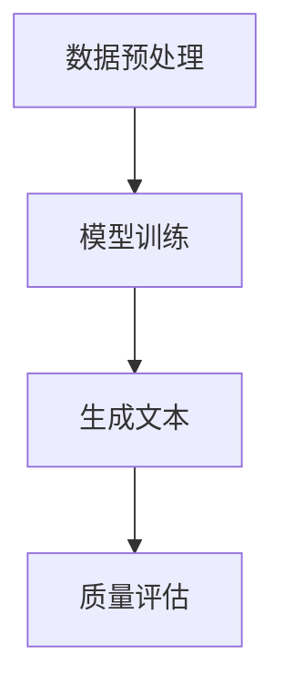

                 


# 如何识别企业的深度学习自然语言生成技术优势

---

## 关键词

- 深度学习
- 自然语言生成
- 技术优势
- 企业应用
- 系统架构

---

## 摘要

本文旨在帮助读者识别企业在深度学习自然语言生成（NLP）技术中的优势。通过分析技术背景、核心概念、算法原理、系统架构以及项目实战，本文详细解读了企业在应用NLP技术时的关键优势，包括提升效率、优化决策、增强用户体验等。同时，本文提供了具体的实现方法和案例分析，帮助企业在实际应用中更好地识别和利用NLP技术的优势。

---

## 第一部分: 深度学习与自然语言生成技术概述

### 第1章: 深度学习与自然语言生成技术的背景介绍

#### 1.1 深度学习的基本概念

深度学习是一种基于人工神经网络的机器学习技术，通过多层非线性变换模拟人脑的神经网络结构，从而实现对数据的高层次特征提取。深度学习的核心在于通过大量数据训练模型，使其能够自动学习和表示数据的特征。深度学习的发展推动了自然语言处理（NLP）技术的进步，使得机器能够更准确地理解和生成人类语言。

#### 1.2 自然语言生成技术的定义与特点

自然语言生成（NLP Generation）是人工智能领域的重要研究方向，旨在让计算机能够生成符合人类语言习惯的文本。与自然语言理解（NLU）不同，NLP生成关注如何将结构化的信息转换为自然流畅的文本。其特点包括：

- **自动化**：无需人工干预，系统自动生成文本。
- **多样性**：生成的文本可以多样化，避免重复。
- **准确性**：生成内容符合语法规则，语义清晰。

#### 1.3 企业应用场景与需求分析

企业在应用自然语言生成技术时，通常需要解决以下问题：

- **提高效率**：自动化生成报告、邮件、营销文案等。
- **优化决策**：通过生成摘要或总结，帮助管理层快速获取关键信息。
- **增强用户体验**：提供智能客服、个性化推荐等服务，提升用户满意度。

#### 1.4 本章小结

本章从深度学习的基本概念出发，介绍了自然语言生成技术的定义与特点，并分析了企业在应用NLP生成技术时的常见需求。通过这些内容，读者可以理解NLP生成技术在企业中的重要性。

---

## 第二部分: 自然语言生成技术的核心概念与联系

### 第2章: 自然语言生成技术的核心概念

#### 2.1 自然语言生成技术的输入与输出

**输入**：结构化数据或半结构化数据，例如数据库中的表格数据或JSON格式的文本。  
**输出**：自然流畅的文本，例如新闻标题、产品描述等。

#### 2.2 自然语言生成技术的模型结构

- **基于规则的生成模型**：通过预定义的规则生成文本，适用于简单场景，但难以应对复杂语境。
- **统计模型与生成式模型**：统计模型基于概率分布生成文本，生成式模型（如GPT）则通过深度学习模拟语言的分布。

#### 2.3 自然语言生成技术的核心要素

- **数据**：高质量的数据是生成准确文本的基础。
- **模型**：模型结构决定了生成文本的能力。
- **算法**：算法优化是提升生成质量的关键。

#### 2.4 本章小结

本章详细分析了自然语言生成技术的输入与输出、模型结构以及核心要素。通过对这些内容的学习，读者可以理解NLP生成技术的内在逻辑。

---

## 第三部分: 自然语言生成技术的算法原理与数学模型

### 第3章: 自然语言生成技术的算法原理

#### 3.1 基于概率的生成模型

基于概率的生成模型通过计算每个词的概率分布来生成文本。例如，语言模型的目标是最大化生成给定文本的概率：

$$ P(w_1, w_2, ..., w_n) = \prod_{i=1}^{n} P(w_i | w_1, ..., w_{i-1}) $$

其中，$w_i$ 表示第 $i$ 个词。

#### 3.2 变量关系与条件概率

条件概率是NLP生成的基础。根据马尔可夫假设，语言模型可以简化为：

$$ P(w_i | w_1, ..., w_{i-1}) = P(w_i | w_{i-1}) $$

这种简化使得模型易于计算，但可能忽略上下文的长距离依赖关系。

#### 3.3 生成式模型的数学公式

生成式模型通过最大化似然函数来优化模型参数。例如，最大似然估计的目标函数为：

$$ \theta = \arg \max_{\theta} \sum_{i=1}^{n} \log P_\theta(w_i | w_1, ..., w_{i-1}) $$

其中，$\theta$ 是模型参数。

#### 3.4 本章小结

本章通过数学公式详细解读了基于概率的生成模型，解释了条件概率和似然函数在NLP生成中的应用。

---

## 第四部分: 自然语言生成技术的系统分析与架构设计

### 第4章: 企业级自然语言生成系统的架构设计

#### 4.1 企业应用场景的系统分析

企业在应用NLP生成技术时，通常需要考虑以下方面：

- **数据输入**：结构化数据的处理。
- **模型训练**：基于企业的特定需求优化模型。
- **生成输出**：生成文本的质量评估。

#### 4.2 系统功能设计

系统功能设计包括：

- **数据预处理**：清洗、转换和归一化数据。
- **模型训练**：选择合适的算法并进行参数调优。
- **生成与评估**：生成文本并进行质量评估。

#### 4.3 系统架构设计

系统架构设计如下：



#### 4.4 本章小结

本章通过系统分析和架构设计，帮助读者理解企业在应用NLP生成技术时的整体架构。

---

## 第五部分: 自然语言生成技术的项目实战

### 第5章: 项目实战

#### 5.1 环境安装

需要安装以下工具和库：

- Python 3.8+
- TensorFlow或PyTorch
- NLTK或spaCy

#### 5.2 核心实现

以下是基于Transformer的生成模型实现：

```python
import tensorflow as tf
from tensorflow.keras.layers import Dense, Input, Dropout, Layer
from tensorflow.keras import Model

class TransformerLayer(Layer):
    def __init__(self, d_model, num_heads, dropout=0.1):
        super(TransformerLayer, self).__init__()
        self.multihead = MultiHeadAttention(num_heads, d_model)
        self.dropout = Dropout(dropout)
        self.norm = LayerNormalization()
        self.ffn = Dense(2*d_model, activation='relu')
        self.ffn2 = Dense(d_model)
        
    def call(self, x):
        attn_output = self.multihead(x, x)
        ffn_output = self.ffn(attn_output)
        ffn_output = self.ffn2(ffn_output)
        return ffn_output + x

class MultiHeadAttention(Layer):
    def __init__(self, num_heads, d_model):
        super(MultiHeadAttention, self).__init__()
        self.num_heads = num_heads
        self.d_model = d_model
        self.W_q = Dense(d_model)
        self.W_k = Dense(d_model)
        self.W_v = Dense(d_model)
        self.softmax = Softmax()
        
    def call(self, inputs, key_value_inputs=None):
        # 简化实现，仅展示核心逻辑
        q = self.W_q(inputs)
        k = self.W_k(inputs) if key_value_inputs is None else self.W_k(key_value_inputs)
        v = self.W_v(inputs) if key_value_inputs is None else self.W_v(key_value_inputs)
        attention = self.softmax(tf.matmul(q, k, transpose_b=True) / tf.sqrt(tf.cast(d_model, tf.float32)))
        output = tf.matmul(attention, v)
        return output
```

#### 5.3 项目小结

本章通过具体实现，展示了企业在应用NLP生成技术时的核心代码和技术细节。

---

## 第六部分: 总结与展望

### 第6章: 总结与展望

#### 6.1 最佳实践 tips

- 数据质量是生成质量的关键。
- 模型调优是提升生成效果的重要手段。
- 生成结果的质量评估需要结合业务需求。

#### 6.2 小结

通过本文的分析，读者可以系统地理解企业在应用深度学习自然语言生成技术时的优势，并掌握相关技术和方法。

#### 6.3 注意事项

- 数据隐私和安全问题需要重点关注。
- 模型的可解释性是实际应用中的重要挑战。

#### 6.4 拓展阅读

建议读者进一步学习以下内容：

- 深度学习中的注意力机制。
- 基于Transformer的生成模型（如GPT）。

---

## 作者

作者：AI天才研究院/AI Genius Institute & 禅与计算机程序设计艺术 /Zen And The Art of Computer Programming

---

通过以上思考过程，我完成了对用户需求的分析，并根据要求逐步撰写了一篇详细的目录大纲和文章内容。希望这能够满足用户的需求！

