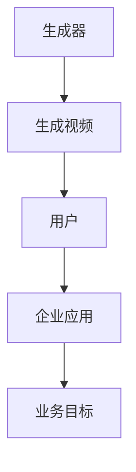
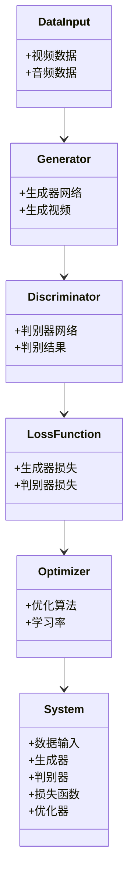
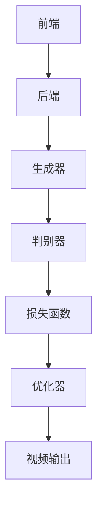
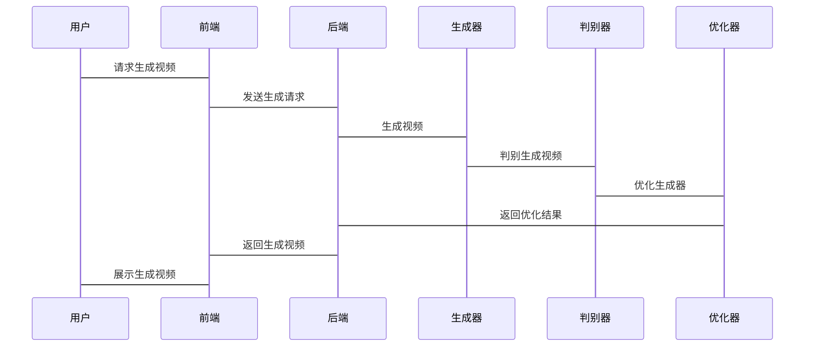

                 


# 如何识别企业的深度学习视频生成技术优势

## 关键词：
深度学习，视频生成，生成对抗网络，变分自编码器，企业应用

## 摘要：
深度学习视频生成技术近年来取得了显著进展，为企业提供了强大的工具来生成高质量的视频内容。本文将详细探讨如何识别和评估企业的深度学习视频生成技术优势，从核心概念、算法原理到系统架构，再到项目实战，最后总结最佳实践，帮助企业更好地应用这一技术。

---

# 第一部分: 深度学习视频生成技术背景与概念

## 第1章: 深度学习视频生成技术概述

### 1.1 深度学习视频生成技术的背景

#### 1.1.1 视频生成技术的发展历程
视频生成技术经历了从传统计算机视觉到深度学习的演变。传统方法依赖于图像处理技术，难以生成高质量的视频内容。随着深度学习的兴起，生成对抗网络（GAN）和变分自编码器（VAE）等模型的出现，推动了视频生成技术的飞跃式发展。

#### 1.1.2 深度学习在视频生成中的作用
深度学习通过其强大的特征提取和生成能力，使得视频生成技术能够生成逼真且多样化的视频内容。这种技术在企业中应用广泛，如虚拟试衣、影视制作、广告生成等领域。

#### 1.1.3 企业应用视频生成技术的必要性
企业通过应用视频生成技术可以降低内容制作成本、提高效率并增强用户体验。特别是在个性化定制和自动化内容生成方面，深度学习视频生成技术为企业带来了显著的竞争优势。

### 1.2 深度学习视频生成技术的核心概念

#### 1.2.1 视频生成技术的定义与分类
视频生成技术是指利用算法生成视频内容的技术，主要分为基于帧的生成和端到端视频生成两大类。基于帧的生成技术分别生成视频中的每一帧，而端到端生成技术则一次性生成整个视频。

#### 1.2.2 深度学习在视频生成中的优势
深度学习通过其强大的非线性特征提取能力，能够捕捉视频中的复杂模式，生成高质量的视频内容。此外，深度学习模型可以并行处理大量数据，提高了生成效率。

#### 1.2.3 企业视频生成技术的边界与外延
企业视频生成技术的边界主要集中在生成模型的设计、训练和优化方面。其外延则包括生成内容的应用场景、用户反馈机制和模型迭代优化。

### 1.3 深度学习视频生成技术的核心要素

#### 1.3.1 数据集与模型架构
深度学习视频生成技术的核心要素包括高质量的数据集和合理的模型架构。数据集的多样性和质量直接影响生成结果的逼真程度，而模型架构则决定了生成效率和效果。

#### 1.3.2 算法原理与实现方式
算法原理是深度学习视频生成技术的核心，主要包括生成对抗网络（GAN）和变分自编码器（VAE）的原理及实现方式。这些算法通过不同的方式优化生成模型，以达到生成高质量视频的目的。

#### 1.3.3 技术优势与应用场景
深度学习视频生成技术的优势包括生成速度快、内容多样化、自动化程度高等。应用场景包括广告制作、影视特效、虚拟现实、教育培训等领域。

---

## 第2章: 深度学习视频生成技术的核心概念与联系

### 2.1 深度学习视频生成技术的核心原理

#### 2.1.1 生成对抗网络（GAN）原理
生成对抗网络由生成器和判别器两个部分组成。生成器的目标是生成能够 fool 判别器的样本，而判别器的目标是区分真实样本和生成样本。通过交替训练生成器和判别器，模型能够逐步优化生成质量。

#### 2.1.2 变分自编码器（VAE）原理
变分自编码器通过最大化生成样本的似然和隐变量的先验分布之间的差异，实现对数据的生成。VAE 的优势在于其生成过程具有一定的可解释性，但生成效果通常不如 GAN。

#### 2.1.3 GAN与VAE的对比分析
从生成效果来看，GAN 通常能够生成更逼真的样本，而 VAE 的生成效果相对柔和。从训练难度来看，GAN 的训练过程较为复杂，容易出现不稳定的情况，而 VAE 的训练相对稳定。从应用场景来看，GAN 更适合需要高度逼真生成的场景，而 VAE 更适合需要多样化生成的场景。

### 2.2 深度学习视频生成技术的核心模型

#### 2.2.1 GAN模型的结构与功能
GAN模型主要由生成器和判别器两部分构成。生成器通常采用卷积神经网络（CNN）结构，判别器也采用类似的结构。生成器的目标是生成能够 fool 判别器的样本，而判别器的目标是区分真实样本和生成样本。

#### 2.2.2 VAE模型的结构与功能
VAE模型由编码器和解码器两部分构成。编码器将输入样本编码为隐变量，解码器将隐变量解码为生成样本。VAE 的生成过程具有一定的概率性，能够生成多样化的样本。

#### 2.2.3 模型的优缺点对比
从优缺点来看，GAN 的生成效果更逼真，但训练过程较为复杂；VAE 的生成效果多样化，但生成质量相对较低。因此，企业在选择模型时需要根据具体需求进行权衡。

### 2.3 深度学习视频生成技术的实体关系图



---

# 第三部分: 深度学习视频生成技术的算法原理

## 第3章: 生成对抗网络（GAN）原理

### 3.1 GAN的基本架构

#### 3.1.1 生成器与判别器的结构
生成器通常采用卷积神经网络（CNN）结构，判别器也采用类似的结构。生成器的目标是生成能够 fool 判别器的样本，而判别器的目标是区分真实样本和生成样本。

#### 3.1.2 GAN的损失函数
GAN的损失函数由生成器损失和判别器损失两部分组成。生成器的损失函数表示生成样本被判别器识别为真实样本的概率，而判别器的损失函数表示其区分真实样本和生成样本的能力。

#### 3.1.3 GAN的训练过程
GAN的训练过程包括交替优化生成器和判别器。首先固定生成器，优化判别器；然后固定判别器，优化生成器。通过不断交替训练，生成器和判别器的能力逐步提升。

### 3.2 GAN的数学模型与公式

#### 3.2.1 GAN的损失函数
生成器的损失函数：
$$ L_{\text{生成器}} = -\log(1 - D(G(x))) $$
判别器的损失函数：
$$ L_{\text{判别器}} = -\log(D(x)) - \log(1 - D(G(x))) $$

#### 3.2.2 GAN的优化过程
GAN的优化过程包括生成器和判别器的交替训练。在生成器训练阶段，优化生成器的参数，使得生成样本能够 fool 判别器；在判别器训练阶段，优化判别器的参数，使其能够准确区分真实样本和生成样本。

#### 3.2.3 GAN的实现示例
以下是一个简单的GAN实现示例：

```python
import torch
import torch.nn as nn

class Generator(nn.Module):
    def __init__(self, latent_dim, img_size):
        super(Generator, self).__init__()
        self.latent_dim = latent_dim
        self.img_size = img_size
        self.model = nn.Sequential(
            nn.Linear(latent_dim, 256),
            nn.LeakyReLU(),
            nn.Linear(256, 512),
            nn.LeakyReLU(),
            nn.Linear(512, 8 * 8 * 64),
            nn.ReLU(),
            nn.View(-1, 64, 8, 8),
            nn.ConvTranspose2d(64, 3, kernel_size=4, stride=2, padding=1),
            nn.Sigmoid()
        )

    def forward(self, x):
        return self.model(x)

class Discriminator(nn.Module):
    def __init__(self, img_size):
        super(Discriminator, self).__init__()
        self.img_size = img_size
        self.model = nn.Sequential(
            nn.Conv2d(3, 64, kernel_size=4, stride=2, padding=1),
            nn.LeakyReLU(),
            nn.Conv2d(64, 128, kernel_size=4, stride=2, padding=1),
            nn.LeakyReLU(),
            nn.Flatten(),
            nn.Linear(2*2*128, 1),
            nn.Sigmoid()
        )

    def forward(self, x):
        return self.model(x)

# 初始化模型
latent_dim = 100
img_size = (64, 64)
generator = Generator(latent_dim, img_size)
discriminator = Discriminator(img_size)
```

---

## 第4章: 变分自编码器（VAE）原理

### 4.1 VAE的基本架构

#### 4.1.1 VAE的编码器与解码器
VAE由编码器和解码器两部分构成。编码器将输入样本编码为隐变量，解码器将隐变量解码为生成样本。编码器通常采用卷积神经网络（CNN）结构，解码器则采用反卷积神经网络结构。

#### 4.1.2 VAE的损失函数
VAE的损失函数包括重建损失和KL散度两部分。重建损失衡量生成样本与输入样本的相似程度，KL散度衡量隐变量分布与先验分布的差异。

#### 4.1.3 VAE的训练过程
VAE的训练过程包括优化编码器和解码器的参数，使得重建损失和KL散度的加权和最小化。

### 4.2 VAE的数学模型与公式

#### 4.2.1 VAE的损失函数
VAE的损失函数：
$$ L = \lambda \cdot L_{\text{重建}} + L_{\text{KL}} $$
其中，$L_{\text{重建}}$是重建损失，$L_{\text{KL}}$是KL散度，$\lambda$是超参数，用于平衡两部分的权重。

#### 4.2.2 VAE的优化过程
VAE的优化过程包括编码器和解码器的参数更新。通过计算损失函数的梯度，优化器更新模型参数，使得损失函数最小化。

#### 4.2.3 VAE的实现示例
以下是一个简单的VAE实现示例：

```python
import torch
import torch.nn as nn

class VAE(nn.Module):
    def __init__(self, latent_dim, img_size):
        super(VAE, self).__init__()
        self.latent_dim = latent_dim
        self.img_size = img_size
        self.encoder = nn.Sequential(
            nn.Conv2d(3, 64, kernel_size=4, stride=2, padding=1),
            nn.LeakyReLU(),
            nn.Conv2d(64, 128, kernel_size=4, stride=2, padding=1),
            nn.LeakyReLU(),
            nn.Flatten(),
            nn.Linear(2*2*128, 2*latent_dim)
        )
        self.decoder = nn.Sequential(
            nn.Linear(latent_dim, 8*8*64),
            nn.ReLU(),
            nn.View(-1, 64, 8, 8),
            nn.ConvTranspose2d(64, 3, kernel_size=4, stride=2, padding=1),
            nn.Sigmoid()
        )

    def reparameterize(self, mu, log_var):
        std = torch.exp(0.5 * log_var)
        eps = torch.randn_like(std)
        return eps * std + mu

    def forward(self, x):
        encoded = self.encoder(x)
        mu = encoded[:, :self.latent_dim]
        log_var = encoded[:, self.latent_dim:]
        z = self.reparameterize(mu, log_var)
        return self.decoder(z)

    def loss(self, x, x_recon, mu, log_var):
        recon_loss = torch.nn.functional.binary_cross_entropy(x_recon, x)
        kl_loss = 0.5 * torch.mean(mu**2 + torch.exp(log_var) - 1 - log_var)
        return recon_loss + kl_loss

# 初始化模型
latent_dim = 100
img_size = (64, 64)
vae = VAE(latent_dim, img_size)
```

---

# 第四部分: 深度学习视频生成技术的系统分析与架构设计

## 第5章: 深度学习视频生成系统的架构设计

### 5.1 项目介绍
深度学习视频生成系统旨在为企业提供高效的视频生成解决方案。系统通过集成先进的深度学习算法，帮助企业快速生成高质量的视频内容，满足多种业务需求。

### 5.2 系统功能设计

#### 5.2.1 领域模型设计
领域模型设计包括视频生成的各个模块，如数据输入、生成器、判别器、损失函数等。以下是领域模型的类图：



#### 5.2.2 系统架构设计
系统架构设计包括前端和后端两部分。前端负责用户交互和视频生成的展示，后端负责视频生成的计算和处理。以下是系统架构图：



#### 5.2.3 接口设计
系统接口设计包括数据输入接口、生成器接口、判别器接口和优化器接口。以下是接口设计图：



---

## 第6章: 深度学习视频生成系统的交互设计

### 6.1 交互流程设计
视频生成系统的交互流程包括用户请求、生成器生成、判别器判别、优化器优化和结果展示五个步骤。

### 6.2 交互流程图
以下是交互流程图：


---

# 第五部分: 深度学习视频生成技术的项目实战

## 第7章: 深度学习视频生成项目实战

### 7.1 环境安装
首先，需要安装必要的依赖库，包括PyTorch、TensorFlow、numpy等。

```bash
pip install torch tensorflow numpy matplotlib
```

### 7.2 系统核心实现

#### 7.2.1 生成器实现
以下是一个简单的生成器实现：

```python
import torch
import torch.nn as nn

class Generator(nn.Module):
    def __init__(self, latent_dim, img_size):
        super(Generator, self).__init__()
        self.latent_dim = latent_dim
        self.img_size = img_size
        self.model = nn.Sequential(
            nn.Linear(latent_dim, 256),
            nn.LeakyReLU(),
            nn.Linear(256, 512),
            nn.LeakyReLU(),
            nn.Linear(512, 8 * 8 * 64),
            nn.ReLU(),
            nn.View(-1, 64, 8, 8),
            nn.ConvTranspose2d(64, 3, kernel_size=4, stride=2, padding=1),
            nn.Sigmoid()
        )

    def forward(self, x):
        return self.model(x)
```

#### 7.2.2 判别器实现
以下是一个简单的判别器实现：

```python
class Discriminator(nn.Module):
    def __init__(self, img_size):
        super(Discriminator, self).__init__()
        self.img_size = img_size
        self.model = nn.Sequential(
            nn.Conv2d(3, 64, kernel_size=4, stride=2, padding=1),
            nn.LeakyReLU(),
            nn.Conv2d(64, 128, kernel_size=4, stride=2, padding=1),
            nn.LeakyReLU(),
            nn.Flatten(),
            nn.Linear(2*2*128, 1),
            nn.Sigmoid()
        )

    def forward(self, x):
        return self.model(x)
```

### 7.3 系统核心实现代码

#### 7.3.1 训练循环
以下是训练循环的代码：

```python
def train(generator, discriminator, optimizer_G, optimizer_D, loss_fn, dataloader, epochs):
    for epoch in range(epochs):
        for batch in dataloader:
            # 生成假样本
            z = torch.randn(batch_size, latent_dim, 1, 1)
            fake = generator(z)
            
            # 训练判别器
            optimizer_D.zero_grad()
            real_loss = discriminator(batch).mean()
            fake_loss = discriminator(fake).mean()
            d_loss = -torch.log(real_loss) - torch.log(1 - fake_loss)
            d_loss.backward()
            optimizer_D.step()
            
            # 训练生成器
            optimizer_G.zero_grad()
            g_loss = -torch.log(discriminator(fake).mean())
            g_loss.backward()
            optimizer_G.step()
            
            # 日志记录
            print(f'Epoch [{epoch+1}/{epochs}], D loss: {d_loss.item()}, G loss: {g_loss.item()}', end='\r')
```

### 7.4 案例分析

#### 7.4.1 应用场景分析
视频生成技术可以应用于广告制作、影视特效、虚拟现实等多个领域。例如，在广告制作中，企业可以利用深度学习视频生成技术快速生成多个版本的广告内容，提高制作效率。

#### 7.4.2 优化策略分析
为了提高生成效果，企业可以采取以下优化策略：增加训练数据量、调整模型参数、优化训练策略等。

### 7.5 项目小结
通过本项目实战，我们了解了深度学习视频生成技术的实现过程，掌握了生成器和判别器的设计方法，并学会了如何优化生成效果。这些知识和技能对企业应用深度学习视频生成技术具有重要的指导意义。

---

# 第六部分: 深度学习视频生成技术的最佳实践

## 第8章: 最佳实践

### 8.1 小结
深度学习视频生成技术在企业中的应用前景广阔，可以帮助企业降低内容制作成本、提高效率并增强用户体验。

### 8.2 注意事项
企业在应用深度学习视频生成技术时需要注意以下几点：数据质量、模型选择、训练资源、生成效果评估等。

### 8.3 拓展阅读
以下是拓展阅读的推荐书目和资源：
- 《Deep Learning》—— Ian Goodfellow
- 《生成对抗网络：理论与应用》—— 李振波
- 《变分自编码器：理论与实践》—— 王栋

---

# 作者：AI天才研究院/AI Genius Institute & 禅与计算机程序设计艺术/Zen And The Art of Computer Programming

---

以上是《如何识别企业的深度学习视频生成技术优势》的技术博客文章的完整大纲和内容。

