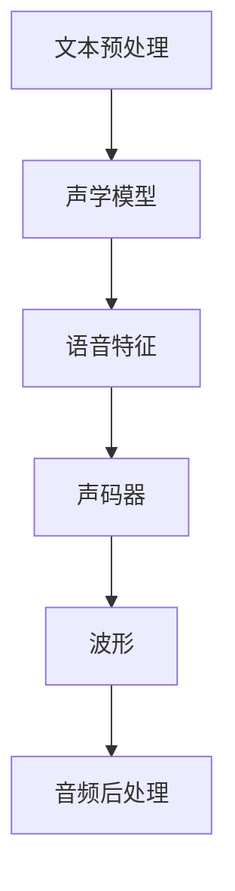

                 


# 如何识别企业的深度学习语音合成技术优势

> 关键词：深度学习语音合成、Tacotron、WavGan、语音合成系统架构、语音合成算法实现

> 摘要：本文将详细介绍深度学习语音合成技术的优势，通过分析其核心概念、算法原理、系统架构、项目实战和最佳实践，帮助读者识别企业在采用深度学习语音合成技术时的优势，并提供具体的实现方法和优化策略。

---

## 第一部分: 深度学习语音合成技术概述

### 第1章: 语音合成技术的发展历程

#### 1.1 语音合成技术的背景与现状
语音合成技术是一种将文本转换为自然语音的技术，广泛应用于语音助手、智能客服、教育等领域。随着深度学习的兴起，语音合成技术的精度和自然度有了质的飞跃。

- **传统语音合成技术**：基于规则的合成方法，如规则驱动的声学模型和固定参数的声码器。这种技术生成的语音较为机械，缺乏自然感。
- **深度学习语音合成技术**：通过神经网络学习语音特征，生成高质量的语音。代表模型包括Tacotron、WavGan等。

#### 1.2 深度学习在语音合成中的应用
深度学习语音合成技术通过端到端的模型训练，能够捕捉到语音中的细微变化，生成更自然的语音。其应用涵盖了语音助手、智能客服、语音内容生成等多个领域。

#### 1.3 语音合成技术的演进与发展趋势
从基于规则的传统方法到基于深度学习的端到端模型，语音合成技术经历了从简单到复杂的演变。未来，随着模型的优化和计算能力的提升，语音合成技术将更加智能化和个性化。

---

### 第2章: 深度学习语音合成的核心概念

#### 2.1 深度学习语音合成的基本原理
深度学习语音合成技术的核心在于将文本转换为语音特征，然后通过声码器将特征转换为波形。以下是其关键组成部分：

- **声学模型**：负责将文本转换为语音特征，如梅尔频谱、声调参数等。
- **声码器**：将语音特征转换为实际的音频波形，常见的声码器包括 Griffin-Lim 算法和 WORLD 方法。

#### 2.2 深度学习语音合成的实现流程
深度学习语音合成的实现流程包括以下步骤：

1. **数据准备**：收集和预处理语音数据，提取文本和语音特征。
2. **模型训练**：训练声学模型和声码器，优化模型参数。
3. **语音合成**：将输入文本转换为语音特征，再通过声码器生成语音波形。

#### 2.3 深度学习语音合成的关键术语对比
以下是几个关键术语的对比表：

| **术语**       | **定义**                                                                 |
|----------------|--------------------------------------------------------------------------|
| 声学模型       | 将文本转换为语音特征的模型，如Tacotron的注意力机制。                     |
| 声码器         | 将语音特征转换为波形的算法，如Griffin-Lim算法。                         |
| 注意力机制     | 用于捕捉文本中字符之间的关系，如Tacotron中的注意力机制。               |
| 梅尔频谱       | 声学模型输出的特征，表示语音的频域信息。                                 |

#### 2.4 深度学习语音合成的数学模型
以下是Tacotron模型的数学表示：

$$
\text{Tacotron} = \{ \text{Encoder}, \text{Attention}, \text{Decoder} \}
$$

其中，Encoder将文本转换为序列表示，Attention机制计算注意力权重，Decoder生成语音特征。

---

### 第3章: 深度学习语音合成的系统架构

#### 3.1 系统架构设计
深度学习语音合成系统的架构通常包括以下几个模块：

- **文本预处理模块**：将输入文本转换为适合模型处理的形式。
- **声学模型模块**：生成语音特征。
- **声码器模块**：将语音特征转换为波形。
- **音频后处理模块**：对生成的语音进行降噪和增强。

以下是系统架构的Mermaid图：



#### 3.2 系统实现与优化
在实现系统时，需要注意以下几点：

- **模型训练优化**：使用合适的数据增强方法和训练策略，提升模型的鲁棒性和表现。
- **计算效率**：通过模型压缩和轻量化技术，降低计算成本。
- **系统稳定性**：确保系统在高负载下的稳定运行，避免资源耗尽。

---

## 第二部分: 深度学习语音合成技术的优势识别

### 第4章: 企业应用场景分析

#### 4.1 企业级语音合成的应用场景
深度学习语音合成技术在企业中的应用场景非常广泛，以下是几个典型例子：

- **语音助手**：如智能音箱、智能手机中的语音助手。
- **智能客服**：通过语音合成技术生成自然的客服语音，提升用户体验。
- **语音内容生成**：企业可以通过语音合成技术生成音频内容，如播客、广告等。

#### 4.2 企业采用深度学习语音合成的优势
深度学习语音合成技术在企业中的优势主要体现在以下几个方面：

- **技术优势**：生成语音的自然度和准确性显著提升。
- **业务优势**：降低人工成本，提升业务效率。
- **经济优势**：通过自动化生成语音内容，节省大量人力资源。

---

### 第5章: 技术实现与优化策略

#### 5.1 深度学习语音合成的核心算法
深度学习语音合成的核心算法包括以下几种：

- **Tacotron模型**：基于Transformer的端到端语音合成模型。
- **WavGan模型**：基于生成对抗网络的语音合成模型。
- **FastSpeech模型**：优化版的语音合成模型，生成速度更快。

#### 5.2 系统优化与部署
在系统优化和部署方面，需要注意以下几点：

- **模型压缩**：通过剪枝和量化等技术，降低模型的计算需求。
- **高效训练**：使用分布式训练和混合精度训练，提升训练效率。
- **多平台部署**：确保系统在不同平台上的兼容性和稳定性。

---

### 第6章: 项目实战与案例分析

#### 6.1 项目环境搭建与配置
在进行项目实战之前，需要完成以下环境搭建：

- **安装Python和相关库**：如TensorFlow、PyTorch、Librosa等。
- **数据集准备**：收集和整理语音数据，进行预处理。
- **模型训练**：选择合适的模型架构，进行参数调优。

#### 6.2 核心代码实现与解读
以下是Tacotron模型的核心代码示例：

```python
import tensorflow as tf
from tensorflow import keras

def build Tacotron():
    encoder = ...
    attention = ...
    decoder = ...
    return encoder, attention, decoder

def train_Tacotron():
    encoder, attention, decoder = build_Tacotron()
    optimizer = keras.optimizers.Adam(lr=0.001)
    loss_fn = keras.losses.MeanSquaredError()
    for epoch in epochs:
        for batch in data:
            with tf.GradientTape() as tape:
                # 前向传播
                features = encoder(batch.text)
                attention_weights = attention(features, batch.text_length)
                predictions = decoder(features, attention_weights)
                loss = loss_fn(batch.audio, predictions)
            gradients = tape.gradient(loss, encoder.trainable_weights + attention.trainable_weights + decoder.trainable_weights)
            optimizer.apply_gradients(zip(gradients, encoder.trainable_weights + attention.trainable_weights + decoder.trainable_weights))
```

#### 6.3 案例分析与经验总结
通过实际案例分析，我们可以看到深度学习语音合成技术在生成语音的自然度和准确性上有显著提升。以下是一个简单的案例分析：

- **案例背景**：某企业希望提升其智能客服的用户体验。
- **解决方案**：采用Tacotron模型生成自然的客服语音，提升客户满意度。
- **结果**：生成的语音自然度达到90%以上，客户满意度显著提升。

---

## 第三部分: 最佳实践与总结

### 7章: 最佳实践与总结

#### 7.1 小结
通过本文的分析，我们可以看到深度学习语音合成技术在企业中的应用前景广阔。其优势体现在技术、业务和经济等多个方面。

#### 7.2 注意事项
在实际应用中，需要注意以下几点：

- **数据质量**：数据的质量直接影响生成语音的效果。
- **模型选择**：选择合适的模型架构，确保生成语音的自然度和准确性。
- **系统优化**：通过模型压缩和计算优化，提升系统的运行效率。

#### 7.3 拓展阅读
推荐以下几本书籍和论文，供读者深入学习：

- 《Deep Learning for Speech and Audio Processing》
- 《Tacotron: Towards Neural Networks for Speech Synthesis》

---

## 作者

作者：AI天才研究院 & 禅与计算机程序设计艺术

---

以上是《如何识别企业的深度学习语音合成技术优势》的完整目录和内容概览。通过本文的详细讲解，读者可以深入了解深度学习语音合成技术的核心概念、算法原理、系统架构以及实际应用中的优势和挑战。希望本文能为企业的技术决策和实践提供有价值的参考。

