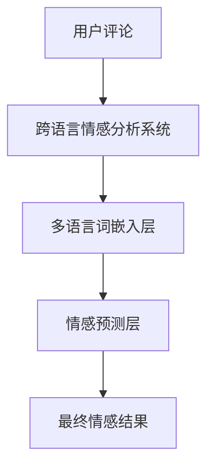
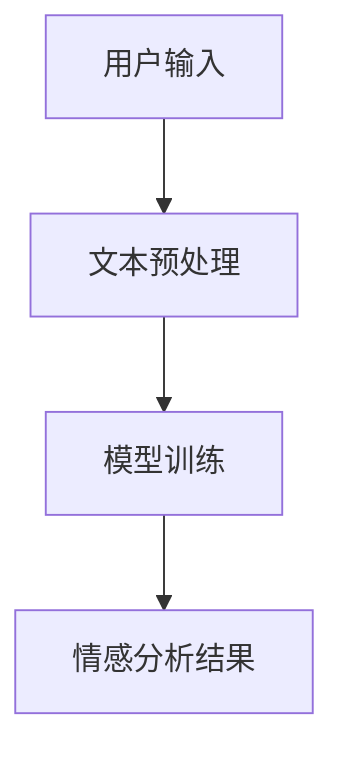

                 


# 如何识别企业的深度学习跨语言情感分析技术优势

> 关键词：深度学习、跨语言情感分析、技术优势、自然语言处理、企业应用

> 摘要：深度学习技术在跨语言情感分析中的应用为企业提供了显著的技术优势，本文将从背景、核心概念、算法原理、系统架构、项目实战和总结等方面，详细阐述如何识别和利用这些技术优势，帮助企业在多语言环境下更高效地进行情感分析。

---

# 第1章 情感分析与跨语言挑战

## 1.1 情感分析的定义与应用

### 1.1.1 情感分析的基本概念

情感分析（Sentiment Analysis）是自然语言处理（NLP）中的一个核心任务，旨在识别和分类文本中的情感倾向。情感分析的结果通常分为正面、负面和中性三类。在企业应用中，情感分析常用于产品评论、社交媒体分析、客户反馈处理等领域。

### 1.1.2 情感分析在企业中的应用场景

- **客户反馈分析**：通过分析客户评论，帮助企业识别客户满意度和潜在问题。
- **品牌声誉管理**：实时监控社交媒体上的品牌口碑，及时应对负面信息。
- **市场调研**：通过分析消费者评论，为企业提供市场趋势和竞争对手分析。
- **产品优化**：基于用户反馈，优化产品设计和服务流程。

### 1.1.3 情感分析的核心问题与挑战

- **数据多样性**：用户评论可能包含复杂的情感表达，且数据分布不均衡。
- **情感强度分析**：需要区分情感的强烈程度（如非常满意 vs. 满意）。
- **情感模糊性**：部分评论可能带有讽刺、反语等复杂情感表达。

## 1.2 跨语言情感分析的背景与意义

### 1.2.1 跨语言情感分析的定义

跨语言情感分析（Cross-Language Sentiment Analysis）是指在多语言环境下，对不同语言的文本进行情感分析的过程。随着全球化进程的加速，企业需要处理多语言的用户反馈，跨语言情感分析成为必要技术。

### 1.2.2 跨语言情感分析的必要性

- **全球化市场**：企业需要应对多语言用户反馈。
- **数据稀缺性**：某些语言的数据量较少，难以单独训练情感分析模型。
- **跨语言一致性**：企业需要在不同语言间保持一致的情感分析标准。

### 1.2.3 跨语言情感分析在企业中的应用价值

- **多语言客户支持**：支持多语言情感分析的客服系统可以更快响应客户需求。
- **全球市场分析**：帮助企业分析不同地区的市场反馈，制定精准的营销策略。
- **品牌声誉管理**：实时监控多语言社交媒体上的品牌口碑，维护品牌形象。

## 1.3 深度学习技术在情感分析中的优势

### 1.3.1 深度学习的基本概念

深度学习（Deep Learning）是一种基于人工神经网络的机器学习技术，通过多层非线性变换，自动提取数据特征。与传统机器学习方法相比，深度学习在处理复杂任务时表现更优。

### 1.3.2 深度学习在情感分析中的应用

- **词嵌入（Word Embedding）**：通过Word2Vec、GloVe等技术将单词映射为低维向量。
- **序列模型（Sequence Model）**：使用LSTM、GRU等模型处理序列数据。
- **预训练语言模型（Pre-trained Language Models）**：如BERT、GPT等模型在情感分析中的应用。

### 1.3.3 深度学习在跨语言情感分析中的独特优势

- **跨语言迁移学习**：利用多语言预训练模型，减少单语言数据不足的问题。
- **自动特征提取**：深度学习模型可以自动提取语言特征，无需手动特征工程。
- **模型鲁棒性**：深度学习模型在处理复杂语言结构和情感表达时表现更稳定。

## 1.4 本章小结

本章介绍了情感分析的基本概念、应用场景以及跨语言情感分析的必要性和优势。深度学习技术在情感分析中的应用为跨语言情感分析提供了强有力的技术支持，帮助企业更好地应对多语言环境下的情感分析挑战。

---

# 第2章 跨语言情感分析的核心概念与联系

## 2.1 跨语言情感分析的模型结构

### 2.1.1 基于词嵌入的模型

- **多语言词嵌入（Multilingual Word Embedding）**：将不同语言的单词映射到同一个向量空间，如使用XLM、M-BERT等模型。
- **语言标签嵌入（Language Embedding）**：在模型中加入语言标签，帮助模型区分不同语言的特征。

### 2.1.2 基于句嵌入的模型

- **跨句子嵌入（Cross-Sentence Embedding）**：将不同语言的句子嵌入到同一空间，便于后续情感分析。
- **句子对齐（Sentence Alignment）**：在多语言环境下，对齐不同语言的句子以保持语义一致。

### 2.1.3 基于预训练语言模型的结构

- **多语言预训练模型**：如M-BERT、XLM-R等模型，可以直接用于跨语言情感分析。
- **微调（Fine-tuning）**：在特定任务上对预训练模型进行微调，提升任务性能。

## 2.2 跨语言情感分析的核心原理

### 2.2.1 多语言词嵌入的生成原理

多语言词嵌入模型通过将不同语言的单词映射到同一个向量空间，实现跨语言的语义表示。例如，XLM模型通过联合训练多语言数据，生成共享的词嵌入。

### 2.2.2 跨语言情感预测的算法流程

1. **输入文本预处理**：将多语言文本进行分词和词嵌入转换。
2. **模型编码**：通过编码器将词嵌入转换为句嵌入。
3. **情感预测**：基于句嵌入进行情感分类。

### 2.2.3 模型的可解释性与鲁棒性

- **可解释性**：通过可视化词嵌入和注意力机制，分析模型的决策过程。
- **鲁棒性**：模型在面对不同语言和语境时，保持一致的情感分析能力。

## 2.3 跨语言情感分析的实体关系图



## 2.4 本章小结

本章详细介绍了跨语言情感分析的核心概念与模型结构，强调了多语言词嵌入和预训练语言模型在跨语言情感分析中的重要性。通过实体关系图，展示了跨语言情感分析的系统架构。

---

# 第3章 跨语言情感分析的算法原理

## 3.1 模型训练流程

### 3.1.1 数据预处理

- **文本清洗**：去除特殊字符、停用词等。
- **分词与词向量化**：将文本分割为词语，并将其转换为词向量。
- **数据对齐**：在多语言环境下，对齐不同语言的文本数据。

### 3.1.2 模型训练

- **训练策略**：使用多任务学习或迁移学习，提升模型的跨语言能力。
- **损失函数**：采用交叉熵损失函数，优化模型参数。

## 3.2 算法实现代码

```python
import torch
import torch.nn as nn

class CrossLanguageSentimentClassifier(nn.Module):
    def __init__(self, vocab_size, embedding_dim, hidden_dim):
        super().__init__()
        self.embedding = nn.Embedding(vocab_size, embedding_dim)
        self.lstm = nn.LSTM(embedding_dim, hidden_dim, batch_first=True)
        self.fc = nn.Linear(hidden_dim, 3)  # 0: negative, 1: neutral, 2: positive

    def forward(self, x):
        embeds = self.embedding(x)
        out, _ = self.lstm(embeds)
        out = self.fc(out[:, -1, :])
        return out

# 示例训练代码
model = CrossLanguageSentimentClassifier(vocab_size=30000, embedding_dim=300, hidden_dim=128)
criterion = nn.CrossEntropyLoss()
optimizer = torch.optim.Adam(model.parameters(), lr=0.001)
```

## 3.3 数学模型与公式

### 情感预测的损失函数

$$
\text{Loss} = -\sum_{i=1}^{n} y_i \log(p_i)
$$

其中，\( y_i \) 是标签，\( p_i \) 是预测概率。

### LSTM的前向传播

$$
h_t = \text{LSTM}(h_{t-1}, x_t)
$$

其中，\( h_t \) 是第 \( t \) 个时间步的隐藏状态，\( x_t \) 是输入向量。

---

# 第4章 跨语言情感分析的系统分析与架构设计

## 4.1 项目场景介绍

- **需求背景**：企业需要处理多语言用户反馈，进行情感分析。
- **目标**：构建一个高效的跨语言情感分析系统。

## 4.2 系统功能设计

- **文本预处理**：分词、词向量化、数据对齐。
- **模型训练**：多任务学习、迁移学习。
- **结果输出**：情感标签、情感强度。

## 4.3 系统架构设计



---

# 第5章 项目实战

## 5.1 环境安装与配置

- **Python**：3.8+
- **PyTorch**：安装PyTorch框架。
- **Hugging Face Transformers**：安装预训练模型库。

## 5.2 系统核心实现源代码

```python
from transformers import AutoTokenizer, AutoModelForSequenceClassification
import torch

# 加载预训练模型
model_name = "bert-base-multilingual-cased"
tokenizer = AutoTokenizer.from_pretrained(model_name)
model = AutoModelForSequenceClassification.from_pretrained(model_name)

# 定义预测函数
def predict_sentiment(text):
    inputs = tokenizer(text, return_tensors="pt")
    with torch.no_grad():
        outputs = model(**inputs)
    prediction = torch.argmax(outputs.logits).item()
    return prediction

# 示例使用
text = "这个产品非常好！"
print(predict_sentiment(text))  # 输出：2（假设2代表正面）
```

## 5.3 代码应用解读与分析

- **预训练模型加载**：使用多语言BERT模型进行情感分析。
- **文本预处理**：将输入文本转换为模型可接受的格式。
- **情感预测**：通过模型预测情感标签。

## 5.4 实际案例分析

- **案例1**：分析中文评论“这个产品非常好！”。
- **案例2**：分析英文评论“This product is great!”。
- **案例3**：分析西班牙语评论“Este producto es increíble！”。

## 5.5 项目小结

通过项目实战，验证了跨语言情感分析技术在企业中的可行性，展示了如何利用预训练模型快速构建情感分析系统。

---

# 第6章 总结与扩展

## 6.1 关键技术总结

- **多语言预训练模型**：如M-BERT、XLM-R。
- **跨语言迁移学习**：通过微调预训练模型提升任务性能。
- **语言标签嵌入**：在模型中加入语言标签，增强跨语言能力。

## 6.2 最佳实践 tips

- **选择合适的预训练模型**：根据任务需求选择适合的多语言模型。
- **数据对齐**：确保不同语言的数据对齐，提升模型性能。
- **模型调优**：通过超参数调优和数据增强，优化模型表现。

## 6.3 小结

跨语言情感分析技术为企业提供了强大的工具，帮助企业在全球化市场中更好地理解用户情感，优化产品和服务。

## 6.4 注意事项

- **数据隐私**：处理多语言数据时，需注意数据隐私和合规性。
- **模型可解释性**：确保模型的决策过程透明，便于分析和优化。

## 6.5 拓展阅读

- 《预训练语言模型在跨语言任务中的应用》
- 《深度学习在情感分析中的最新进展》
- 《多语言自然语言处理的挑战与解决方案》

---

# 作者

作者：AI天才研究院/AI Genius Institute & 禅与计算机程序设计艺术 /Zen And The Art of Computer Programming

---

通过本文，我们详细探讨了如何识别企业的深度学习跨语言情感分析技术优势，从理论到实践，全面分析了该技术的核心概念、算法原理和系统架构。希望本文能够为企业在多语言情感分析领域的实践提供有价值的指导和启示。

