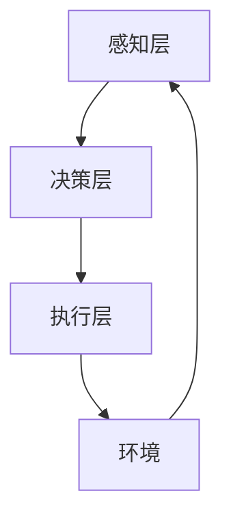
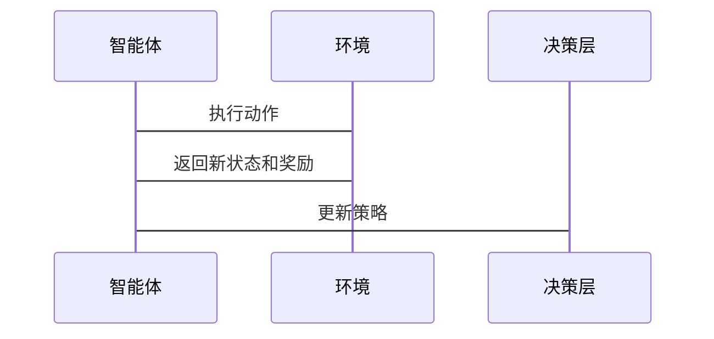

                 


# 如何识别企业的深度强化学习技术优势

> 关键词：深度强化学习，技术优势，企业识别，算法原理，系统架构，项目实战

> 摘要：深度强化学习（Deep Reinforcement Learning, DRL）作为一种结合了深度学习和强化学习的技术，近年来在多个领域取得了显著的应用成果。本文旨在帮助读者识别企业在深度强化学习技术方面的优势，从基本概念、算法原理、系统架构到实际项目案例，全面解析深度强化学习的核心优势及其在企业中的应用价值。

---

## 第一部分：深度强化学习技术背景

### 第1章：深度强化学习的基本概念

#### 1.1 强化学习的定义与特点
强化学习是一种通过智能体与环境交互来学习最优策略的机器学习方法。其核心在于智能体通过不断尝试和错误，逐步优化自身的行为策略，以最大化累计奖励。

- **特点**：
  - **目标导向**：通过最大化累积奖励来优化行为。
  - **经验驱动**：依赖于与环境的交互经验，而非大量标注数据。
  - **实时反馈**：通过即时奖励信号指导策略优化。

#### 1.2 深度强化学习的引入与优势
深度强化学习结合了深度学习强大的特征表示能力和强化学习的决策优化能力，能够处理高维、复杂的状态和动作空间。

- **优势**：
  - **处理复杂状态**：深度神经网络能够自动提取复杂状态的特征表示。
  - **端到端学习**：直接从输入到输出进行端到端优化。
  - **泛化能力**：能够处理未见过的新状态和动作。

#### 1.3 深度强化学习与传统机器学习的区别
| 特性             | 深度强化学习                | 传统机器学习                |
|------------------|---------------------------|-----------------------------|
| 数据类型         | 多为非结构化数据（如图像、文本） | 结构化数据为主               |
| 优化目标         | 最大化累积奖励              | 最小化误差或分类错误          |
| 交互性           | 强调与环境的实时交互        | 主要依赖于静态数据集          |
| 应用场景         | 游戏AI、机器人控制、自动驾驶   | 分类、回归、聚类等问题        |

#### 1.4 本章小结
本章介绍了深度强化学习的基本概念、特点、优势以及与传统机器学习的区别，为后续章节的学习奠定了基础。

---

## 第二部分：深度强化学习技术的核心概念与原理

### 第2章：深度强化学习的核心概念

#### 2.1 策略与价值函数
- **策略函数（Policy Function）**：定义智能体在给定状态下应采取的动作。策略函数通常用概率分布表示，即策略网络输出每个动作的概率。
  - **策略网络结构**：通常采用卷积神经网络（CNN）或循环神经网络（RNN）。
  - **策略优化目标**：最大化所选动作的累积奖励。
- **价值函数（Value Function）**：衡量智能体在某一状态下的优劣程度，通常以期望的累积奖励为目标。
  - **价值网络结构**：同样采用深度神经网络，输出的是状态的价值。
  - **价值优化目标**：最大化当前状态的价值。

#### 2.2 神经网络在深度强化学习中的应用
- **神经网络的作用**：深度强化学习依赖于神经网络来近似策略或价值函数，从而实现端到端的优化。
- **神经网络的训练**：强化学习的神经网络通常采用经验回放和目标网络等技术来稳定训练过程。

#### 2.3 动作空间与状态空间
- **动作空间（Action Space）**：智能体可执行的所有动作的集合。
  - **离散动作空间**：如游戏中的移动方向选择。
  - **连续动作空间**：如自动驾驶中的油门和刹车控制。
- **状态空间（State Space）**：智能体所处环境的所有可能状态的集合。
  - **离散状态空间**：如棋盘游戏中的棋子位置。
  - **连续状态空间**：如自动驾驶中的车速和距离等连续变量。

#### 2.4 深度强化学习的数学模型与公式
- **策略梯度方法**：
  $$ \nabla J(\theta) = E\left[ \nabla \log \pi_\theta(s,a) \cdot Q(s,a) \right] $$
  其中，\( \pi_\theta(s,a) \) 是策略函数，\( Q(s,a) \) 是价值函数。
- **Q-learning方法**：
  $$ Q(s,a) = Q(s,a) + \alpha \left( r + \gamma \max Q(s',a') - Q(s,a) \right) $$

#### 2.5 本章小结
本章详细讲解了深度强化学习中的核心概念，包括策略、价值函数、神经网络以及动作和状态空间，并通过数学公式和对比分析帮助读者理解这些概念之间的联系。

---

## 第三部分：深度强化学习技术的算法原理

### 第3章：深度强化学习的主要算法

#### 3.1 DQN算法
- **基本原理**：DQN通过经验回放和目标网络来稳定强化学习的训练过程。
- **网络结构**：
  - **主网络**：用于评估当前状态的价值。
  - **目标网络**：用于稳定目标值的更新。
- **训练流程**：
  1. 环境中获取经验（状态、动作、奖励、新状态）。
  2. 将经验存储在经验回放池中。
  3. 从池中随机抽取小批量经验进行训练。
  4. 更新主网络，逐步逼近目标网络。

#### 3.2 政策梯度算法
- **基本原理**：直接优化策略函数，通过梯度上升方法最大化累积奖励。
- **网络结构**：
  - **策略网络**：输出每个动作的概率分布。
  - **价值网络**：辅助估计状态价值，用于稳定训练过程。
- **训练流程**：
  1. 采样动作并执行，得到奖励。
  2. 计算策略梯度，更新策略网络参数。

#### 3.3 A3C算法
- **基本原理**：采用异步并行策略，多个智能体同时在不同环境实例中进行训练。
- **网络结构**：使用相同的策略和价值网络结构。
- **训练流程**：
  1. 各智能体并行收集经验。
  2. 经验通过队列传递到主进程。
  3. 主进程统一更新网络参数。

#### 3.4 PPO算法
- **基本原理**：通过限制策略更新的幅度，确保策略优化的稳定性。
- **网络结构**：与A3C类似，采用策略和价值网络。
- **训练流程**：
  1. 采样经验并计算优势值。
  2. 分阶段优化策略和价值函数。

#### 3.5 算法对比分析
| 算法   | 优点                     | 缺点                     |
|--------|--------------------------|--------------------------|
| DQN    | 稳定性高，适合离散动作空间 | 训练速度较慢，适合简单环境 |
| PG     | 端到端优化，适合复杂任务   | 需要连续动作空间支持       |
| A3C    | 并行训练效率高             | 网络更新复杂              |
| PPO    | 稳定性好，适合复杂任务     | 对环境依赖性强            |

#### 3.6 本章小结
本章介绍了深度强化学习中的主要算法，包括DQN、PG、A3C和PPO，并通过对比分析帮助读者理解不同算法的优缺点及其适用场景。

---

## 第四部分：深度强化学习技术的系统架构设计

### 第4章：深度强化学习的系统架构

#### 4.1 问题场景介绍
- **目标**：构建一个深度强化学习系统，用于解决特定任务（如游戏AI、机器人控制）。
- **输入**：状态空间、动作空间、奖励函数。
- **输出**：优化后的策略或价值函数。

#### 4.2 系统功能设计
- **领域模型**：通过领域知识构建状态和动作的映射关系。
- **系统架构**：包括感知层、决策层和执行层。
- **接口设计**：定义系统与外部环境的交互接口。

#### 4.3 系统架构图


#### 4.4 系统交互流程


#### 4.5 本章小结
本章从系统架构的角度，详细设计了深度强化学习系统的组成和交互流程，为后续的项目实现奠定了基础。

---

## 第五部分：深度强化学习技术的项目实战

### 第5章：深度强化学习的项目实现

#### 5.1 环境安装
- **安装依赖**：Python、TensorFlow、Keras、OpenAI Gym。
- **环境配置**：配置虚拟环境，安装必要的库。

#### 5.2 核心实现
- **DQN算法实现**：
  ```python
  import numpy as np
  import tensorflow as tf
  from tensorflow.keras import layers

  class DQN:
      def __init__(self, state_space, action_space):
          self.state_space = state_space
          self.action_space = action_space
          self.model = self.build_model()

      def build_model(self):
          model = tf.keras.Sequential([
              layers.Dense(64, activation='relu'),
              layers.Dense(64, activation='relu'),
              layers.Dense(self.action_space, activation='linear')
          ])
          return model
  ```

- **训练过程**：
  ```python
  dqn = DQN(state_space, action_space)
  for episode in range(1000):
      state = env.reset()
      while not done:
          action = dqn.act(state)
          next_state, reward, done = env.step(action)
          dqn.remember(state, action, reward, next_state)
          dqn.train()
  ```

#### 5.3 案例分析
- **案例1**：游戏AI训练，通过DQN算法实现游戏自动玩胜。
- **案例2**：机器人控制，通过强化学习优化运动轨迹。

#### 5.4 项目小结
本章通过具体的项目实现，展示了深度强化学习技术的实际应用，并对实现过程中的关键点进行了详细解读。

---

## 第六部分：总结与展望

### 第6章：总结与展望

#### 6.1 全文总结
深度强化学习结合了深度学习的特征表示能力和强化学习的决策优化能力，能够有效解决复杂任务中的决策问题。本文从基本概念、算法原理到系统架构和项目实战，全面解析了深度强化学习的核心优势及其在企业中的应用价值。

#### 6.2 最佳实践
- **选择合适的算法**：根据任务类型选择DQN、PG、A3C或PPO等算法。
- **优化系统架构**：设计高效的系统架构，确保系统的可扩展性和稳定性。
- **注重经验积累**：通过经验回放和策略优化，提升系统的泛化能力和学习效率。

#### 6.3 注意事项
- **数据质量**：强化学习依赖于高质量的环境反馈，需确保环境设计的合理性。
- **计算资源**：深度强化学习需要大量的计算资源，需优化硬件配置和算法效率。
- **伦理与安全**：确保深度强化学习系统的应用符合伦理规范，避免潜在的安全风险。

#### 6.4 拓展阅读
- 《Deep Reinforcement Learning: Theory and Algorithms》
- 《Reinforcement Learning: An Introduction》
- 《Hands-On Machine Learning with Scikit-Learn, Keras, and TensorFlow》

#### 6.5 本章小结
本文总结了深度强化学习的核心内容，并给出了实际应用中的注意事项和拓展阅读建议，为读者进一步学习和实践提供了指导。

---

## 作者：AI天才研究院/AI Genius Institute & 禅与计算机程序设计艺术 /Zen And The Art of Computer Programming

