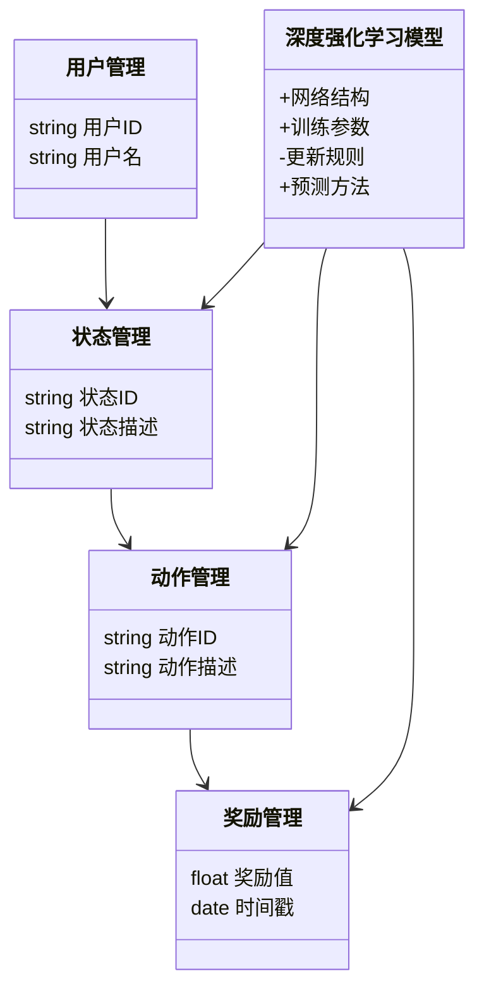
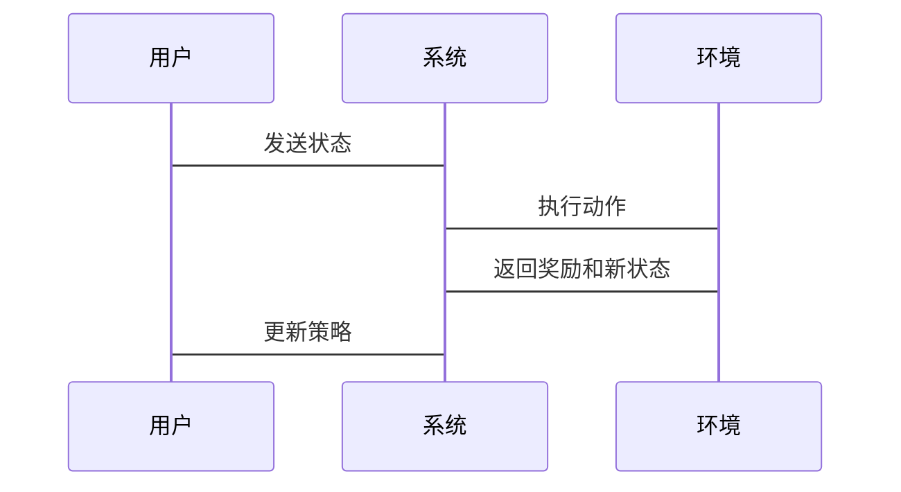

                 

<think>
好的，现在我要根据用户的要求，逐步构建一个详细的《如何识别企业的深度强化学习控制系统优势》的技术博客文章。我会按照目录大纲的结构，逐部分进行撰写，确保每个部分都涵盖必要的内容，并且逻辑清晰，结构完整。

---

# 如何识别企业的深度强化学习控制系统优势

> **关键词**：深度强化学习、控制系统、企业优势、算法原理、系统架构  
> **摘要**：本文旨在探讨企业在应用深度强化学习控制系统时的优势识别方法。通过详细分析系统的背景、核心概念、算法原理、系统架构、项目实战及最佳实践，帮助读者理解如何在企业中有效识别和利用深度强化学习控制系统的潜力。

---

## 第一部分：背景介绍

### 第1章：深度强化

---

#### 1.1 问题背景

在现代企业中，复杂的控制系统和决策过程往往依赖传统的规则或简单的逻辑算法，这些方法在面对动态变化和复杂环境时显得力不从心。深度强化学习（Deep Reinforcement Learning, DRL）作为一种结合了深度学习和强化学习的技术，为企业提供了更高效、更灵活的解决方案。

#### 1.2 问题描述

企业的控制系统通常需要应对多变的市场环境、复杂的业务流程和多样化的用户需求。传统的控制系统在处理这些问题时，往往难以快速适应变化，导致效率低下或决策失误。

#### 1.3 问题解决

深度强化学习通过模拟和学习，能够在复杂的环境中找到最优解决方案。它通过与环境的交互，不断优化策略，从而提高控制系统的效率和准确性。

#### 1.4 边界与外延

深度强化学习控制系统的应用范围包括生产优化、资源分配、供应链管理等领域。其边界在于复杂的动态环境和高维状态空间，而外延则涉及与传统控制方法的结合。

#### 1.5 概念结构

深度强化学习控制系统由环境、动作、状态、奖励、策略和学习过程等核心要素组成。这些要素通过相互作用，形成一个闭环的反馈系统，不断优化控制策略。

---

## 第二部分：核心概念与联系

### 第2章：深度强化

---

#### 2.1 深度强化学习控制系统原理

深度强化学习结合了深度学习的特征提取能力和强化学习的决策优化能力。通过神经网络作为价值函数逼近器，系统能够从经验中学习最优策略。

#### 2.2 核心要素对比

| **要素**       | **传统控制系统** | **深度强化学习控制系统** |
|----------------|------------------|---------------------------|
| 决策方式       | 基于规则或逻辑  | 基于学习和经验            |
| 状态空间       | 低维             | 高维或复杂                |
| 策略优化       | 手动调整          | 自动优化                  |
| 适应性         | 较低             | 较高                      |

#### 2.3 实体关系图

以下是深度强化学习控制系统的核心要素ER图：

```mermaid
erDiagram
    actor 用户 {
        string 用户ID
        string 用户名
    }
    actor 环境 {
        string 环境ID
        string 环境描述
    }
    class 状态 {
        string 状态ID
        string 状态描述
    }
    class 动作 {
        string 动作ID
        string 动作描述
    }
    class 奖励 {
        float 奖励值
        date 时间戳
    }
    状态 --> 奖励: 导致
    动作 --> 状态: 引发
    用户 --> 环境: 与环境交互
    深度强化学习模型 --> 状态
    深度强化学习模型 --> 动作
    深度强化学习模型 --> 奖励
```

---

## 第三部分：算法原理讲解

### 第3章：深度强化

---

#### 3.1 算法原理

深度强化学习的核心算法包括Q-learning和Deep Q-Networks（DQN）。DQN通过神经网络近似Q值函数，克服了传统Q-learning在高维状态空间中的局限性。

#### 3.2 算法流程

以下是DQN算法的流程图：

```mermaid
graph TD
    A[初始化网络参数θ] --> B[初始化经验回放池]
    B --> C[接收状态s]
    C --> D[选择动作a]
    D --> E[执行动作a，获得奖励r和新状态s']
    E --> F[将(s, a, r, s')存入经验回放池]
    F --> G[从经验回放池中随机采样小批量数据]
    G --> H[计算目标Q值]
    H --> I[计算损失函数]
    I --> J[更新网络参数θ]
    J --> A[返回到A，继续循环]
```

#### 3.3 代码实现

以下是DQN算法的Python代码示例：

```python
import numpy as np
import tensorflow as tf

class DQN:
    def __init__(self, state_space, action_space, learning_rate=0.01):
        self.state_space = state_space
        self.action_space = action_space
        self.learning_rate = learning_rate
        self.model = self.build_model()
        self.target_model = self.build_model()
        self.target_update()

    def build_model(self):
        model = tf.keras.Sequential([
            tf.keras.layers.Dense(64, activation='relu', input_dim=self.state_space),
            tf.keras.layers.Dense(64, activation='relu'),
            tf.keras.layers.Dense(self.action_space, activation='linear')
        ])
        model.compile(optimizer=tf.keras.optimizers.Adam(lr=self.learning_rate), loss='mean_squared_error')
        return model

    def target_update(self):
        self.target_model.set_weights(self.model.get_weights())

    def act(self, state):
        state = np.array([state])
        prediction = self.model.predict(state)
        return np.argmax(prediction[0])

    def train(self, state, action, reward, next_state):
        state = np.array([state])
        next_state = np.array([next_state])
        target = self.target_model.predict(state)
        target[0][action] = reward + np.max(self.target_model.predict(next_state))
        self.model.fit(state, target, epochs=1, verbose=0)
```

#### 3.4 数学模型

深度强化学习的核心数学模型是Q值更新公式：

$$ Q(s, a) = Q(s, a) + \alpha (r + \gamma \max Q(s', a') - Q(s, a)) $$

其中，$\alpha$ 是学习率，$\gamma$ 是折扣因子。

---

## 第四部分：系统分析与架构设计方案

### 第4章：深度强化

---

#### 4.1 问题场景

企业中的供应链管理系统可以通过深度强化学习优化库存控制和订单调度。

#### 4.2 系统功能设计

以下是系统功能设计的类图：



#### 4.3 系统架构设计

以下是系统的架构图：


#### 4.4 系统交互

以下是系统的交互图：



---

## 第五部分：项目实战

### 第5章：深度强化

---

#### 5.1 环境安装

安装所需的Python库：

```bash
pip install numpy tensorflow-gpu keras
```

#### 5.2 核心代码实现

以下是供应链管理系统的DQN实现：

```python
import numpy as np
import tensorflow as tf

class DQNSupplyChain:
    def __init__(self, state_space, action_space, learning_rate=0.01):
        self.state_space = state_space
        self.action_space = action_space
        self.learning_rate = learning_rate
        self.model = self.build_model()
        self.target_model = self.build_model()
        self.target_update()

    def build_model(self):
        model = tf.keras.Sequential([
            tf.keras.layers.Dense(64, activation='relu', input_dim=self.state_space),
            tf.keras.layers.Dense(64, activation='relu'),
            tf.keras.layers.Dense(self.action_space, activation='linear')
        ])
        model.compile(optimizer=tf.keras.optimizers.Adam(lr=self.learning_rate), loss='mean_squared_error')
        return model

    def target_update(self):
        self.target_model.set_weights(self.model.get_weights())

    def act(self, state):
        state = np.array([state])
        prediction = self.model.predict(state)
        return np.argmax(prediction[0])

    def train(self, state, action, reward, next_state):
        state = np.array([state])
        next_state = np.array([next_state])
        target = self.target_model.predict(state)
        target[0][action] = reward + np.max(self.target_model.predict(next_state))
        self.model.fit(state, target, epochs=1, verbose=0)

# 示例使用
state_space = 4  # 状态空间维度
action_space = 3  # 动作空间维度
dqn = DQNSupplyChain(state_space, action_space)
state = np.random.random(state_space)
action = dqn.act(state)
reward = 0.99  # 假设获得奖励
next_state = np.random.random(state_space)
dqn.train(state, action, reward, next_state)
```

#### 5.3 实际案例分析

在供应链管理中，深度强化学习可以优化库存水平，减少缺货和过剩的情况，从而降低成本。

---

## 第六部分：总结与展望

### 第6章：深度强化

---

#### 6.1 最佳实践

- 确保数据质量，提供多样化的经验。
- 合理设置奖励机制，引导系统向期望的方向发展。
- 定期更新模型，适应环境的变化。

#### 6.2 小结

深度强化学习为企业提供了优化控制系统的新思路。通过不断学习和优化，系统能够适应复杂的动态环境，提高效率和准确性。

#### 6.3 注意事项

- 深度强化学习需要大量的计算资源和时间，企业在实施前需做好充分准备。
- 确保系统的安全性，避免恶意攻击和数据泄露。

#### 6.4 拓展阅读

建议进一步学习强化学习的经典算法（如DQN、PPO）以及在不同领域的应用案例。

---

**作者：AI天才研究院/AI Genius Institute & 禅与计算机程序设计艺术 /Zen And The Art of Computer Programming**

