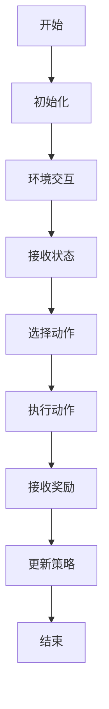
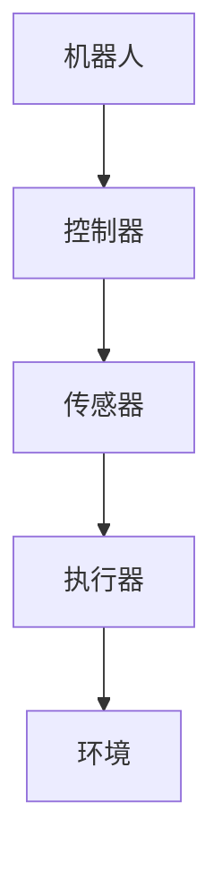

                 


# 如何识别企业的深度强化学习机器人控制优势

> 关键词：深度强化学习，机器人控制，企业优势，技术应用，算法原理，数学模型

> 摘要：本文旨在探讨深度强化学习在机器人控制中的应用，通过分析其核心原理、数学模型及系统架构，帮助企业识别在机器人控制领域的竞争优势。文章从背景介绍、算法流程、数学模型、系统架构、项目实战等多个维度展开，结合实例分析和最佳实践，为企业提供深度强化学习机器人控制的全面解决方案。

---

## 第1章: 问题背景与核心概念

### 1.1 问题背景

#### 1.1.1 机器人控制的现状与挑战
现代机器人控制技术广泛应用于工业自动化、服务机器人、医疗设备等领域。然而，传统基于规则的控制方法在面对复杂动态环境时，往往显得力不从心。例如，在工业生产中，生产线上的设备需要在动态变化的环境中实时调整策略，传统的预设规则难以应对突发情况，导致效率低下甚至设备损坏。

#### 1.1.2 深度强化学习在机器人控制中的作用
深度强化学习（Deep Reinforcement Learning, DRL）通过结合深度学习强大的特征表示能力和强化学习的决策优化能力，为机器人控制提供了更灵活、更智能的解决方案。例如，DRL可以通过不断试错，学习到最优的控制策略，从而在动态环境中实现高效、稳定的机器人操作。

#### 1.1.3 企业的竞争优势与技术需求
在市场竞争日益激烈的今天，企业需要通过技术创新来提升生产效率、降低成本。深度强化学习技术的应用可以帮助企业实现机器人控制的智能化升级，从而在同行业中获得竞争优势。

---

### 1.2 核心概念与定义

#### 1.2.1 深度强化学习的定义
深度强化学习是将深度学习与强化学习相结合的技术。深度学习负责从高维数据中提取特征，强化学习通过试错机制优化决策策略。

#### 1.2.2 机器人控制的定义
机器人控制是指通过传感器获取环境信息，经过计算处理后，向执行机构发送指令，以实现预期动作的过程。

#### 1.2.3 两者的结合与应用
深度强化学习通过模拟机器人与环境的交互，学习最优控制策略，从而实现机器人在复杂环境中的自主决策。

---

### 1.3 核心概念的联系与对比

#### 1.3.1 深度强化学习与传统强化学习的区别
| **对比维度** | **传统强化学习** | **深度强化学习** |
|--------------|------------------|------------------|
| 特征表示     | 基于低维特征     | 基于高维深度特征 |
| 决策策略     | 策略固定或有限   | 策略动态优化     |
| 应用场景     | 简单动态环境     | 复杂动态环境     |

#### 1.3.2 机器人控制中的状态空间与动作空间
- **状态空间**：机器人在环境中的感知信息，如位置、速度、传感器数据等。
- **动作空间**：机器人可以执行的动作，如转动、移动、抓取等。

#### 1.3.3 企业应用中的优势对比
企业采用深度强化学习技术可以实现以下优势：
1. 提高机器人控制的智能化水平。
2. 降低人工干预的需求。
3. 提升机器人在复杂环境中的适应能力。

---

## 第2章: 深度强化学习的核心原理

### 2.1 算法原理与流程

#### 2.1.1 算法流程图（mermaid）



---

### 2.2 数学模型与公式

#### 2.2.1 状态值函数
$$ V(s) = \max_a Q(s,a) $$

#### 2.2.2 Q-learning算法
$$ Q(s,a) = Q(s,a) + \alpha (r + \gamma \max_a Q(s',a) - Q(s,a)) $$

---

### 2.3 实例分析

#### 2.3.1 简单机器人导航问题
假设一个机器人需要在二维平面上从起点移动到目标点，避开障碍物。深度强化学习通过试错学习，找到最优路径。

#### 2.3.2 动作选择与奖励机制
- **动作选择**：机器人在每个时间步选择移动方向。
- **奖励机制**：距离目标点越近，奖励越高；碰撞障碍物，奖励降低。

---

## 第3章: 机器人控制的数学模型

### 3.1 状态空间建模

#### 3.1.1 状态空间的定义与特征
状态空间是机器人在环境中的所有可能状态的集合，包括位置、速度、传感器数据等。

#### 3.1.2 状态空间的维度分析
状态空间的维度取决于机器人感知的维度。例如，二维平面导航问题，状态空间维度为2。

---

### 3.2 动作空间建模

#### 3.2.1 动作空间的定义与特征
动作空间是机器人可以执行的所有动作的集合，如前进、后退、左转、右转。

#### 3.2.2 动作空间的维度分析
动作空间的维度取决于机器人的动作类型。例如，二维平面导航问题，动作空间维度为4。

---

### 3.3 系统架构设计

#### 3.3.1 系统架构图（mermaid）



---

## 第4章: 深度强化学习在机器人控制中的应用

### 4.1 实时控制与优化

#### 4.1.1 实时控制的挑战
- 动态环境中的快速决策。
- 高维状态空间的处理效率。

#### 4.1.2 基于深度强化学习的优化策略
通过深度强化学习，机器人可以在实时环境中快速调整策略，实现最优控制。

---

### 4.2 多机器人协作与协调

#### 4.2.1 多机器人协作的挑战
- 机器人之间的通信与协调。
- 集体目标的达成。

#### 4.2.2 基于深度强化学习的协作策略
通过深度强化学习，机器人可以实现自主协作，共同完成复杂任务。

---

## 第5章: 项目实战

### 5.1 环境搭建与安装

#### 5.1.1 环境搭建步骤
1. 安装Python。
2. 安装深度强化学习库（如TensorFlow、Keras）。
3. 安装机器人控制库（如ROS）。

---

### 5.2 核心实现源代码

```python
import numpy as np
import tensorflow as tf

# 定义Q网络
class QNetwork:
    def __init__(self, state_dim, action_dim):
        self.model = tf.keras.Sequential([
            tf.keras.layers.Dense(64, activation='relu', input_shape=(state_dim,)),
            tf.keras.layers.Dense(action_dim)
        ])
    
    def call(self, state):
        return self.model(state)

# 定义深度强化学习算法
class DeepRLAlgorithm:
    def __init__(self, state_dim, action_dim):
        self.q_network = QNetwork(state_dim, action_dim)
        self.target_network = QNetwork(state_dim, action_dim)
        self.optimizer = tf.keras.optimizers.Adam(learning_rate=0.001)
    
    def update(self, states, actions, rewards, next_states):
        # 计算目标Q值
        target_Q = self.target_network.call(next_states).numpy().max(axis=1)
        target_Q = rewards + 0.99 * target_Q
        
        # 计算当前Q值
        current_Q = self.q_network.call(states).numpy()[np.arange(len(actions)), actions]
        
        # 更新Q网络
        loss = tf.keras.losses.mean_squared_error(target_Q, current_Q)
        self.q_network.model.trainable_variables[0].assign(
            self.q_network.model.trainable_variables[0] - 0.1*(tf.gradients(loss, self.q_network.model.trainable_variables)[0])
        )
    
    def get_action(self, state):
        q_values = self.q_network.call(state).numpy()
        return np.argmax(q_values)
```

---

### 5.3 案例分析与解读

#### 5.3.1 案例背景
假设我们有一个工业机器人，需要在动态生产线上抓取零件。使用深度强化学习算法，机器人可以在动态环境中快速调整抓取策略。

#### 5.3.2 代码应用解读
- **Q网络**：用于估计当前状态的动作值。
- **目标网络**：用于更新Q网络，确保学习稳定。
- **更新规则**：通过试错机制，优化动作选择。

---

## 第6章: 总结与展望

### 6.1 最佳实践 tips

1. **数据质量**：高质量的环境数据是深度强化学习成功的关键。
2. **算法选择**：根据具体场景选择合适的算法。
3. **系统架构**：确保系统的实时性和稳定性。

### 6.2 小结
深度强化学习为机器人控制提供了强大的工具，通过不断学习和优化，机器人可以在复杂环境中实现高效、智能的控制。

### 6.3 注意事项
- 确保算法的收敛性。
- 处理好机器人与环境的实时交互。

### 6.4 拓展阅读
建议进一步学习强化学习的经典算法（如DQN、PPO）以及机器人控制的最新研究。

---

## 作者：AI天才研究院/AI Genius Institute & 禅与计算机程序设计艺术 /Zen And The Art of Computer Programming

---

希望这篇文章能够帮助您全面了解深度强化学习在机器人控制中的应用，并为企业识别技术优势提供参考。如果需要进一步探讨或扩展内容，请随时联系！

