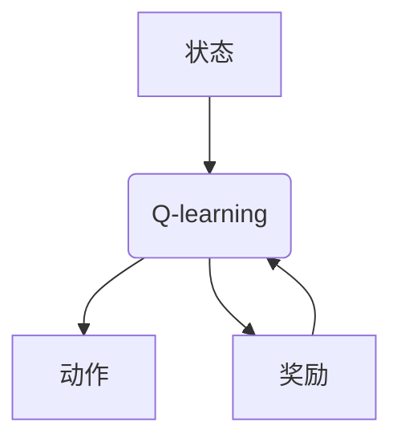
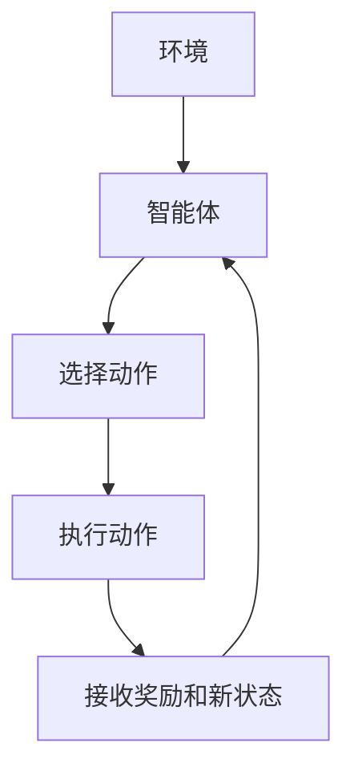
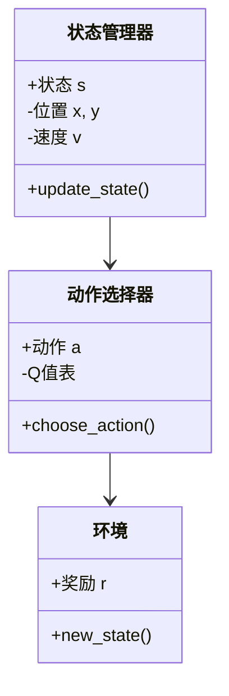

                 

# 如何识别企业的深度强化学习自主导航优势

> 关键词：深度强化学习，自主导航，企业应用，算法原理，系统架构

> 摘要：深度强化学习（Deep Reinforcement Learning，DRL）作为一种革命性的技术，正在为企业自主导航问题提供新的解决方案。本文将从背景介绍、核心概念、算法原理、系统架构、项目实战等多个维度，详细阐述如何识别和应用深度强化学习在企业自主导航中的优势，帮助企业提升智能化水平和竞争优势。

---

## 第一部分：深度强化学习与企业自主导航的背景介绍

### 第1章：深度强化学习的概述

#### 1.1 深度强化学习的核心概念

##### 1.1.1 问题背景与问题描述
深度强化学习（DRL）是一种结合了深度学习和强化学习的新兴技术。强化学习通过智能体与环境的交互，学习最优策略；而深度学习则提供了强大的特征提取能力。DRL的优势在于能够处理高维、复杂、动态的环境，适用于自动驾驶、游戏AI、机器人控制等领域。

##### 1.1.2 问题解决的思路与方法
DRL的核心思路是通过神经网络逼近策略或价值函数，实现对复杂环境的决策优化。智能体通过与环境交互，不断调整策略，以最大化累计奖励。

##### 1.1.3 概念的边界与外延
DRL不仅限于简单的状态-动作空间，还可以处理图像、文本等高维输入。其外延包括多智能体协作、在线学习、元学习等。

##### 1.1.4 核心要素与组成结构
- **智能体（Agent）**：决策者，通过感知环境做出动作。
- **环境（Environment）**：智能体所处的外部世界，提供状态和奖励。
- **状态（State）**：环境的当前情况，输入给智能体。
- **动作（Action）**：智能体对环境的操作。
- **奖励（Reward）**：环境对智能体行为的反馈，指导学习方向。

---

### 第2章：企业中的自主导航问题

#### 2.1 自主导航的定义与特点

##### 2.1.1 自主导航的核心要素
- **自主性**：无需外部干预，自主完成任务。
- **适应性**：动态环境中灵活调整策略。
- **高效性**：快速决策，减少计算开销。

##### 2.1.2 自主导航与企业业务的结合
在企业中，自主导航技术可应用于物流调度、设备控制、数据分析等领域，提升效率和降低成本。

##### 2.1.3 自主导航的挑战与机遇
- **挑战**：动态环境的不确定性，多目标优化的复杂性。
- **机遇**：智能化转型，提升企业竞争力。

---

## 第二部分：深度强化学习的核心概念与联系

### 第5章：深度强化学习的基本原理

#### 5.1 深度强化学习的原理

##### 5.1.1 Q-learning算法原理

Q-learning通过更新Q值表，记录状态-动作对的期望奖励，选择最优动作。公式如下：

$$ Q(s, a) = Q(s, a) + \alpha [r + \max Q(s', a') - Q(s, a)] $$

其中：
- $\alpha$：学习率
- $r$：即时奖励
- $s'$：下一状态

---

### 第6章：深度强化学习的核心算法

#### 6.1 DQN算法的原理与实现

##### 6.1.1 DQN算法的数学模型

状态值函数：

$$ V(s) = \max_a Q(s, a) $$

动作选择策略：

$$ \pi(a|s) = \text{argmax}_a Q(s, a) $$

##### 6.1.2 DQN算法的流程图

---

## 第三部分：深度强化学习的系统分析与架构设计

### 第7章：深度强化学习与自主导航的关系

#### 7.1 自主导航中的状态空间建模

##### 7.1.1 状态空间的定义与构建

状态空间包括位置、速度、障碍物信息等。例如，在物流调度中，状态可以表示为：

$$ s = (x, y, v, o) $$

其中：
- $x$：x坐标
- $y$：y坐标
- $v$：速度
- $o$：障碍物信息

##### 7.1.2 状态空间的特征提取

通过深度神经网络提取高维特征，例如：

$$ f(s) = \text{DNN}(s) $$

---

## 第四部分：深度强化学习的项目实战

### 第8章：深度强化学习在企业自主导航中的应用

#### 8.1 项目背景

以物流仓储为例，智能机器人需要在动态环境中自主导航，完成货物运输。

#### 8.2 系统功能设计

##### 8.2.1 领域模型设计

---

## 第五部分：总结与展望

### 第9章：深度强化学习的未来趋势

#### 9.1 最佳实践 tips

- 数据质量至关重要，需确保训练数据的多样性和代表性。
- 在实际应用中，需结合具体场景调整超参数，优化算法性能。

#### 9.2 小结

深度强化学习为企业自主导航提供了强大的技术支撑，通过不断学习和优化，能够显著提升企业的智能化水平和竞争力。

#### 9.3 注意事项

- 避免过度依赖算法，需结合企业实际需求设计合理的解决方案。
- 注重算法的可解释性，确保决策过程透明可控。

#### 9.4 拓展阅读

推荐阅读《Deep Reinforcement Learning: A Tutorial》和《Reinforcement Learning: Theory and Algorithms》。

---

## 作者信息

作者：AI天才研究院（AI Genius Institute） & 禅与计算机程序设计艺术（Zen And The Art of Computer Programming）

---

通过以上结构化的内容，您可以逐步展开每一部分的详细阐述，确保文章内容完整且符合技术博客的风格要求。

