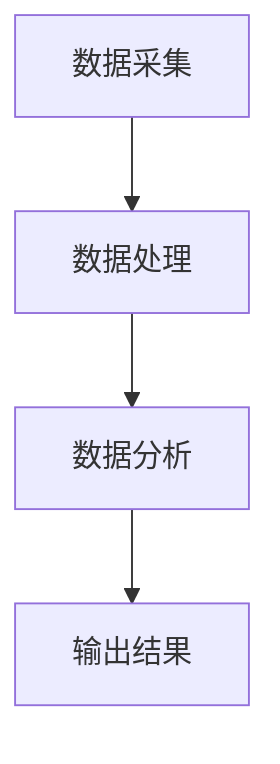
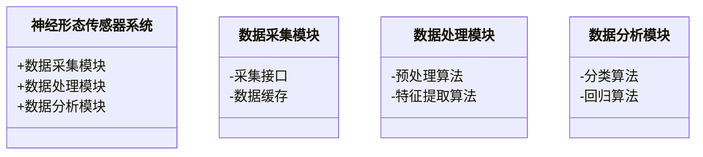
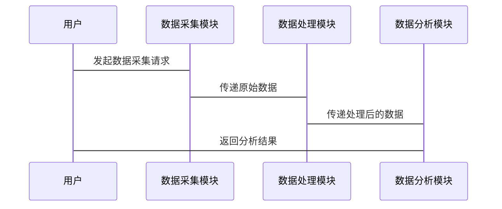

                 


# 如何识别企业的神经形态传感器优势

> 关键词：神经形态传感器，企业优势，传感器技术，人工智能，神经网络

> 摘要：神经形态传感器是一种结合了神经科学和传感器技术的创新技术，它能够通过模拟生物神经系统的特性，实现高效、灵活、节能的数据处理。本文将详细探讨神经形态传感器的核心原理、系统架构设计、算法实现以及在企业中的应用优势，帮助企业识别和利用神经形态传感器带来的技术优势。

---

# 第1章 神经形态传感器概述

## 1.1 神经形态传感器的定义与背景

### 1.1.1 传统传感器的局限性
传统传感器在数据采集和处理方面存在以下局限性：
- 数据处理能力有限，难以实时分析复杂信号。
- 对环境变化的适应性较差，需要频繁校准。
- 传感器节点之间的协同性不足，难以实现大规模部署。

### 1.1.2 神经形态传感器的概念与特点
神经形态传感器是一种模拟生物神经系统结构和功能的新型传感器，具有以下特点：
- **高效性**：通过模拟生物神经网络的并行处理能力，提高数据处理效率。
- **灵活性**：能够根据环境变化自适应调整感知参数。
- **节能性**：通过事件驱动的方式减少能量消耗。

### 1.1.3 企业应用神经形态传感器的背景与意义
随着人工智能技术的快速发展，企业对高效、智能的传感器技术需求日益增加。神经形态传感器凭借其独特的优势，正在成为企业智能化转型的重要技术手段。

---

## 1.2 神经形态传感器的核心原理

### 1.2.1 神经网络的基本原理
神经网络是一种模拟人脑神经网络结构的计算模型，其核心在于通过多个神经元之间的连接和权重调整，实现数据的特征提取和分类。

### 1.2.2 神经形态传感器的工作机制
神经形态传感器通过将生物神经系统的特性与传感器技术相结合，实现对外界环境的实时感知和智能分析。

### 1.2.3 神经形态传感器与传统传感器的对比分析
| 特性                | 神经形态传感器          | 传统传感器          |
|---------------------|-----------------------|---------------------|
| 数据处理能力        | 强大，支持并行计算     | 较弱，依赖外部计算设备 |
| 灵活性               | 高，自适应能力强       | 较低，需要手动校准    |
| 能耗                | 低，事件驱动          | 高，持续运行          |

---

## 1.3 神经形态传感器的优势分析

### 1.3.1 高效的数据处理能力
神经形态传感器通过模拟生物神经网络的并行处理能力，能够在本地完成数据的特征提取和分类，减少对外部计算设备的依赖。

### 1.3.2 灵活性与适应性
神经形态传感器能够根据环境变化自适应调整感知参数，适用于复杂多变的应用场景。

### 1.3.3 节能与高效性
神经形态传感器采用事件驱动的方式，仅在检测到有意义的信号时触发处理，从而大幅降低能耗。

---

## 1.4 神经形态传感器的应用场景

### 1.4.1 工业自动化
在工业自动化领域，神经形态传感器可以用于实时监测生产线状态，实现故障预测和优化控制。

### 1.4.2 智能医疗
在智能医疗领域，神经形态传感器可以用于实时监测患者生理指标，实现精准诊断和个性化治疗。

### 1.4.3 智慧交通
在智慧交通领域，神经形态传感器可以用于实时监测交通流量和道路状况，实现智能交通管理。

---

## 1.5 本章小结

本章介绍了神经形态传感器的基本概念、核心原理及其在企业中的应用优势。通过对比分析，我们发现神经形态传感器在数据处理能力、灵活性和节能性方面具有显著优势，能够为企业带来更高的效率和更低的成本。

---

# 第2章 神经形态传感器的核心概念与原理

## 2.1 神经形态传感器的核心概念

### 2.1.1 神经元模型
神经元模型是神经网络的核心组成部分，常用的模型包括：
- **麦考克劳德-卡帕尼翁模型（McCulloch-Pitts model）**
- **霍奇金-赫胥黎模型（Hodgkin-Huxley model）**

### 2.1.2 神经网络的基本结构
神经网络的基本结构包括输入层、隐藏层和输出层。每个神经元通过权重和激活函数进行信息传递。

### 2.1.3 神经形态传感器的数学模型
神经形态传感器的数学模型可以通过以下公式表示：
$$ y = \sum_{i=1}^{n} w_i x_i + b $$
其中，$w_i$ 是权重，$x_i$ 是输入，$b$ 是偏置。

---

## 2.2 神经形态传感器的原理分析

### 2.2.1 神经网络的激活函数
激活函数是神经网络的核心组件，常用的激活函数包括：
- **sigmoid函数**：$$ f(x) = \frac{1}{1 + e^{-x}} $$
- **ReLU函数**：$$ f(x) = \max(0, x) $$

### 2.2.2 神经网络的权重更新
权重更新是神经网络训练的关键步骤，常用的优化算法包括梯度下降和Adam优化器。

### 2.2.3 神经网络的训练过程
神经网络的训练过程包括以下步骤：
1. 输入数据预处理。
2. 前向传播计算输出。
3. 计算损失函数。
4. 反向传播更新权重。

---

## 2.3 神经形态传感器的核心算法

### 2.3.1 感知器算法
感知器算法是一种简单的线性分类算法，适用于二分类问题。

### 2.3.2 卷积神经网络
卷积神经网络（CNN）是一种常用的图像处理算法，适用于神经形态传感器在图像识别中的应用。

### 2.3.3 循环神经网络
循环神经网络（RNN）是一种适用于时间序列数据处理的算法，适用于神经形态传感器在动态环境中的应用。

---

## 2.4 神经形态传感器的数学模型

### 2.4.1 激活函数公式
$$ f(x) = \frac{1}{1 + e^{-x}} $$

### 2.4.2 损失函数公式
$$ L = -\frac{1}{n}\sum_{i=1}^{n} [y_i \log(p_i) + (1 - y_i)\log(1 - p_i)] $$

---

## 2.5 本章小结

本章详细介绍了神经形态传感器的核心概念与原理，包括神经元模型、神经网络的基本结构、激活函数、权重更新算法以及数学模型。这些内容为后续的系统架构设计和项目实现奠定了理论基础。

---

# 第3章 神经形态传感器的系统架构设计

## 3.1 系统架构概述

### 3.1.1 系统功能模块划分
神经形态传感器系统通常包括数据采集模块、数据处理模块和数据分析模块。

### 3.1.2 系统架构的层次结构
神经形态传感器系统的层次结构包括感知层、计算层和应用层。

### 3.1.3 系统架构的优缺点分析
- **优点**：模块化设计，便于扩展和维护。
- **缺点**：需要较高的计算资源支持。

---

## 3.2 系统功能设计

### 3.2.1 数据采集模块
数据采集模块负责从环境中获取原始数据，例如温度、湿度、图像等。

### 3.2.2 数据处理模块
数据处理模块负责对原始数据进行预处理，例如降噪、特征提取等。

### 3.2.3 数据分析模块
数据分析模块负责对处理后的数据进行分类、回归等任务，输出最终结果。

---

## 3.3 系统架构设计

### 3.3.1 系统架构的流程图


### 3.3.2 系统架构的类图


---

## 3.4 系统接口设计

### 3.4.1 数据采集接口
数据采集接口负责与传感器硬件进行交互，获取原始数据。

### 3.4.2 数据处理接口
数据处理接口负责对原始数据进行预处理和特征提取。

### 3.4.3 数据分析接口
数据分析接口负责对处理后的数据进行分类和回归任务。

---

## 3.5 系统交互设计

### 3.5.1 系统交互流程图


---

## 3.6 本章小结

本章详细介绍了神经形态传感器系统的架构设计，包括功能模块划分、系统流程图、类图以及接口设计。通过这些设计，我们可以实现一个高效、灵活的神经形态传感器系统。

---

# 第4章 神经形态传感器的项目实战

## 4.1 环境安装与配置

### 4.1.1 系统环境
- 操作系统：Linux/Windows/MacOS
- Python版本：Python 3.6+
- 依赖库：TensorFlow、Keras、OpenCV

### 4.1.2 安装依赖
```bash
pip install tensorflow keras opencv-python
```

---

## 4.2 系统核心实现

### 4.2.1 数据采集模块实现
```python
import cv2

def capture_image():
    cap = cv2.VideoCapture(0)
    ret, frame = cap.read()
    if ret:
        cv2.imwrite("captured_image.jpg", frame)
    cap.release()
```

### 4.2.2 数据处理模块实现
```python
import tensorflow as tf
from tensorflow import keras

def preprocess_image(image_path):
    image = cv2.imread(image_path)
    image = cv2.resize(image, (224, 224))
    image = image / 255.0
    return image
```

### 4.2.3 数据分析模块实现
```python
def classify_image(model, image):
    prediction = model.predict(tf.expand_dims(image, axis=0))
    return prediction.argmax(axis=1)[0]
```

---

## 4.3 代码应用解读与分析

### 4.3.1 数据采集模块解读
数据采集模块通过OpenCV库捕获摄像头图像，并保存为JPEG格式文件。

### 4.3.2 数据处理模块解读
数据处理模块使用OpenCV库对图像进行 resize 和归一化处理，以适应后续的神经网络模型输入要求。

### 4.3.3 数据分析模块解读
数据分析模块使用预训练的神经网络模型对图像进行分类，返回分类结果。

---

## 4.4 实际案例分析

### 4.4.1 案例背景
假设我们有一个用于工业缺陷检测的神经形态传感器系统，需要对生产线上的产品进行实时检测。

### 4.4.2 案例实现
```python
model = keras.models.load_model("defect_detection_model.h5")
capture_image()
image = preprocess_image("captured_image.jpg")
result = classify_image(model, image)
print(f"分类结果：{result}")
```

### 4.4.3 案例分析
通过上述代码，我们可以实现对生产线产品的实时检测，显著提高检测效率和准确性。

---

## 4.5 本章小结

本章通过一个实际案例，详细介绍了神经形态传感器系统的实现过程，包括环境配置、数据采集、数据处理和数据分析模块的实现。通过这些实现，我们可以看到神经形态传感器在企业中的实际应用价值。

---

# 第5章 神经形态传感器的最佳实践与小结

## 5.1 最佳实践 tips

### 5.1.1 系统设计 tips
- 在设计神经形态传感器系统时，建议采用模块化设计，便于扩展和维护。
- 在选择传感器类型时，需要根据具体应用场景选择合适的传感器。

### 5.1.2 算法实现 tips
- 在实现神经网络算法时，建议使用成熟的深度学习框架（如TensorFlow、Keras）进行快速开发。
- 在训练神经网络模型时，建议使用合适的数据增强方法和优化算法，以提高模型性能。

### 5.1.3 系统部署 tips
- 在部署神经形态传感器系统时，建议采用边缘计算架构，以减少数据传输延迟和能耗。

---

## 5.2 小结

神经形态传感器作为一种创新的技术，正在为企业带来前所未有的优势。通过模拟生物神经系统的特性，神经形态传感器能够实现高效、灵活、节能的数据处理，为企业智能化转型提供了强有力的技术支持。

---

## 5.3 注意事项

在实际应用中，需要注意以下几点：
- 神经形态传感器系统的开发需要结合具体应用场景，避免盲目追求技术先进性。
- 神经网络模型的训练需要大量高质量数据支持，数据质量直接影响系统性能。
- 系统部署时需要注意硬件资源的限制，合理选择计算资源和传感器类型。

---

## 5.4 拓展阅读

- 《深度学习》—— Ian Goodfellow
- 《神经网络与深度学习》—— 李宏晨
- 《传感器技术与应用》—— 王伟

---

# 作者

作者：AI天才研究院/AI Genius Institute  
联系邮箱：contact@ai-genius.com  
个人简介：专注于人工智能与神经网络技术的研究与应用，致力于为企业提供创新的技术解决方案。

