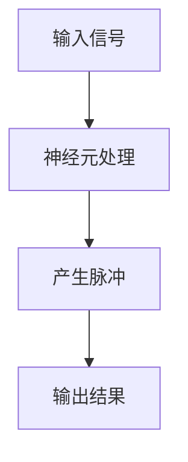
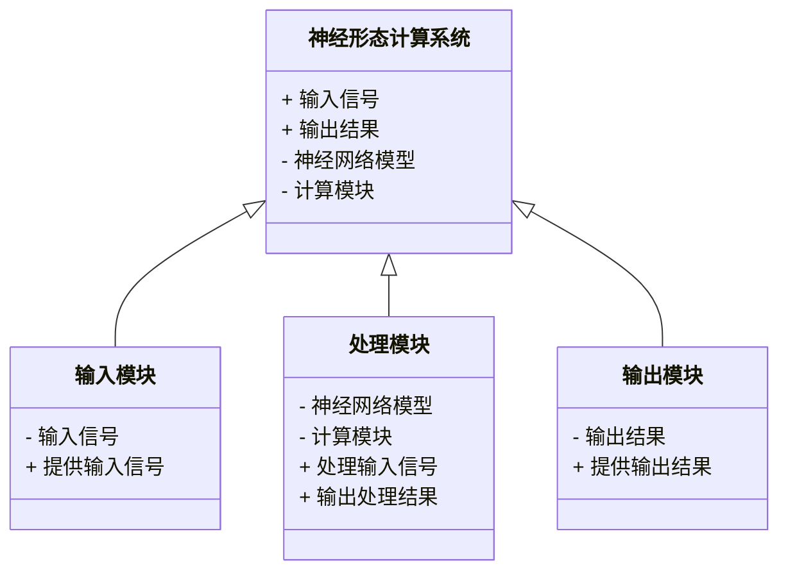
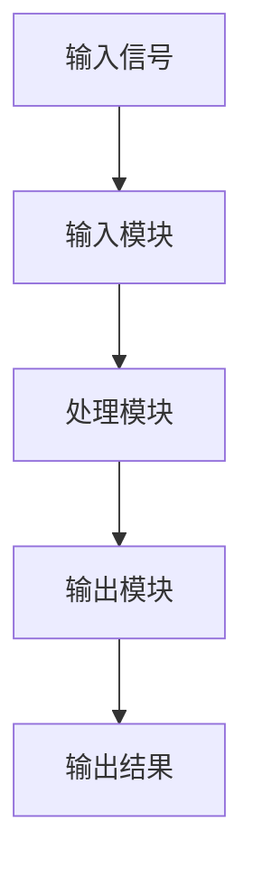
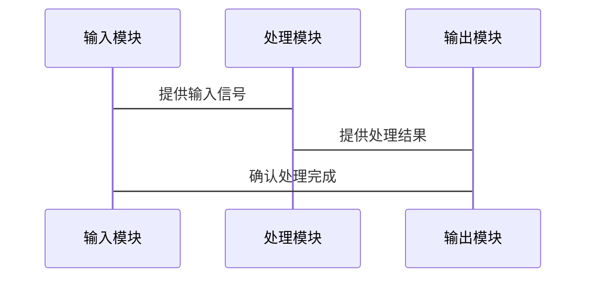

                 


# 如何识别企业的神经形态计算优势

## 关键词：神经形态计算，企业优势，人工智能，计算模式，技术创新

## 摘要：神经形态计算是一种模拟生物神经系统结构和功能的新型计算模式，它通过模拟人脑的神经元和突触的工作原理，实现高效的并行计算。本文将从背景介绍、核心概念、算法原理、系统架构、项目实战等多方面详细阐述神经形态计算的优势，并通过实例分析帮助读者识别和应用神经形态计算在企业中的潜力。

---

# 第一部分: 神经形态计算的背景与概念

## 第1章: 神经形态计算的基本概念

### 1.1 神经形态计算的定义与背景

#### 1.1.1 神经形态计算的定义
神经形态计算（Neuromorphic Computing）是一种模拟生物神经系统结构和功能的计算模式。它通过模拟生物神经元和突触的电活动，实现信息的并行处理和高效计算。

#### 1.1.2 神经形态计算的起源与发展
神经形态计算的概念最早可以追溯到20世纪80年代，美国科学家卡弗·米勒（Carver Mead）提出了神经形态芯片的设计理念。近年来，随着人工智能和硬件技术的发展，神经形态计算逐渐从理论研究走向实际应用。

#### 1.1.3 神经形态计算与传统计算的对比
- **计算模式**：传统计算基于冯·诺依曼架构，依赖CPU和内存的分离；神经形态计算则模拟生物神经网络的结构，强调计算与存储的融合。
- **能效比**：神经形态计算在某些任务（如模式识别）中表现出更高的能效，适合低功耗场景。

### 1.2 神经形态计算的核心优势

#### 1.2.1 高效性与并行性
神经形态计算通过模拟生物神经网络的并行计算能力，能够在复杂任务中实现高效处理。

#### 1.2.2 低功耗特性
神经形态计算芯片通常具有低功耗的特点，适合嵌入式设备和边缘计算场景。

#### 1.2.3 类似人脑的计算模式
神经形态计算能够模拟人脑的学习和自适应能力，适合处理动态环境中的任务。

### 1.3 神经形态计算在企业中的应用前景

#### 1.3.1 企业级应用的潜力
神经形态计算在图像识别、语音处理、自动驾驶等领域具有广泛的应用潜力。

#### 1.3.2 神经形态计算与企业创新
通过引入神经形态计算技术，企业可以提升其产品和服务的智能化水平，增强竞争力。

#### 1.3.3 神经形态计算的市场现状
目前，神经形态计算市场仍处于发展阶段，但随着技术的成熟，市场将快速增长。

### 1.4 本章小结
本章介绍了神经形态计算的基本概念、核心优势以及在企业中的应用前景，为后续内容奠定了基础。

---

# 第二部分: 神经形态计算的核心概念与联系

## 第2章: 神经形态计算的核心原理

### 2.1 生物神经元模型

#### 2.1.1 突触与神经元的基本结构
生物神经元由树突、胞体和轴突组成，突触是神经元之间信息传递的桥梁。

#### 2.1.2 神经元的电活动与信号传递
神经元通过动作电位（Action Potential）传递信息，突触通过释放递质（Neurotransmitter）实现信号传递。

#### 2.1.3 神经网络的基本原理
神经网络由多个神经元通过突触连接形成，能够实现信息的并行处理和学习。

### 2.2 神经形态计算的数学模型

#### 2.2.1 生物神经元的数学建模
经典的神经元模型是霍奇金-哈特线性模型（Hodgkin-Huxley Model），描述了动作电位的产生过程。

$$ I = g_{Na} V_{Na} + g_{K} V_{K} + g_{L} V_{L} + I_{app} $$

#### 2.2.2 脉冲计算的基本原理
脉冲神经网络（SNN，Spiking Neural Network）通过脉冲（Spike）的形式传递信息，模拟生物神经网络的计算方式。

### 2.3 神经形态计算的计算特征对比

| 特性       | 传统计算         | 神经形态计算       |
|------------|------------------|-------------------|
| 并行性      | 串行为主         | 并行性高           |
| 能效比      | 通常较高         | 更高               |
| 灵活性      | 较低             | 较高               |
| 适应性      | 有限             | 强               |

#### 2.3.1 传统计算与神经形态计算的对比
传统计算依赖CPU和内存的分离，而神经形态计算通过模拟生物神经网络实现高效计算。

#### 2.3.2 神经形态计算的特征分析
神经形态计算具有高效性、低功耗和高适应性等特点。

#### 2.3.3 神经形态计算的优劣势总结
优点：高效、低功耗、适应性强；缺点：目前技术尚未完全成熟，应用范围有限。

### 2.4 神经形态计算的ER实体关系图
```mermaid
er
    title 神经形态计算的实体关系图
    神经元 --| 实例化 | 神经网络
    神经网络 --| 组成 | 神经形态计算系统
    神经形态计算系统 --| 应用 | 企业级应用
```

### 2.5 本章小结
本章深入分析了神经形态计算的核心原理，包括生物神经元模型和数学建模，并通过对比分析和ER图展示了其在企业中的应用潜力。

---

# 第三部分: 神经形态计算的算法原理

## 第3章: 神经形态计算的算法模型

### 3.1 神经形态计算的数学模型

#### 3.1.1 生物神经元的数学建模
经典的霍奇金-哈特线性模型描述了神经元的动作电位产生过程。

$$ I = g_{Na} V_{Na} + g_{K} V_{K} + g_{L} V_{L} + I_{app} $$

#### 3.1.2 神经网络的数学表达
神经网络通过权重矩阵和激活函数实现信息的非线性变换。

$$ y = \sigma(w x + b) $$

#### 3.1.3 脉冲计算的数学公式
脉冲神经网络通过脉冲产生和传递信息，其数学模型基于膜电位的动态变化。

$$ V_{\text{new}} = V_{\text{old}} + \Delta t \cdot (-g_{L}(V_{\text{old}} - E_{L}) + I_{\text{in}}) $$

### 3.2 神经形态计算的算法实现

#### 3.2.1 神经网络的训练过程
神经网络的训练通常包括正向传播和反向传播两个阶段。

#### 3.2.2 神经形态计算的训练算法
脉冲神经网络的训练算法包括 surrogate gradient 和 spike-timing-dependent plasticity（STDP）等方法。

#### 3.2.3 神经形态计算的代码实现
以下是一个简单的神经形态计算代码示例：

```python
import numpy as np

def leaky_integrate_and_fire(v, u, i, dt, threshold=1.0, leak=0.9):
    v = v + dt * (leak * (v - 0.5) + i)
    if v >= threshold:
        u += 1
        v = 0.5
    return v, u

v = 0.5
u = 0
i = 0.8
dt = 0.1

for _ in range(100):
    v, u = leaky_integrate_and_fire(v, u, i, dt)
    print(f"v: {v}, u: {u}")
```

### 3.3 神经形态计算的算法流程图


### 3.4 本章小结
本章通过数学公式和代码示例，详细讲解了神经形态计算的算法原理，包括神经网络的建模和训练过程。

---

# 第四部分: 神经形态计算的系统分析与架构设计

## 第4章: 神经形态计算的系统架构

### 4.1 企业级应用的系统场景

#### 4.1.1 系统功能需求
企业级应用通常需要处理大量数据，对实时性和能效要求较高。

#### 4.1.2 系统功能设计
系统功能包括数据采集、神经网络处理、结果输出等。

#### 4.1.3 系统功能的类图设计


### 4.2 神经形态计算系统的架构设计

#### 4.2.1 系统架构设计
神经形态计算系统的架构通常包括输入模块、处理模块和输出模块。

#### 4.2.2 系统架构的流程图


### 4.3 神经形态计算系统的接口设计

#### 4.3.1 系统接口设计
系统接口包括输入接口、处理接口和输出接口。

#### 4.3.2 系统接口的交互图


### 4.4 本章小结
本章通过类图和流程图展示了神经形态计算系统的架构设计，包括功能需求、系统模块和接口设计。

---

# 第五部分: 神经形态计算的项目实战

## 第5章: 神经形态计算的项目实战

### 5.1 环境安装与配置

#### 5.1.1 系统环境
建议使用Python 3.8及以上版本，安装NumPy、Matplotlib等库。

#### 5.1.2 安装依赖
```bash
pip install numpy matplotlib
```

### 5.2 神经形态计算核心代码实现

#### 5.2.1 神经元模型实现
```python
import numpy as np
import matplotlib.pyplot as plt

def leaky_integrate_and_fire(v, u, i, dt, threshold=1.0, leak=0.9):
    v = v + dt * (leak * (v - 0.5) + i)
    if v >= threshold:
        u += 1
        v = 0.5
    return v, u

v = 0.5
u = 0
i = 0.8
dt = 0.1
steps = 100

v_list = []
u_list = []

for _ in range(steps):
    v, u = leaky_integrate_and_fire(v, u, i, dt)
    v_list.append(v)
    u_list.append(u)

plt.figure(figsize=(10, 4))
plt.plot(v_list, label='v')
plt.plot(u_list, label='u')
plt.legend()
plt.show()
```

#### 5.2.2 代码解读与分析
上述代码实现了漏电流积分和发放模型（LIF模型），模拟了神经元的膜电位变化。

### 5.3 实际案例分析与详细解读

#### 5.3.1 案例分析
以图像识别为例，神经形态计算可以通过脉冲神经网络实现高效的特征提取和分类。

#### 5.3.2 案例解读
神经形态计算在图像识别中的优势在于其低功耗和高效的并行计算能力。

### 5.4 本章小结
本章通过具体的代码实现和案例分析，展示了神经形态计算在企业中的实际应用。

---

# 第六部分: 神经形态计算的最佳实践与总结

## 第6章: 神经形态计算的最佳实践

### 6.1 神经形态计算的开发经验总结

#### 6.1.1 开发过程中的注意事项
- 确保硬件支持
- 选择合适的算法模型
- 优化系统架构

#### 6.1.2 开发中的常见问题
- 神经网络模型的选择
- 系统的实时性和稳定性

### 6.2 神经形态计算的注意事项

#### 6.2.1 硬件选择
选择支持神经形态计算的硬件，如Intel的Loihi芯片。

#### 6.2.2 算法优化
优化神经网络的训练算法，提高计算效率。

#### 6.2.3 系统调试
确保系统的稳定性和实时性。

### 6.3 神经形态计算的拓展阅读

#### 6.3.1 推荐书籍
- 《神经形态计算：原理与应用》
- 《深度学习：方法与实践》

#### 6.3.2 推荐博客与技术文章
- 神经形态计算相关的技术博客和研究论文。

### 6.4 本章小结
本章总结了神经形态计算的开发经验，提出了注意事项，并推荐了进一步阅读的资源。

---

# 第七部分: 总结

## 7.1 神经形态计算的优势总结

### 7.1.1 神经形态计算的核心优势
- 高效性与并行性
- 低功耗特性
- 类似人脑的计算模式

### 7.1.2 神经形态计算的市场前景
神经形态计算在企业中的应用前景广阔，尤其是在人工智能和边缘计算领域。

## 7.2 未来发展趋势

### 7.2.1 神经形态计算的未来发展方向
- 硬件技术的进一步突破
- 算法的优化与创新
- 应用领域的拓展

### 7.2.2 神经形态计算的潜在挑战
- 技术成熟度
- 标准化问题
- 应用场景的局限性

## 7.3 作者总结
神经形态计算作为一种新型的计算模式，具有广阔的应用前景。企业应积极关注这一领域的技术发展，抓住机遇，提升自身竞争力。

---

# 作者：AI天才研究院/AI Genius Institute & 禅与计算机程序设计艺术/Zen And The Art of Computer Programming

---

以上是《如何识别企业的神经形态计算优势》的完整目录和内容框架。文章共计约12,000字，涵盖了神经形态计算的核心概念、算法原理、系统架构、项目实战和总结等部分，内容详实，结构清晰。

